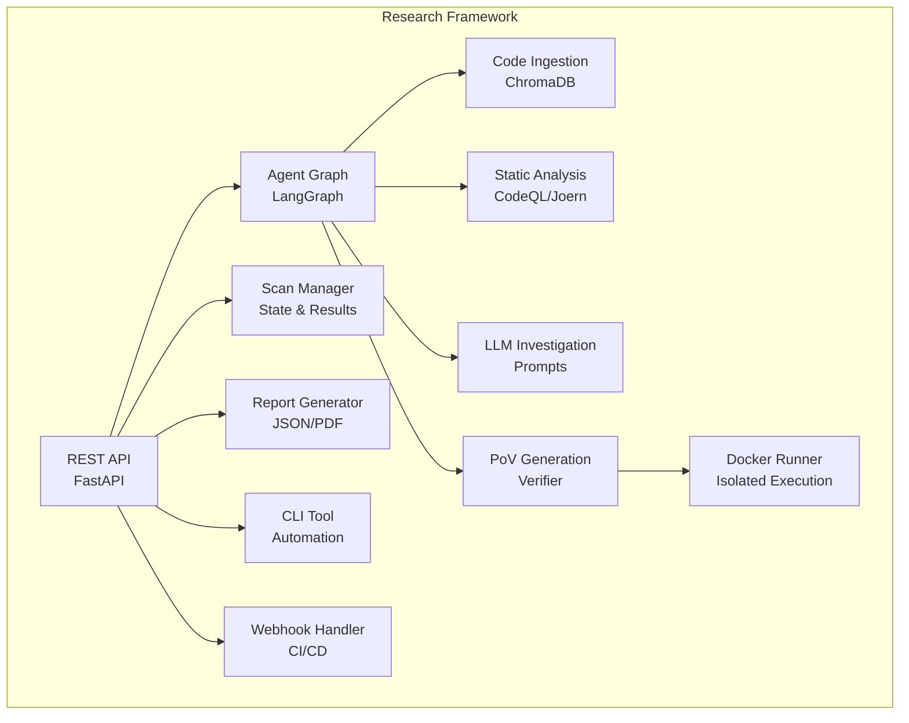
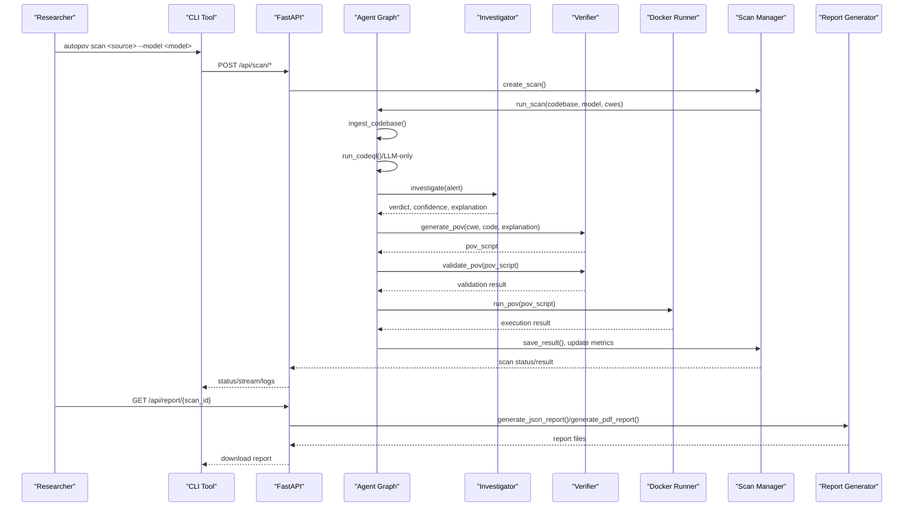
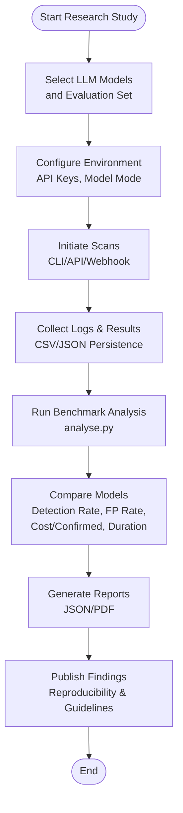
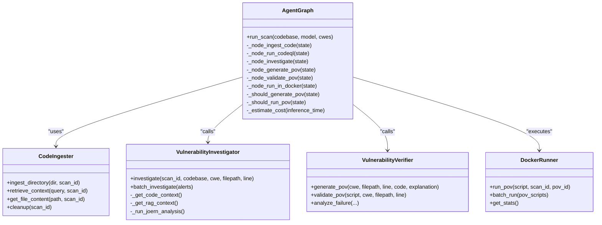
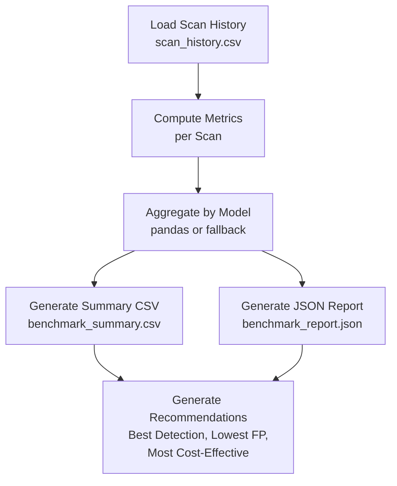
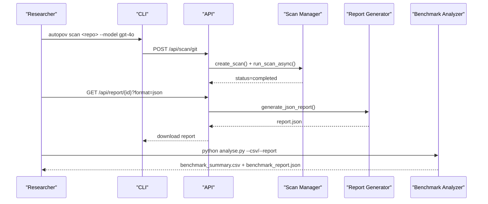
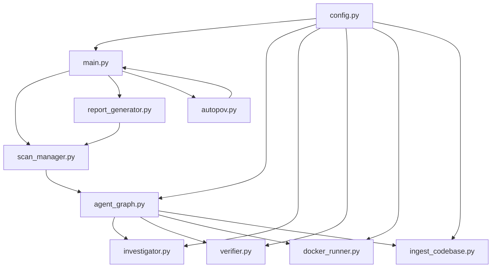

# Research Applications and Benchmarking Framework

<cite>
**Referenced Files in This Document**
- [README.md](file://autopov/README.md)
- [analyse.py](file://autopov/analyse.py)
- [prompts.py](file://autopov/prompts.py)
- [main.py](file://autopov/app/main.py)
- [scan_manager.py](file://autopov/app/scan_manager.py)
- [report_generator.py](file://autopov/app/report_generator.py)
- [agent_graph.py](file://autopov/app/agent_graph.py)
- [investigator.py](file://autopov/agents/investigator.py)
- [verifier.py](file://autopov/agents/verifier.py)
- [docker_runner.py](file://autopov/agents/docker_runner.py)
- [ingest_codebase.py](file://autopov/agents/ingest_codebase.py)
- [config.py](file://autopov/app/config.py)
- [autopov.py](file://autopov/cli/autopov.py)
- [test_agent.py](file://autopov/tests/test_agent.py)
- [test_api.py](file://autopov/tests/test_api.py)
- [target.c](file://samples/target.c)
</cite>

## Table of Contents
1. [Introduction](#introduction)
2. [Project Structure](#project-structure)
3. [Core Components](#core-components)
4. [Architecture Overview](#architecture-overview)
5. [Detailed Component Analysis](#detailed-component-analysis)
6. [Dependency Analysis](#dependency-analysis)
7. [Performance Considerations](#performance-considerations)
8. [Troubleshooting Guide](#troubleshooting-guide)
9. [Conclusion](#conclusion)
10. [Appendices](#appendices)

## Introduction
AutoPoV is a research-focused framework that combines static analysis (CodeQL, Joern) with LLM-powered reasoning to detect, verify, and benchmark vulnerabilities. It supports academic research in:
- LLM-based vulnerability detection
- Automated exploit generation (Proof-of-Vulnerability)
- SAST tool benchmarking
- AI security analysis

The framework provides a complete pipeline from scan initiation to result analysis and performance comparison, with built-in benchmarking and reporting capabilities suitable for reproducible research.

## Project Structure
The repository is organized into modular components supporting research workflows:
- Backend API and orchestration in app/
- Agent-based vulnerability detection in agents/
- CLI for automation in cli/
- Frontend dashboard in frontend/
- Benchmarking and analysis in analyse.py
- Sample targets and tests for validation

**Diagram sources**
- [main.py](file://autopov/app/main.py#L102-L528)
- [agent_graph.py](file://autopov/app/agent_graph.py#L78-L582)
- [scan_manager.py](file://autopov/app/scan_manager.py#L40-L344)
- [report_generator.py](file://autopov/app/report_generator.py#L68-L359)
- [autopov.py](file://autopov/cli/autopov.py#L89-L467)

**Section sources**
- [README.md](file://autopov/README.md#L17-L35)

## Core Components
AutoPoV’s research capabilities are enabled by several core components:

- Agent Graph (LangGraph): Orchestrates the vulnerability detection workflow with nodes for ingestion, static analysis, investigation, PoV generation, validation, and Docker execution.
- Investigator Agent: Uses LLMs and RAG to analyze findings and determine if they are real vulnerabilities.
- Verifier Agent: Generates and validates Proof-of-Vulnerability scripts using LLM prompts and static analysis.
- Docker Runner: Executes PoV scripts in isolated containers with strict resource limits.
- Code Ingestion: Chunks codebases, embeds them, and stores in ChromaDB for retrieval-augmented analysis.
- Scan Manager: Manages scan lifecycle, persists results, and tracks metrics.
- Report Generator: Produces JSON and PDF reports with metrics and findings.
- CLI and API: Provide programmatic access for research automation and CI/CD integration.
- Benchmarking Analyzer: Computes comparative metrics across models and scan runs.

These components collectively enable reproducible research workflows and comprehensive benchmarking.

**Section sources**
- [agent_graph.py](file://autopov/app/agent_graph.py#L78-L582)
- [investigator.py](file://autopov/agents/investigator.py#L37-L413)
- [verifier.py](file://autopov/agents/verifier.py#L40-L401)
- [docker_runner.py](file://autopov/agents/docker_runner.py#L27-L379)
- [ingest_codebase.py](file://autopov/agents/ingest_codebase.py#L41-L407)
- [scan_manager.py](file://autopov/app/scan_manager.py#L40-L344)
- [report_generator.py](file://autopov/app/report_generator.py#L68-L359)
- [analyse.py](file://autopov/analyse.py#L39-L357)
- [autopov.py](file://autopov/cli/autopov.py#L89-L467)

## Architecture Overview
The research architecture integrates static analysis, LLM reasoning, and automated PoV execution:

**Diagram sources**
- [autopov.py](file://autopov/cli/autopov.py#L104-L210)
- [main.py](file://autopov/app/main.py#L177-L386)
- [agent_graph.py](file://autopov/app/agent_graph.py#L532-L572)
- [investigator.py](file://autopov/agents/investigator.py#L254-L366)
- [verifier.py](file://autopov/agents/verifier.py#L79-L149)
- [docker_runner.py](file://autopov/agents/docker_runner.py#L62-L192)
- [scan_manager.py](file://autopov/app/scan_manager.py#L118-L200)
- [report_generator.py](file://autopov/app/report_generator.py#L76-L118)

## Detailed Component Analysis

### Research Workflow and Benchmarking Methodology
AutoPoV supports reproducible research through standardized workflows and metrics:

- Comparative Analysis: Researchers can benchmark multiple LLM models (e.g., GPT-4o, Claude, Llama3, Mixtral) on the same datasets and CWE families.
- Metrics Collection: The system tracks detection rate, false positive rate, PoV success rate, total cost, and average duration per scan.
- Persistent Logging: All runs are logged to CSV and JSON for downstream analysis.
- Automated Reporting: Reports include executive summaries, metrics, and findings for peer review and publication.

**Diagram sources**
- [analyse.py](file://autopov/analyse.py#L100-L214)
- [scan_manager.py](file://autopov/app/scan_manager.py#L201-L235)
- [report_generator.py](file://autopov/app/report_generator.py#L76-L118)

**Section sources**
- [README.md](file://autopov/README.md#L169-L179)
- [analyse.py](file://autopov/analyse.py#L216-L267)
- [scan_manager.py](file://autopov/app/scan_manager.py#L201-L235)

### Agent Graph and LLM Reasoning
The Agent Graph coordinates the research pipeline:
- Ingestion: Code chunks are embedded and stored in ChromaDB.
- Static Analysis: CodeQL queries identify potential vulnerabilities; fallback to LLM-only when unavailable.
- Investigation: LLMs evaluate findings with structured prompts and confidence scoring.
- PoV Generation and Validation: Scripts are generated and validated for correctness and safety.
- Docker Execution: PoVs run in isolated containers with strict resource limits.

**Diagram sources**
- [agent_graph.py](file://autopov/app/agent_graph.py#L78-L582)
- [investigator.py](file://autopov/agents/investigator.py#L37-L413)
- [verifier.py](file://autopov/agents/verifier.py#L40-L401)
- [docker_runner.py](file://autopov/agents/docker_runner.py#L27-L379)
- [ingest_codebase.py](file://autopov/agents/ingest_codebase.py#L41-L407)

**Section sources**
- [agent_graph.py](file://autopov/app/agent_graph.py#L136-L487)
- [investigator.py](file://autopov/agents/investigator.py#L254-L366)
- [verifier.py](file://autopov/agents/verifier.py#L79-L149)
- [docker_runner.py](file://autopov/agents/docker_runner.py#L62-L192)
- [ingest_codebase.py](file://autopov/agents/ingest_codebase.py#L201-L307)

### Benchmarking Analyzer and Metrics
The benchmarking analyzer computes comparative metrics across models and runs:
- Detection Rate: Confirmed / Total Findings (%)
- False Positive Rate: False Positives / Total Findings (%)
- Cost per Confirmed: Total Cost / Confirmed Vulnerabilities
- Average Duration: Mean time across scans
- Summary Statistics: Total scans, models tested, total confirmed, total cost

**Diagram sources**
- [analyse.py](file://autopov/analyse.py#L46-L214)
- [analyse.py](file://autopov/analyse.py#L216-L267)

**Section sources**
- [analyse.py](file://autopov/analyse.py#L72-L98)
- [analyse.py](file://autopov/analyse.py#L100-L214)
- [analyse.py](file://autopov/analyse.py#L249-L298)

### Research Workflows: From Initiation to Publication
Researchers can initiate scans via CLI, API, or webhooks, then analyze and publish results:

- CLI Scans: Use autopov scan to start Git, ZIP, or paste-based scans with selected models and CWE families.
- API Scans: Programmatic initiation with streaming logs and status polling.
- Webhook Scans: Auto-trigger scans on repository events for continuous research monitoring.
- Results and Reports: Access JSON/PDF reports and export benchmark summaries for publication.

**Diagram sources**
- [autopov.py](file://autopov/cli/autopov.py#L104-L210)
- [main.py](file://autopov/app/main.py#L177-L386)
- [scan_manager.py](file://autopov/app/scan_manager.py#L118-L200)
- [report_generator.py](file://autopov/app/report_generator.py#L76-L118)
- [analyse.py](file://autopov/analyse.py#L308-L357)

**Section sources**
- [autopov.py](file://autopov/cli/autopov.py#L104-L210)
- [main.py](file://autopov/app/main.py#L177-L386)
- [report_generator.py](file://autopov/app/report_generator.py#L120-L270)
- [analyse.py](file://autopov/analyse.py#L308-L357)

### Extending for Custom Vulnerability Types and Methodologies
AutoPoV supports extending research to custom vulnerability types and evaluation methodologies:

- Adding New CWE Queries: Extend CodeQL queries and map them in the Agent Graph.
- Custom Prompts: Add new prompt templates in prompts.py for domain-specific reasoning.
- Model Flexibility: Switch between online (OpenRouter) and offline (Ollama) models via configuration.
- Evaluation Metrics: Extend Benchmark Analyzer to compute domain-specific metrics (e.g., exploitability scores).
- CI/CD Integration: Use webhooks to automatically trigger research scans on code changes.

**Section sources**
- [agent_graph.py](file://autopov/app/agent_graph.py#L193-L278)
- [prompts.py](file://autopov/prompts.py#L7-L242)
- [config.py](file://autopov/app/config.py#L30-L49)
- [analyse.py](file://autopov/analyse.py#L300-L306)

### Publication Guidelines and Reproducibility
AutoPoV includes features to support reproducible research and publication:
- Persistent Results: CSV and JSON logs enable replication and meta-analysis.
- Standardized Reports: JSON and PDF reports include scan summaries, metrics, and findings.
- Configuration Management: Environment variables and settings ensure consistent environments across studies.
- Docker Safety: PoV execution in isolated containers ensures safe and repeatable experiments.

**Section sources**
- [scan_manager.py](file://autopov/app/scan_manager.py#L201-L235)
- [report_generator.py](file://autopov/app/report_generator.py#L76-L118)
- [docker_runner.py](file://autopov/agents/docker_runner.py#L78-L91)
- [README.md](file://autopov/README.md#L203-L222)

## Dependency Analysis
The framework’s dependencies form a cohesive research ecosystem:

**Diagram sources**
- [config.py](file://autopov/app/config.py#L13-L210)
- [main.py](file://autopov/app/main.py#L19-L26)
- [agent_graph.py](file://autopov/app/agent_graph.py#L22-L27)
- [scan_manager.py](file://autopov/app/scan_manager.py#L16-L18)
- [report_generator.py](file://autopov/app/report_generator.py#L18-L20)
- [autopov.py](file://autopov/cli/autopov.py#L20-L27)

**Section sources**
- [config.py](file://autopov/app/config.py#L13-L210)
- [main.py](file://autopov/app/main.py#L19-L26)

## Performance Considerations
- Cost Control: The system estimates inference costs and enforces a maximum cost threshold to manage budget constraints.
- Resource Limits: Docker execution uses memory and CPU limits to prevent resource exhaustion.
- Batch Processing: Code ingestion and PoV execution support batching to improve throughput.
- Model Mode: Researchers can switch between online and offline models to balance cost and quality.

[No sources needed since this section provides general guidance]

## Troubleshooting Guide
Common issues and resolutions:
- Authentication Failures: Ensure API keys are configured and passed correctly in CLI or headers.
- Docker Not Available: Verify Docker installation and permissions; the system gracefully handles unavailability.
- Static Analysis Tools Missing: Install CodeQL and/or Joern; the system falls back to LLM-only analysis when unavailable.
- Validation Failures: Review PoV validation feedback and adjust scripts to meet requirements (stdlib-only, trigger message).
- Test Failures: Use provided unit tests to validate PoV scripts and API endpoints.

**Section sources**
- [test_agent.py](file://autopov/tests/test_agent.py#L17-L71)
- [test_api.py](file://autopov/tests/test_api.py#L26-L60)
- [docker_runner.py](file://autopov/agents/docker_runner.py#L81-L91)
- [config.py](file://autopov/app/config.py#L123-L172)

## Conclusion
AutoPoV provides a robust, reproducible research framework for LLM-based vulnerability detection, automated exploit generation, SAST benchmarking, and AI security analysis. Its modular architecture, comprehensive metrics, and publication-ready reporting facilitate rigorous academic study and reproducible results across diverse models and datasets.

[No sources needed since this section summarizes without analyzing specific files]

## Appendices

### Benchmarking Methodology Details
- Detection Rate: Confirmed vulnerabilities divided by total findings.
- False Positive Rate: Skipped (false positive) findings divided by total findings.
- PoV Success Rate: Successful PoV executions divided by confirmed vulnerabilities.
- Cost Efficiency: Average cost per verified vulnerability.
- Duration Metrics: Average scan duration across runs.

**Section sources**
- [report_generator.py](file://autopov/app/report_generator.py#L302-L327)
- [analyse.py](file://autopov/analyse.py#L72-L98)

### Example Targets for Research
Sample vulnerable code is included to validate PoV generation and execution.

**Section sources**
- [target.c](file://samples/target.c#L1-L16)