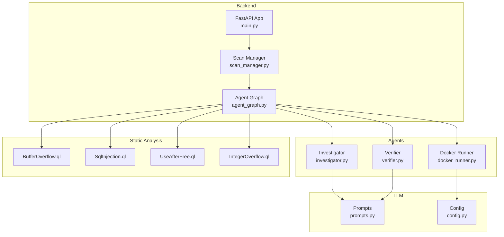
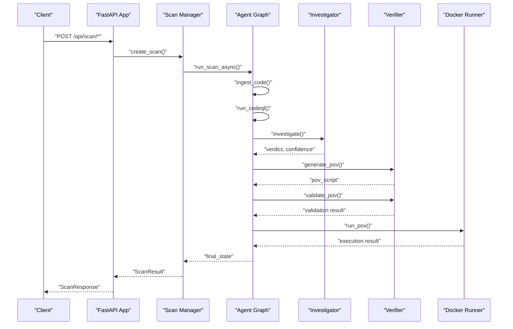
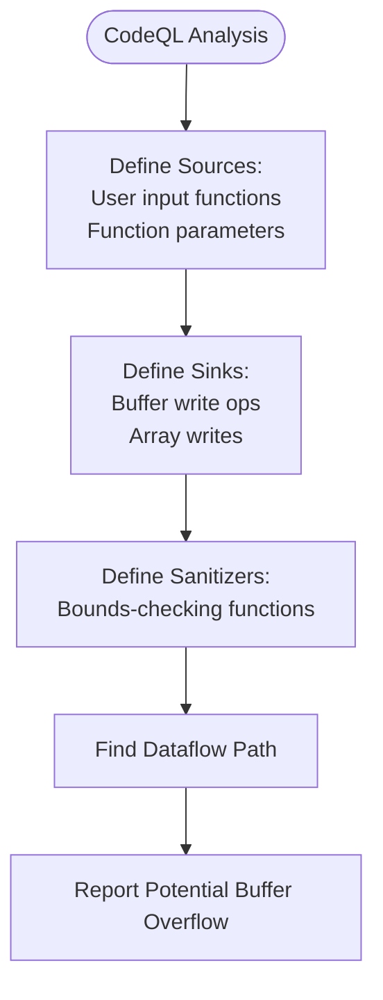
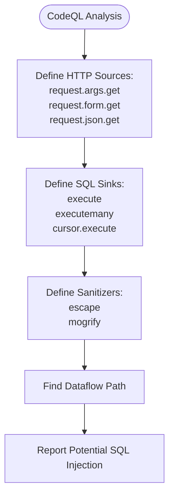
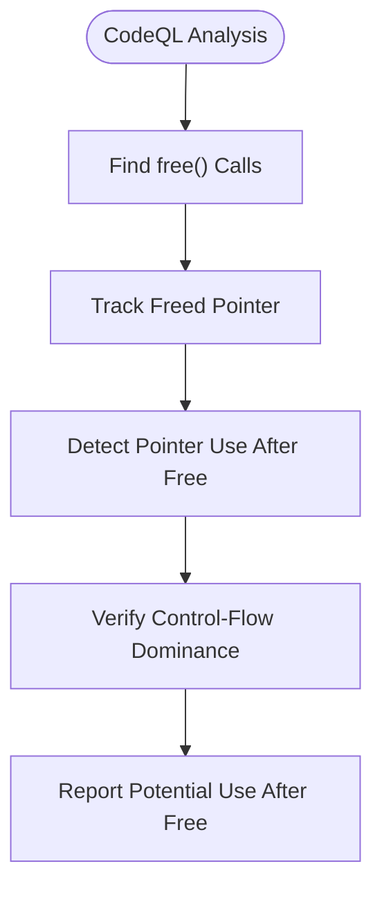
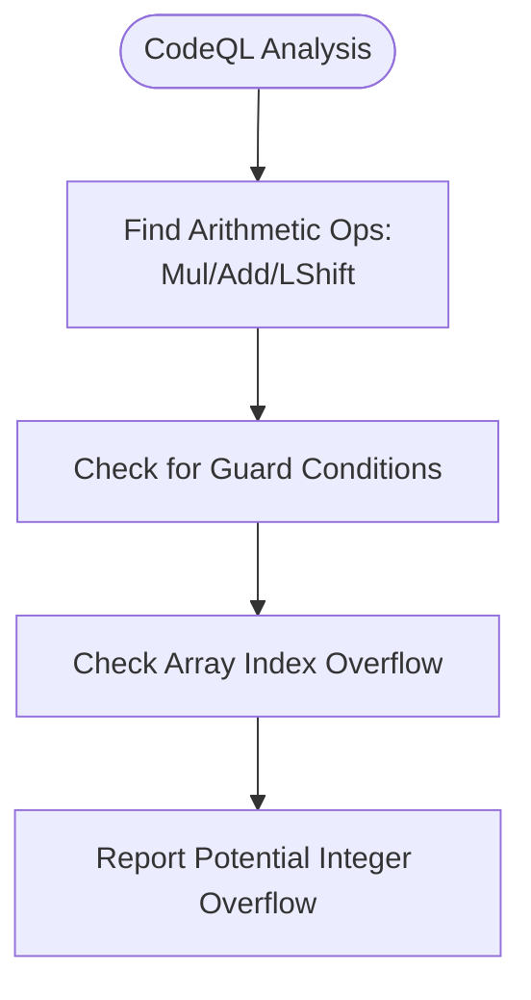
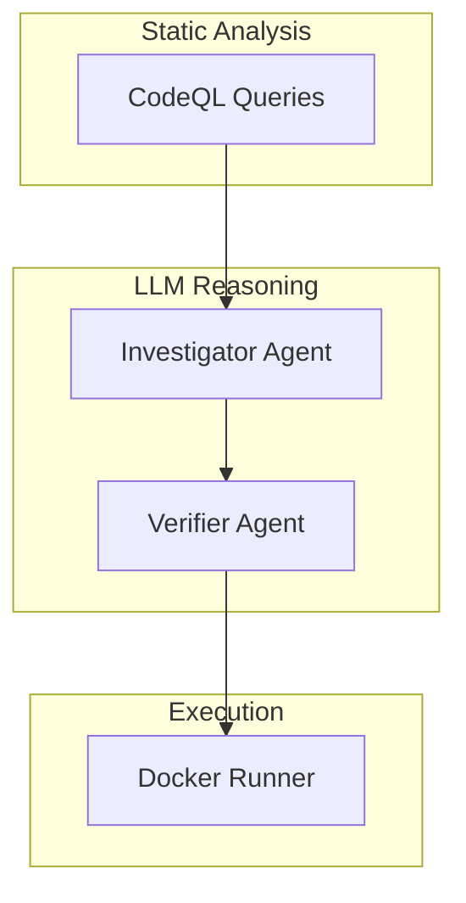
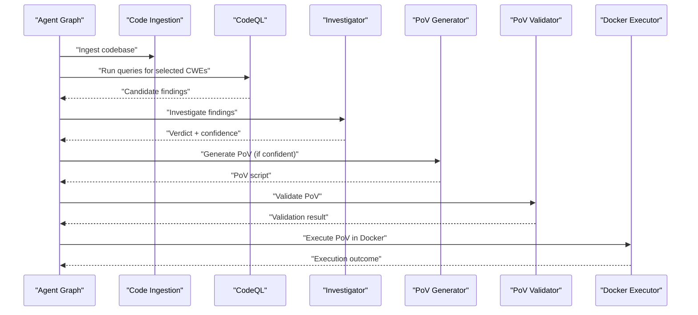
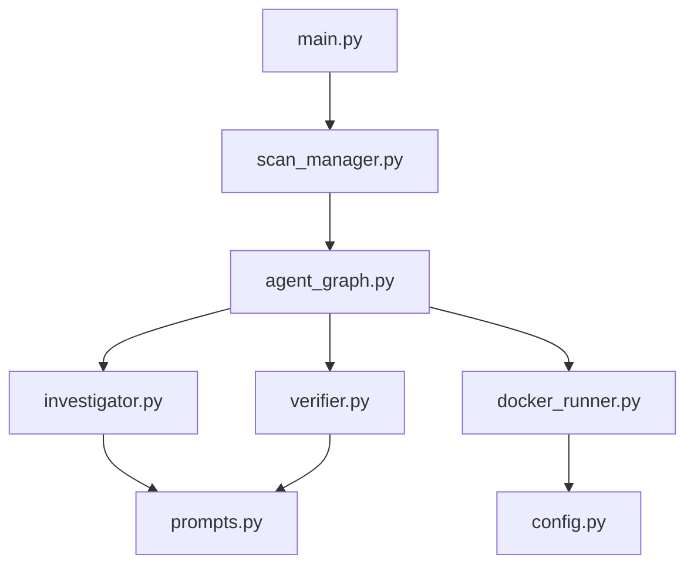

# Supported CWE Types and Detection Methodology

<cite>
**Referenced Files in This Document**
- [README.md](file://autopov/README.md)
- [config.py](file://autopov/app/config.py)
- [main.py](file://autopov/app/main.py)
- [scan_manager.py](file://autopov/app/scan_manager.py)
- [agent_graph.py](file://autopov/app/agent_graph.py)
- [investigator.py](file://autopov/agents/investigator.py)
- [verifier.py](file://autopov/agents/verifier.py)
- [docker_runner.py](file://autopov/agents/docker_runner.py)
- [prompts.py](file://autopov/prompts.py)
- [analyse.py](file://autopov/analyse.py)
- [BufferOverflow.ql](file://autopov/codeql_queries/BufferOverflow.ql)
- [SqlInjection.ql](file://autopov/codeql_queries/SqlInjection.ql)
- [UseAfterFree.ql](file://autopov/codeql_queries/UseAfterFree.ql)
- [IntegerOverflow.ql](file://autopov/codeql_queries/IntegerOverflow.ql)
</cite>

## Table of Contents
1. [Introduction](#introduction)
2. [Project Structure](#project-structure)
3. [Core Components](#core-components)
4. [Architecture Overview](#architecture-overview)
5. [Detailed Component Analysis](#detailed-component-analysis)
6. [Dependency Analysis](#dependency-analysis)
7. [Performance Considerations](#performance-considerations)
8. [Troubleshooting Guide](#troubleshooting-guide)
9. [Conclusion](#conclusion)

## Introduction
AutoPoV is a hybrid vulnerability detection framework that combines static analysis with AI-powered reasoning to identify and validate security flaws. The system focuses on four primary CWE categories: Buffer Overflow (CWE-119), SQL Injection (CWE-89), Use After Free (CWE-416), and Integer Overflow (CWE-190). This document explains the detection methodology, implementation details, and the hybrid approach that augments static analysis results with LLM-based validation.

## Project Structure
The AutoPoV project is organized into several key areas:
- Backend API and orchestration: FastAPI application, scan manager, and agent graph workflow
- Agents: Code ingestion, vulnerability investigation, PoV generation/validation, and Docker execution
- Static analysis: CodeQL queries for each supported CWE
- LLM prompts: Structured prompts for investigation, PoV generation, validation, and retry analysis
- Configuration: Centralized settings for models, tools, and supported CWEs
- Analysis: Benchmarking utilities for evaluating detection performance

**Diagram sources**
- [main.py](file://autopov/app/main.py#L102-L121)
- [scan_manager.py](file://autopov/app/scan_manager.py#L40-L50)
- [agent_graph.py](file://autopov/app/agent_graph.py#L78-L134)
- [investigator.py](file://autopov/agents/investigator.py#L37-L42)
- [verifier.py](file://autopov/agents/verifier.py#L40-L46)
- [docker_runner.py](file://autopov/agents/docker_runner.py#L27-L36)
- [BufferOverflow.ql](file://autopov/codeql_queries/BufferOverflow.ql#L1-L10)
- [SqlInjection.ql](file://autopov/codeql_queries/SqlInjection.ql#L1-L10)
- [UseAfterFree.ql](file://autopov/codeql_queries/UseAfterFree.ql#L1-L10)
- [IntegerOverflow.ql](file://autopov/codeql_queries/IntegerOverflow.ql#L1-L10)
- [prompts.py](file://autopov/prompts.py#L7-L44)
- [config.py](file://autopov/app/config.py#L94-L100)

**Section sources**
- [README.md](file://autopov/README.md#L17-L35)
- [main.py](file://autopov/app/main.py#L102-L121)

## Core Components
AutoPoV supports four primary CWE categories with dedicated CodeQL queries and LLM-driven validation:

- CWE-119 (Buffer Overflow): Detects unsafe buffer operations and missing bounds checks
- CWE-89 (SQL Injection): Identifies unsanitized user input flowing into SQL execution
- CWE-416 (Use After Free): Flags dangling pointer dereferences after memory deallocation
- CWE-190 (Integer Overflow): Catches arithmetic operations that may overflow or wrap around

These are configured as the supported CWEs and are selectable during scans.

**Section sources**
- [config.py](file://autopov/app/config.py#L94-L100)
- [README.md](file://autopov/README.md#L194-L202)

## Architecture Overview
The detection pipeline follows a structured workflow:
1. Code ingestion into a vector store
2. Static analysis via CodeQL for each selected CWE
3. LLM-based investigation to distinguish real vulnerabilities from false positives
4. PoV script generation and validation
5. Safe execution in Docker containers
6. Status tracking and result aggregation

**Diagram sources**
- [main.py](file://autopov/app/main.py#L177-L316)
- [scan_manager.py](file://autopov/app/scan_manager.py#L86-L116)
- [agent_graph.py](file://autopov/app/agent_graph.py#L532-L572)
- [investigator.py](file://autopov/agents/investigator.py#L254-L347)
- [verifier.py](file://autopov/agents/verifier.py#L79-L149)
- [docker_runner.py](file://autopov/agents/docker_runner.py#L62-L191)

## Detailed Component Analysis

### CWE-119: Buffer Overflow (BufferOverflow.ql)
AutoPoV detects potential buffer overflows by modeling dataflow from user inputs and function parameters to unsafe buffer operations. The CodeQL query defines:
- Sources: Functions like `gets`, `scanf`, `read`, and function parameters
- Sinks: Buffer write operations such as `strcpy`, `memcpy`, and array writes
- Sanitizers: Bounds-checking functions like `strlen`, `sizeof`, and `strnlen`

**Diagram sources**
- [BufferOverflow.ql](file://autopov/codeql_queries/BufferOverflow.ql#L16-L53)

Implementation highlights:
- Source detection covers common C input functions and non-main parameters
- Sink detection targets explicit buffer operations and array writes
- Sanitizer detection includes length and size checks to reduce false positives

Confidence scoring and validation:
- The LLM-based investigator evaluates whether the reported path constitutes a real vulnerability, considering context and mitigations
- Confidence thresholds guide whether PoV generation proceeds

**Section sources**
- [BufferOverflow.ql](file://autopov/codeql_queries/BufferOverflow.ql#L16-L59)
- [prompts.py](file://autopov/prompts.py#L39-L42)

### CWE-89: SQL Injection (SqlInjection.ql)
The SQL Injection detector identifies user-controlled data reaching SQL execution sinks. The CodeQL query captures:
- Sources: HTTP request inputs such as `request.args.get`, `request.form.get`, and environment variables
- Sinks: SQL execution methods like `execute`, `executemany`, and cursor execution
- Sanitizers: Parameterized query helpers like `escape` and `mogrify`

**Diagram sources**
- [SqlInjection.ql](file://autopov/codeql_queries/SqlInjection.ql#L17-L61)

Implementation highlights:
- HTTP input sources are mapped to Flask-style request APIs
- SQL execution sinks include common ORM and DB-API patterns
- Sanitizer detection encourages parameterized queries

Confidence scoring and validation:
- The investigator considers whether the code uses parameterized queries or other mitigations
- CWE-89 validation ensures PoV scripts include SQL keywords and payloads

**Section sources**
- [SqlInjection.ql](file://autopov/codeql_queries/SqlInjection.ql#L17-L67)
- [prompts.py](file://autopov/prompts.py#L71-L75)

### CWE-416: Use After Free (UseAfterFree.ql)
Use After Free detection focuses on memory safety by identifying pointer dereferences after `free()` calls. The CodeQL query models:
- Free call detection: Calls to `free()`
- Use-after-free conditions: Subsequent pointer usage after the free call
- Control-flow dominance: Ensures the use occurs after the free in program order

**Diagram sources**
- [UseAfterFree.ql](file://autopov/codeql_queries/UseAfterFree.ql#L19-L34)

Implementation highlights:
- Free call identification and freed expression tracking
- Pointer reuse detection with control-flow dominance checks
- Specialized handling for C/C++ memory management patterns

Confidence scoring and validation:
- The investigator integrates optional Joern CPG analysis for deeper memory flow insights
- CWE-416 validation acknowledges that PoV execution may require C code

**Section sources**
- [UseAfterFree.ql](file://autopov/codeql_queries/UseAfterFree.ql#L19-L41)
- [investigator.py](file://autopov/agents/investigator.py#L89-L184)

### CWE-190: Integer Overflow (IntegerOverflow.ql)
Integer Overflow detection targets arithmetic operations that may exceed representable ranges. The CodeQL query identifies:
- Potential overflow operations: Multiplication, addition, and left shifts without explicit guards
- Array index calculations: Index expressions that may overflow without bounds checks
- Type awareness: Unsigned vs signed integral types

**Diagram sources**
- [IntegerOverflow.ql](file://autopov/codeql_queries/IntegerOverflow.ql#L18-L55)

Implementation highlights:
- Overflow detection for multiplication, addition, and left shift operations
- Array index calculation overflow checks
- Guard condition absence increases risk assessment

Confidence scoring and validation:
- The investigator assesses whether bounds checks or safe arithmetic patterns mitigate risk
- CWE-190 validation ensures PoV scripts use sufficiently large values to trigger wraparound

**Section sources**
- [IntegerOverflow.ql](file://autopov/codeql_queries/IntegerOverflow.ql#L18-L62)
- [prompts.py](file://autopov/prompts.py#L74-L75)

### Hybrid Detection Methodology
AutoPoV augments static analysis with LLM-based reasoning to improve precision and reduce false positives. The methodology consists of:

- Static analysis: CodeQL queries produce candidate vulnerabilities with precise locations
- LLM investigation: The investigator agent analyzes context, mitigations, and exploitability
- PoV generation and validation: Verified PoV scripts are generated and validated for correctness and safety
- Safe execution: PoVs run in isolated Docker containers with strict resource limits

**Diagram sources**
- [agent_graph.py](file://autopov/app/agent_graph.py#L163-L191)
- [investigator.py](file://autopov/agents/investigator.py#L254-L347)
- [verifier.py](file://autopov/agents/verifier.py#L79-L149)
- [docker_runner.py](file://autopov/agents/docker_runner.py#L62-L191)

Confidence scoring and false positive reduction:
- The investigator assigns a confidence score and justification for each finding
- Threshold-based routing determines whether PoV generation proceeds
- Validation includes syntax checks, standard library constraints, and CWE-specific criteria
- LLM-based validation provides additional reasoning and suggestions

**Section sources**
- [agent_graph.py](file://autopov/app/agent_graph.py#L488-L514)
- [prompts.py](file://autopov/prompts.py#L24-L43)
- [verifier.py](file://autopov/agents/verifier.py#L151-L227)

### Detection Pipeline Details
The end-to-end pipeline integrates multiple components:

- Code ingestion: Files are chunked and embedded into a vector store for retrieval
- CodeQL execution: For each CWE, the corresponding query is executed against a generated CodeQL database
- Investigation: The investigator agent retrieves context and applies LLM reasoning to classify findings
- PoV lifecycle: Scripts are generated, validated, and executed in Docker with safety constraints
- Result aggregation: Final statuses (confirmed, skipped, failed) are tracked and summarized

**Diagram sources**
- [agent_graph.py](file://autopov/app/agent_graph.py#L136-L191)
- [investigator.py](file://autopov/agents/investigator.py#L254-L347)
- [verifier.py](file://autopov/agents/verifier.py#L79-L149)
- [docker_runner.py](file://autopov/agents/docker_runner.py#L62-L191)

**Section sources**
- [agent_graph.py](file://autopov/app/agent_graph.py#L136-L572)
- [scan_manager.py](file://autopov/app/scan_manager.py#L118-L175)

## Dependency Analysis
The system exhibits clear separation of concerns with well-defined dependencies:

- Backend depends on configuration for tool availability and model selection
- Agent graph orchestrates static analysis, investigation, and execution
- Agents depend on prompts for structured LLM interactions
- Docker runner encapsulates containerized execution with safety constraints

**Diagram sources**
- [config.py](file://autopov/app/config.py#L13-L210)
- [main.py](file://autopov/app/main.py#L19-L26)
- [scan_manager.py](file://autopov/app/scan_manager.py#L16-L18)
- [agent_graph.py](file://autopov/app/agent_graph.py#L22-L27)
- [investigator.py](file://autopov/agents/investigator.py#L27-L30)
- [verifier.py](file://autopov/agents/verifier.py#L27-L32)
- [docker_runner.py](file://autopov/agents/docker_runner.py#L19-L20)
- [prompts.py](file://autopov/prompts.py#L7-L44)

**Section sources**
- [config.py](file://autopov/app/config.py#L13-L210)
- [main.py](file://autopov/app/main.py#L19-L26)

## Performance Considerations
- Cost control: The system estimates inference costs and tracks total expenses per scan
- Resource limits: Docker execution enforces timeouts, memory, and CPU quotas
- Parallelism: Thread pools and asynchronous execution improve throughput
- Fallbacks: When CodeQL or Joern are unavailable, LLM-only analysis can still proceed

[No sources needed since this section provides general guidance]

## Troubleshooting Guide
Common issues and resolutions:
- CodeQL not available: The system falls back to LLM-only analysis and logs warnings
- Docker not available: PoV execution is skipped with explanatory messages
- LLM configuration errors: Missing API keys or offline model dependencies cause targeted exceptions
- Validation failures: PoV scripts are re-analyzed and regenerated with improved approaches

**Section sources**
- [agent_graph.py](file://autopov/app/agent_graph.py#L168-L173)
- [docker_runner.py](file://autopov/agents/docker_runner.py#L81-L90)
- [investigator.py](file://autopov/agents/investigator.py#L57-L87)
- [verifier.py](file://autopov/agents/verifier.py#L53-L77)

## Conclusion
AutoPoV provides a robust, hybrid approach to vulnerability detection by combining precise static analysis with AI-powered reasoning. The framework supports four critical CWE categories—Buffer Overflow, SQL Injection, Use After Free, and Integer Overflow—each with tailored CodeQL queries and LLM-driven validation. The detection pipeline emphasizes confidence scoring, false positive reduction, and safe execution of PoVs in isolated environments, enabling reliable benchmarking and research into LLM-based vulnerability detection.