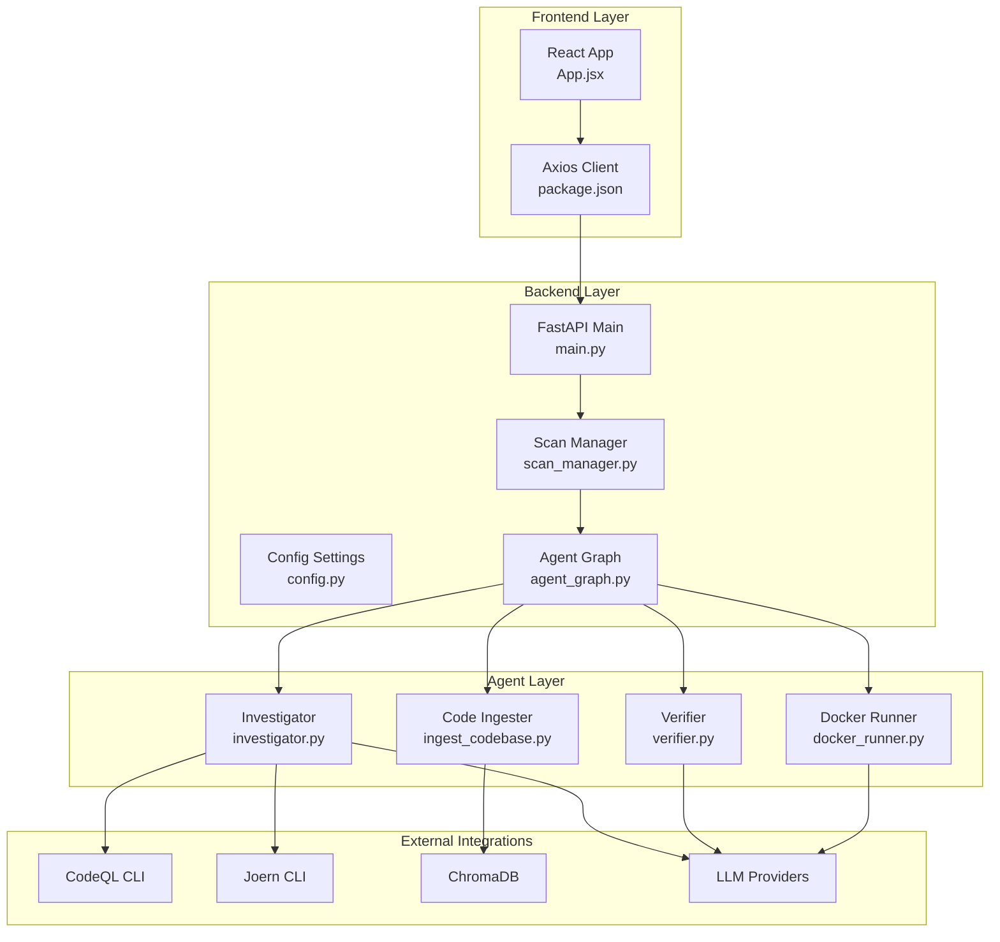
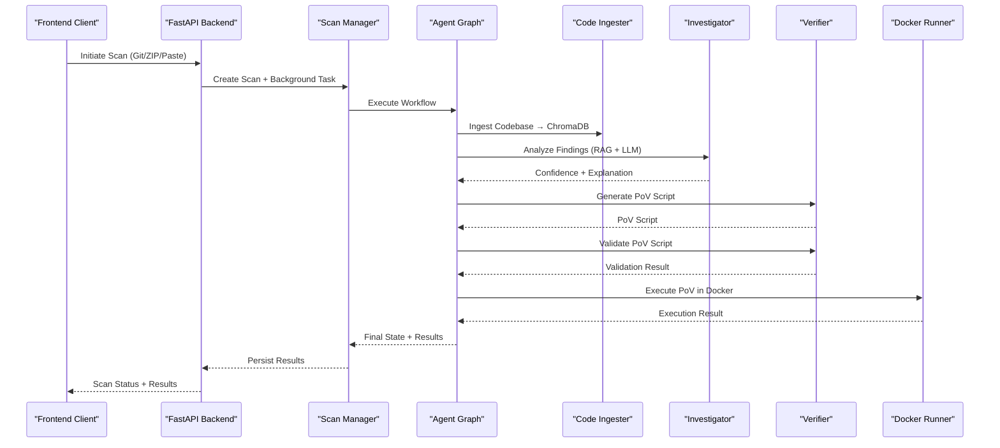
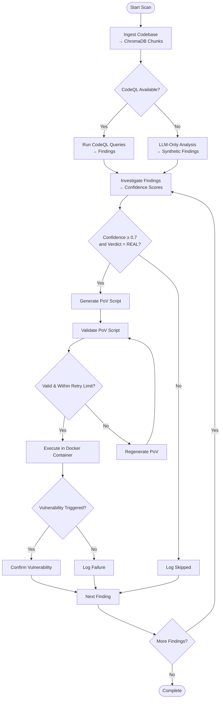
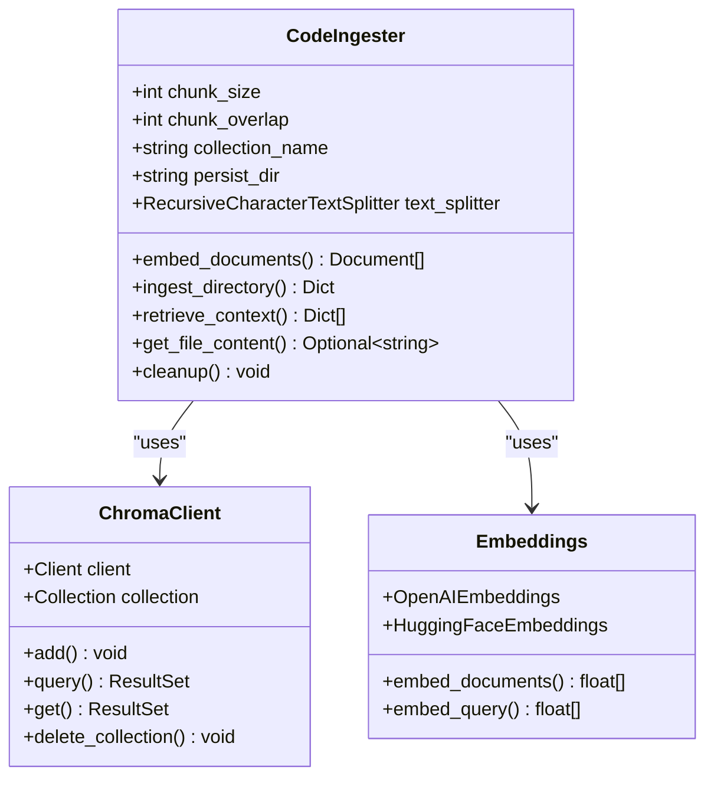
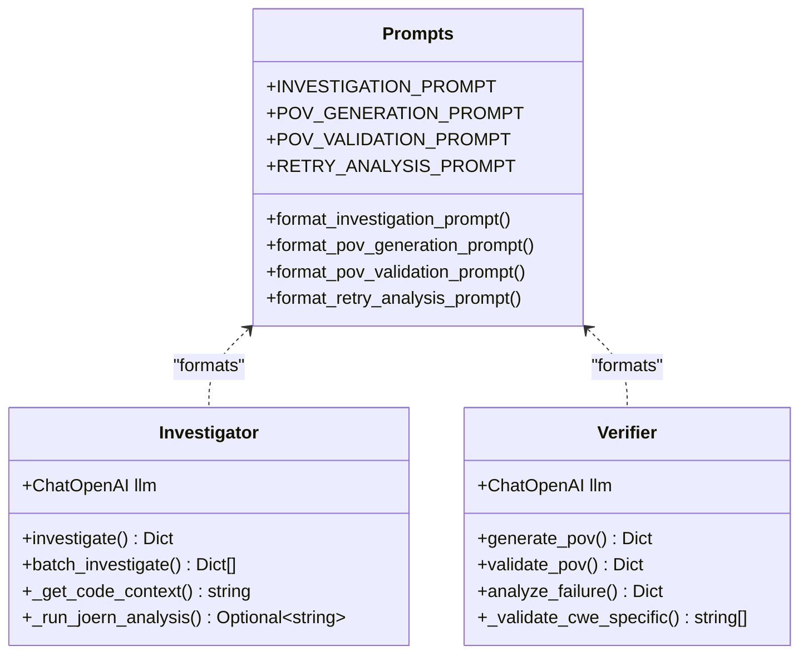
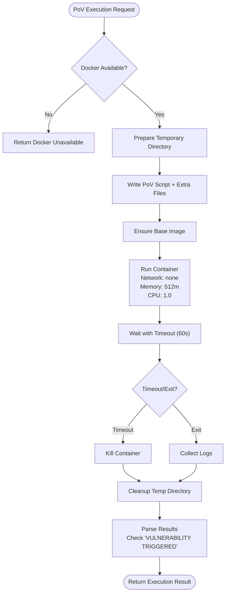
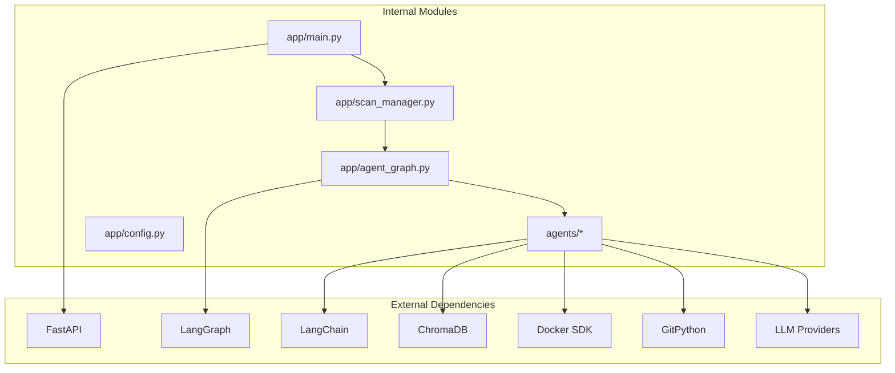

# System Architecture

<cite>
**Referenced Files in This Document**
- [main.py](file://autopov/app/main.py)
- [agent_graph.py](file://autopov/app/agent_graph.py)
- [config.py](file://autopov/app/config.py)
- [ingest_codebase.py](file://autopov/agents/ingest_codebase.py)
- [investigator.py](file://autopov/agents/investigator.py)
- [verifier.py](file://autopov/agents/verifier.py)
- [docker_runner.py](file://autopov/agents/docker_runner.py)
- [scan_manager.py](file://autopov/app/scan_manager.py)
- [source_handler.py](file://autopov/app/source_handler.py)
- [git_handler.py](file://autopov/app/git_handler.py)
- [prompts.py](file://autopov/prompts.py)
- [App.jsx](file://autopov/frontend/src/App.jsx)
- [package.json](file://autopov/frontend/package.json)
- [requirements.txt](file://autopov/requirements.txt)
</cite>

## Update Summary
**Changes Made**
- Updated LangGraph-based workflow orchestration with stateful pipeline management
- Enhanced conditional transitions and automated codebase handling
- Comprehensive agent integration for ingestion, investigation, verification, and Docker execution
- Added detailed state management with vulnerability-specific states
- Improved error handling and cost tracking mechanisms
- Enhanced security architecture with Docker isolation and resource limiting

## Table of Contents
1. [Introduction](#introduction)
2. [Project Structure](#project-structure)
3. [Core Components](#core-components)
4. [Architecture Overview](#architecture-overview)
5. [Detailed Component Analysis](#detailed-component-analysis)
6. [Dependency Analysis](#dependency-analysis)
7. [Performance Considerations](#performance-considerations)
8. [Security Architecture](#security-architecture)
9. [Technology Stack Integration](#technology-stack-integration)
10. [Scalability and Deployment](#scalability-and-deployment)
11. [Monitoring and Observability](#monitoring-and-observability)
12. [Troubleshooting Guide](#troubleshooting-guide)
13. [Conclusion](#conclusion)

## Introduction
AutoPoV is a hybrid agentic framework designed to autonomously detect and validate software vulnerabilities through a combination of static analysis, LLM-powered reasoning, and controlled execution environments. The system integrates a FastAPI backend, a React frontend, LangGraph-based agent orchestration, and external tool integrations for CodeQL, Joern, ChromaDB, and LLM providers. It implements a pipeline pattern where code ingestion feeds a vector store, followed by automated investigation, PoV generation, validation, and execution in isolated Docker containers.

**Updated** The system now features a sophisticated LangGraph-based workflow orchestration that manages stateful pipeline execution with intelligent conditional transitions, enabling automated codebase handling and comprehensive agent integration for vulnerability detection and validation.

## Project Structure
The project follows a layered architecture with clear separation of concerns:
- Backend: FastAPI application exposing REST endpoints for scan initiation, status polling, and reporting
- Agent Orchestration: LangGraph-based workflow managing the vulnerability detection pipeline
- Agents: Specialized components for code ingestion, investigation, verification, and Docker execution
- Frontend: React SPA providing user interface and real-time scan progress streaming
- Integrations: External tools and services for analysis and storage

**Diagram sources**
- [main.py](file://autopov/app/main.py#L103-L108)
- [agent_graph.py](file://autopov/app/agent_graph.py#L84-L134)
- [config.py](file://autopov/app/config.py#L13-L210)
- [ingest_codebase.py](file://autopov/agents/ingest_codebase.py#L41-L116)
- [investigator.py](file://autopov/agents/investigator.py#L37-L87)
- [verifier.py](file://autopov/agents/verifier.py#L40-L77)
- [docker_runner.py](file://autopov/agents/docker_runner.py#L27-L48)

**Section sources**
- [main.py](file://autopov/app/main.py#L103-L108)
- [App.jsx](file://autopov/frontend/src/App.jsx#L1-L29)
- [package.json](file://autopov/frontend/package.json#L1-L34)

## Core Components
The system comprises four primary layers:

### Backend Services (FastAPI)
- REST API endpoints for scan initiation via Git repositories, ZIP uploads, and raw code paste
- Real-time progress streaming using Server-Sent Events (SSE)
- Authentication via API keys and admin key management
- Webhook handlers for GitHub and GitLab integration
- Metrics endpoint for system monitoring

### Agent Orchestration (LangGraph)
- Stateful workflow graph orchestrating vulnerability detection pipeline
- Modular nodes for code ingestion, analysis, investigation, PoV generation, validation, and execution
- Conditional branching based on confidence thresholds and validation outcomes
- Persistent state management with logging and cost tracking

### Agent Components
- **Code Ingester**: Text splitting, embedding generation, and ChromaDB storage
- **Investigator**: LLM-powered vulnerability analysis with RAG and optional Joern CPG analysis
- **Verifier**: PoV script generation and validation with CWE-specific rules
- **Docker Runner**: Secure containerized execution with resource limits and network isolation

### Frontend Application (React)
- Single-page application with routing for home, scan progress, results, history, and settings
- Real-time progress updates via SSE connections
- Component-based architecture with reusable UI elements

**Updated** The LangGraph-based workflow orchestration now provides sophisticated state management with detailed vulnerability-specific states, enabling granular control over the detection pipeline and intelligent decision-making based on analysis results.

**Section sources**
- [main.py](file://autopov/app/main.py#L174-L525)
- [agent_graph.py](file://autopov/app/agent_graph.py#L78-L134)
- [ingest_codebase.py](file://autopov/agents/ingest_codebase.py#L41-L60)
- [investigator.py](file://autopov/agents/investigator.py#L37-L50)
- [verifier.py](file://autopov/agents/verifier.py#L40-L46)
- [docker_runner.py](file://autopov/agents/docker_runner.py#L27-L36)
- [App.jsx](file://autopov/frontend/src/App.jsx#L1-L29)

## Architecture Overview
The AutoPoV architecture implements a hybrid agentic framework combining static analysis, machine learning, and controlled execution:

**Updated** The workflow now includes sophisticated state management with vulnerability-specific states, enabling detailed tracking of each finding's progression through the pipeline and intelligent decision-making based on confidence thresholds and validation outcomes.

**Diagram sources**
- [main.py](file://autopov/app/main.py#L174-L313)
- [scan_manager.py](file://autopov/app/scan_manager.py#L86-L116)
- [agent_graph.py](file://autopov/app/agent_graph.py#L532-L572)
- [ingest_codebase.py](file://autopov/agents/ingest_codebase.py#L201-L307)
- [investigator.py](file://autopov/agents/investigator.py#L254-L347)
- [verifier.py](file://autopov/agents/verifier.py#L79-L149)
- [docker_runner.py](file://autopov/agents/docker_runner.py#L62-L191)

## Detailed Component Analysis

### Agent-Based Workflow Orchestration
The LangGraph-based workflow manages a stateful pipeline with conditional transitions:

**Updated** The workflow now includes comprehensive state management with vulnerability-specific states including pending, ingesting, running_codeql, investigating, generating_pov, validating_pov, running_pov, completed, failed, and skipped states. Each finding maintains detailed metadata including confidence scores, CWE types, code chunks, and execution results.

**Diagram sources**
- [agent_graph.py](file://autopov/app/agent_graph.py#L84-L134)
- [agent_graph.py](file://autopov/app/agent_graph.py#L488-L515)

**Section sources**
- [agent_graph.py](file://autopov/app/agent_graph.py#L78-L134)
- [agent_graph.py](file://autopov/app/agent_graph.py#L488-L515)

### Code Ingestion and Vector Store Management
The code ingestion system implements a sophisticated pipeline for preparing codebases for analysis:

**Updated** The ingestion system now supports both online (OpenAI embeddings) and offline (HuggingFace embeddings) configurations, with automatic fallback mechanisms and comprehensive error handling for missing dependencies.

**Diagram sources**
- [ingest_codebase.py](file://autopov/agents/ingest_codebase.py#L41-L116)
- [ingest_codebase.py](file://autopov/agents/ingest_codebase.py#L105-L115)

**Section sources**
- [ingest_codebase.py](file://autopov/agents/ingest_codebase.py#L201-L307)
- [ingest_codebase.py](file://autopov/agents/ingest_codebase.py#L309-L352)

### LLM Integration and Prompt Engineering
The system employs centralized prompt templates for consistent agent behavior:

**Updated** The LLM integration now supports both online (OpenRouter) and offline (Ollama) configurations with automatic fallback mechanisms, comprehensive error handling, and LangSmith tracing integration for performance monitoring.

**Diagram sources**
- [prompts.py](file://autopov/prompts.py#L7-L43)
- [prompts.py](file://autopov/prompts.py#L46-L78)
- [prompts.py](file://autopov/prompts.py#L81-L108)
- [prompts.py](file://autopov/prompts.py#L176-L209)
- [investigator.py](file://autopov/agents/investigator.py#L37-L87)
- [verifier.py](file://autopov/agents/verifier.py#L40-L77)

**Section sources**
- [prompts.py](file://autopov/prompts.py#L245-L342)
- [investigator.py](file://autopov/agents/investigator.py#L254-L347)
- [verifier.py](file://autopov/agents/verifier.py#L79-L149)

### Docker Execution Environment
The Docker runner ensures secure, isolated execution with strict resource limitations:

**Updated** The Docker execution environment now includes comprehensive error handling, resource limiting (512MB memory, 1.0 CPU), network isolation (none), and automatic cleanup mechanisms to ensure secure and reliable PoV execution.

**Diagram sources**
- [docker_runner.py](file://autopov/agents/docker_runner.py#L62-L191)
- [config.py](file://autopov/app/config.py#L78-L84)

**Section sources**
- [docker_runner.py](file://autopov/agents/docker_runner.py#L62-L191)
- [config.py](file://autopov/app/config.py#L78-L84)

## Dependency Analysis
The system exhibits clean dependency boundaries with minimal coupling between layers:

**Updated** The dependency structure now includes LangGraph for workflow orchestration, enhanced LangChain integration for LLM operations, and improved error handling across all dependencies.

**Diagram sources**
- [requirements.txt](file://autopov/requirements.txt#L1-L42)
- [main.py](file://autopov/app/main.py#L13-L25)
- [agent_graph.py](file://autopov/app/agent_graph.py#L22-L26)

**Section sources**
- [requirements.txt](file://autopov/requirements.txt#L1-L42)
- [main.py](file://autopov/app/main.py#L13-L25)

## Performance Considerations
The architecture incorporates several performance optimization strategies:

### Asynchronous Processing
- Thread pool executor for CPU-intensive scanning operations
- Async I/O for real-time progress streaming
- Background task execution for long-running operations

### Resource Management
- Configurable chunk sizes (4000 chars) with 200 char overlap for optimal embedding quality
- Batched ChromaDB writes (100 documents per batch) for efficient storage
- Temporary directory cleanup to prevent disk space accumulation

### Caching and Reusability
- Persistent ChromaDB collections per scan for repeated queries
- LLM model caching through LangChain abstraction
- Docker image caching to reduce pull times

### Scalability Patterns
- Stateless agent nodes enable horizontal scaling
- Queue-based background processing supports multiple concurrent scans
- Configurable thread pool size for workload adaptation

**Updated** The system now includes comprehensive cost tracking, inference time measurement, and resource utilization monitoring to optimize performance and prevent resource exhaustion.

## Security Architecture
AutoPoV implements defense-in-depth security measures:

### Container Isolation
- Network isolation using `network_mode='none'` prevents outbound connections
- Memory limit of 512MB and CPU quota of 1.0 restrict execution resources
- Read-only volume mounts (`mode='ro'`) prevent filesystem tampering
- Automatic container cleanup and temporary directory removal

### Access Control
- API key authentication for all endpoints
- Admin-only endpoints for key management
- Webhook signature verification for GitHub/GitLab integrations
- CORS policy restricted to frontend origins

### Input Sanitization
- Path traversal protection in ZIP/TAR extraction handlers
- Binary file detection to prevent malicious content processing
- Safe scan ID sanitization for filesystem operations
- LLM prompt injection prevention through structured JSON responses

### Tool Availability Checks
- Runtime detection of CodeQL, Joern, and Docker availability
- Graceful fallback to LLM-only analysis when tools are unavailable
- Environment variable validation for LLM provider configuration

**Updated** The security architecture now includes comprehensive Docker execution isolation, resource limiting, and automatic cleanup mechanisms to ensure safe validation of discovered vulnerabilities.

**Section sources**
- [docker_runner.py](file://autopov/agents/docker_runner.py#L122-L133)
- [git_handler.py](file://autopov/app/git_handler.py#L56-L58)
- [config.py](file://autopov/app/config.py#L123-L172)

## Technology Stack Integration
The system integrates multiple technologies through well-defined interfaces:

### Static Analysis Tools
- **CodeQL**: Database creation and query execution for specific CWE patterns
- **Joern**: CPG analysis for use-after-free vulnerability detection
- **Kaitai Struct**: Binary file parsing capabilities for specialized formats

### Vector Storage and Retrieval
- **ChromaDB**: Local vector database with persistent storage
- **Sentence Transformers**: Offline embedding model for local deployments
- **OpenAI Embeddings**: Online embedding model for cloud deployments

### LLM Providers
- **Online**: OpenRouter with OpenAI-compatible API
- **Offline**: Ollama with local model serving
- **Unified Interface**: Consistent API across both deployment modes

### Frontend Technologies
- **React 18**: Modern component-based architecture
- **Tailwind CSS**: Utility-first styling framework
- **React Router**: Client-side navigation and routing
- **Axios**: HTTP client for API communication

**Updated** The technology stack now includes comprehensive LangGraph integration for workflow orchestration, enhanced LangChain support for LLM operations, and improved error handling across all integrations.

**Section sources**
- [config.py](file://autopov/app/config.py#L74-L84)
- [config.py](file://autopov/app/config.py#L60-L72)
- [config.py](file://autopov/app/config.py#L30-L49)
- [package.json](file://autopov/frontend/package.json#L12-L19)

## Scalability and Deployment
The architecture supports scalable deployment patterns:

### Horizontal Scaling
- Stateless agent nodes can be replicated across multiple instances
- Shared ChromaDB persistence enables multi-instance coordination
- Load balancer distribution for API endpoints

### Resource Scaling
- Kubernetes deployment with configurable replicas
- Docker Swarm for container orchestration
- Cloud-native autoscaling based on queue length

### Data Persistence
- Configurable persistence directories for results and embeddings
- CSV audit logging for compliance and analytics
- Temporary directory cleanup policies prevent storage exhaustion

### Monitoring and Metrics
- Built-in metrics endpoint for system health
- LLM cost tracking and inference time measurement
- Scan progress logging with timestamped entries

**Updated** The deployment architecture now includes comprehensive monitoring capabilities, cost tracking, and resource utilization metrics to support production-scale deployments.

## Monitoring and Observability
The system provides comprehensive observability features:

### Logging Infrastructure
- Structured log entries with timestamps in scan state
- Real-time progress streaming via Server-Sent Events
- Error propagation with detailed exception information

### Metrics Collection
- Scan duration tracking and cost calculation
- Success/failure rate monitoring
- Resource utilization metrics for Docker containers

### Alerting and Notifications
- Webhook integration for CI/CD pipeline notifications
- Email/SMS integration points for critical findings
- Slack/Discord webhook support for team collaboration

**Updated** The monitoring system now includes comprehensive cost tracking, inference time measurement, and detailed resource utilization metrics to support production deployment and optimization.

## Troubleshooting Guide
Common issues and resolution strategies:

### Docker Execution Failures
- Verify Docker daemon availability and connectivity
- Check memory and CPU limits for insufficient resources
- Review container logs for syntax errors or runtime exceptions

### LLM Provider Issues
- Validate API keys and model availability
- Check network connectivity for online providers
- Monitor token usage and cost limits

### Code Analysis Problems
- Verify CodeQL installation and database creation
- Check file permissions for source code access
- Review embedding model compatibility

### Frontend Communication Errors
- Confirm CORS configuration for development builds
- Validate API endpoint URLs and authentication headers
- Check WebSocket connection for real-time updates

**Updated** The troubleshooting guide now includes guidance for LangGraph workflow issues, state management problems, and enhanced error handling scenarios.

**Section sources**
- [docker_runner.py](file://autopov/agents/docker_runner.py#L168-L187)
- [config.py](file://autopov/app/config.py#L123-L172)
- [main.py](file://autopov/app/main.py#L347-L382)

## Conclusion
AutoPoV represents a sophisticated hybrid agentic framework that successfully combines static analysis, machine learning, and controlled execution environments. The layered architecture provides clear separation of concerns while maintaining high cohesion within each layer. The LangGraph-based workflow orchestration enables flexible, stateful processing of vulnerability detection pipelines, while the security-focused Docker execution environment ensures safe validation of discovered vulnerabilities. The system's modular design, comprehensive monitoring capabilities, and robust error handling make it suitable for production deployment in enterprise security contexts.

**Updated** The recent enhancements to the LangGraph-based workflow orchestration provide sophisticated state management, intelligent conditional transitions, and comprehensive agent integration, making AutoPoV a powerful and reliable solution for autonomous vulnerability detection and validation.