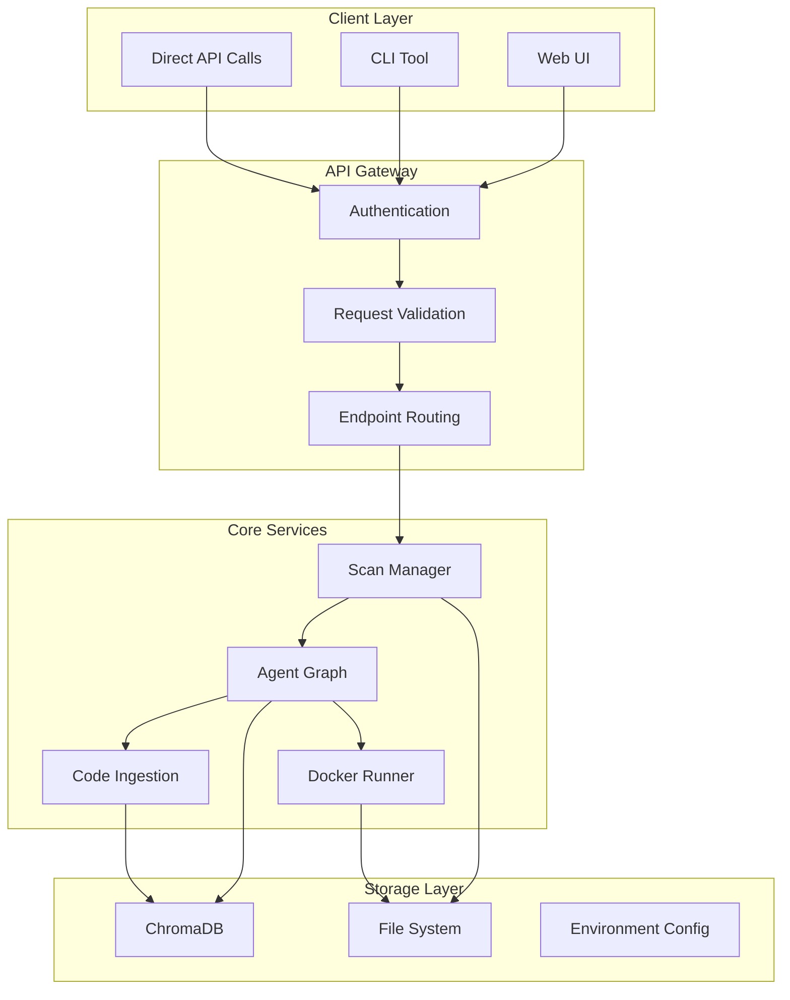
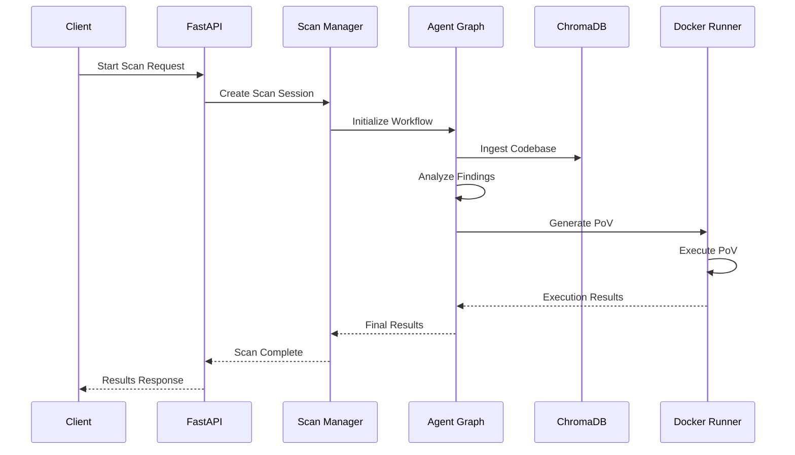

# Technology Stack Overview

<cite>
**Referenced Files in This Document**
- [requirements.txt](file://autopov/requirements.txt)
- [package.json](file://autopov/frontend/package.json)
- [vite.config.js](file://autopov/frontend/vite.config.js)
- [tailwind.config.js](file://autopov/frontend/tailwind.config.js)
- [postcss.config.js](file://autopov/frontend/postcss.config.js)
- [main.py](file://autopov/app/main.py)
- [config.py](file://autopov/app/config.py)
- [agent_graph.py](file://autopov/app/agent_graph.py)
- [docker_runner.py](file://autopov/agents/docker_runner.py)
- [ingest_codebase.py](file://autopov/agents/ingest_codebase.py)
- [prompts.py](file://autopov/prompts.py)
- [autopov.py](file://autopov/cli/autopov.py)
- [analyse.py](file://autopov/analyse.py)
- [README.md](file://autopov/README.md)
</cite>

## Table of Contents
1. [Introduction](#introduction)
2. [Backend Stack](#backend-stack)
3. [Frontend Stack](#frontend-stack)
4. [Database and Storage](#database-and-storage)
5. [External Tool Integrations](#external-tool-integrations)
6. [LLM Provider Integrations](#llm-provider-integrations)
7. [Async Programming Patterns](#async-programming-patterns)
8. [Integration Architecture](#integration-architecture)
9. [Version Requirements and Compatibility](#version-requirements-and-compatibility)
10. [Performance Considerations](#performance-considerations)
11. [Troubleshooting Guide](#troubleshooting-guide)
12. [Conclusion](#conclusion)

## Introduction
AutoPoV is a full-stack vulnerability detection and benchmarking framework that combines static analysis tools with AI-powered reasoning. The system integrates FastAPI for REST API development, LangChain/LangGraph for agent-based workflows, React for the frontend, and various external tools for comprehensive vulnerability analysis. This document provides a comprehensive overview of the complete technology foundation, including version requirements, compatibility considerations, and integration patterns between components.

## Backend Stack
The backend is built on FastAPI, providing a modern asynchronous web framework with automatic OpenAPI documentation and pydantic model validation. The application follows a modular architecture with clear separation of concerns across different functional domains.

### Core Framework Components
The backend leverages several key Python libraries for robust application development:

- **FastAPI >=0.104.0**: Asynchronous web framework with automatic API documentation
- **Uvicorn [standard] >=0.24.0**: ASGI server for production deployment
- **Pydantic >=2.5.0**: Data validation and settings management
- **Pydantic-Settings >=2.1.0**: Environment variable configuration management

### LLM and Agent Framework
AutoPoV implements a sophisticated LangGraph-based agent system for vulnerability detection and verification:

- **LangChain >=0.1.0**: AI chain framework for LLM integration
- **LangGraph >=0.0.40**: Stateful agent workflows with conditional routing
- **LangChain-OpenAI >=0.0.5**: OpenAI model integration
- **LangChain-Ollama >=0.0.1**: Local LLM model support

### Vector Storage and Embeddings
The system uses ChromaDB for semantic search and retrieval augmented generation (RAG):

- **ChromaDB >=0.4.18**: Vector database for code embeddings
- **Sentence-Transformers >=2.2.2**: Text embedding generation

### Code Analysis and Docker Integration
Additional utilities support comprehensive code analysis and secure execution:

- **GitPython >=3.1.40**: Git repository operations
- **Docker >=7.0.0**: Containerized execution environment
- **Click >=8.1.7**: Command-line interface framework
- **Requests >=2.31.0**: HTTP client for external API calls

### Testing Infrastructure
Robust testing capabilities ensure code quality and reliability:

- **PyTest >=7.4.3**: Test framework
- **PyTest-AsyncIO >=0.21.1**: Async test support
- **HTTPX >=0.25.2**: Async HTTP client for testing

**Section sources**
- [requirements.txt](file://autopov/requirements.txt#L1-L42)
- [main.py](file://autopov/app/main.py#L1-L528)
- [config.py](file://autopov/app/config.py#L1-L210)

## Frontend Stack
The frontend is built with React and modern build tooling, providing a responsive web interface for vulnerability scanning and result visualization.

### Core React Dependencies
The frontend utilizes a comprehensive set of React ecosystem packages:

- **React ^18.2.0**: UI library with hooks and components
- **React DOM ^18.2.0**: React DOM rendering
- **React Router DOM ^6.20.0**: Client-side routing
- **Axios ^1.6.0**: HTTP client for API communication
- **Recharts ^2.10.0**: Data visualization components
- **Lucide React ^0.294.0**: Icon library

### Build Tooling and Styling
Modern development workflow with Vite and Tailwind CSS:

- **Vite ^5.0.0**: Fast build tool and development server
- **@vitejs/plugin-react ^4.2.0**: React plugin for Vite
- **Tailwind CSS ^3.3.6**: Utility-first CSS framework
- **PostCSS ^8.4.32**: CSS processing pipeline
- **Autoprefixer ^10.4.16**: Automatic vendor prefixing

### Development Configuration
The frontend includes comprehensive development tooling:

- ESLint for code quality and linting
- TypeScript definitions for type safety
- Hot module replacement for efficient development
- Proxy configuration for API development

**Section sources**
- [package.json](file://autopov/frontend/package.json#L1-L34)
- [vite.config.js](file://autopov/frontend/vite.config.js#L1-L21)
- [tailwind.config.js](file://autopov/frontend/tailwind.config.js#L1-L30)
- [postcss.config.js](file://autopov/frontend/postcss.config.js#L1-L7)

## Database and Storage
AutoPoV implements a dual-storage approach combining vector databases for semantic search and traditional file system storage for results management.

### Vector Database (ChromaDB)
ChromaDB serves as the primary vector storage solution for code embeddings and semantic search:

- **Persistent Storage**: Data stored in `./data/chroma` directory
- **Collection Management**: Dynamic collection creation per scan session
- **Embedding Models**: Configurable based on LLM mode (online/offline)
- **Batch Operations**: Efficient bulk insertions for large codebases

### File System Storage
Traditional file-based storage handles results, reports, and intermediate artifacts:

- **Results Directory**: Central location for scan outcomes (`./results`)
- **PoV Scripts**: Dedicated storage for generated proof-of-vulnerability scripts (`./results/povs`)
- **Run History**: Persistent storage of scan metadata (`./results/runs`)
- **Temporary Files**: Secure temporary storage for processing (`/tmp/autopov`)

### Data Persistence Strategy
The system implements a layered persistence approach:

1. **Runtime State**: In-memory processing during active scans
2. **Vector Persistence**: Long-term storage in ChromaDB collections
3. **Artifact Storage**: Permanent file system storage for results
4. **Cleanup Management**: Automatic resource cleanup for expired sessions

**Section sources**
- [config.py](file://autopov/app/config.py#L60-L108)
- [ingest_codebase.py](file://autopov/agents/ingest_codebase.py#L1-L407)
- [docker_runner.py](file://autopov/agents/docker_runner.py#L1-L379)

## External Tool Integrations
AutoPoV integrates with several external analysis tools to provide comprehensive vulnerability detection capabilities.

### Static Analysis Tools
The framework supports multiple static analysis engines:

- **CodeQL CLI**: Advanced static analysis for multiple programming languages
- **Joern**: CPG (Call Program Graph) generation for code analysis
- **Kaitai Struct Compiler**: Binary format analysis capabilities

### Containerized Execution
Secure execution environment for proof-of-vulnerability scripts:

- **Docker SDK**: Programmatic container management
- **Isolation**: Network isolation, resource limits, and security boundaries
- **Image Management**: Automatic image pulling and container lifecycle

### Tool Availability Detection
The system includes comprehensive tool availability checking:

- **Docker Detection**: Runtime Docker daemon connectivity
- **CodeQL Detection**: CLI version and capability verification
- **Joern Detection**: CPG generation tool availability
- **Graceful Degradation**: Fallback mechanisms when tools are unavailable

**Section sources**
- [config.py](file://autopov/app/config.py#L74-L171)
- [agent_graph.py](file://autopov/app/agent_graph.py#L163-L278)
- [docker_runner.py](file://autopov/agents/docker_runner.py#L50-L61)

## LLM Provider Integrations
AutoPoV supports both online and offline LLM providers, enabling flexible deployment scenarios and cost optimization.

### Online LLM Providers
**OpenRouter Integration**:
- **Base URL**: `https://openrouter.ai/api/v1`
- **API Key Management**: Environment-based authentication
- **Model Support**: GPT-4o, Claude-3.5-Sonnet
- **Embedding Models**: text-embedding-3-small for vector operations

### Offline LLM Providers
**Ollama Integration**:
- **Default Base URL**: `http://localhost:11434`
- **Model Support**: Llama3:70b, Mixtral:8x7b
- **Local Processing**: No external API dependencies
- **Resource Efficiency**: Reduced operational costs

### Configuration Management
Dynamic LLM configuration based on deployment mode:

- **Model Mode Switching**: Runtime selection between online/offline
- **Embedding Model Selection**: Automatic embedding model choice
- **Cost Tracking**: Per-request cost calculation and monitoring
- **Fallback Mechanisms**: Graceful degradation when providers are unavailable

### Prompt Engineering
Comprehensive prompt system for different workflow stages:

- **Investigation Prompts**: Vulnerability analysis and verification
- **PoV Generation**: Automated exploit script creation
- **Validation Prompts**: PoV script quality assurance
- **Retry Analysis**: Failure analysis and improvement suggestions

**Section sources**
- [config.py](file://autopov/app/config.py#L30-L89)
- [prompts.py](file://autopov/prompts.py#L1-L374)

## Async Programming Patterns
AutoPoV extensively uses asynchronous programming patterns to handle concurrent operations, long-running scans, and real-time communication.

### FastAPI Async Endpoints
The backend implements comprehensive async support:

- **Background Task Processing**: Non-blocking scan initiation
- **Streaming Responses**: Server-Sent Events for real-time progress
- **Async Database Operations**: Concurrent vector storage operations
- **Concurrent External Calls**: Parallel tool executions

### Agent Workflow Coordination
LangGraph-based agent system with async coordination:

- **State Machine**: Asynchronous state transitions
- **Conditional Routing**: Dynamic workflow branching
- **Parallel Processing**: Concurrent vulnerability analysis
- **Error Recovery**: Fault-tolerant async execution

### Real-time Communication
WebSocket and streaming support for user feedback:

- **SSE Implementation**: Continuous log streaming
- **Progress Updates**: Real-time scan status reporting
- **Event-driven Architecture**: Reactive user interface updates
- **Timeout Management**: Graceful operation cancellation

### Resource Management
Efficient async resource utilization:

- **Connection Pooling**: Reusable database and API connections
- **Memory Management**: Async garbage collection
- **CPU Optimization**: Non-blocking I/O operations
- **Network Efficiency**: Async HTTP client usage

**Section sources**
- [main.py](file://autopov/app/main.py#L83-L161)
- [main.py](file://autopov/app/main.py#L350-L385)
- [agent_graph.py](file://autopov/app/agent_graph.py#L532-L572)

## Integration Architecture
AutoPoV implements a sophisticated integration architecture that coordinates multiple systems and data flows.

### API Layer Architecture
REST API with comprehensive endpoint coverage:

**Diagram sources**
- [main.py](file://autopov/app/main.py#L102-L121)
- [agent_graph.py](file://autopov/app/agent_graph.py#L84-L134)

### Data Flow Architecture
Complex data flow patterns for vulnerability analysis:

**Diagram sources**
- [main.py](file://autopov/app/main.py#L177-L316)
- [agent_graph.py](file://autopov/app/agent_graph.py#L532-L572)

### Component Interaction Patterns
The system employs several interaction patterns:

- **Observer Pattern**: Real-time progress updates
- **Strategy Pattern**: Pluggable LLM providers
- **Factory Pattern**: Dynamic component instantiation
- **Mediator Pattern**: Agent workflow coordination

**Section sources**
- [main.py](file://autopov/app/main.py#L1-L528)
- [agent_graph.py](file://autopov/app/agent_graph.py#L1-L582)

## Version Requirements and Compatibility
AutoPoV maintains strict version requirements to ensure compatibility and stability across all components.

### Python Runtime Requirements
- **Python 3.11+**: Minimum runtime requirement for async features
- **Virtual Environment**: Recommended isolation for dependencies
- **Package Pinning**: Specific versions for reproducible builds

### Backend Library Versions
- **FastAPI 0.104.0+**: Latest async features and security patches
- **LangChain 0.1.0+**: Agent framework stability
- **LangGraph 0.0.40+**: State machine reliability
- **ChromaDB 0.4.18+**: Vector database compatibility

### Frontend Dependencies
- **Node.js 20+**: Modern JavaScript runtime
- **React 18.2.0+**: Latest hooks and features
- **Vite 5.0.0+**: Build tool stability
- **Tailwind CSS 3.3.6+**: Utility-first approach

### External Tool Requirements
- **Docker Engine**: For PoV execution isolation
- **CodeQL CLI**: Static analysis capabilities
- **Ollama**: Local LLM inference (optional)

### Compatibility Matrix
The system maintains backward compatibility through careful version management:

- **API Stability**: Breaking changes avoided in major releases
- **LLM Provider Flexibility**: Easy switching between providers
- **Tool Availability**: Graceful fallback when tools are missing
- **Configuration Migration**: Backward-compatible settings

**Section sources**
- [README.md](file://autopov/README.md#L39-L46)
- [requirements.txt](file://autopov/requirements.txt#L1-L42)
- [package.json](file://autopov/frontend/package.json#L1-L34)

## Performance Considerations
AutoPoV is designed with performance optimization as a core principle, implementing several strategies for efficient resource utilization.

### Async Performance Optimization
- **Non-blocking I/O**: All external operations use async patterns
- **Connection pooling**: Reused database and API connections
- **Batch processing**: Vector operations optimized for throughput
- **Memory management**: Efficient garbage collection and resource cleanup

### Vector Database Optimization
- **Chunk sizing**: Configurable chunk sizes for optimal embedding performance
- **Batch embeddings**: Minimized API calls through batching
- **Collection indexing**: Optimized search performance
- **Memory mapping**: Efficient vector storage and retrieval

### Container Security and Performance
- **Resource limits**: CPU and memory constraints prevent resource exhaustion
- **Network isolation**: Security through zero network access
- **Image caching**: Efficient container image management
- **Timeout handling**: Prevents hanging operations

### Cost Management
- **Usage tracking**: Real-time cost monitoring
- **Budget limits**: Configurable spending caps
- **Provider switching**: Optimal provider selection based on cost
- **Efficiency metrics**: Performance monitoring and optimization

### Scalability Patterns
- **Horizontal scaling**: Stateless API design enables load balancing
- **Queue-based processing**: Background task distribution
- **Caching strategies**: Frequently accessed data optimization
- **Database optimization**: Indexing and query optimization

## Troubleshooting Guide
Common issues and their solutions across the AutoPoV technology stack.

### Backend Issues
**FastAPI Application Problems**:
- Verify Uvicorn installation and version compatibility
- Check port availability (default 8000)
- Ensure environment variables are properly loaded
- Validate CORS configuration for frontend integration

**Async Operation Failures**:
- Check asyncio event loop configuration
- Verify database connection pooling
- Monitor background task execution
- Review timeout configurations

### Frontend Issues
**Development Server Problems**:
- Verify Node.js version compatibility
- Check Vite configuration for proxy settings
- Ensure port availability (default 5173)
- Validate Tailwind CSS configuration

**Build Issues**:
- Clear node_modules and reinstall dependencies
- Check for conflicting package versions
- Verify TypeScript configuration
- Review PostCSS plugin compatibility

### Database and Storage Issues
**ChromaDB Problems**:
- Verify persistent directory permissions
- Check disk space availability
- Monitor database file corruption
- Review collection naming conflicts

**File System Issues**:
- Validate write permissions for results directory
- Check temporary file cleanup procedures
- Monitor storage quota usage
- Verify cross-platform path compatibility

### External Tool Integration
**Docker Issues**:
- Verify Docker daemon connectivity
- Check image availability and pull permissions
- Review resource limit configurations
- Validate network isolation settings

**LLM Provider Issues**:
- Verify API key authentication
- Check model availability and quotas
- Monitor rate limiting and usage caps
- Review fallback mechanism configuration

### Performance Troubleshooting
**Memory Leaks**:
- Monitor vector database memory usage
- Check for unclosed file handles
- Review async task cleanup
- Validate garbage collection

**Slow Operations**:
- Profile vector embedding performance
- Optimize chunk size configuration
- Review database query optimization
- Check network latency to external APIs

**Section sources**
- [main.py](file://autopov/app/main.py#L164-L174)
- [config.py](file://autopov/app/config.py#L123-L171)
- [docker_runner.py](file://autopov/agents/docker_runner.py#L50-L61)

## Conclusion
AutoPoV represents a comprehensive technology stack that successfully integrates modern web development practices with advanced AI and security analysis capabilities. The system's architecture demonstrates best practices in async programming, microservice design, and tool integration while maintaining flexibility for both cloud and offline deployment scenarios.

The technology foundation provides a solid base for vulnerability detection research and industrial applications, with clear separation of concerns, robust error handling, and comprehensive monitoring capabilities. The modular design enables easy extension and customization for specific use cases while maintaining system stability and performance.

Future enhancements could focus on distributed processing capabilities, enhanced security measures, and expanded tool integration, building upon the strong foundation established by this technology stack.