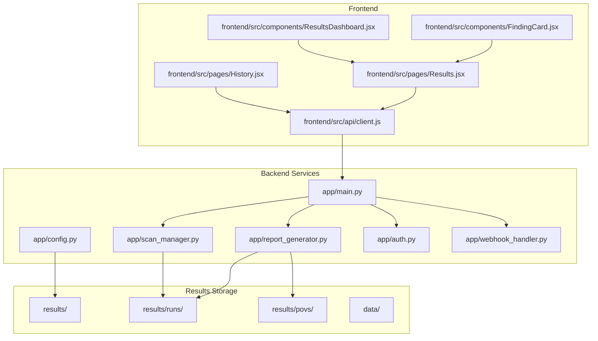
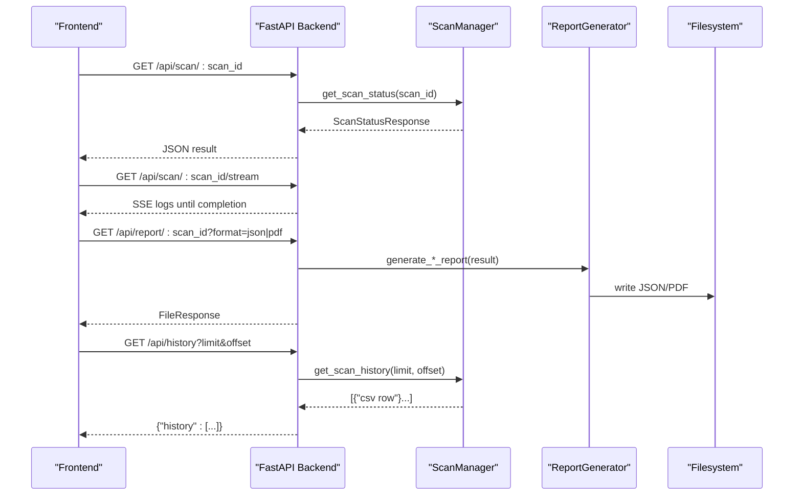
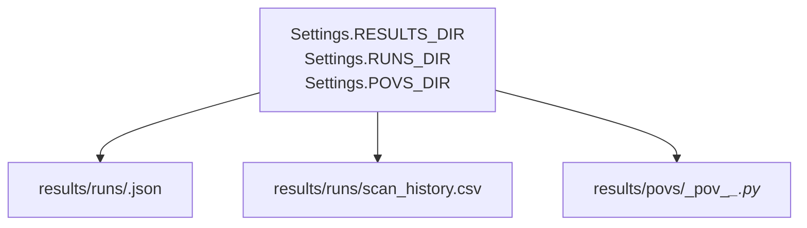
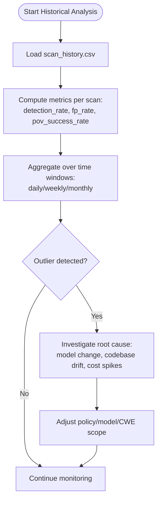
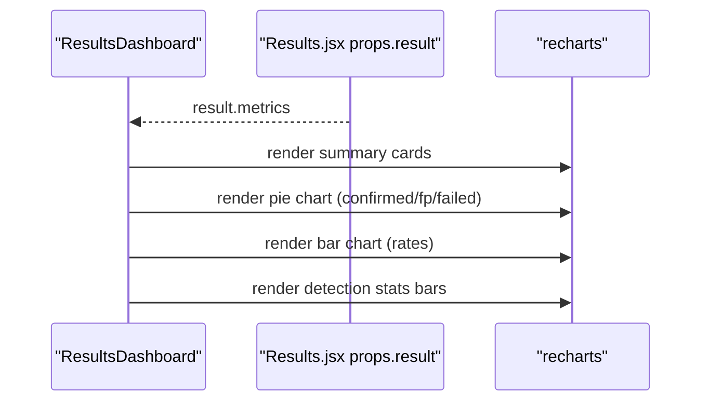
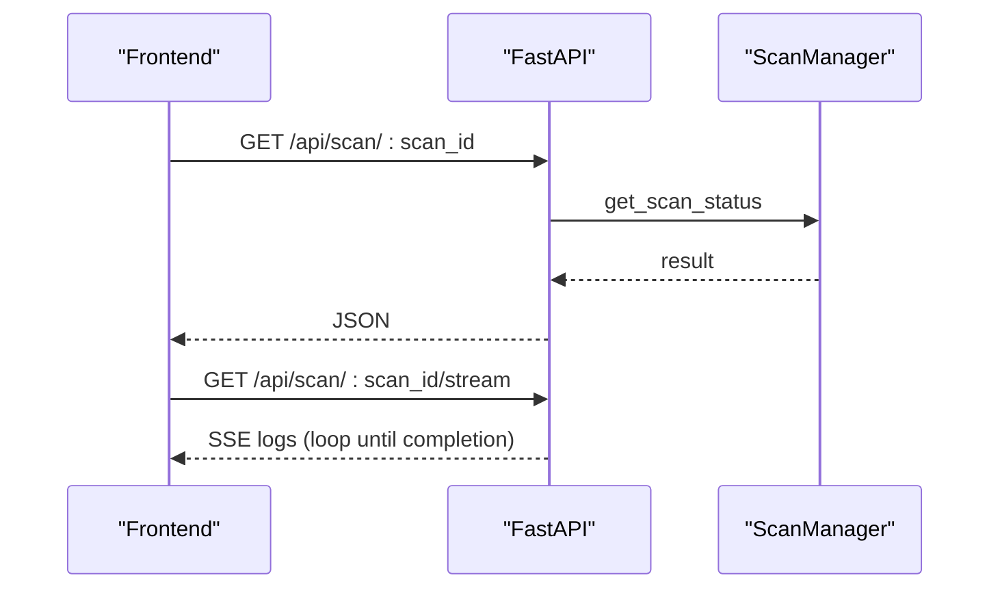
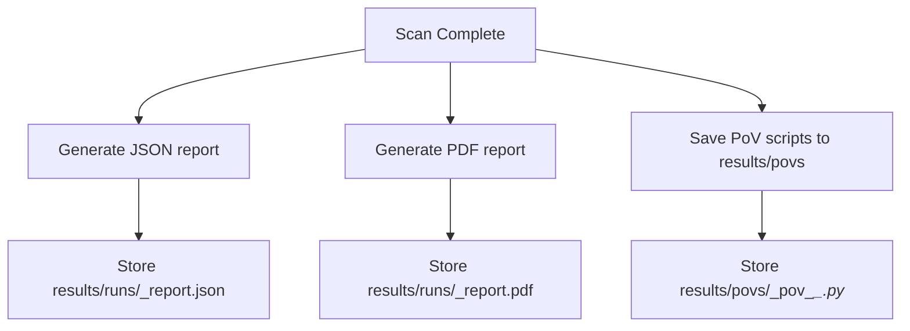
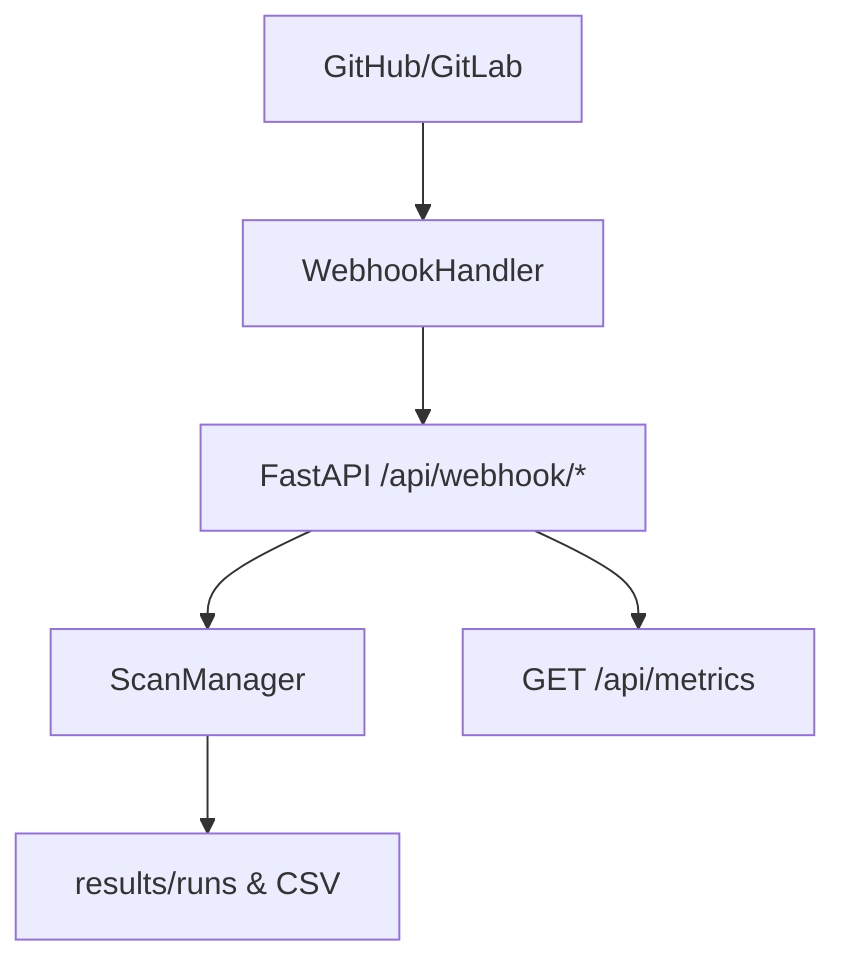
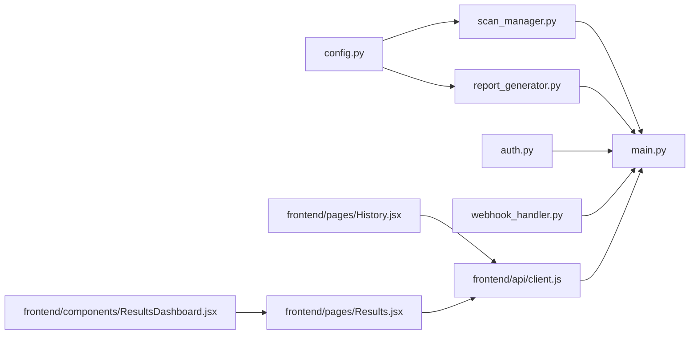

# Analytics Integration and Visualization

<cite>
**Referenced Files in This Document**
- [config.py](file://autopov/app/config.py)
- [scan_manager.py](file://autopov/app/scan_manager.py)
- [report_generator.py](file://autopov/app/report_generator.py)
- [main.py](file://autopov/app/main.py)
- [client.js](file://autopov/frontend/src/api/client.js)
- [History.jsx](file://autopov/frontend/src/pages/History.jsx)
- [Results.jsx](file://autopov/frontend/src/pages/Results.jsx)
- [ResultsDashboard.jsx](file://autopov/frontend/src/components/ResultsDashboard.jsx)
- [FindingCard.jsx](file://autopov/frontend/src/components/FindingCard.jsx)
- [auth.py](file://autopov/app/auth.py)
- [webhook_handler.py](file://autopov/app/webhook_handler.py)
- [.gitkeep](file://autopov/results/.gitkeep)
- [.gitkeep](file://autopov/results/runs/.gitkeep)
- [.gitkeep](file://autopov/results/povs/.gitkeep)
</cite>

## Table of Contents
1. [Introduction](#introduction)
2. [Project Structure](#project-structure)
3. [Core Components](#core-components)
4. [Architecture Overview](#architecture-overview)
5. [Detailed Component Analysis](#detailed-component-analysis)
6. [Dependency Analysis](#dependency-analysis)
7. [Performance Considerations](#performance-considerations)
8. [Troubleshooting Guide](#troubleshooting-guide)
9. [Conclusion](#conclusion)
10. [Appendices](#appendices)

## Introduction
This document explains AutoPoV’s analytics integration and visualization capabilities with a focus on:
- Persistent storage of results and PoVs organized by runs
- Historical analysis workflows and metrics
- Frontend dashboards and report generation
- Integration patterns with external analytics platforms and SOC workflows
- Practical examples for custom metrics, automated reporting, and archival strategies

It consolidates backend persistence, frontend visualization, and API flows to help teams operate AutoPoV as a repeatable, auditable, and analyzable security pipeline.

## Project Structure
AutoPoV organizes analytics data under a dedicated results hierarchy:
- results/runs: Per-scan JSON artifacts and a CSV history log
- results/povs: Persisted PoV scripts for confirmed vulnerabilities
- data: Shared persistent data (e.g., ChromaDB embeddings)

**Diagram sources**
- [config.py](file://autopov/app/config.py#L102-L107)
- [scan_manager.py](file://autopov/app/scan_manager.py#L47-L48)
- [report_generator.py](file://autopov/app/report_generator.py#L72-L74)
- [main.py](file://autopov/app/main.py#L103-L121)
- [client.js](file://autopov/frontend/src/api/client.js#L3-L8)
- [History.jsx](file://autopov/frontend/src/pages/History.jsx#L15-L16)
- [Results.jsx](file://autopov/frontend/src/pages/Results.jsx#L18-L24)
- [ResultsDashboard.jsx](file://autopov/frontend/src/components/ResultsDashboard.jsx#L6-L24)
- [FindingCard.jsx](file://autopov/frontend/src/components/FindingCard.jsx#L5-L17)

**Section sources**
- [config.py](file://autopov/app/config.py#L102-L107)
- [scan_manager.py](file://autopov/app/scan_manager.py#L201-L236)
- [report_generator.py](file://autopov/app/report_generator.py#L76-L118)
- [Results.jsx](file://autopov/frontend/src/pages/Results.jsx#L15-L28)
- [History.jsx](file://autopov/frontend/src/pages/History.jsx#L12-L25)

## Core Components
- Configuration and paths: Centralized directory configuration for results, runs, and PoVs.
- Scan manager: Orchestrates scan lifecycle, persists JSON results, and maintains a CSV history log.
- Report generator: Produces JSON/PDF reports and persists PoV scripts.
- API server: Exposes endpoints for streaming logs, retrieving results, generating reports, and metrics.
- Frontend: Renders dashboards, history, and individual scan details with charts and severity badges.
- Authentication: API key management and bearer token verification.
- Webhooks: GitHub/GitLab integrations to auto-trigger scans and persist outcomes.

**Section sources**
- [config.py](file://autopov/app/config.py#L102-L107)
- [scan_manager.py](file://autopov/app/scan_manager.py#L40-L116)
- [report_generator.py](file://autopov/app/report_generator.py#L68-L119)
- [main.py](file://autopov/app/main.py#L319-L431)
- [ResultsDashboard.jsx](file://autopov/frontend/src/components/ResultsDashboard.jsx#L5-L24)
- [auth.py](file://autopov/app/auth.py#L32-L96)
- [webhook_handler.py](file://autopov/app/webhook_handler.py#L15-L24)

## Architecture Overview
The analytics pipeline integrates frontend, backend, and persistence layers to enable:
- Real-time streaming logs during scans
- Persistent JSON results and CSV history
- On-demand report generation (JSON/PDF)
- PoV script archival for confirmed findings
- Metrics aggregation for dashboards and external systems

**Diagram sources**
- [Results.jsx](file://autopov/frontend/src/pages/Results.jsx#L15-L28)
- [History.jsx](file://autopov/frontend/src/pages/History.jsx#L12-L25)
- [client.js](file://autopov/frontend/src/api/client.js#L40-L53)
- [main.py](file://autopov/app/main.py#L319-L431)
- [scan_manager.py](file://autopov/app/scan_manager.py#L237-L273)
- [report_generator.py](file://autopov/app/report_generator.py#L76-L118)

## Detailed Component Analysis

### Results Directory Structure and Persistence
- Runs: Each scan produces a JSON artifact named by scan_id and a CSV history log aggregating metrics for historical analysis.
- PoVs: PoV scripts for confirmed vulnerabilities are persisted separately for auditability and re-use.
- Data: Vector store and other persistent assets are stored under data/.

**Diagram sources**
- [config.py](file://autopov/app/config.py#L102-L107)
- [scan_manager.py](file://autopov/app/scan_manager.py#L201-L236)
- [report_generator.py](file://autopov/app/report_generator.py#L272-L300)

**Section sources**
- [config.py](file://autopov/app/config.py#L102-L107)
- [scan_manager.py](file://autopov/app/scan_manager.py#L201-L236)
- [report_generator.py](file://autopov/app/report_generator.py#L272-L300)
- [.gitkeep](file://autopov/results/.gitkeep#L1-L2)
- [.gitkeep](file://autopov/results/runs/.gitkeep#L1-L2)
- [.gitkeep](file://autopov/results/povs/.gitkeep#L1-L2)

### Data Persistence Patterns and Naming Conventions
- JSON result files: <scan_id>.json in results/runs
- CSV history: scan_history.csv in results/runs with columns for counts, costs, durations, timestamps
- PoV scripts: <scan_id>_pov_<i>_<cwe>.py in results/povs
- Metadata: timestamps, model, CWE scope, and aggregated metrics included in JSON and CSV

**Section sources**
- [scan_manager.py](file://autopov/app/scan_manager.py#L201-L236)
- [report_generator.py](file://autopov/app/report_generator.py#L76-L118)

### Historical Analysis Workflows
- Trend identification: Use CSV history to compute trends in total_findings, confirmed_vulns, false_positives, total_cost_usd, and duration_s over time windows.
- Regression detection: Compare detection_rate and fp_rate across recent scans; flag significant shifts.
- Performance monitoring: Track duration_s and total_cost_usd to detect outliers and optimize model/CWE selections.

[No sources needed since this diagram shows conceptual workflow, not actual code structure]

### Dashboard Integration and Visualization
- Frontend dashboards consume result payloads to render:
  - Summary cards (total findings, confirmed, cost, duration)
  - Distribution pie chart (confirmed, false positives, failed)
  - Metrics bar chart (detection rate vs. false positive rate)
  - Detection statistics bars
- Severity badges classify findings by CWE severity.

**Diagram sources**
- [ResultsDashboard.jsx](file://autopov/frontend/src/components/ResultsDashboard.jsx#L5-L24)
- [Results.jsx](file://autopov/frontend/src/pages/Results.jsx#L15-L28)

**Section sources**
- [ResultsDashboard.jsx](file://autopov/frontend/src/components/ResultsDashboard.jsx#L5-L24)
- [Results.jsx](file://autopov/frontend/src/pages/Results.jsx#L15-L28)
- [FindingCard.jsx](file://autopov/frontend/src/components/FindingCard.jsx#L5-L17)

### API and Streaming Logs
- Status and results: GET /api/scan/{scan_id}
- Streaming logs: GET /api/scan/{scan_id}/stream (SSE)
- History: GET /api/history?limit&offset
- Reports: GET /api/report/{scan_id}?format=json|pdf
- Metrics: GET /api/metrics

**Diagram sources**
- [client.js](file://autopov/frontend/src/api/client.js#L40-L44)
- [main.py](file://autopov/app/main.py#L319-L385)
- [scan_manager.py](file://autopov/app/scan_manager.py#L237-L285)

**Section sources**
- [client.js](file://autopov/frontend/src/api/client.js#L40-L53)
- [main.py](file://autopov/app/main.py#L319-L385)

### Report Generation and PoV Archival
- JSON report: Includes report_metadata, scan_summary, metrics, and findings
- PDF report: Executive summary, metrics table, confirmed vulnerabilities, methodology
- PoV scripts: Saved to results/povs with metadata headers

**Diagram sources**
- [report_generator.py](file://autopov/app/report_generator.py#L76-L118)
- [report_generator.py](file://autopov/app/report_generator.py#L120-L270)
- [report_generator.py](file://autopov/app/report_generator.py#L272-L300)

**Section sources**
- [report_generator.py](file://autopov/app/report_generator.py#L76-L118)
- [report_generator.py](file://autopov/app/report_generator.py#L120-L270)
- [report_generator.py](file://autopov/app/report_generator.py#L272-L300)

### Integration with External Platforms and SOC Workflows
- Metrics endpoint: GET /api/metrics exposes overall system metrics for dashboards
- Webhooks: GitHub/GitLab triggers scans automatically; results are persisted for later auditing
- API keys: Bearer token authentication secures endpoints for CI/CD and SOCs

**Diagram sources**
- [webhook_handler.py](file://autopov/app/webhook_handler.py#L196-L265)
- [main.py](file://autopov/app/main.py#L433-L475)
- [scan_manager.py](file://autopov/app/scan_manager.py#L304-L334)
- [auth.py](file://autopov/app/auth.py#L137-L156)

**Section sources**
- [main.py](file://autopov/app/main.py#L513-L517)
- [webhook_handler.py](file://autopov/app/webhook_handler.py#L196-L265)
- [auth.py](file://autopov/app/auth.py#L137-L156)

## Dependency Analysis
- Backend modules depend on configuration for paths and tool availability checks
- ScanManager persists results and CSV logs; ReportGenerator depends on ScanResult and writes JSON/PDF and PoVs
- Frontend depends on API client for authenticated requests and SSE streaming
- Authentication enforces bearer tokens across endpoints

**Diagram sources**
- [config.py](file://autopov/app/config.py#L102-L107)
- [scan_manager.py](file://autopov/app/scan_manager.py#L47-L48)
- [report_generator.py](file://autopov/app/report_generator.py#L72-L74)
- [main.py](file://autopov/app/main.py#L103-L121)
- [client.js](file://autopov/frontend/src/api/client.js#L3-L8)
- [History.jsx](file://autopov/frontend/src/pages/History.jsx#L15-L16)
- [Results.jsx](file://autopov/frontend/src/pages/Results.jsx#L18-L24)
- [ResultsDashboard.jsx](file://autopov/frontend/src/components/ResultsDashboard.jsx#L5-L24)
- [auth.py](file://autopov/app/auth.py#L32-L96)
- [webhook_handler.py](file://autopov/app/webhook_handler.py#L15-L24)

**Section sources**
- [main.py](file://autopov/app/main.py#L103-L121)
- [client.js](file://autopov/frontend/src/api/client.js#L3-L8)
- [scan_manager.py](file://autopov/app/scan_manager.py#L47-L48)
- [report_generator.py](file://autopov/app/report_generator.py#L72-L74)
- [auth.py](file://autopov/app/auth.py#L32-L96)
- [webhook_handler.py](file://autopov/app/webhook_handler.py#L15-L24)

## Performance Considerations
- Use CSV history for efficient historical queries and aggregation
- Persist PoVs separately to avoid bloating JSON payloads
- Stream logs via SSE to reduce latency and memory overhead during long scans
- Limit report generation frequency; cache PDFs when appropriate
- Monitor cost and duration metrics to tune model selection and CWE scope

[No sources needed since this section provides general guidance]

## Troubleshooting Guide
- Authentication failures: Ensure Bearer token is present and valid; verify admin key for admin endpoints
- Missing results: Check scan status and fallback to persisted JSON in results/runs/<scan_id>.json
- Webhook errors: Validate signatures/tokens and ensure callback registration is active
- PDF generation: Confirm fpdf availability; otherwise only JSON reports are supported

**Section sources**
- [auth.py](file://autopov/app/auth.py#L137-L156)
- [main.py](file://autopov/app/main.py#L319-L347)
- [webhook_handler.py](file://autopov/app/webhook_handler.py#L213-L218)
- [report_generator.py](file://autopov/app/report_generator.py#L130-L131)

## Conclusion
AutoPoV provides a robust, persistent analytics stack with:
- Clear results and PoV storage under results/runs and results/povs
- Built-in CSV history for trend and regression analysis
- Rich frontend dashboards and on-demand reports
- Secure APIs with bearer tokens and webhook integrations
Adopt the recommended archival and retention strategies below to operationalize long-term observability and SOC alignment.

## Appendices

### Practical Examples

- Dashboard creation
  - Use the metrics exposed by the frontend dashboard component to build custom widgets for total findings, confirmed count, cost, and duration.
  - Reference: [ResultsDashboard.jsx](file://autopov/frontend/src/components/ResultsDashboard.jsx#L5-L24)

- Custom metric calculation
  - Compute detection_rate and fp_rate from CSV history for a given time window.
  - Reference: [scan_manager.py](file://autopov/app/scan_manager.py#L304-L334)

- Automated reporting setup
  - Schedule periodic report retrieval via GET /api/report/{scan_id}?format=json|pdf and store in your artifact repository.
  - Reference: [client.js](file://autopov/frontend/src/api/client.js#L50-L53), [main.py](file://autopov/app/main.py#L400-L431)

- Extending analytics capabilities
  - Add new metrics in ScanResult and update CSV writer to include additional columns.
  - Reference: [scan_manager.py](file://autopov/app/scan_manager.py#L201-L236)

- Integrating with SOC workflows
  - Use webhooks to auto-trigger scans on code pushes; persist results for audit trails.
  - Reference: [webhook_handler.py](file://autopov/app/webhook_handler.py#L196-L265), [main.py](file://autopov/app/main.py#L433-L475)

### Data Archiving Strategies, Retention Policies, and Backup Procedures
- Archiving
  - Compress results/runs/<scan_id>.json and results/povs/*.py periodically
  - Move archived artifacts to cold storage (e.g., S3, NAS) with metadata indexing
- Retention
  - Define retention periods by scan age and compliance requirements; purge old JSON/PDF/PoV files accordingly
- Backup
  - Back up results/runs/scan_history.csv and all PoV scripts regularly; include checksums for integrity verification
- Auditability
  - Maintain immutable logs of report generations and PoV executions; include timestamps and scan_id cross-references

[No sources needed since this section provides general guidance]