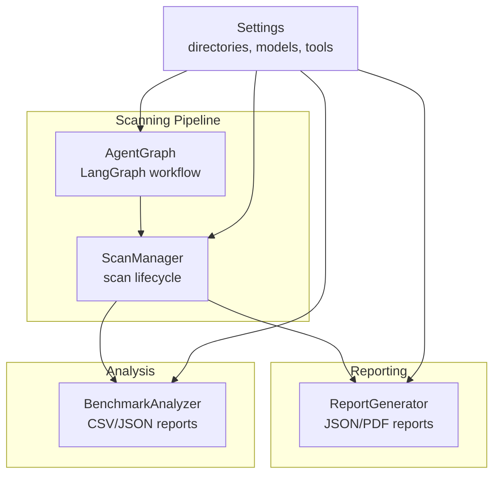
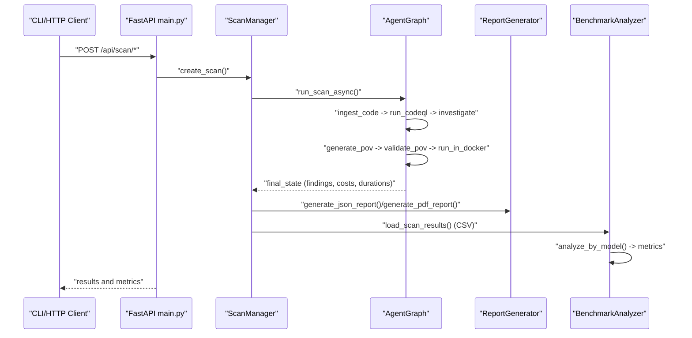
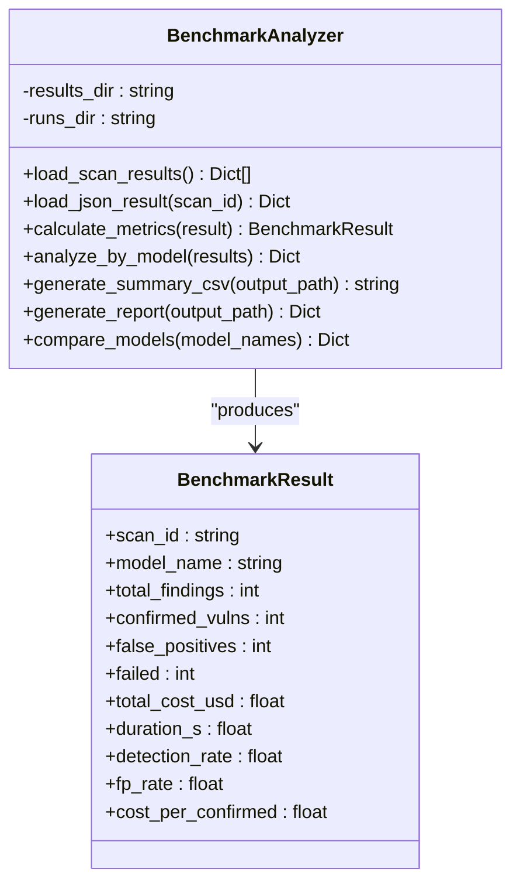
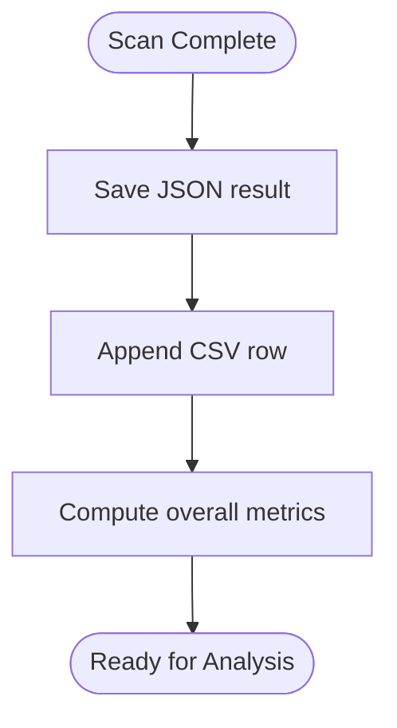
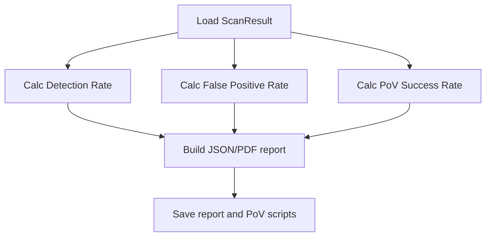
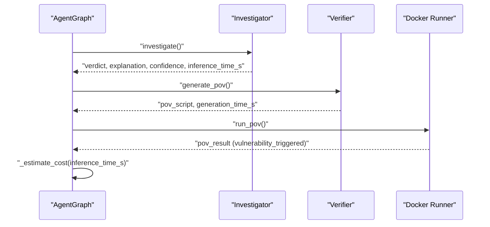
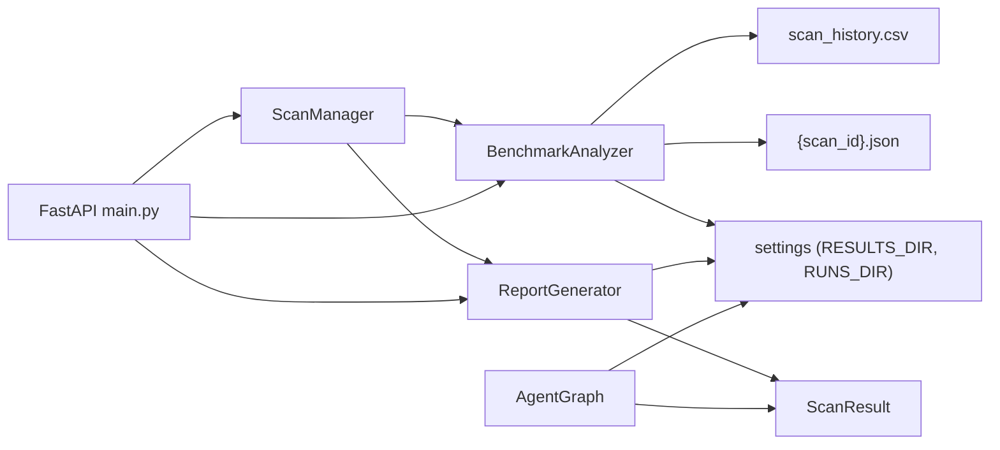

# Benchmarking and Performance Analysis

<cite>
**Referenced Files in This Document**
- [analyse.py](file://autopov/analyse.py)
- [scan_manager.py](file://autopov/app/scan_manager.py)
- [report_generator.py](file://autopov/app/report_generator.py)
- [agent_graph.py](file://autopov/app/agent_graph.py)
- [config.py](file://autopov/app/config.py)
- [prompts.py](file://autopov/prompts.py)
- [README.md](file://autopov/README.md)
- [main.py](file://autopov/app/main.py)
- [autopov.py](file://autopov/cli/autopov.py)
</cite>

## Table of Contents
1. [Introduction](#introduction)
2. [Project Structure](#project-structure)
3. [Core Components](#core-components)
4. [Architecture Overview](#architecture-overview)
5. [Detailed Component Analysis](#detailed-component-analysis)
6. [Dependency Analysis](#dependency-analysis)
7. [Performance Considerations](#performance-considerations)
8. [Troubleshooting Guide](#troubleshooting-guide)
9. [Conclusion](#conclusion)
10. [Appendices](#appendices)

## Introduction
This document describes AutoPoV’s benchmarking and performance analysis framework for comparative evaluation of LLM performance across vulnerability detection tasks. It focuses on the analyse.py utility for processing scan results and generating comparative metrics, and documents benchmark methodologies including detection rates, false positive rates, and Proof-of-Vulnerability (PoV) success rates across CWE types and datasets. It also covers performance metrics computation (cost analysis, inference time tracking, and resource utilization), comparative analysis workflows for models, configurations, and static analysis tools, and practical guidance for setting baselines, tracking improvements, and conducting controlled experiments.

## Project Structure
AutoPoV integrates a scanning pipeline with a reporting and analysis subsystem:
- Scanning pipeline: orchestrates ingestion, static analysis, LLM investigation, PoV generation/validation, and Docker execution.
- Reporting: produces JSON/PDF reports and extracts per-scan metrics.
- Analysis: loads historical scan results and computes comparative benchmarks across models and runs.

**Diagram sources**
- [agent_graph.py](file://autopov/app/agent_graph.py#L532-L572)
- [scan_manager.py](file://autopov/app/scan_manager.py#L118-L235)
- [report_generator.py](file://autopov/app/report_generator.py#L76-L118)
- [analyse.py](file://autopov/analyse.py#L42-L60)
- [config.py](file://autopov/app/config.py#L102-L107)

**Section sources**
- [README.md](file://autopov/README.md#L1-L242)
- [config.py](file://autopov/app/config.py#L102-L107)

## Core Components
- BenchmarkAnalyzer: Loads scan results, calculates per-scan metrics, aggregates by model, and generates CSV and JSON reports.
- ScanManager: Executes scans, persists results to CSV and JSON, and maintains history.
- ReportGenerator: Produces per-scan JSON/PDF reports with detection rate, false positive rate, and PoV success rate.
- AgentGraph: Orchestrates the vulnerability detection workflow and tracks inference time and cost per finding.
- CLI and API: Provide programmatic access to trigger scans, fetch results, and generate reports.

Key metrics produced:
- Detection rate (%): confirmed_vulns / total_findings
- False positive rate (%): false_positives / total_findings
- PoV success rate (%): confirmed findings with vulnerability_triggered / confirmed_vulns
- Cost per confirmed: total_cost_usd / confirmed_vulns
- Duration: total seconds per scan

**Section sources**
- [analyse.py](file://autopov/analyse.py#L23-L98)
- [analyse.py](file://autopov/analyse.py#L100-L159)
- [analyse.py](file://autopov/analyse.py#L216-L247)
- [analyse.py](file://autopov/analyse.py#L249-L267)
- [report_generator.py](file://autopov/app/report_generator.py#L302-L327)
- [scan_manager.py](file://autopov/app/scan_manager.py#L148-L163)
- [agent_graph.py](file://autopov/app/agent_graph.py#L521-L531)

## Architecture Overview
The benchmarking workflow spans data ingestion, static analysis, LLM-based investigation, PoV generation/validation, Docker execution, and persistence. Analysis consumes persisted CSV/JSON to compute comparative metrics.

**Diagram sources**
- [main.py](file://autopov/app/main.py#L177-L316)
- [scan_manager.py](file://autopov/app/scan_manager.py#L86-L175)
- [agent_graph.py](file://autopov/app/agent_graph.py#L532-L572)
- [report_generator.py](file://autopov/app/report_generator.py#L76-L118)
- [analyse.py](file://autopov/analyse.py#L46-L60)

## Detailed Component Analysis

### BenchmarkAnalyzer: Comparative Metrics and Reports
- Loads CSV history and JSON results for each scan.
- Calculates per-scan metrics: detection_rate, fp_rate, cost_per_confirmed.
- Aggregates by model using pandas when available, otherwise falls back to pure Python.
- Generates CSV summary and JSON report with recommendations.

**Diagram sources**
- [analyse.py](file://autopov/analyse.py#L23-L98)
- [analyse.py](file://autopov/analyse.py#L42-L60)
- [analyse.py](file://autopov/analyse.py#L100-L159)

**Section sources**
- [analyse.py](file://autopov/analyse.py#L46-L60)
- [analyse.py](file://autopov/analyse.py#L72-L98)
- [analyse.py](file://autopov/analyse.py#L100-L159)
- [analyse.py](file://autopov/analyse.py#L216-L247)
- [analyse.py](file://autopov/analyse.py#L249-L267)
- [analyse.py](file://autopov/analyse.py#L300-L305)

### ScanManager: Persistence and Metrics
- Persists each scan as JSON and appends a CSV row with metrics.
- Computes overall system metrics from CSV history.

**Diagram sources**
- [scan_manager.py](file://autopov/app/scan_manager.py#L201-L235)
- [scan_manager.py](file://autopov/app/scan_manager.py#L304-L334)

**Section sources**
- [scan_manager.py](file://autopov/app/scan_manager.py#L201-L235)
- [scan_manager.py](file://autopov/app/scan_manager.py#L304-L334)

### ReportGenerator: Per-Scan Metrics and PoV Success
- Calculates detection rate, false positive rate, and PoV success rate.
- Formats findings for reports and saves PoV scripts.

**Diagram sources**
- [report_generator.py](file://autopov/app/report_generator.py#L302-L327)
- [report_generator.py](file://autopov/app/report_generator.py#L76-L118)

**Section sources**
- [report_generator.py](file://autopov/app/report_generator.py#L302-L327)
- [report_generator.py](file://autopov/app/report_generator.py#L76-L118)

### AgentGraph: Inference Time and Cost Tracking
- Tracks inference_time_s and cost_usd per finding.
- Estimates cost based on inference time and model mode.

**Diagram sources**
- [agent_graph.py](file://autopov/app/agent_graph.py#L290-L325)
- [agent_graph.py](file://autopov/app/agent_graph.py#L327-L369)
- [agent_graph.py](file://autopov/app/agent_graph.py#L403-L433)
- [agent_graph.py](file://autopov/app/agent_graph.py#L521-L531)

**Section sources**
- [agent_graph.py](file://autopov/app/agent_graph.py#L290-L325)
- [agent_graph.py](file://autopov/app/agent_graph.py#L327-L369)
- [agent_graph.py](file://autopov/app/agent_graph.py#L403-L433)
- [agent_graph.py](file://autopov/app/agent_graph.py#L521-L531)

### Configuration and Data Paths
- Results and runs directories are configured centrally and used by all components.

**Section sources**
- [config.py](file://autopov/app/config.py#L102-L107)

## Dependency Analysis
- BenchmarkAnalyzer depends on ScanManager’s persisted CSV/JSON and settings for directories.
- ReportGenerator depends on ScanResult and settings for output directories.
- AgentGraph drives cost and timing metrics used by both ReportGenerator and BenchmarkAnalyzer.
- CLI and API provide entry points to trigger scans and retrieve results.

**Diagram sources**
- [analyse.py](file://autopov/analyse.py#L42-L60)
- [scan_manager.py](file://autopov/app/scan_manager.py#L201-L235)
- [report_generator.py](file://autopov/app/report_generator.py#L76-L118)
- [agent_graph.py](file://autopov/app/agent_graph.py#L532-L572)
- [main.py](file://autopov/app/main.py#L177-L316)

**Section sources**
- [analyse.py](file://autopov/analyse.py#L42-L60)
- [scan_manager.py](file://autopov/app/scan_manager.py#L201-L235)
- [report_generator.py](file://autopov/app/report_generator.py#L76-L118)
- [agent_graph.py](file://autopov/app/agent_graph.py#L532-L572)
- [main.py](file://autopov/app/main.py#L177-L316)

## Performance Considerations
- Cost tracking:
  - Online models: cost estimated from inference_time_s at a fixed rate.
  - Offline models: cost tracking is disabled in the current implementation.
- Inference time and duration:
  - Per-finding inference_time_s and total scan duration are recorded and used for metrics.
- Resource utilization:
  - Docker execution is constrained by configurable limits (timeout, memory, CPU).
- Scalability:
  - Pandas-based aggregation is used when available; otherwise a pure Python fallback is used.

Recommendations:
- Enable token-based cost accounting for online models to improve accuracy.
- Track GPU utilization for offline models and incorporate into cost estimation.
- Monitor Docker resource usage and adjust limits to balance safety and throughput.

**Section sources**
- [agent_graph.py](file://autopov/app/agent_graph.py#L521-L531)
- [config.py](file://autopov/app/config.py#L78-L87)
- [config.py](file://autopov/app/config.py#L191-L202)

## Troubleshooting Guide
Common issues and resolutions:
- Missing scan history:
  - Ensure scans complete and persist to CSV; verify RUNS_DIR exists.
- Missing pandas:
  - Fallback to pure Python aggregation; expect slower performance.
- Docker not available:
  - PoV generation may succeed, but Docker execution is skipped; verify DOCKER_ENABLED and Docker availability.
- CodeQL not available:
  - LLM-only analysis is used as a fallback; results may differ.

Operational checks:
- Verify environment variables for API keys, model selection, and tool availability.
- Confirm that REPORTS_DIR and RUNS_DIR are writable.

**Section sources**
- [analyse.py](file://autopov/analyse.py#L14-L18)
- [config.py](file://autopov/app/config.py#L123-L136)
- [config.py](file://autopov/app/config.py#L137-L147)
- [config.py](file://autopov/app/config.py#L191-L202)

## Conclusion
AutoPoV’s benchmarking framework provides a complete pipeline from vulnerability scanning to comparative analysis. The analyse.py utility enables model comparisons using detection rate, false positive rate, PoV success rate, cost per confirmed, and average duration. Integrations with ScanManager, ReportGenerator, and AgentGraph ensure robust metric collection and reproducible experiments. By leveraging CSV/JSON persistence and structured reporting, teams can establish baselines, monitor improvements, and conduct controlled experiments across models and configurations.

## Appendices

### Benchmark Methodologies and Metrics
- Detection rate: percentage of confirmed vulnerabilities among total findings.
- False positive rate: percentage of non-vulnerabilities flagged as findings.
- PoV success rate: percentage of confirmed vulnerabilities with successful PoV execution.
- Cost per confirmed: total cost divided by confirmed vulnerabilities.
- Duration: total seconds per scan.

**Section sources**
- [analyse.py](file://autopov/analyse.py#L72-L98)
- [report_generator.py](file://autopov/app/report_generator.py#L302-L327)

### Comparative Analysis Workflows
- Compare models:
  - Use analyse.py CLI with --compare to filter results by model names.
- Generate reports:
  - Use analyse.py --report to produce a JSON report with recommendations.
- Export summaries:
  - Use analyse.py --csv to export a CSV summary for spreadsheets.

**Section sources**
- [analyse.py](file://autopov/analyse.py#L308-L357)

### Practical Examples
- Setup:
  - Configure environment variables and ensure directories exist.
  - Start backend and frontend or use CLI/API to trigger scans.
- Interpretation:
  - Review CSV/JSON outputs; focus on detection rate, FP rate, PoV success, and cost per confirmed.
- Optimization:
  - Adjust model mode, enable token-based cost tracking, tune Docker limits, and iterate on prompts.

**Section sources**
- [README.md](file://autopov/README.md#L69-L101)
- [config.py](file://autopov/app/config.py#L102-L107)
- [prompts.py](file://autopov/prompts.py#L245-L374)
- [autopov.py](file://autopov/cli/autopov.py#L104-L210)