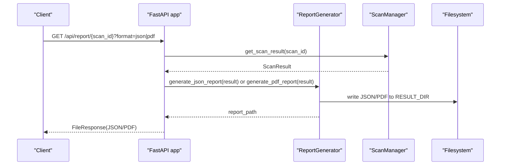
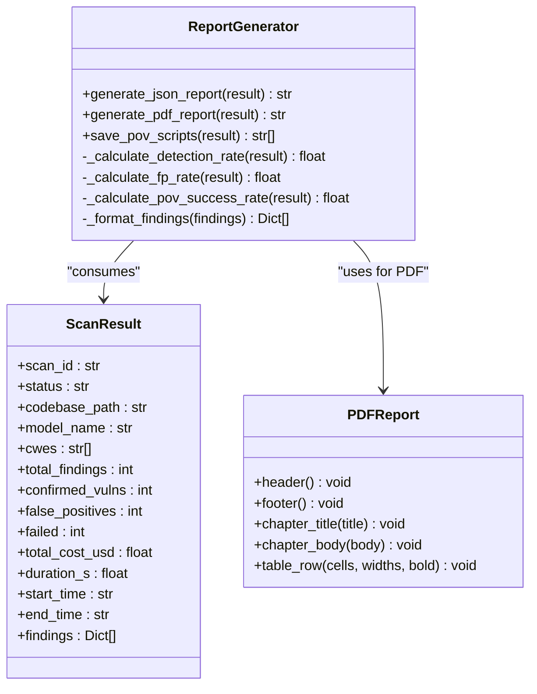
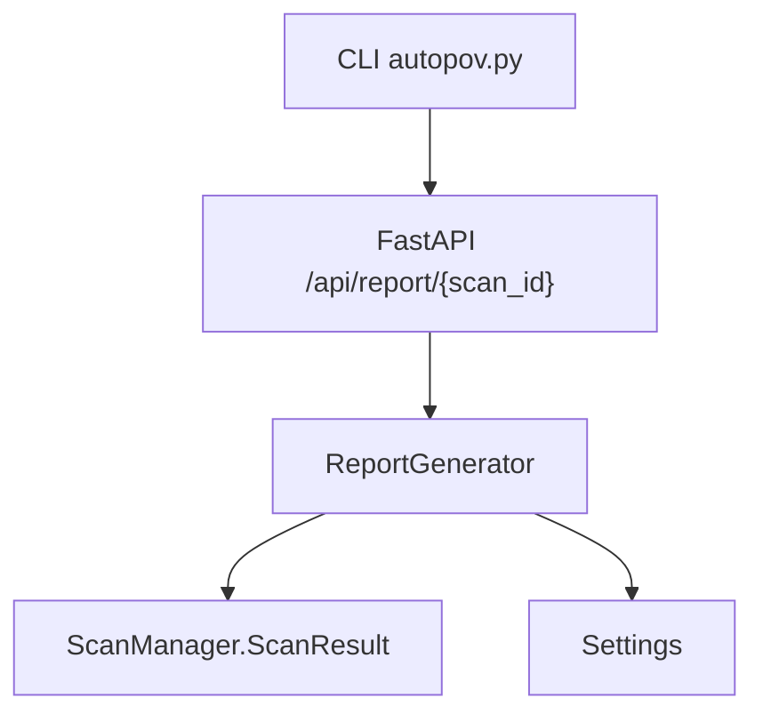

# Report Generation

<cite>
**Referenced Files in This Document**
- [report_generator.py](file://autopov/app/report_generator.py)
- [main.py](file://autopov/app/main.py)
- [scan_manager.py](file://autopov/app/scan_manager.py)
- [config.py](file://autopov/app/config.py)
- [requirements.txt](file://autopov/requirements.txt)
- [README.md](file://autopov/README.md)
- [autopov.py](file://autopov/cli/autopov.py)
</cite>

## Table of Contents
1. [Introduction](#introduction)
2. [Project Structure](#project-structure)
3. [Core Components](#core-components)
4. [Architecture Overview](#architecture-overview)
5. [Detailed Component Analysis](#detailed-component-analysis)
6. [Dependency Analysis](#dependency-analysis)
7. [Performance Considerations](#performance-considerations)
8. [Troubleshooting Guide](#troubleshooting-guide)
9. [Conclusion](#conclusion)
10. [Appendices](#appendices)

## Introduction
This document explains AutoPoV’s report generation system, focusing on how JSON and PDF reports are produced from scan results. It covers the ReportGenerator class architecture, the PDFReport custom class for PDF formatting, report templates and styling, JSON schema structure, and the end-to-end workflow for generating and retrieving reports. It also provides guidance on integrating reports into automated workflows and CI/CD pipelines, along with troubleshooting steps for common issues.

## Project Structure
The report generation pipeline spans several modules:
- Report generation logic resides in the report generator module.
- The FastAPI application exposes endpoints to retrieve reports in JSON or PDF formats.
- Scan results are represented by a dataclass and persisted to disk.
- Configuration defines output directories and environment-dependent checks.
- The CLI integrates with the API to download reports programmatically.

```mermaid
graph TB
subgraph "API Layer"
API["FastAPI app<br/>/api/report/{scan_id}"]
end
subgraph "Report Generation"
RG["ReportGenerator<br/>JSON/PDF generation"]
PDF["PDFReport<br/>custom PDF builder"]
end
subgraph "Scan Management"
SM["ScanManager<br/>ScanResult dataclass"]
end
subgraph "Configuration"
CFG["Settings<br/>directories, tools availability"]
end
subgraph "CLI"
CLI["CLI autopov.py<br/>report download"]
end
API --> RG
RG --> SM
RG --> PDF
RG --> CFG
CLI --> API
```

**Diagram sources**
- [main.py](file://autopov/app/main.py#L398-L428)
- [report_generator.py](file://autopov/app/report_generator.py#L68-L359)
- [scan_manager.py](file://autopov/app/scan_manager.py#L21-L38)
- [config.py](file://autopov/app/config.py#L102-L107)
- [autopov.py](file://autopov/cli/autopov.py#L333-L363)

**Section sources**
- [main.py](file://autopov/app/main.py#L398-L428)
- [report_generator.py](file://autopov/app/report_generator.py#L68-L359)
- [scan_manager.py](file://autopov/app/scan_manager.py#L21-L38)
- [config.py](file://autopov/app/config.py#L102-L107)
- [autopov.py](file://autopov/cli/autopov.py#L333-L363)

## Core Components
- ReportGenerator: Orchestrates JSON and PDF report creation from ScanResult instances. It computes metrics, formats findings, and writes output files to configured directories.
- PDFReport: Extends FPDF to provide standardized headers, footers, chapter titles, body text, and table rendering tailored for AutoPoV reports.
- ScanResult: Dataclass representing scan outcomes and findings, consumed by ReportGenerator.
- Settings: Provides RESULT_DIR, POVS_DIR, RUNS_DIR, and ensures directories exist.

Key responsibilities:
- JSON report: Metadata, scan summary, metrics, and findings.
- PDF report: Cover page, executive summary, metrics table, confirmed vulnerabilities details, and methodology.

**Section sources**
- [report_generator.py](file://autopov/app/report_generator.py#L68-L359)
- [scan_manager.py](file://autopov/app/scan_manager.py#L21-L38)
- [config.py](file://autopov/app/config.py#L102-L107)

## Architecture Overview
The report generation flow connects API requests to report generation and file output.



**Diagram sources**
- [main.py](file://autopov/app/main.py#L398-L428)
- [report_generator.py](file://autopov/app/report_generator.py#L76-L118)
- [report_generator.py](file://autopov/app/report_generator.py#L120-L270)
- [scan_manager.py](file://autopov/app/scan_manager.py#L241-L250)

## Detailed Component Analysis

### ReportGenerator Class
Responsibilities:
- Generate JSON report with metadata, scan summary, metrics, and findings.
- Generate PDF report with standardized sections and formatting.
- Save PoV scripts to POVS_DIR for confirmed vulnerabilities.
- Compute metrics: detection rate, false positive rate, PoV success rate.

Key methods:
- generate_json_report(result): Builds a structured JSON document and writes it to RESULT_DIR.
- generate_pdf_report(result): Creates a PDF with cover page, executive summary, metrics table, confirmed vulnerabilities details, and methodology.
- save_pov_scripts(result): Writes PoV Python scripts to POVS_DIR with metadata headers.
- Metric helpers: _calculate_detection_rate, _calculate_fp_rate, _calculate_pov_success_rate.
- _format_findings: Normalizes findings for report consumption.



**Diagram sources**
- [report_generator.py](file://autopov/app/report_generator.py#L68-L359)
- [scan_manager.py](file://autopov/app/scan_manager.py#L21-L38)

**Section sources**
- [report_generator.py](file://autopov/app/report_generator.py#L68-L359)
- [scan_manager.py](file://autopov/app/scan_manager.py#L21-L38)

### PDFReport Custom Class
PDFReport extends FPDF to provide:
- Standardized header with title and date.
- Footer with page number.
- Chapter title with colored background.
- Chapter body with multi-cell text.
- Table row rendering with configurable widths and bold headers.

Usage in PDF report generation:
- Cover page title and metadata.
- Executive summary section.
- Metrics table with computed percentages.
- Confirmed vulnerabilities details with truncation for long PoV scripts.
- Methodology section.

Styling options:
- Fonts: Arial/Bold for headings, Arial for body text.
- Colors: Light blue fill for chapter titles.
- Monospace font for PoV script content.
- Widths: Configurable table column widths.

Limitations:
- Requires fpdf2 availability; otherwise raises a ReportGeneratorError.
- Long PoV scripts are truncated to a fixed length to fit within page constraints.

**Section sources**
- [report_generator.py](file://autopov/app/report_generator.py#L27-L66)
- [report_generator.py](file://autopov/app/report_generator.py#L120-L270)

### JSON Report Schema Structure
The JSON report organizes data under four top-level sections:

- report_metadata
  - generated_at: Timestamp of report generation.
  - tool: Tool identifier.
  - version: Application version from settings.

- scan_summary
  - scan_id: Unique scan identifier.
  - status: Final scan status.
  - codebase: Path to scanned codebase.
  - model: Model used for analysis.
  - cwes_checked: List of CWEs checked.
  - duration_seconds: Total scan duration in seconds.
  - total_cost_usd: Total cost in USD.

- metrics
  - total_findings: Total number of findings.
  - confirmed_vulnerabilities: Number of confirmed vulnerabilities.
  - false_positives: Number of skipped/false positives.
  - failed_analyses: Number of failed analyses.
  - detection_rate: Percentage computed from confirmed vs total findings.
  - false_positive_rate: Percentage computed from false positives vs total findings.
  - pov_success_rate: Percentage computed from successful PoV executions among confirmed vulnerabilities.

- findings
  - Array of normalized findings with:
    - cwe_type
    - filepath
    - line_number
    - verdict
    - confidence
    - explanation
    - vulnerable_code
    - final_status
    - has_pov
    - pov_success
    - inference_time_s
    - cost_usd

**Section sources**
- [report_generator.py](file://autopov/app/report_generator.py#L76-L118)
- [report_generator.py](file://autopov/app/report_generator.py#L329-L349)

### PDF Report Sections
Cover page:
- Centered title, scan ID, and UTC timestamp.

Executive summary:
- Scan configuration and results overview with computed metrics.

Metrics summary:
- Tabular presentation of metrics including detection rate, false positive rate, PoV success rate, total cost, and duration.

Confirmed vulnerabilities details:
- For each confirmed finding, displays CWE type, file path, line number, confidence, explanation, and PoV script (monospace, truncated if too long).

Methodology:
- Describes the scanning process and metric definitions.

**Section sources**
- [report_generator.py](file://autopov/app/report_generator.py#L120-L270)

### Practical Examples of Report Generation Workflows
- API-driven generation:
  - Endpoint: GET /api/report/{scan_id}?format=json|pdf
  - Returns FileResponse pointing to the generated file in RESULT_DIR.

- CLI-driven generation:
  - Command: autopov report <scan_id> --format pdf
  - Downloads the PDF report to the current directory.

- Saving PoV scripts:
  - save_pov_scripts(result) writes individual PoV Python scripts to POVS_DIR with metadata headers.

- Output management:
  - JSON reports are written to RESULT_DIR.
  - PDF reports are written to RESULT_DIR.
  - PoV scripts are written to POVS_DIR.

**Section sources**
- [main.py](file://autopov/app/main.py#L398-L428)
- [autopov.py](file://autopov/cli/autopov.py#L333-L363)
- [report_generator.py](file://autopov/app/report_generator.py#L272-L300)
- [config.py](file://autopov/app/config.py#L102-L107)

### Integration into Automated Workflows and CI/CD Pipelines
- Use the API endpoint to programmatically retrieve reports after scans complete.
- The CLI tool supports downloading reports for local automation.
- Ensure fpdf2 is installed for PDF generation; otherwise, handle the ImportError gracefully.
- Persist results in RESULT_DIR and POVS_DIR for downstream artifact storage.

**Section sources**
- [requirements.txt](file://autopov/requirements.txt#L27-L28)
- [report_generator.py](file://autopov/app/report_generator.py#L12-L16)
- [README.md](file://autopov/README.md#L124-L126)

## Dependency Analysis
- ReportGenerator depends on:
  - ScanResult from scan_manager.py.
  - Settings from config.py for RESULT_DIR and POVS_DIR.
  - fpdf2 for PDF generation (optional import).
- FastAPI endpoints depend on ReportGenerator to produce files and return FileResponse.
- CLI depends on API endpoints to download reports.



**Diagram sources**
- [report_generator.py](file://autopov/app/report_generator.py#L18-L19)
- [main.py](file://autopov/app/main.py#L24-L25)
- [autopov.py](file://autopov/cli/autopov.py#L333-L363)

**Section sources**
- [report_generator.py](file://autopov/app/report_generator.py#L18-L19)
- [main.py](file://autopov/app/main.py#L24-L25)
- [autopov.py](file://autopov/cli/autopov.py#L333-L363)

## Performance Considerations
- PDF generation:
  - Large PoV scripts are truncated to keep the PDF readable and within page constraints.
  - Table rendering uses fixed widths; adjust widths if adding more columns.
- JSON generation:
  - Writing JSON is lightweight; ensure RESULT_DIR is on fast storage for throughput.
- Metrics computation:
  - Calculations are O(n) over findings; keep findings lists reasonable in size.

[No sources needed since this section provides general guidance]

## Troubleshooting Guide
Common issues and resolutions:
- Missing fpdf2 dependency:
  - Symptom: ReportGeneratorError indicating fpdf2 is unavailable.
  - Resolution: Install fpdf2 via pip; the requirement is listed in requirements.txt.

- Empty or missing scan results:
  - Symptom: 404 Not Found when retrieving report.
  - Resolution: Ensure the scan completed and results are persisted; verify scan_id correctness.

- PDF formatting limitations:
  - Long PoV scripts are truncated; consider saving PoV scripts separately to POVS_DIR for inspection.

- Directory permissions:
  - Ensure RESULT_DIR and POVS_DIR exist and are writable; settings.ensure_directories() creates them.

- API key errors:
  - Ensure a valid API key is provided; otherwise API endpoints return HTTP exceptions.

**Section sources**
- [report_generator.py](file://autopov/app/report_generator.py#L12-L16)
- [report_generator.py](file://autopov/app/report_generator.py#L130-L131)
- [main.py](file://autopov/app/main.py#L407-L408)
- [config.py](file://autopov/app/config.py#L191-L202)
- [requirements.txt](file://autopov/requirements.txt#L27-L28)

## Conclusion
AutoPoV’s report generation system provides robust JSON and PDF outputs from scan results. ReportGenerator encapsulates the logic for both formats, while PDFReport standardizes PDF appearance. The system integrates cleanly with the API and CLI, enabling straightforward automation and CI/CD integration. By addressing dependencies and directory permissions, teams can reliably generate and distribute reports across environments.

[No sources needed since this section summarizes without analyzing specific files]

## Appendices

### API Definition: Report Retrieval
- GET /api/report/{scan_id}?format=json|pdf
  - Produces FileResponse with either JSON or PDF content.
  - Returns 404 if scan result not found.
  - Returns 400 if format is invalid.

**Section sources**
- [main.py](file://autopov/app/main.py#L398-L428)

### CLI Commands: Report Download
- autopov report <scan_id> --format json|pdf
  - Downloads the report to the current directory.

**Section sources**
- [autopov.py](file://autopov/cli/autopov.py#L333-L363)