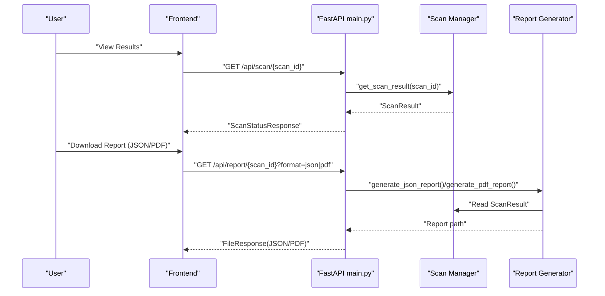
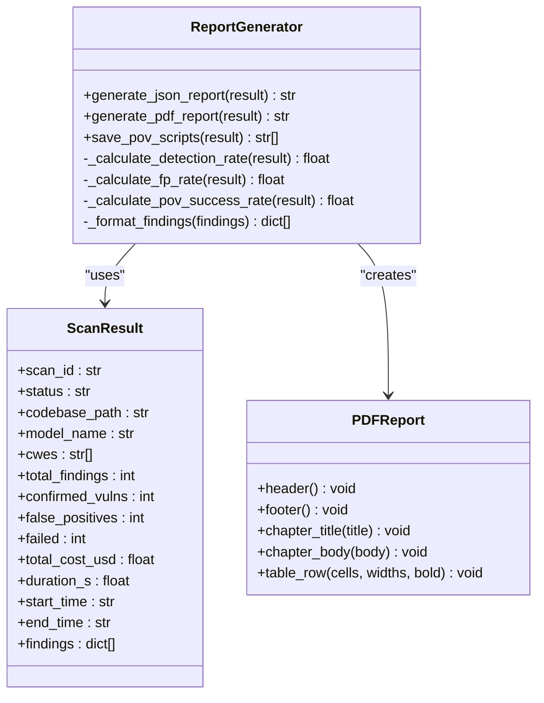
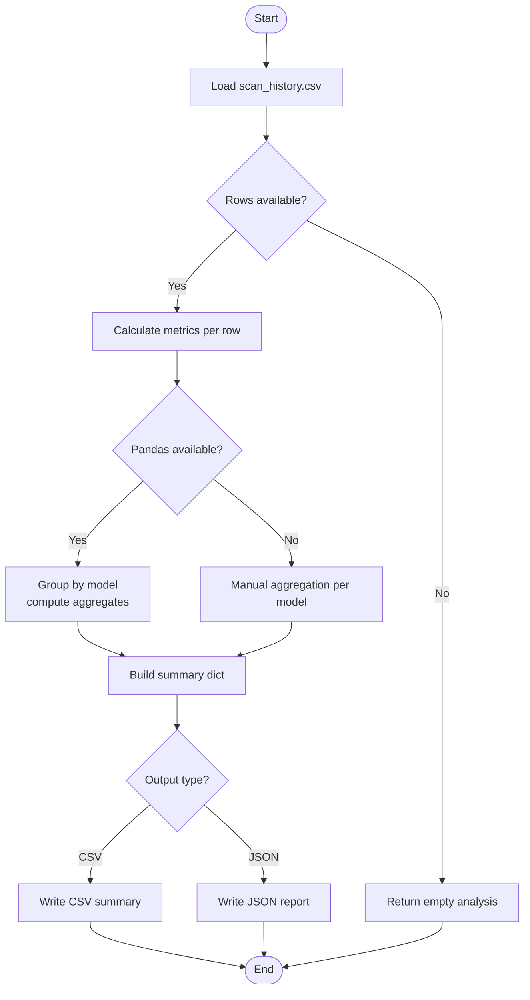
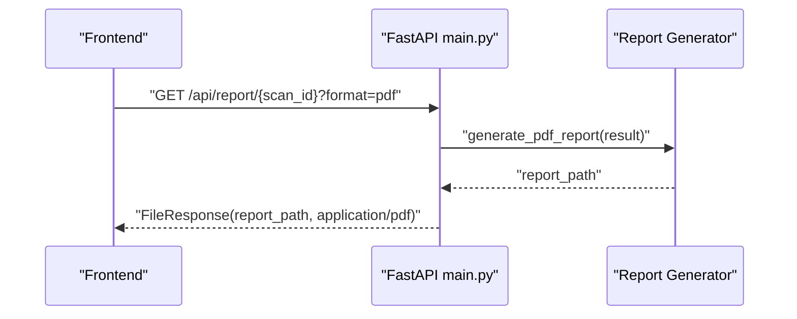
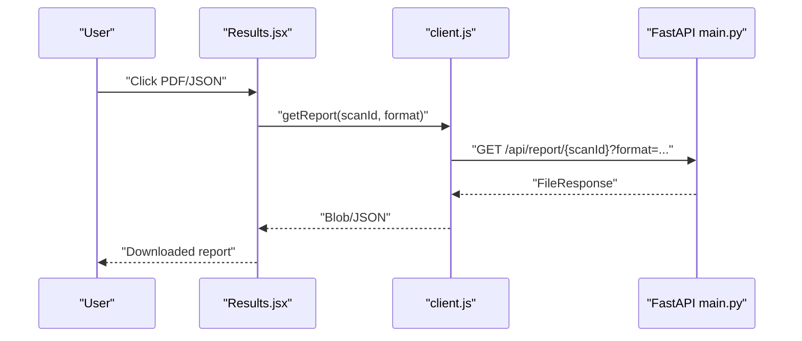
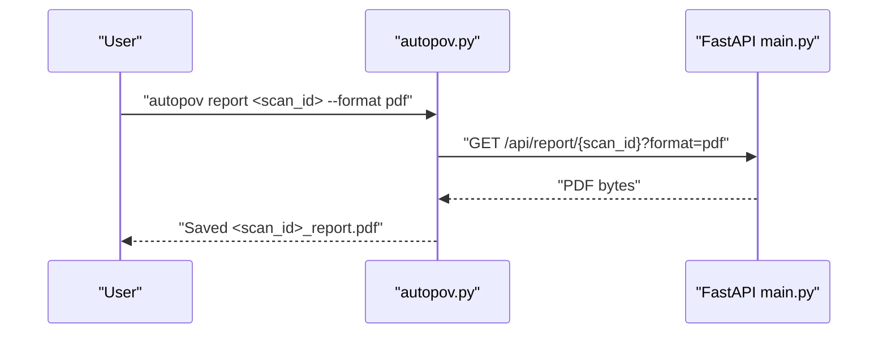
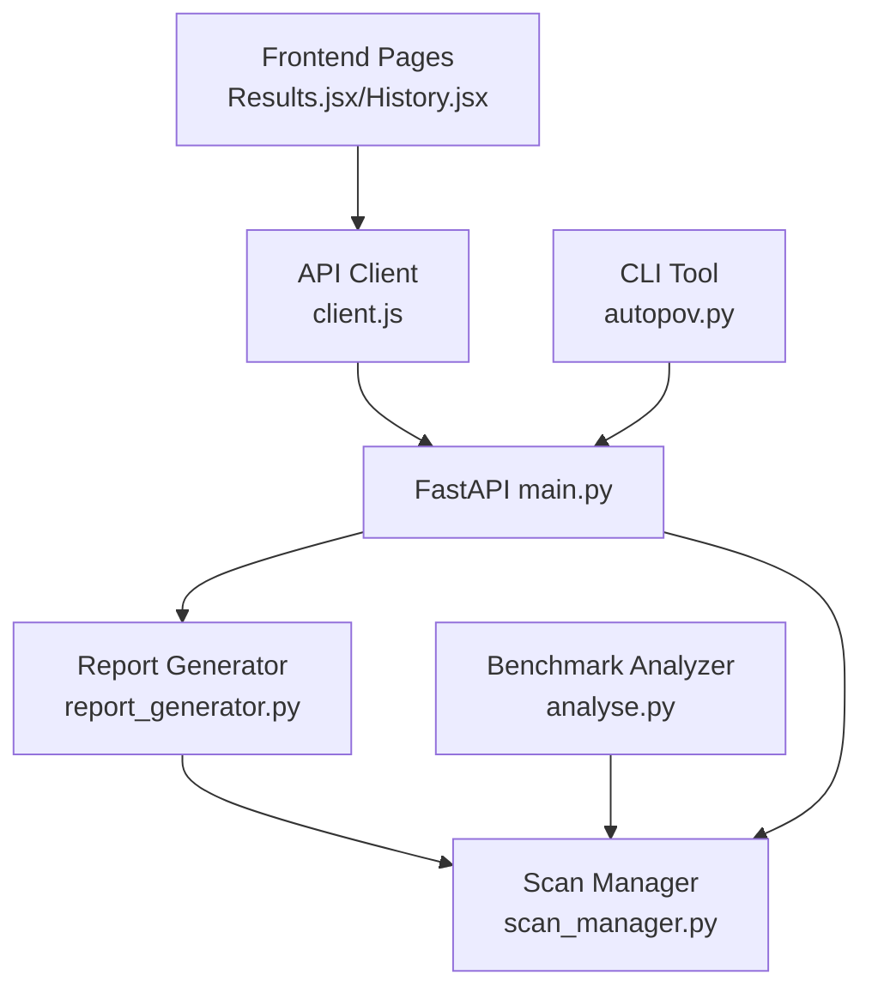

# Reporting and Analytics

<cite>
**Referenced Files in This Document**
- [analyse.py](file://autopov/analyse.py)
- [report_generator.py](file://autopov/app/report_generator.py)
- [main.py](file://autopov/app/main.py)
- [config.py](file://autopov/app/config.py)
- [scan_manager.py](file://autopov/app/scan_manager.py)
- [Results.jsx](file://autopov/frontend/src/pages/Results.jsx)
- [History.jsx](file://autopov/frontend/src/pages/History.jsx)
- [client.js](file://autopov/frontend/src/api/client.js)
- [requirements.txt](file://autopov/requirements.txt)
- [README.md](file://autopov/README.md)
- [autopov.py](file://autopov/cli/autopov.py)
</cite>

## Table of Contents
1. [Introduction](#introduction)
2. [Project Structure](#project-structure)
3. [Core Components](#core-components)
4. [Architecture Overview](#architecture-overview)
5. [Detailed Component Analysis](#detailed-component-analysis)
6. [Dependency Analysis](#dependency-analysis)
7. [Performance Considerations](#performance-considerations)
8. [Troubleshooting Guide](#troubleshooting-guide)
9. [Conclusion](#conclusion)
10. [Appendices](#appendices)

## Introduction
This document explains AutoPoV’s reporting and analytics system with a focus on result presentation, benchmarking, and performance analysis. It covers:
- Report generation capabilities for JSON and PDF outputs, including customization options
- Benchmarking framework for comparing LLM performance across vulnerability types and datasets
- Analytical capabilities such as metrics computation, comparative analysis, and trend reporting
- Practical examples for report customization, benchmark workflows, and result interpretation
- Export capabilities, historical analysis, and integration into CI/CD pipelines

## Project Structure
AutoPoV organizes reporting and analytics across backend, CLI, and frontend components:
- Backend API exposes endpoints to generate reports and manage scan lifecycle
- Report generator creates JSON and PDF reports from scan results
- CLI provides command-line access to scanning, results retrieval, and report generation
- Frontend enables interactive viewing, downloading, and historical browsing of results
- Benchmarking utilities analyze historical CSV logs to produce summaries and recommendations

```mermaid
graph TB
subgraph "Backend"
API["FastAPI app<br/>main.py"]
SM["Scan Manager<br/>scan_manager.py"]
RG["Report Generator<br/>report_generator.py"]
CFG["Settings<br/>config.py"]
end
subgraph "CLI"
CLI["CLI Tool<br/>cli/autopov.py"]
end
subgraph "Frontend"
FE_Res["Results Page<br/>frontend/src/pages/Results.jsx"]
FE_Hist["History Page<br/>frontend/src/pages/History.jsx"]
FE_Client["API Client<br/>frontend/src/api/client.js"]
end
subgraph "Analytics"
AN["Benchmark Analyzer<br/>analyse.py"]
end
CLI --> API
FE_Client --> API
FE_Res --> FE_Client
FE_Hist --> FE_Client
API --> SM
API --> RG
RG --> SM
SM --> AN
AN --> SM
```

**Diagram sources**
- [main.py](file://autopov/app/main.py#L397-L428)
- [report_generator.py](file://autopov/app/report_generator.py#L68-L118)
- [scan_manager.py](file://autopov/app/scan_manager.py#L201-L235)
- [config.py](file://autopov/app/config.py#L102-L107)
- [Results.jsx](file://autopov/frontend/src/pages/Results.jsx#L30-L48)
- [History.jsx](file://autopov/frontend/src/pages/History.jsx#L12-L25)
- [client.js](file://autopov/frontend/src/api/client.js#L50-L53)
- [analyse.py](file://autopov/analyse.py#L39-L60)

**Section sources**
- [main.py](file://autopov/app/main.py#L397-L428)
- [report_generator.py](file://autopov/app/report_generator.py#L68-L118)
- [scan_manager.py](file://autopov/app/scan_manager.py#L201-L235)
- [config.py](file://autopov/app/config.py#L102-L107)
- [Results.jsx](file://autopov/frontend/src/pages/Results.jsx#L30-L48)
- [History.jsx](file://autopov/frontend/src/pages/History.jsx#L12-L25)
- [client.js](file://autopov/frontend/src/api/client.js#L50-L53)
- [analyse.py](file://autopov/analyse.py#L39-L60)

## Core Components
- Report Generator: Produces JSON and PDF reports from ScanResult instances, computes metrics, and formats findings
- Benchmark Analyzer: Loads historical scan results, calculates metrics, performs group-by-model analysis, and generates CSV/JSON reports
- Scan Manager: Orchestrates scan lifecycle, persists results to JSON and CSV, and maintains history
- Frontend Pages: Allow users to view results, download reports, and browse scan history
- CLI Tool: Provides commands to scan, retrieve results, and generate reports in desired formats

Key responsibilities:
- Report generation: JSON metadata, metrics, findings; PDF executive summary, metrics table, confirmed vulnerabilities, methodology
- Benchmarking: CSV summary and detailed JSON report with recommendations
- Historical analysis: CSV-backed scan history for trend and comparative analysis

**Section sources**
- [report_generator.py](file://autopov/app/report_generator.py#L68-L118)
- [analyse.py](file://autopov/analyse.py#L39-L98)
- [scan_manager.py](file://autopov/app/scan_manager.py#L201-L235)
- [Results.jsx](file://autopov/frontend/src/pages/Results.jsx#L30-L48)
- [autopov.py](file://autopov/cli/autopov.py#L278-L291)

## Architecture Overview
The reporting pipeline integrates API endpoints, report generation, and analytics:



**Diagram sources**
- [main.py](file://autopov/app/main.py#L397-L428)
- [report_generator.py](file://autopov/app/report_generator.py#L76-L118)
- [scan_manager.py](file://autopov/app/scan_manager.py#L241-L250)

## Detailed Component Analysis

### Report Generator
The Report Generator produces two report formats:
- JSON: Structured metadata, scan summary, metrics, and findings
- PDF: Cover page, executive summary, metrics table, confirmed vulnerabilities, and methodology

Key features:
- Metrics computation: detection rate, false positive rate, PoV success rate
- Findings formatting: cwe_type, filepath, line_number, verdict, confidence, explanation, vulnerable_code, final_status, PoV presence, PoV success, inference time, cost
- PDF formatting: chapter titles, tables, and truncation for long PoV content



**Diagram sources**
- [report_generator.py](file://autopov/app/report_generator.py#L68-L350)
- [scan_manager.py](file://autopov/app/scan_manager.py#L21-L38)

**Section sources**
- [report_generator.py](file://autopov/app/report_generator.py#L68-L350)
- [scan_manager.py](file://autopov/app/scan_manager.py#L21-L38)

### Benchmark Analyzer
The Benchmark Analyzer loads historical scan results from CSV, computes metrics, and supports:
- Per-scan metrics: detection rate, false positive rate, cost per confirmed
- Group-by-model analysis: counts, totals, and averages for multiple metrics
- CSV summary and detailed JSON report with recommendations



**Diagram sources**
- [analyse.py](file://autopov/analyse.py#L46-L60)
- [analyse.py](file://autopov/analyse.py#L72-L98)
- [analyse.py](file://autopov/analyse.py#L100-L214)
- [analyse.py](file://autopov/analyse.py#L216-L267)

**Section sources**
- [analyse.py](file://autopov/analyse.py#L39-L214)
- [analyse.py](file://autopov/analyse.py#L216-L298)

### API Endpoints for Reporting
The backend exposes:
- GET /api/report/{scan_id}?format=json|pdf: Downloads a specific scan report in requested format
- GET /api/scan/{scan_id}: Retrieves scan status and results
- GET /api/history: Lists recent scans for historical analysis



**Diagram sources**
- [main.py](file://autopov/app/main.py#L397-L428)
- [report_generator.py](file://autopov/app/report_generator.py#L120-L270)

**Section sources**
- [main.py](file://autopov/app/main.py#L397-L428)
- [report_generator.py](file://autopov/app/report_generator.py#L120-L270)

### Frontend Integration
- Results page allows downloading JSON and PDF reports and displays confirmed findings
- History page lists recent scans with status, model, confirmed counts, and costs
- API client handles authentication and SSE streaming for logs



**Diagram sources**
- [Results.jsx](file://autopov/frontend/src/pages/Results.jsx#L30-L48)
- [client.js](file://autopov/frontend/src/api/client.js#L50-L53)
- [main.py](file://autopov/app/main.py#L397-L428)

**Section sources**
- [Results.jsx](file://autopov/frontend/src/pages/Results.jsx#L30-L48)
- [History.jsx](file://autopov/frontend/src/pages/History.jsx#L12-L25)
- [client.js](file://autopov/frontend/src/api/client.js#L50-L53)

### CLI Integration
The CLI supports:
- Generating reports in JSON or PDF formats
- Retrieving results and displaying them in table or JSON formats
- Managing API keys and viewing history



**Diagram sources**
- [autopov.py](file://autopov/cli/autopov.py#L337-L362)
- [main.py](file://autopov/app/main.py#L397-L428)

**Section sources**
- [autopov.py](file://autopov/cli/autopov.py#L278-L291)
- [autopov.py](file://autopov/cli/autopov.py#L337-L362)

## Dependency Analysis
- Report generation depends on ScanResult and optional PDF library (fpdf2)
- Benchmarking depends on CSV history and optional pandas for aggregation
- Frontend relies on API client for authenticated requests and SSE for logs
- CLI communicates with backend using HTTP requests and prints structured output



**Diagram sources**
- [report_generator.py](file://autopov/app/report_generator.py#L18-L20)
- [analyse.py](file://autopov/analyse.py#L14-L20)
- [client.js](file://autopov/frontend/src/api/client.js#L10-L25)
- [main.py](file://autopov/app/main.py#L13-L25)
- [autopov.py](file://autopov/cli/autopov.py#L56-L87)

**Section sources**
- [requirements.txt](file://autopov/requirements.txt#L26-L28)
- [config.py](file://autopov/app/config.py#L102-L107)

## Performance Considerations
- CSV-based historical analysis scales well for moderate volumes; consider partitioning or indexing for large histories
- PDF generation requires fpdf2; ensure availability in deployment environments
- Pandas acceleration improves aggregation performance; fallback logic ensures functionality without pandas
- Cost and duration metrics enable cost-aware benchmarking and resource planning

[No sources needed since this section provides general guidance]

## Troubleshooting Guide
Common issues and resolutions:
- Missing fpdf2: PDF report generation raises an error indicating missing dependency; install via requirements
- Missing scan history: CSV file may not exist until scans complete; ensure scan execution persisted results
- Authentication failures: Verify API key configuration in frontend, CLI, or environment variables
- Empty or partial results: Confirm scan completion and existence of JSON result file

**Section sources**
- [report_generator.py](file://autopov/app/report_generator.py#L120-L132)
- [scan_manager.py](file://autopov/app/scan_manager.py#L201-L235)
- [client.js](file://autopov/frontend/src/api/client.js#L18-L25)
- [autopov.py](file://autopov/cli/autopov.py#L29-L43)

## Conclusion
AutoPoV delivers a robust reporting and analytics ecosystem:
- JSON and PDF reports present actionable insights with metrics and findings
- Benchmarking utilities enable cross-model comparisons and recommendations
- Historical analysis supports trend monitoring and continuous improvement
- Frontend and CLI integrate seamlessly for interactive and automated workflows

[No sources needed since this section summarizes without analyzing specific files]

## Appendices

### Practical Examples

- Report customization
  - JSON: Access structured metadata and findings for downstream processing
  - PDF: Includes executive summary, metrics table, and confirmed vulnerability details; customize by modifying report generation logic
  - PoV scripts: Saved separately for confirmed vulnerabilities; useful for reproducibility and triage

- Benchmark analysis workflows
  - Generate CSV summary and detailed JSON report for model comparisons
  - Compare specific models by filtering historical results
  - Interpret recommendations for best detection rate, lowest false positive rate, and cost-effectiveness

- Result interpretation
  - Detection rate: proportion of confirmed vulnerabilities among total findings
  - False positive rate: proportion of non-vulnerabilities flagged as findings
  - PoV success rate: proportion of confirmed vulnerabilities with successful PoV execution
  - Cost per confirmed: average cost to verify each vulnerability

- Export and historical analysis
  - Export CSV and JSON for external tools and dashboards
  - Use CSV history for trend reporting and capacity planning

- CI/CD integration
  - Use CLI to trigger scans and generate reports
  - Automate report downloads and artifact publishing
  - Integrate webhook triggers for repository events

**Section sources**
- [report_generator.py](file://autopov/app/report_generator.py#L76-L118)
- [analyse.py](file://autopov/analyse.py#L216-L267)
- [README.md](file://autopov/README.md#L169-L179)
- [autopov.py](file://autopov/cli/autopov.py#L104-L210)