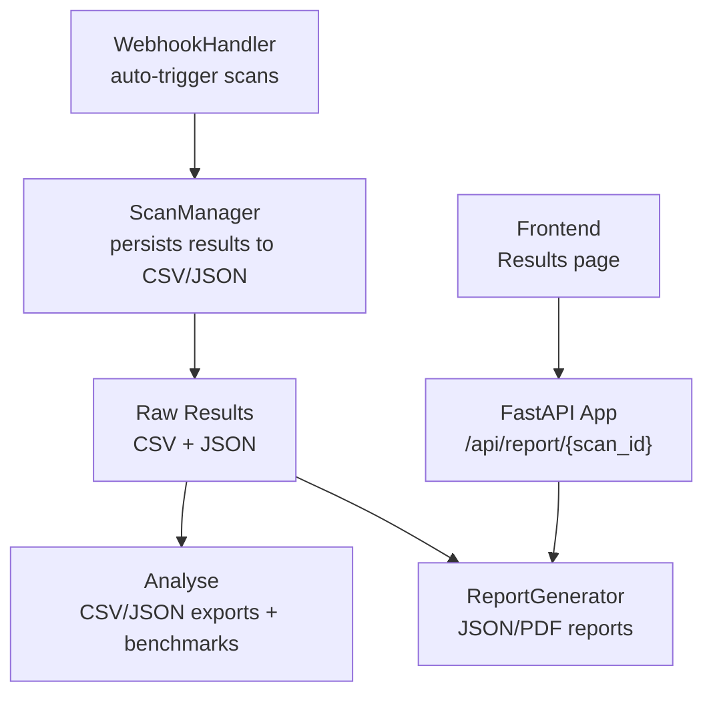
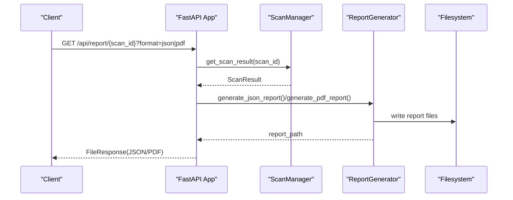
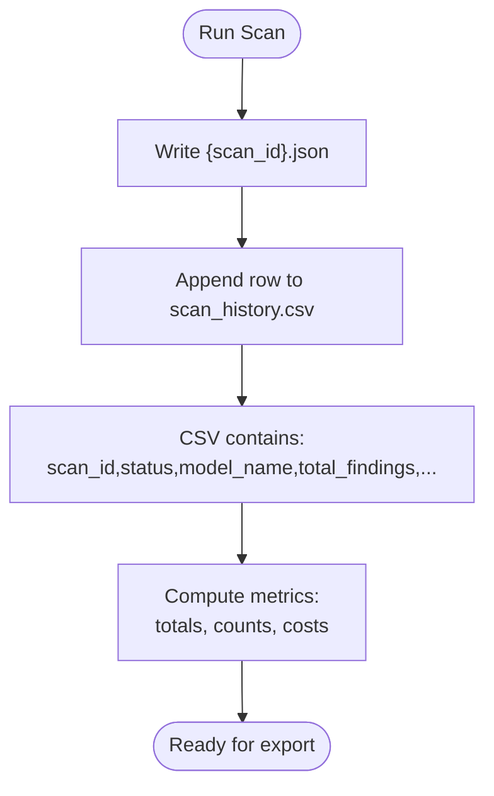
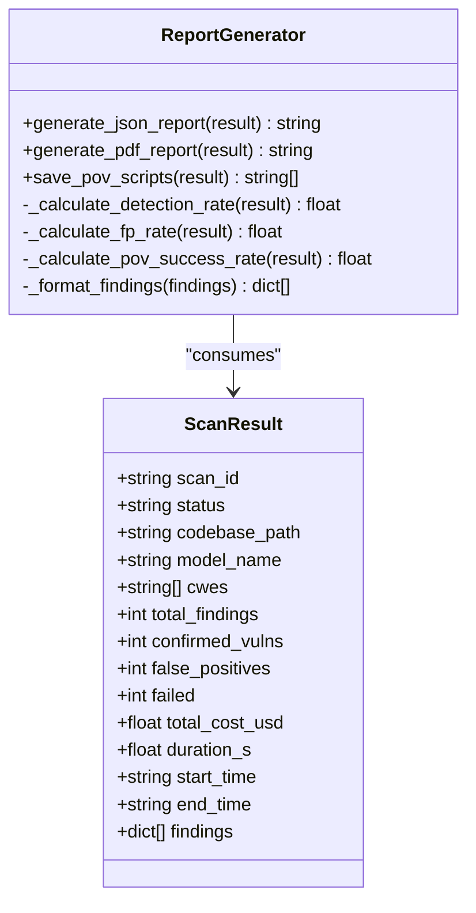
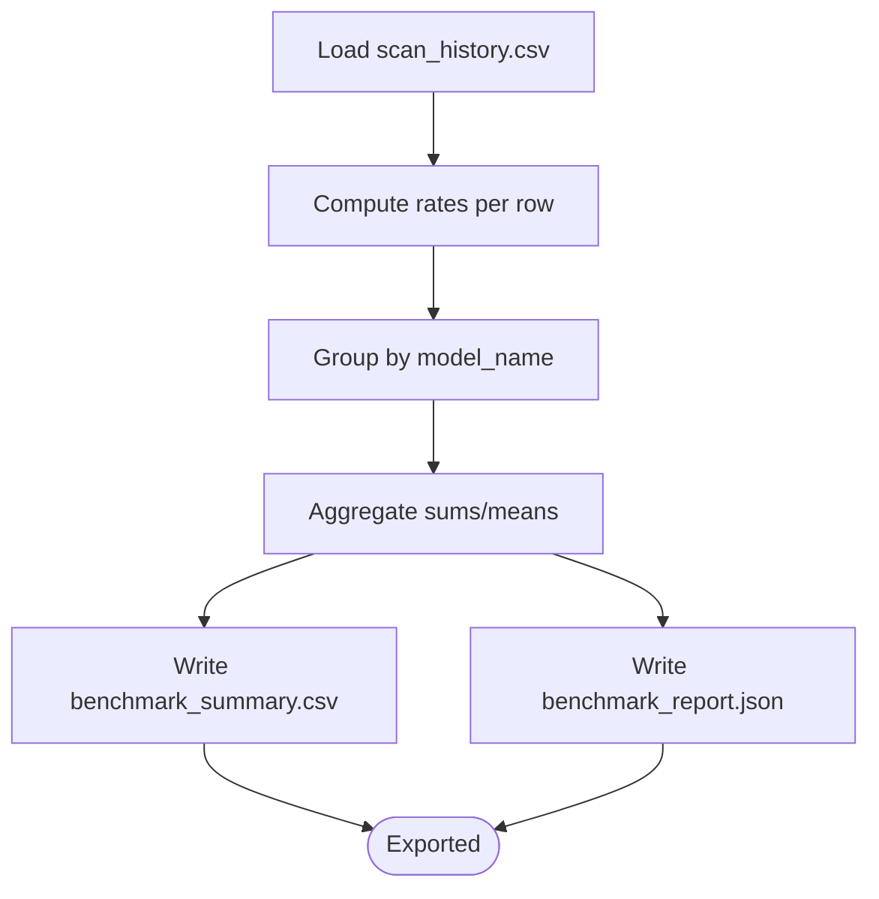
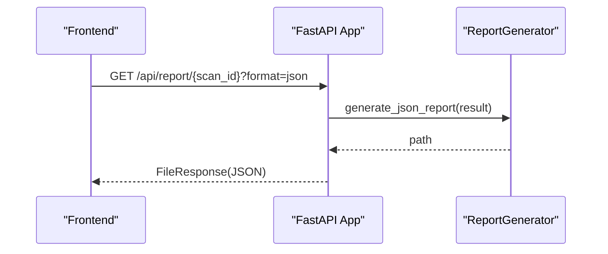
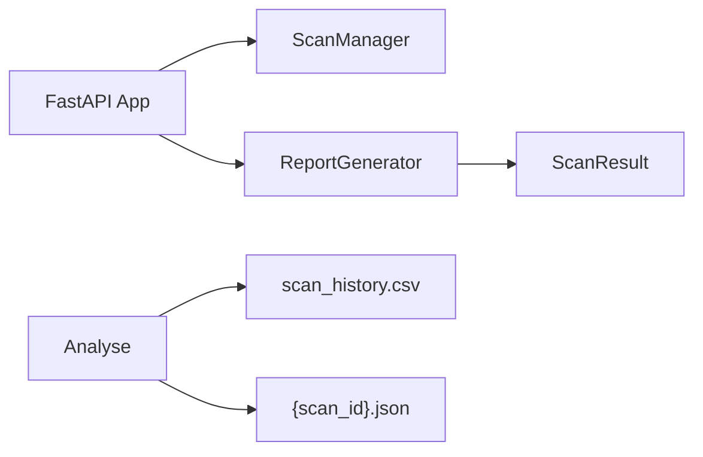

# Result Processing and Export

<cite>
**Referenced Files in This Document**
- [analyse.py](file://autopov/analyse.py)
- [report_generator.py](file://autopov/app/report_generator.py)
- [scan_manager.py](file://autopov/app/scan_manager.py)
- [main.py](file://autopov/app/main.py)
- [config.py](file://autopov/app/config.py)
- [Results.jsx](file://autopov/frontend/src/pages/Results.jsx)
- [webhook_handler.py](file://autopov/app/webhook_handler.py)
</cite>

## Table of Contents
1. [Introduction](#introduction)
2. [Project Structure](#project-structure)
3. [Core Components](#core-components)
4. [Architecture Overview](#architecture-overview)
5. [Detailed Component Analysis](#detailed-component-analysis)
6. [Dependency Analysis](#dependency-analysis)
7. [Performance Considerations](#performance-considerations)
8. [Troubleshooting Guide](#troubleshooting-guide)
9. [Conclusion](#conclusion)
10. [Appendices](#appendices)

## Introduction
This document explains AutoPoV’s result processing and export capabilities with a focus on transforming raw scan results into structured, actionable outputs. It covers:
- CSV and JSON export functionality from scan results
- Data formatting, filtering, and aggregation options
- Result data structures, field mappings, and export schema definitions
- Utilities for result processing, including data cleaning, normalization, and statistical calculations
- Export workflows for security dashboards, research databases, and compliance reporting
- Practical examples of custom export configurations, bulk processing, and validation
- Data privacy considerations, export limitations, and performance optimization for large result sets
- Guidance on integrating exported data with external analysis tools and visualization platforms

## Project Structure
AutoPoV organizes result processing and export across several modules:
- Result persistence and history: CSV and JSON files under the runs directory
- Reporting: JSON and PDF report generation
- Analysis: Benchmark summarization and CSV/JSON exports
- API: Endpoints to retrieve results and trigger report generation
- Frontend: UI to display results and download reports

**Diagram sources**
- [scan_manager.py](file://autopov/app/scan_manager.py#L201-L235)
- [analyse.py](file://autopov/analyse.py#L216-L267)
- [report_generator.py](file://autopov/app/report_generator.py#L76-L118)
- [main.py](file://autopov/app/main.py#L400-L431)
- [Results.jsx](file://autopov/frontend/src/pages/Results.jsx#L30-L48)
- [webhook_handler.py](file://autopov/app/webhook_handler.py#L196-L336)

**Section sources**
- [scan_manager.py](file://autopov/app/scan_manager.py#L201-L235)
- [config.py](file://autopov/app/config.py#L102-L107)

## Core Components
- ScanManager persists each scan result as a JSON file and appends a row to a CSV history file. It also exposes APIs to retrieve results and metrics.
- ReportGenerator creates JSON and PDF reports from a ScanResult, including metrics and formatted findings.
- Analyse provides CSV and JSON exports for benchmarking, aggregating results by model and computing derived metrics.
- FastAPI app exposes endpoints to download reports and retrieve scan history.
- Frontend allows users to view results and download JSON/PDF reports.

**Section sources**
- [scan_manager.py](file://autopov/app/scan_manager.py#L21-L38)
- [report_generator.py](file://autopov/app/report_generator.py#L68-L118)
- [analyse.py](file://autopov/analyse.py#L39-L98)
- [main.py](file://autopov/app/main.py#L400-L431)
- [Results.jsx](file://autopov/frontend/src/pages/Results.jsx#L30-L48)

## Architecture Overview
The result processing pipeline integrates scanning, persistence, analysis, and export:

**Diagram sources**
- [main.py](file://autopov/app/main.py#L400-L431)
- [scan_manager.py](file://autopov/app/scan_manager.py#L241-L250)
- [report_generator.py](file://autopov/app/report_generator.py#L76-L118)

## Detailed Component Analysis

### Scan Result Persistence and History
- Each scan writes:
  - A JSON file named by scan_id under the runs directory
  - A CSV row appended to scan_history.csv with standardized fields
- Retrieval:
  - JSON result by scan_id
  - CSV history with pagination and reverse chronological order
- Metrics aggregation:
  - Summarizes completed scans, failed scans, total confirmed vulnerabilities, and total cost

**Diagram sources**
- [scan_manager.py](file://autopov/app/scan_manager.py#L201-L235)
- [scan_manager.py](file://autopov/app/scan_manager.py#L252-L273)
- [scan_manager.py](file://autopov/app/scan_manager.py#L304-L334)

**Section sources**
- [scan_manager.py](file://autopov/app/scan_manager.py#L201-L235)
- [scan_manager.py](file://autopov/app/scan_manager.py#L252-L273)
- [scan_manager.py](file://autopov/app/scan_manager.py#L304-L334)

### Report Generation (JSON and PDF)
- JSON report schema:
  - Metadata: tool, version, generation timestamp
  - Scan summary: scan_id, status, codebase, model, CWEs, duration, cost
  - Metrics: totals, detection rate, false positive rate, PoV success rate
  - Findings: formatted entries with cwe_type, filepath, line_number, verdict, confidence, explanation, vulnerable_code, final_status, has_pov, pov_success, inference_time_s, cost_usd
- PDF report includes:
  - Executive summary, metrics table, confirmed vulnerabilities with explanations and PoV scripts (truncated if large), methodology

**Diagram sources**
- [report_generator.py](file://autopov/app/report_generator.py#L68-L118)
- [report_generator.py](file://autopov/app/report_generator.py#L302-L327)
- [report_generator.py](file://autopov/app/report_generator.py#L329-L349)
- [scan_manager.py](file://autopov/app/scan_manager.py#L21-L38)

**Section sources**
- [report_generator.py](file://autopov/app/report_generator.py#L76-L118)
- [report_generator.py](file://autopov/app/report_generator.py#L120-L270)
- [report_generator.py](file://autopov/app/report_generator.py#L272-L300)
- [report_generator.py](file://autopov/app/report_generator.py#L302-L327)
- [report_generator.py](file://autopov/app/report_generator.py#L329-L349)

### Benchmark Analysis and Export
- Loads CSV history and computes:
  - Detection rate, false positive rate, cost per confirmed
  - Aggregates by model with counts and averages
- Generates:
  - CSV summary with model-level metrics
  - JSON report with analysis and recommendations
- CLI entry point supports:
  - --csv to generate CSV summary
  - --report to generate JSON report
  - --compare to compare specific models

**Diagram sources**
- [analyse.py](file://autopov/analyse.py#L46-L60)
- [analyse.py](file://autopov/analyse.py#L72-L98)
- [analyse.py](file://autopov/analyse.py#L100-L159)
- [analyse.py](file://autopov/analyse.py#L216-L247)
- [analyse.py](file://autopov/analyse.py#L249-L267)

**Section sources**
- [analyse.py](file://autopov/analyse.py#L39-L98)
- [analyse.py](file://autopov/analyse.py#L100-L159)
- [analyse.py](file://autopov/analyse.py#L216-L267)
- [analyse.py](file://autopov/analyse.py#L308-L357)

### API Workflows for Export
- Report endpoint:
  - GET /api/report/{scan_id}?format=json|pdf
  - Returns FileResponse for the generated report
- Frontend integration:
  - Results page downloads JSON or PDF reports via client API

**Diagram sources**
- [main.py](file://autopov/app/main.py#L400-L431)
- [Results.jsx](file://autopov/frontend/src/pages/Results.jsx#L30-L48)

**Section sources**
- [main.py](file://autopov/app/main.py#L400-L431)
- [Results.jsx](file://autopov/frontend/src/pages/Results.jsx#L30-L48)

### Data Structures and Field Mappings
- ScanResult fields persisted to JSON and CSV:
  - scan_id, status, codebase_path, model_name, cwes, total_findings, confirmed_vulns, false_positives, failed, total_cost_usd, duration_s, start_time, end_time, findings
- CSV schema (headers and ordering):
  - scan_id, status, model_name, cwes, total_findings, confirmed_vulns, false_positives, failed, total_cost_usd, duration_s, start_time, end_time
- Report JSON schema:
  - report_metadata, scan_summary, metrics, findings
- Benchmark CSV schema:
  - Model, Scans, Confirmed, FP, Total Findings, Detection Rate %, FP Rate %, Total Cost $, Avg Cost/Confirmed $, Avg Duration s
- Benchmark JSON schema:
  - generated_at, analysis (by_model records, summary), recommendations

**Section sources**
- [scan_manager.py](file://autopov/app/scan_manager.py#L21-L38)
- [scan_manager.py](file://autopov/app/scan_manager.py#L209-L235)
- [report_generator.py](file://autopov/app/report_generator.py#L86-L113)
- [analyse.py](file://autopov/analyse.py#L226-L244)
- [analyse.py](file://autopov/analyse.py#L257-L266)

### Filtering and Aggregation Options
- By model:
  - Group by model_name and compute counts and averages
- By scan_id:
  - Load individual JSON result for targeted export
- By time window:
  - Use CSV history pagination (limit, offset) to process subsets
- Recommendations:
  - Best detection rate, lowest FP rate, most cost-effective model

**Section sources**
- [analyse.py](file://autopov/analyse.py#L100-L159)
- [analyse.py](file://autopov/analyse.py#L300-L305)
- [scan_manager.py](file://autopov/app/scan_manager.py#L252-L273)

### Export Workflows for Different Use Cases
- Security dashboards:
  - Use JSON report findings for visualization; leverage frontend charts to render metrics and distributions
- Research databases:
  - Export CSV history for batch analysis; apply custom filters and aggregations externally
- Compliance reporting:
  - Generate PDF reports for auditors; include methodology and PoV details

**Section sources**
- [report_generator.py](file://autopov/app/report_generator.py#L120-L270)
- [Results.jsx](file://autopov/frontend/src/pages/Results.jsx#L115-L153)

### Practical Examples and Customization
- Custom export configurations:
  - Use CLI analyse.py to generate CSV or JSON reports
  - Filter by model names for targeted comparisons
- Bulk processing:
  - Iterate scan_history.csv rows to process multiple scans
  - Use CSV pagination to handle large histories
- Data validation:
  - Numeric conversion and zero-division guards in analysis
  - Existence checks for JSON and CSV files

**Section sources**
- [analyse.py](file://autopov/analyse.py#L308-L357)
- [analyse.py](file://autopov/analyse.py#L107-L159)
- [scan_manager.py](file://autopov/app/scan_manager.py#L262-L273)

## Dependency Analysis
- Internal dependencies:
  - FastAPI app depends on ScanManager and ReportGenerator
  - ReportGenerator depends on ScanResult
  - Analyse depends on CSV/JSON files in runs directory
- External dependencies:
  - pandas (optional) for advanced aggregation
  - fpdf (optional) for PDF reports

**Diagram sources**
- [main.py](file://autopov/app/main.py#L24-L25)
- [report_generator.py](file://autopov/app/report_generator.py#L18-L19)
- [analyse.py](file://autopov/analyse.py#L14-L18)

**Section sources**
- [main.py](file://autopov/app/main.py#L24-L25)
- [report_generator.py](file://autopov/app/report_generator.py#L12-L16)
- [analyse.py](file://autopov/analyse.py#L14-L18)

## Performance Considerations
- CSV parsing:
  - Use streaming or chunked processing for very large histories
- Pandas fallback:
  - If pandas is unavailable, Analyse falls back to pure Python aggregation
- Report generation:
  - PDF generation requires fpdf; otherwise an error is raised
- Concurrency:
  - Scans run in thread pools; consider resource limits for heavy workloads

[No sources needed since this section provides general guidance]

## Troubleshooting Guide
- Missing CSV or JSON:
  - Analyse prints a message when scan history is not found
  - ReportGenerator raises an error if fpdf is not installed
- Invalid format:
  - API endpoint rejects unsupported formats for report downloads
- Webhook triggers:
  - Signature/token verification failures return explicit error messages

**Section sources**
- [analyse.py](file://autopov/analyse.py#L51-L53)
- [report_generator.py](file://autopov/app/report_generator.py#L130-L131)
- [main.py](file://autopov/app/main.py#L429-L430)
- [webhook_handler.py](file://autopov/app/webhook_handler.py#L213-L218)
- [webhook_handler.py](file://autopov/app/webhook_handler.py#L284-L289)

## Conclusion
AutoPoV provides a robust pipeline for processing scan results and exporting structured outputs. CSV and JSON exports enable integration with dashboards, research, and compliance systems. The Analyse module offers benchmarking and aggregation, while ReportGenerator produces human-readable JSON and PDF reports. With configurable export workflows and validation safeguards, teams can tailor AutoPoV to diverse operational needs.

[No sources needed since this section summarizes without analyzing specific files]

## Appendices

### Appendix A: Export Schema Definitions
- CSV history (headers):
  - scan_id, status, model_name, cwes, total_findings, confirmed_vulns, false_positives, failed, total_cost_usd, duration_s, start_time, end_time
- JSON report (top-level keys):
  - report_metadata, scan_summary, metrics, findings
- Benchmark CSV (headers):
  - Model, Scans, Confirmed, FP, Total Findings, Detection Rate %, FP Rate %, Total Cost $, Avg Cost/Confirmed $, Avg Duration s
- Benchmark JSON (top-level keys):
  - generated_at, analysis, recommendations

**Section sources**
- [scan_manager.py](file://autopov/app/scan_manager.py#L209-L235)
- [report_generator.py](file://autopov/app/report_generator.py#L86-L113)
- [analyse.py](file://autopov/analyse.py#L226-L244)
- [analyse.py](file://autopov/analyse.py#L257-L266)

### Appendix B: Privacy and Limitations
- Data privacy:
  - Reports include sensitive details (paths, code excerpts); restrict access and review before sharing
- Export limitations:
  - PDF generation requires fpdf
  - CSV/JSON availability depends on persisted files
  - PoV scripts are truncated in PDF for readability

**Section sources**
- [report_generator.py](file://autopov/app/report_generator.py#L130-L131)
- [report_generator.py](file://autopov/app/report_generator.py#L225-L231)

### Appendix C: Integrating with External Tools
- Visualization platforms:
  - Use JSON report findings and CSV history for charts and dashboards
- Research databases:
  - Import CSV history into analytics tools for trend analysis
- Compliance:
  - Attach PDF reports with methodology and PoV details

**Section sources**
- [Results.jsx](file://autopov/frontend/src/pages/Results.jsx#L115-L153)
- [report_generator.py](file://autopov/app/report_generator.py#L238-L265)