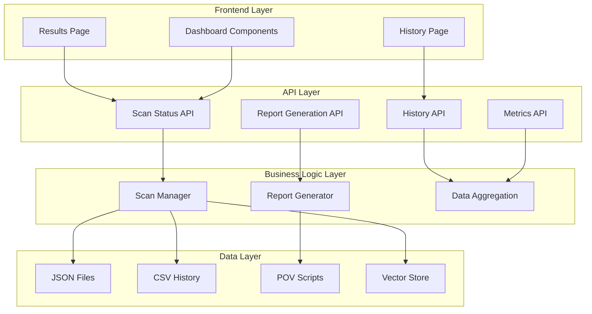
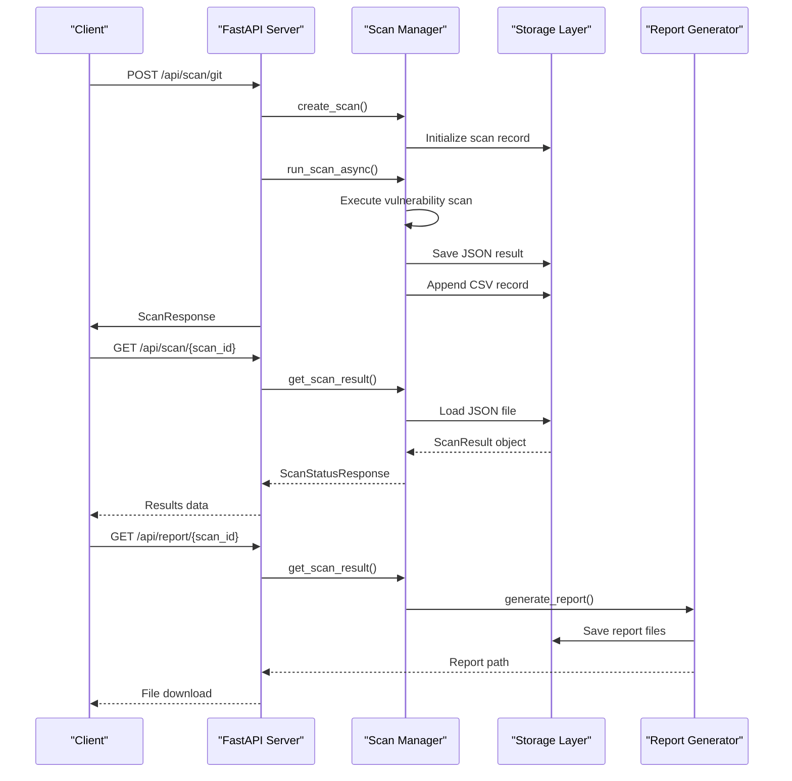
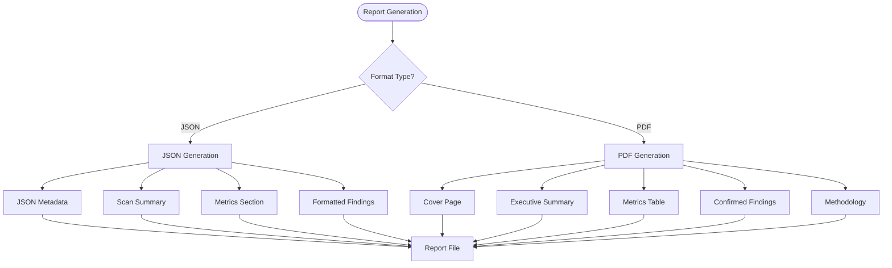
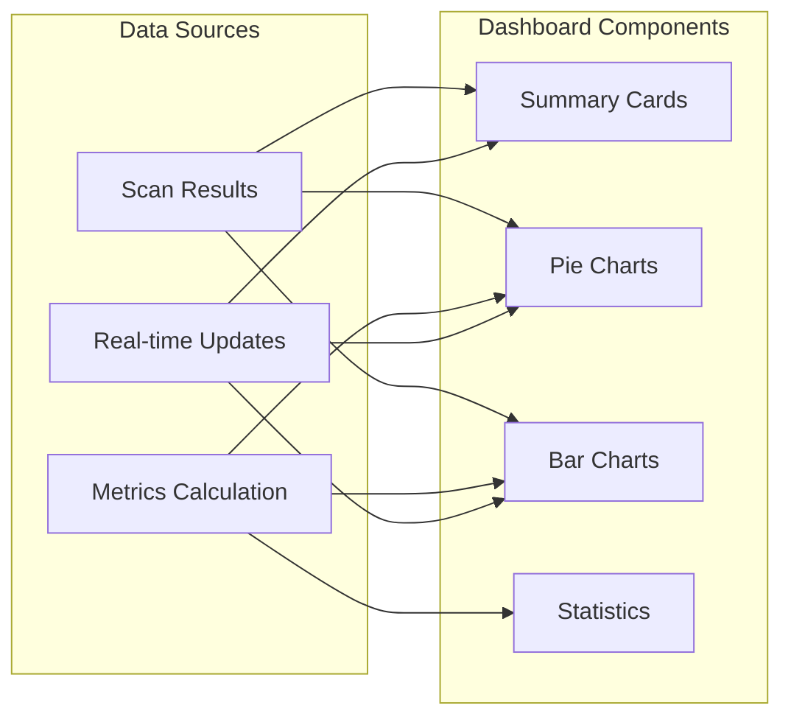
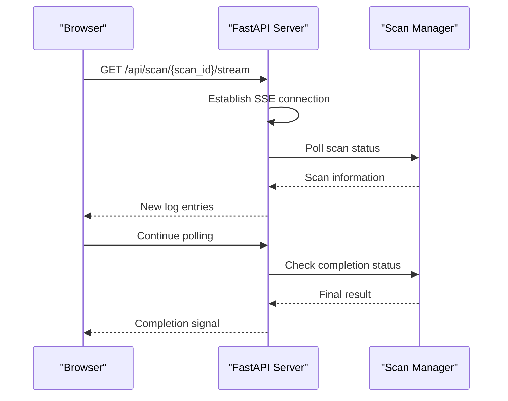

# Results and Data Management

<cite>
**Referenced Files in This Document**
- [main.py](file://autopov/app/main.py)
- [scan_manager.py](file://autopov/app/scan_manager.py)
- [report_generator.py](file://autopov/app/report_generator.py)
- [config.py](file://autopov/app/config.py)
- [Results.jsx](file://autopov/frontend/src/pages/Results.jsx)
- [History.jsx](file://autopov/frontend/src/pages/History.jsx)
- [ResultsDashboard.jsx](file://autopov/frontend/src/components/ResultsDashboard.jsx)
- [FindingCard.jsx](file://autopov/frontend/src/components/FindingCard.jsx)
- [client.js](file://autopov/frontend/src/api/client.js)
- [scan_history.csv](file://autopov/results/runs/scan_history.csv)
- [00457eac-35b4-4e40-a9bd-59f9443694a4.json](file://autopov/results/runs/00457eac-35b4-4e40-a9bd-59f9443694a4.json)
- [15b3f4e6-6e13-42d4-a8ad-5754b0b310ac.json](file://autopov/results/runs/15b3f4e6-6e13-42d4-a8ad-5754b0b310ac.json)
- [api_keys.json](file://autopov/data/api_keys.json)
</cite>

## Table of Contents
1. [Introduction](#introduction)
2. [System Architecture](#system-architecture)
3. [Data Storage Architecture](#data-storage-architecture)
4. [Scan Result Lifecycle](#scan-result-lifecycle)
5. [Report Generation System](#report-generation-system)
6. [Frontend Data Presentation](#frontend-data-presentation)
7. [API Endpoints for Results](#api-endpoints-for-results)
8. [Data Persistence and Retrieval](#data-persistence-and-retrieval)
9. [Performance Considerations](#performance-considerations)
10. [Troubleshooting Guide](#troubleshooting-guide)
11. [Conclusion](#conclusion)

## Introduction

The AutoPoV system implements a comprehensive results and data management framework for autonomous vulnerability scanning. This system manages the entire lifecycle of scan results, from initial execution through final reporting, with robust persistence mechanisms and real-time data presentation capabilities.

The results management system handles multiple data formats including JSON scan results, CSV history logs, and structured report generation. It supports both real-time streaming of scan progress and batch retrieval of completed results, providing a complete solution for vulnerability assessment data management.

## System Architecture

The results and data management system follows a layered architecture with clear separation of concerns:



**Diagram sources**
- [main.py](file://autopov/app/main.py#L362-L480)
- [scan_manager.py](file://autopov/app/scan_manager.py#L40-L348)
- [report_generator.py](file://autopov/app/report_generator.py#L68-L359)

## Data Storage Architecture

The system employs a multi-format storage strategy optimized for different use cases:

### Directory Structure
```
results/
├── runs/           # Active scan data and history
│   ├── scan_history.csv    # Historical metrics
│   ├── [scan_id].json      # Complete scan results
│   └── [scan_id].json      # Individual scan result files
└── povs/           # Generated proof-of-vulnerability scripts
    └── [scan_id]_pov_[index]_[cwe_type].py
```

### Storage Formats

**JSON Storage (Primary)**
- Complete scan results with all findings
- Timestamped metadata and metrics
- Structured data for programmatic access

**CSV Storage (Historical)**
- Aggregated metrics for analytics
- Optimized for reporting and dashboard integration
- Comma-separated values for easy parsing

**POV Script Storage**
- Individual Python scripts for each confirmed vulnerability
- Named with scan ID, index, and CWE type
- Version-controlled for audit trails

**Section sources**
- [config.py](file://autopov/app/config.py#L123-L129)
- [scan_manager.py](file://autopov/app/scan_manager.py#L205-L240)
- [report_generator.py](file://autopov/app/report_generator.py#L272-L300)

## Scan Result Lifecycle

The scan result lifecycle encompasses creation, execution, persistence, and retrieval phases:



**Diagram sources**
- [main.py](file://autopov/app/main.py#L191-L358)
- [scan_manager.py](file://autopov/app/scan_manager.py#L86-L204)
- [report_generator.py](file://autopov/app/report_generator.py#L76-L118)

### Result Data Structure

The ScanResult data class encapsulates all scan information:

| Field | Type | Description |
|-------|------|-------------|
| scan_id | String | Unique identifier for the scan |
| status | String | Current scan status (created, running, completed, failed) |
| codebase_path | String | Path to scanned codebase |
| model_name | String | LLM model used for analysis |
| cwes | List[String] | CWE categories checked |
| total_findings | Integer | Total number of findings |
| confirmed_vulns | Integer | Number of confirmed vulnerabilities |
| false_positives | Integer | Number of false positive findings |
| failed | Integer | Number of failed analyses |
| total_cost_usd | Float | Total cost in USD |
| duration_s | Float | Scan duration in seconds |
| start_time | String | ISO timestamp of start |
| end_time | String | ISO timestamp of completion |
| findings | List[Dict] | Detailed finding information |

**Section sources**
- [scan_manager.py](file://autopov/app/scan_manager.py#L21-L38)

## Report Generation System

The report generation system provides multiple output formats with comprehensive data presentation:

### Supported Formats

**JSON Reports**
- Complete scan metadata and findings
- Machine-readable format for integrations
- Structured data for downstream processing

**PDF Reports**
- Professional formatted documents
- Executive summaries and detailed findings
- Print-ready format with charts and statistics

### Report Content Structure



**Diagram sources**
- [report_generator.py](file://autopov/app/report_generator.py#L76-L270)

**Section sources**
- [report_generator.py](file://autopov/app/report_generator.py#L68-L359)

## Frontend Data Presentation

The frontend implements comprehensive data visualization and user interaction patterns:

### Results Dashboard

The ResultsDashboard component provides interactive data visualization:



**Diagram sources**
- [ResultsDashboard.jsx](file://autopov/frontend/src/components/ResultsDashboard.jsx#L42-L161)

### Finding Detail Cards

Individual finding cards provide expandable detail views:

| Component | Purpose | Features |
|-----------|---------|----------|
| Status Indicator | Visual status representation | Color-coded icons (green/yellow/red) |
| CWE Badge | Vulnerability classification | Severity-based coloring |
| File Location | Source code reference | File path and line number display |
| Confidence Meter | Detection reliability | Color-coded confidence levels |
| Expand/Collapse | Detail visibility | Interactive disclosure |

**Section sources**
- [ResultsDashboard.jsx](file://autopov/frontend/src/components/ResultsDashboard.jsx#L1-L166)
- [FindingCard.jsx](file://autopov/frontend/src/components/FindingCard.jsx#L1-L121)

## API Endpoints for Results

The system exposes comprehensive REST API endpoints for results management:

### Core Endpoints

| Endpoint | Method | Purpose | Response Format |
|----------|--------|---------|-----------------|
| `/api/scan/{scan_id}` | GET | Retrieve scan status and results | JSON object |
| `/api/scan/{scan_id}/stream` | GET | Stream real-time scan logs | Server-Sent Events |
| `/api/report/{scan_id}` | GET | Download scan report | File download (JSON/PDF) |
| `/api/history` | GET | Retrieve scan history | JSON array |
| `/api/metrics` | GET | System-wide metrics | JSON object |

### Real-time Streaming

The streaming endpoint provides live log updates:



**Diagram sources**
- [main.py](file://autopov/app/main.py#L399-L434)

**Section sources**
- [main.py](file://autopov/app/main.py#L362-L480)

## Data Persistence and Retrieval

The system implements robust data persistence with multiple retrieval strategies:

### File-based Storage Strategy

**Active Scans (Memory)**
- Runtime scan state management
- Thread-safe access patterns
- Temporary storage during execution

**Persistent Storage (Disk)**
- JSON files for complete results
- CSV files for historical analytics
- Automatic cleanup and rotation

### Retrieval Patterns

**Immediate Access**
- Direct file system reads for completed scans
- Optimized for low-latency retrieval
- Cached file system access

**Aggregated Access**
- CSV-based analytics queries
- Historical trend analysis
- Batch processing capabilities

**Section sources**
- [scan_manager.py](file://autopov/app/scan_manager.py#L241-L290)
- [scan_history.csv](file://autopov/results/runs/scan_history.csv#L1-L25)

## Performance Considerations

The results management system incorporates several performance optimization strategies:

### Memory Management
- Limited memory footprint for active scans
- Efficient JSON serialization/deserialization
- Automatic cleanup of completed scan data

### Storage Optimization
- Compressed JSON storage format
- Efficient CSV indexing for large datasets
- Optimized file I/O operations

### Network Efficiency
- Streaming server-sent events for real-time updates
- Chunked file downloads for large reports
- Connection pooling for database operations

### Scalability Features
- Asynchronous processing for long-running scans
- Parallel execution of independent operations
- Load balancing for high-concurrency scenarios

## Troubleshooting Guide

Common issues and their resolutions:

### Scan Results Not Found
**Symptoms**: 404 errors when accessing scan results
**Causes**: 
- Scan ID doesn't exist
- Scan data purged due to retention policies
- Incorrect scan ID format

**Resolutions**:
- Verify scan ID format (UUID)
- Check scan history endpoint for valid IDs
- Confirm scan completion status

### Report Generation Failures
**Symptoms**: 500 errors during report generation
**Causes**:
- Missing PDF dependencies
- Insufficient disk space
- Corrupted scan data

**Resolutions**:
- Install required PDF libraries
- Check available storage space
- Re-run scan to regenerate data

### Performance Issues
**Symptoms**: Slow response times for results
**Causes**:
- Large scan result files
- High concurrent access
- Insufficient system resources

**Resolutions**:
- Implement result caching
- Optimize database queries
- Scale system resources

**Section sources**
- [main.py](file://autopov/app/main.py#L370-L381)
- [report_generator.py](file://autopov/app/report_generator.py#L130-L132)

## Conclusion

The AutoPoV results and data management system provides a comprehensive solution for vulnerability assessment data handling. Through its multi-format storage approach, real-time streaming capabilities, and robust reporting system, it enables effective monitoring, analysis, and presentation of security scan results.

The system's architecture supports scalability, maintainability, and extensibility while maintaining high performance standards. Its integration with both frontend dashboards and backend APIs creates a seamless user experience for vulnerability management workflows.

Key strengths include:
- Comprehensive data persistence across multiple formats
- Real-time data streaming for live monitoring
- Professional report generation capabilities
- Scalable architecture supporting high-volume operations
- Robust error handling and recovery mechanisms

This foundation provides an excellent platform for extending vulnerability management capabilities and integrating with broader security orchestration systems.