# Research & Development

<cite>
**Referenced Files in This Document**
- [README.md](file://README.md)
- [DOCS_APPLICATION_FLOW.md](file://DOCS_APPLICATION_FLOW.md)
- [app/main.py](file://app/main.py)
- [app/agent_graph.py](file://app/agent_graph.py)
- [app/policy.py](file://app/policy.py)
- [app/learning_store.py](file://app/learning_store.py)
- [app/config.py](file://app/config.py)
- [agents/__init__.py](file://agents/__init__.py)
- [agents/ingest_codebase.py](file://agents/ingest_codebase.py)
- [agents/heuristic_scout.py](file://agents/heuristic_scout.py)
- [agents/llm_scout.py](file://agents/llm_scout.py)
- [agents/investigator.py](file://agents/investigator.py)
- [prompts.py](file://prompts.py)
- [analyse.py](file://analyse.py)
</cite>

## Table of Contents
1. [Introduction](#introduction)
2. [Project Structure](#project-structure)
3. [Core Components](#core-components)
4. [Architecture Overview](#architecture-overview)
5. [Detailed Component Analysis](#detailed-component-analysis)
6. [Dependency Analysis](#dependency-analysis)
7. [Performance Considerations](#performance-considerations)
8. [Troubleshooting Guide](#troubleshooting-guide)
9. [Conclusion](#conclusion)
10. [Appendices](#appendices)

## Introduction
This document provides comprehensive research and development guidance for AutoPoV’s autonomous vulnerability detection platform. It explains how to extend the agent ecosystem, add new vulnerability categories (CWEs), implement custom validation methods, and optimize detection accuracy using the integrated learning store and adaptive model routing. It also outlines reproducible research methodologies, benchmarking workflows, and result analysis techniques suitable for academic and industrial applications.

## Project Structure
AutoPoV is organized into modular components:
- Agents: specialized autonomous nodes for ingestion, discovery, investigation, PoV generation, and validation
- App: FastAPI backend orchestrating scans, integrating agents, and exposing REST endpoints
- Frontend: React-based dashboard for interactive inspection and reporting
- CLI: command-line interface for streamlined operations
- Data and Results: persistent storage for vectors, learning metrics, and scan artifacts
- Tests: pytest-based coverage for core modules

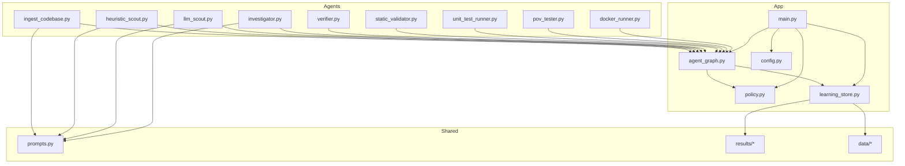

**Diagram sources**
- [agents/ingest_codebase.py](file://agents/ingest_codebase.py)
- [agents/heuristic_scout.py](file://agents/heuristic_scout.py)
- [agents/llm_scout.py](file://agents/llm_scout.py)
- [agents/investigator.py](file://agents/investigator.py)
- [app/agent_graph.py](file://app/agent_graph.py)
- [app/policy.py](file://app/policy.py)
- [app/learning_store.py](file://app/learning_store.py)
- [app/main.py](file://app/main.py)
- [app/config.py](file://app/config.py)
- [prompts.py](file://prompts.py)

**Section sources**
- [README.md:89-124](file://README.md#L89-L124)

## Core Components
- Agent Graph (LangGraph): orchestrates the end-to-end vulnerability lifecycle with autonomous routing and looping over findings
- Policy Router: selects the optimal reasoning model per stage, CWE, and language using adaptive routing modes
- Learning Store: records agent decisions and outcomes for self-improvement and model selection optimization
- Prompts: standardized, structured prompts for investigation, PoV generation, validation, and retry analysis
- Configuration: environment-driven settings controlling routing, cost caps, tool availability, and supported CWEs

Key responsibilities:
- Ingestion: chunking, embedding, and RAG context for downstream agents
- Discovery: CodeQL, heuristic, and LLM-based candidate surfacing
- Investigation: LLM + RAG + optional CPG analysis to decide REAL vs FALSE_POSITIVE
- PoV Generation: exploit script synthesis with strict constraints
- Validation: static → unit test → Docker escalation
- Reporting and replay: persistent results, metrics, and replay for comparative benchmarking

**Section sources**
- [app/agent_graph.py:82-168](file://app/agent_graph.py#L82-L168)
- [app/policy.py:12-39](file://app/policy.py#L12-L39)
- [app/learning_store.py:14-256](file://app/learning_store.py#L14-L256)
- [prompts.py:7-424](file://prompts.py#L7-L424)
- [app/config.py:13-255](file://app/config.py#L13-L255)

## Architecture Overview
The system is a stateful agent graph driven by LangGraph. Each agent node performs perception, decision-making, action, and observation, with conditional edges enabling dynamic routing. The Policy Agent selects models based on historical performance, and the Learning Store persists outcomes to improve future routing.

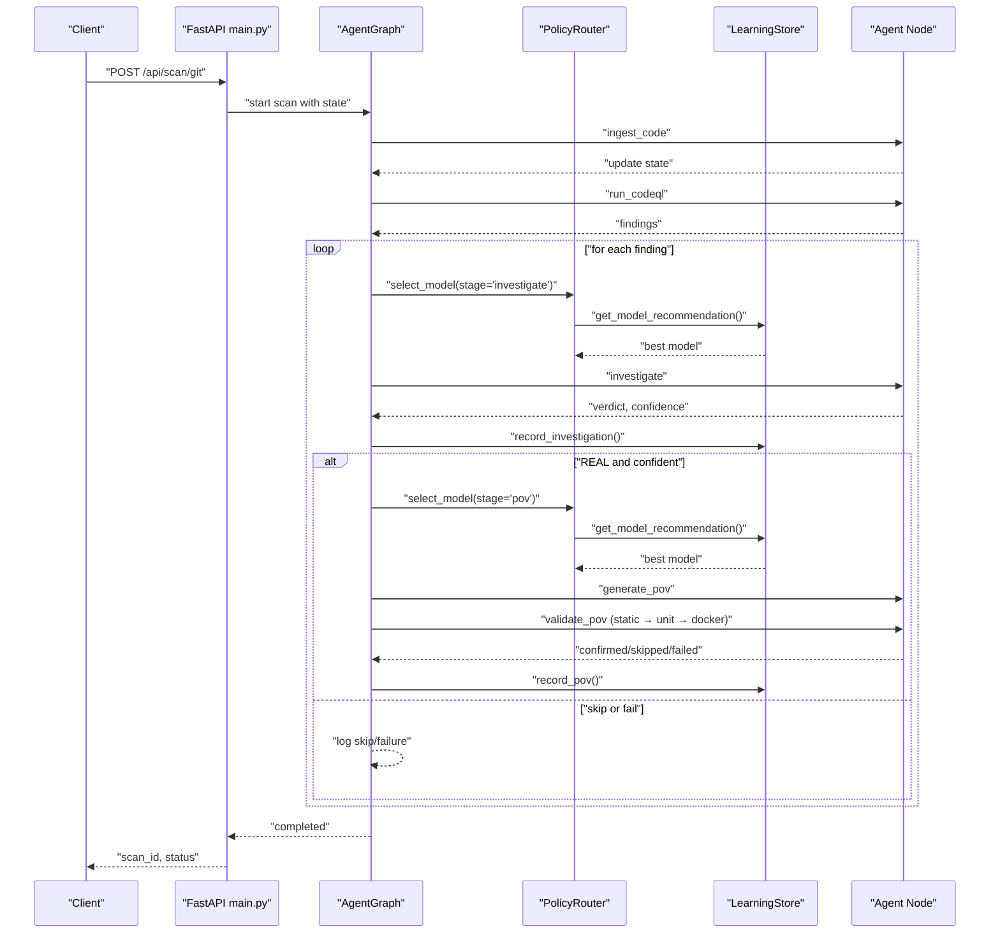

**Diagram sources**
- [app/main.py:204-400](file://app/main.py#L204-L400)
- [app/agent_graph.py:170-777](file://app/agent_graph.py#L170-L777)
- [app/policy.py:18-32](file://app/policy.py#L18-L32)
- [app/learning_store.py:61-124](file://app/learning_store.py#L61-L124)

**Section sources**
- [DOCS_APPLICATION_FLOW.md:1-242](file://DOCS_APPLICATION_FLOW.md#L1-L242)

## Detailed Component Analysis

### Learning Store and Model Routing
The Learning Store persists agent outcomes and computes model performance metrics. The Policy Router selects models based on routing mode:
- auto: delegates to OpenRouter auto-router
- fixed: uses a configured model
- learning: selects the model with the highest confirmed-per-cost score per CWE and language

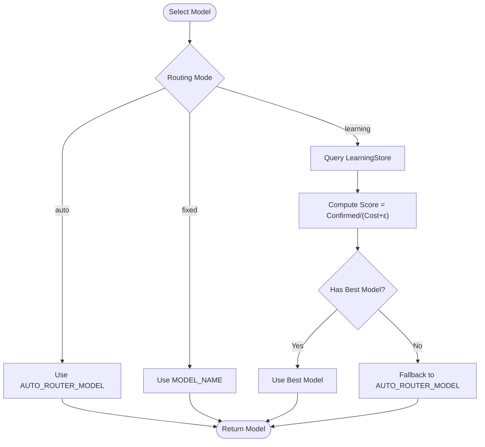

**Diagram sources**
- [app/policy.py:18-32](file://app/policy.py#L18-L32)
- [app/learning_store.py:188-248](file://app/learning_store.py#L188-L248)

**Section sources**
- [app/learning_store.py:126-186](file://app/learning_store.py#L126-L186)
- [app/policy.py:12-39](file://app/policy.py#L12-L39)

### Investigator Agent and RAG Context
The Investigator Agent synthesizes code context, optionally augments with RAG, and integrates CPG analysis for specific CWEs. It parses structured JSON responses and records costs and token usage.

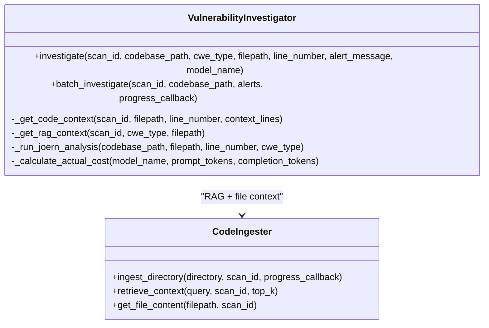

**Diagram sources**
- [agents/investigator.py:270-433](file://agents/investigator.py#L270-L433)
- [agents/ingest_codebase.py:315-391](file://agents/ingest_codebase.py#L315-L391)

**Section sources**
- [agents/investigator.py:270-433](file://agents/investigator.py#L270-L433)
- [agents/ingest_codebase.py:207-314](file://agents/ingest_codebase.py#L207-L314)

### Discovery Agents: Heuristic and LLM Scout
Heuristic Scout applies regex patterns per CWE to quickly surface candidates. LLM Scout samples top files and asks the model to propose candidates with structured JSON.

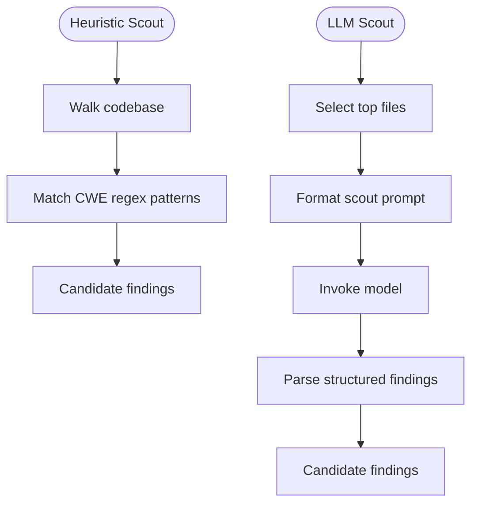

**Diagram sources**
- [agents/heuristic_scout.py:188-234](file://agents/heuristic_scout.py#L188-L234)
- [agents/llm_scout.py:88-200](file://agents/llm_scout.py#L88-L200)

**Section sources**
- [agents/heuristic_scout.py:188-234](file://agents/heuristic_scout.py#L188-L234)
- [agents/llm_scout.py:88-200](file://agents/llm_scout.py#L88-L200)

### Agent Graph Orchestration and Conditional Routing
The Agent Graph defines nodes and edges, with conditional routing determining whether to generate PoV, skip, or log failures. It loops over findings until none remain.

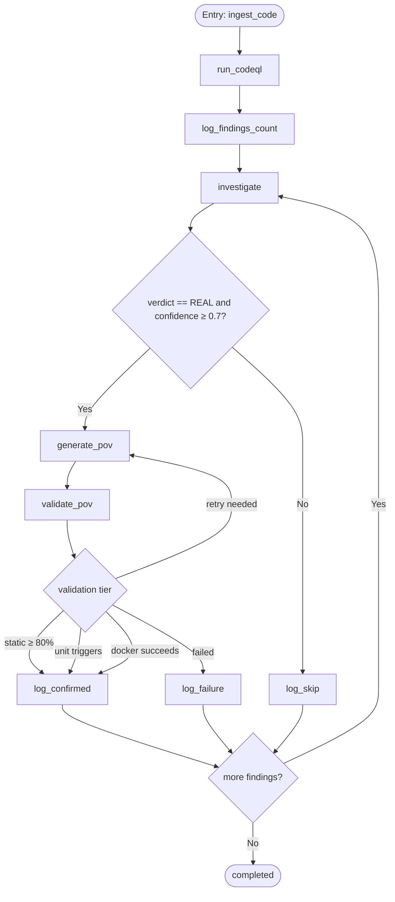

**Diagram sources**
- [app/agent_graph.py:88-168](file://app/agent_graph.py#L88-L168)
- [app/agent_graph.py:691-777](file://app/agent_graph.py#L691-L777)

**Section sources**
- [app/agent_graph.py:88-168](file://app/agent_graph.py#L88-L168)
- [app/agent_graph.py:691-777](file://app/agent_graph.py#L691-L777)

### Research Framework and Experimental Design
AutoPoV supports rigorous research workflows:
- Comparative benchmarking: replay findings against multiple models to compare detection rates, false positive rates, and cost per confirmed
- Routing optimization: evaluate routing modes (auto, fixed, learning) and observe improvements via the Learning Store
- Ablation studies: toggle scout agents, CodeQL availability, and vector store context to isolate component contributions
- Cost-aware experiments: constrain per-scan budgets and per-stage costs to study trade-offs

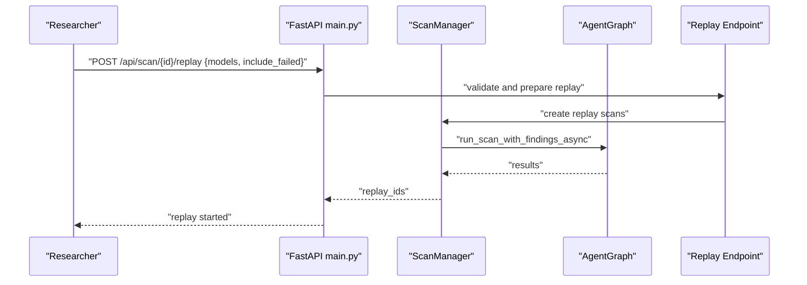

**Diagram sources**
- [app/main.py:404-490](file://app/main.py#L404-L490)
- [app/agent_graph.py:691-777](file://app/agent_graph.py#L691-L777)

**Section sources**
- [app/main.py:404-490](file://app/main.py#L404-L490)
- [analyse.py:300-306](file://analyse.py#L300-L306)

### Extending the Platform: Adding New Agents
To add a new agent:
1. Implement the agent logic in a new module under agents/
2. Expose a factory/get function returning a singleton instance
3. Import and export the agent in agents/__init__.py
4. Integrate the agent node into the Agent Graph in app/agent_graph.py
5. Wire routing and conditional edges as needed
6. Record outcomes in the Learning Store if applicable

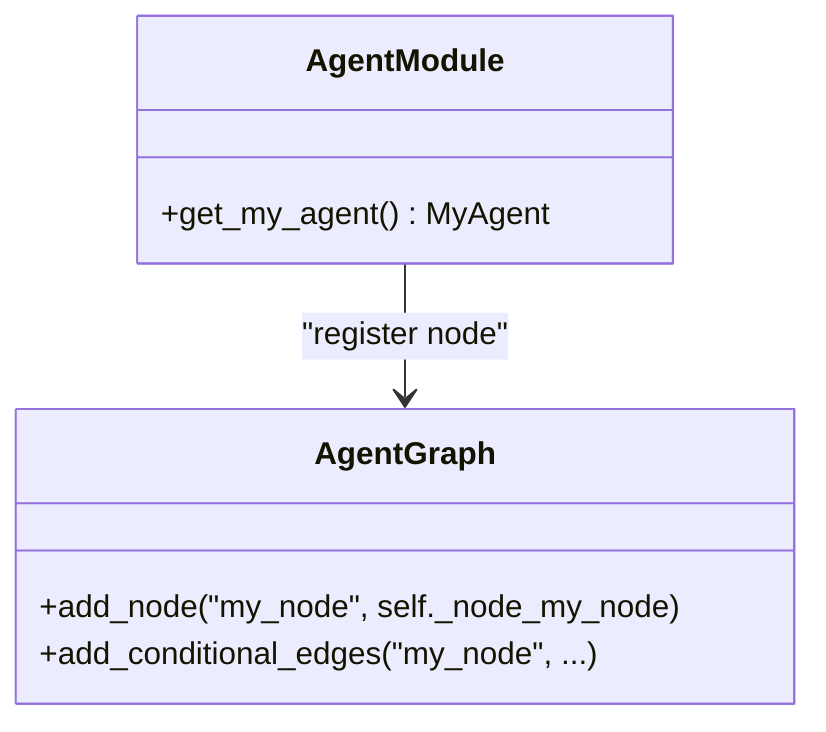

**Diagram sources**
- [agents/__init__.py:6-20](file://agents/__init__.py#L6-L20)
- [app/agent_graph.py:94-168](file://app/agent_graph.py#L94-L168)

**Section sources**
- [agents/__init__.py:6-20](file://agents/__init__.py#L6-L20)
- [app/agent_graph.py:94-168](file://app/agent_graph.py#L94-L168)

### Adding New CWE Categories
Supported CWEs are defined centrally. To add a new CWE:
1. Extend SUPPORTED_CWES in app/config.py
2. Provide a CodeQL query or fallback logic in app/agent_graph.py
3. Add or update regex patterns in agents/heuristic_scout.py if applicable
4. Ensure prompts in prompts.py reflect the new CWE semantics
5. Verify scoring and routing in the Learning Store align with expected performance

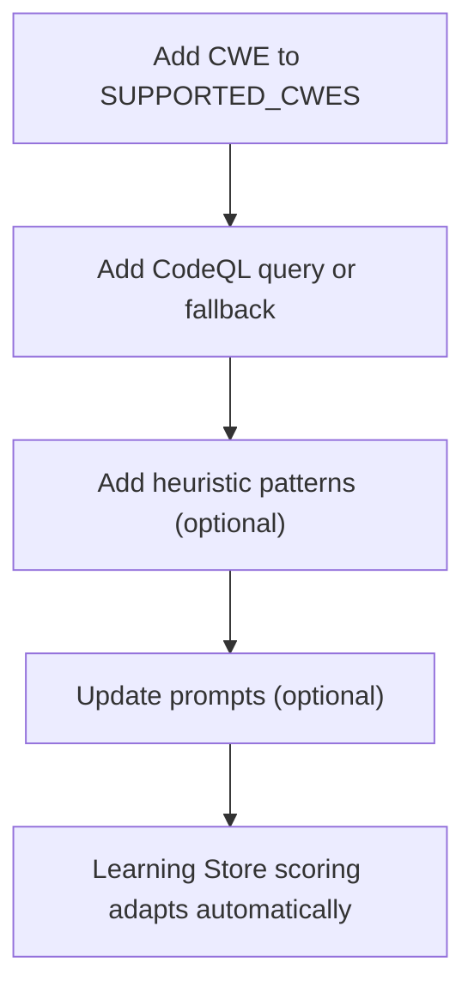

**Diagram sources**
- [app/config.py:108-134](file://app/config.py#L108-L134)
- [app/agent_graph.py:382-504](file://app/agent_graph.py#L382-L504)
- [agents/heuristic_scout.py:18-157](file://agents/heuristic_scout.py#L18-L157)
- [prompts.py:7-44](file://prompts.py#L7-L44)

**Section sources**
- [app/config.py:108-134](file://app/config.py#L108-L134)
- [app/agent_graph.py:382-504](file://app/agent_graph.py#L382-L504)
- [agents/heuristic_scout.py:18-157](file://agents/heuristic_scout.py#L18-L157)
- [prompts.py:7-44](file://prompts.py#L7-L44)

### Implementing Custom Validation Methods
The validation pipeline escalates from static analysis to unit testing to Docker execution. To add a custom validation method:
1. Implement a validator agent that accepts a PoV script and returns structured validation results
2. Insert the validator into the validation node logic in app/agent_graph.py
3. Update conditional edges to route based on validation tier outcomes
4. Record outcomes in the Learning Store for model selection optimization

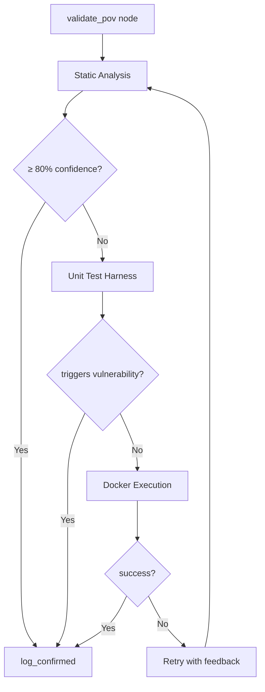

**Diagram sources**
- [app/agent_graph.py:779-850](file://app/agent_graph.py#L779-L850)

**Section sources**
- [app/agent_graph.py:779-850](file://app/agent_graph.py#L779-L850)

### Research Methodologies and Result Analysis
- Metrics: detection rate, false positive rate, cost per confirmed, average duration
- Summaries: CSV and JSON reports via analyse.py
- Recommendations: derived from aggregated model performance

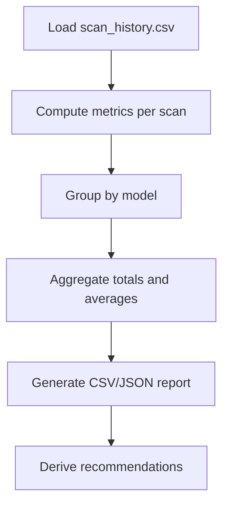

**Diagram sources**
- [analyse.py:46-247](file://analyse.py#L46-L247)

**Section sources**
- [analyse.py:46-247](file://analyse.py#L46-L247)

## Dependency Analysis
AutoPoV exhibits clear separation of concerns:
- Agents depend on shared prompts and configuration
- The Agent Graph depends on agents, policy, and learning store
- The API layer depends on the Agent Graph, Scan Manager, and configuration
- Data dependencies include SQLite (learning.db), ChromaDB, and file system for results

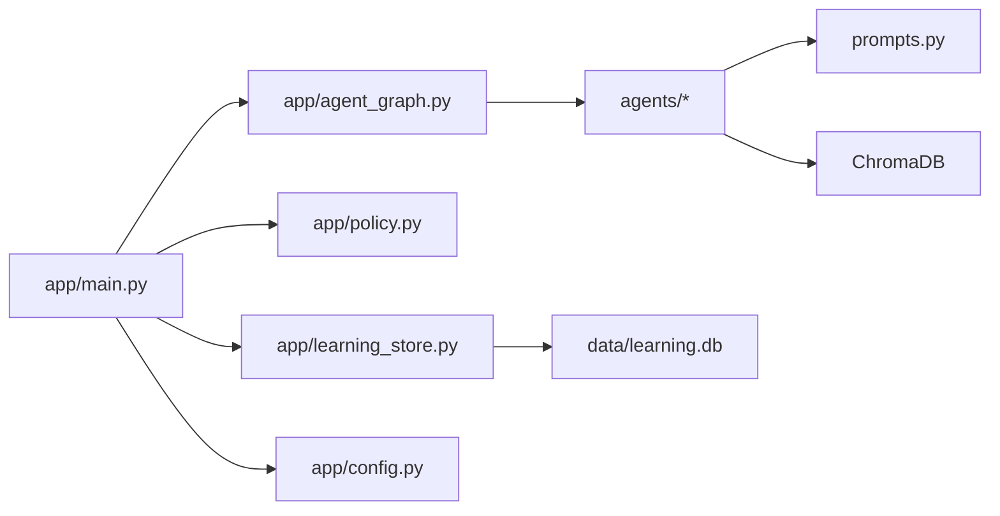

**Diagram sources**
- [app/main.py:19-27](file://app/main.py#L19-L27)
- [app/agent_graph.py:19-28](file://app/agent_graph.py#L19-L28)
- [app/policy.py:8-9](file://app/policy.py#L8-L9)
- [app/learning_store.py:11-11](file://app/learning_store.py#L11-L11)
- [app/config.py:13-255](file://app/config.py#L13-L255)

**Section sources**
- [app/main.py:19-27](file://app/main.py#L19-L27)
- [app/agent_graph.py:19-28](file://app/agent_graph.py#L19-L28)
- [app/learning_store.py:11-11](file://app/learning_store.py#L11-L11)

## Performance Considerations
- Cost control: per-scan ceilings and per-stage cost caps prevent runaway expenses
- Tool availability checks: CodeQL, Joern, and Docker are validated before use
- Batched ingestion and embeddings reduce overhead
- Adaptive routing improves throughput and accuracy over time

[No sources needed since this section provides general guidance]

## Troubleshooting Guide
Common operational issues and resolutions:
- Authentication failures: verify API key hashing and admin key HMAC comparisons
- Tool unavailability: check Docker, CodeQL, and Joern presence; the system gracefully falls back when possible
- Rate limiting: enforce per-key limits to avoid overload
- Learning Store anomalies: ensure SQLite connectivity and table initialization

**Section sources**
- [app/main.py:691-724](file://app/main.py#L691-L724)
- [app/config.py:162-198](file://app/config.py#L162-L198)
- [app/learning_store.py:25-59](file://app/learning_store.py#L25-L59)

## Conclusion
AutoPoV offers a robust, research-friendly platform for autonomous vulnerability detection. Its modular agent architecture, adaptive model routing, and learning store enable reproducible experimentation, rigorous benchmarking, and continuous improvement. Researchers can extend the agent ecosystem, introduce new CWE categories, and refine validation strategies while leveraging built-in observability and result analysis tools.

[No sources needed since this section summarizes without analyzing specific files]

## Appendices

### Contribution Guidelines
- New agents: implement in agents/, expose via agents/__init__.py, integrate in app/agent_graph.py
- New CWEs: update app/config.py SUPPORTED_CWES, add CodeQL or fallback logic, update prompts and patterns as needed
- Custom validations: implement a validator agent and integrate into the validation node logic
- Research reproducibility: use replay endpoints and analyse.py for comparative studies

**Section sources**
- [agents/__init__.py:6-20](file://agents/__init__.py#L6-L20)
- [app/agent_graph.py:94-168](file://app/agent_graph.py#L94-L168)
- [app/config.py:108-134](file://app/config.py#L108-L134)
- [analyse.py:300-306](file://analyse.py#L300-L306)