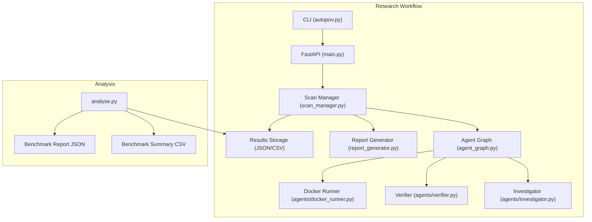
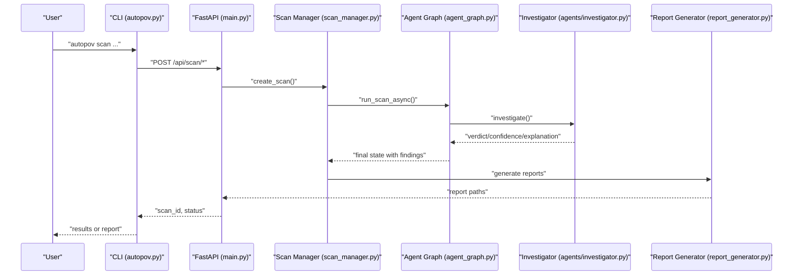
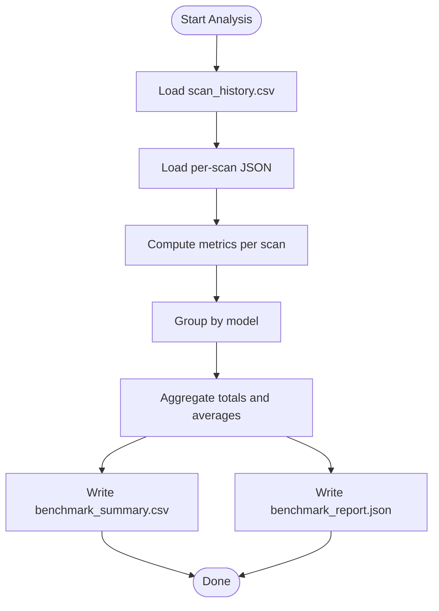
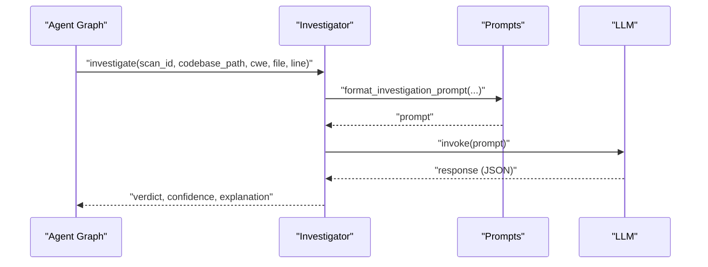
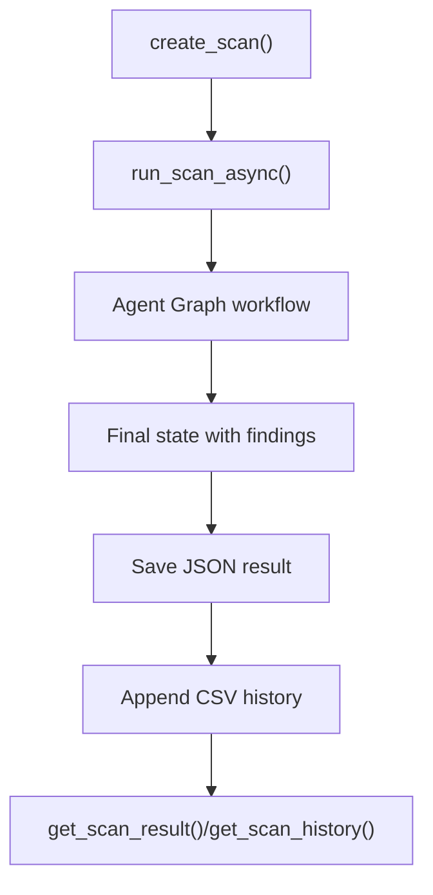
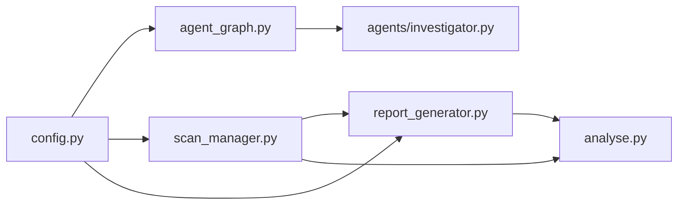

# Research and Benchmarking

<cite>
**Referenced Files in This Document**
- [analyse.py](file://autopov/analyse.py)
- [README.md](file://autopov/README.md)
- [run.sh](file://autopov/run.sh)
- [prompts.py](file://autopov/prompts.py)
- [main.py](file://autopov/app/main.py)
- [config.py](file://autopov/app/config.py)
- [scan_manager.py](file://autopov/app/scan_manager.py)
- [report_generator.py](file://autopov/app/report_generator.py)
- [agent_graph.py](file://autopov/app/agent_graph.py)
- [investigator.py](file://autopov/agents/investigator.py)
- [autopov.py](file://autopov/cli/autopov.py)
- [test_agent.py](file://autopov/tests/test_agent.py)
- [test_api.py](file://autopov/tests/test_api.py)
</cite>

## Table of Contents
1. [Introduction](#introduction)
2. [Project Structure](#project-structure)
3. [Core Components](#core-components)
4. [Architecture Overview](#architecture-overview)
5. [Detailed Component Analysis](#detailed-component-analysis)
6. [Dependency Analysis](#dependency-analysis)
7. [Performance Considerations](#performance-considerations)
8. [Troubleshooting Guide](#troubleshooting-guide)
9. [Conclusion](#conclusion)
10. [Appendices](#appendices)

## Introduction
This document describes AutoPoV’s research and benchmarking framework for evaluating Large Language Model (LLM) performance in vulnerability detection tasks. It covers dataset preparation, evaluation metrics, comparative analysis techniques, and the analyse.py utility for processing scan results and generating performance reports. It also outlines research applications, reproducibility guidelines, result reporting standards, ethical considerations, and extension pathways for the community.

## Project Structure
AutoPoV is a full-stack research prototype integrating static analysis (CodeQL, Joern) with AI-powered reasoning (LLMs via LangGraph) to detect, verify, and benchmark vulnerabilities. The benchmarking pipeline produces structured scan results stored as JSON and CSV, which are consumed by analyse.py to compute per-model metrics and generate benchmark reports.

**Diagram sources**
- [autopov.py](file://autopov/cli/autopov.py#L1-L467)
- [main.py](file://autopov/app/main.py#L1-L525)
- [scan_manager.py](file://autopov/app/scan_manager.py#L1-L344)
- [agent_graph.py](file://autopov/app/agent_graph.py#L1-L582)
- [investigator.py](file://autopov/agents/investigator.py#L1-L413)
- [report_generator.py](file://autopov/app/report_generator.py#L1-L359)
- [analyse.py](file://autopov/analyse.py#L1-L357)

**Section sources**
- [README.md](file://autopov/README.md#L1-L242)
- [run.sh](file://autopov/run.sh#L1-L233)

## Core Components
- Dataset preparation: Code ingestion, optional CodeQL/Joern augmentation, and LLM-based investigation produce findings with statuses (confirmed, skipped, failed).
- Evaluation metrics: Detection rate, false positive rate, PoV success rate, total cost, and average duration.
- Comparative analysis: Grouped statistics by model, recommendations, and CSV/JSON reports.
- Reporting: Per-scan JSON/PDF reports and aggregated benchmark outputs.

**Section sources**
- [scan_manager.py](file://autopov/app/scan_manager.py#L201-L236)
- [report_generator.py](file://autopov/app/report_generator.py#L302-L327)
- [analyse.py](file://autopov/analyse.py#L72-L98)

## Architecture Overview
The benchmarking architecture comprises:
- CLI for initiating scans and retrieving results.
- FastAPI endpoints for orchestration, authentication, and reporting.
- Scan manager coordinating the agent graph workflow.
- Agent graph implementing a LangGraph pipeline with nodes for ingestion, static analysis, investigation, PoV generation/validation, and Docker execution.
- Investigator agent using RAG and LLM prompting to classify findings.
- Report generator producing per-scan reports and saving PoV scripts.
- Analyst utility for summarizing and comparing model performance.

**Diagram sources**
- [autopov.py](file://autopov/cli/autopov.py#L104-L210)
- [main.py](file://autopov/app/main.py#L175-L314)
- [scan_manager.py](file://autopov/app/scan_manager.py#L86-L176)
- [agent_graph.py](file://autopov/app/agent_graph.py#L532-L572)
- [investigator.py](file://autopov/agents/investigator.py#L254-L366)
- [report_generator.py](file://autopov/app/report_generator.py#L76-L118)

## Detailed Component Analysis

### analyse.py: Benchmark Analysis Utility
Purpose:
- Load historical scan results from CSV and JSON.
- Compute per-scan and per-model metrics.
- Generate benchmark summary CSV and detailed JSON report with recommendations.

Key capabilities:
- Metrics calculation: detection rate, false positive rate, cost per confirmed.
- Aggregation by model with counts and averages.
- CSV and JSON outputs for downstream analysis.
- CLI entry point for quick benchmark summaries.

**Diagram sources**
- [analyse.py](file://autopov/analyse.py#L46-L98)
- [analyse.py](file://autopov/analyse.py#L100-L214)
- [analyse.py](file://autopov/analyse.py#L216-L267)

**Section sources**
- [analyse.py](file://autopov/analyse.py#L23-L98)
- [analyse.py](file://autopov/analyse.py#L100-L214)
- [analyse.py](file://autopov/analyse.py#L216-L267)

### Prompts and Investigation Pipeline
Prompts define the LLM tasks for vulnerability investigation, PoV generation, validation, and summary reporting. The Investigator agent constructs prompts with context and invokes the configured LLM to produce structured outputs.

**Diagram sources**
- [prompts.py](file://autopov/prompts.py#L7-L43)
- [investigator.py](file://autopov/agents/investigator.py#L296-L313)
- [agent_graph.py](file://autopov/app/agent_graph.py#L290-L325)

**Section sources**
- [prompts.py](file://autopov/prompts.py#L7-L43)
- [prompts.py](file://autopov/prompts.py#L245-L261)
- [investigator.py](file://autopov/agents/investigator.py#L254-L366)

### Scan Lifecycle and Results Storage
The scan manager orchestrates the end-to-end workflow, persists results to JSON and CSV, and computes metrics for reporting and benchmarking.

**Diagram sources**
- [scan_manager.py](file://autopov/app/scan_manager.py#L50-L84)
- [scan_manager.py](file://autopov/app/scan_manager.py#L86-L176)
- [scan_manager.py](file://autopov/app/scan_manager.py#L201-L236)

**Section sources**
- [scan_manager.py](file://autopov/app/scan_manager.py#L201-L236)
- [report_generator.py](file://autopov/app/report_generator.py#L302-L327)

### Metrics Definitions and Interpretation
- Detection rate: confirmed / total findings × 100
- False positive rate: false positives / total findings × 100
- PoV success rate: confirmed with triggered PoV / confirmed × 100
- Cost per confirmed: total cost / confirmed (if confirmed > 0)
- Duration: wall-clock time of the scan

These metrics are computed both in the report generator and the analyst utility.

**Section sources**
- [report_generator.py](file://autopov/app/report_generator.py#L302-L327)
- [analyse.py](file://autopov/analyse.py#L72-L98)

### Comparative Analysis Techniques
- Group by model to compare detection rate, FP rate, cost per confirmed, and average duration.
- Generate recommendations highlighting best detection rate, lowest FP rate, and most cost-effective model.
- Filter and compare specific models via CLI or programmatic selection.

**Section sources**
- [analyse.py](file://autopov/analyse.py#L100-L159)
- [analyse.py](file://autopov/analyse.py#L269-L298)
- [analyse.py](file://autopov/analyse.py#L300-L305)

### Research Applications
- Accuracy: Track detection rate and PoV success rate across datasets and models.
- Precision and recall: Use false positive rate and false negative rate derived from confirmed/skipped/failed statuses.
- Cost-effectiveness: Compare cost per confirmed across models and configurations.
- Reproducibility: Use standardized scan parameters, CWE sets, and environment variables.

**Section sources**
- [README.md](file://autopov/README.md#L169-L179)
- [config.py](file://autopov/app/config.py#L95-L100)
- [config.py](file://autopov/app/config.py#L173-L189)

### Publication Guidelines and Reproducibility
- Standardize datasets, CWE sets, and model configurations.
- Provide environment variables and dependency versions.
- Include benchmark_summary.csv and benchmark_report.json for transparency.
- Document scan parameters, cost caps, and safety constraints.

**Section sources**
- [README.md](file://autopov/README.md#L146-L168)
- [README.md](file://autopov/README.md#L169-L179)
- [config.py](file://autopov/app/config.py#L173-L189)

### Practical Research Workflows
- Prepare datasets: Git repositories, ZIP archives, or pasted code.
- Configure environment: API keys, model mode, and cost limits.
- Run scans via CLI or API; monitor progress via streaming logs.
- Generate per-scan reports (JSON/PDF) and aggregate benchmark results.
- Export CSV for statistical analysis and visualization.

**Section sources**
- [autopov.py](file://autopov/cli/autopov.py#L104-L210)
- [main.py](file://autopov/app/main.py#L347-L382)
- [report_generator.py](file://autopov/app/report_generator.py#L76-L118)
- [analyse.py](file://autopov/analyse.py#L216-L267)

### Statistical Analysis of Results
- Use CSV outputs for descriptive statistics, correlation analysis, and hypothesis testing.
- Stratify by model, dataset, and CWE to assess variance and significance.
- Visualize distributions of detection rate, FP rate, and cost per confirmed.

**Section sources**
- [analyse.py](file://autopov/analyse.py#L216-L247)

### Research Ethics, Bias Assessment, and Responsible AI
- Bias mitigation: Evaluate across diverse CWEs, languages, and codebases; avoid skewed datasets.
- Transparency: Publish raw results, prompts, and configurations.
- Safety: Enforce Docker execution with resource limits and timeouts.
- Fairness: Report model-specific strengths/weaknesses without discriminatory claims.

**Section sources**
- [README.md](file://autopov/README.md#L203-L210)
- [agent_graph.py](file://autopov/app/agent_graph.py#L403-L433)

### Extending the Framework and Contributing
- Add new CWE queries under codeql_queries and update supported CWEs.
- Integrate additional LLM providers by extending configuration and prompts.
- Contribute new agents or nodes to the agent graph.
- Enhance analyse.py with additional metrics or visualization exports.

**Section sources**
- [README.md](file://autopov/README.md#L194-L202)
- [config.py](file://autopov/app/config.py#L95-L100)
- [agent_graph.py](file://autopov/app/agent_graph.py#L193-L278)

## Dependency Analysis
The benchmarking pipeline depends on:
- Configuration for models, tools, and directories.
- Agent graph for orchestration and conditional branching.
- Investigator for LLM-based classification.
- Report generator for metrics and artifacts.
- Analyst utility for aggregation and reporting.

**Diagram sources**
- [config.py](file://autopov/app/config.py#L13-L210)
- [agent_graph.py](file://autopov/app/agent_graph.py#L78-L135)
- [scan_manager.py](file://autopov/app/scan_manager.py#L40-L49)
- [report_generator.py](file://autopov/app/report_generator.py#L68-L75)
- [analyse.py](file://autopov/analyse.py#L20-L45)

**Section sources**
- [config.py](file://autopov/app/config.py#L13-L210)
- [agent_graph.py](file://autopov/app/agent_graph.py#L78-L135)
- [scan_manager.py](file://autopov/app/scan_manager.py#L40-L49)
- [report_generator.py](file://autopov/app/report_generator.py#L68-L75)
- [analyse.py](file://autopov/analyse.py#L20-L45)

## Performance Considerations
- Cost control: Monitor total cost and enforce maximum thresholds.
- Parallelism: Use thread pools for scan execution; consider concurrency limits.
- I/O efficiency: Persist results incrementally and stream logs for large scans.
- Resource isolation: Docker execution with memory and CPU limits ensures reproducible runtime.

**Section sources**
- [config.py](file://autopov/app/config.py#L85-L87)
- [config.py](file://autopov/app/config.py#L78-L84)
- [scan_manager.py](file://autopov/app/scan_manager.py#L46-L48)
- [agent_graph.py](file://autopov/app/agent_graph.py#L403-L433)

## Troubleshooting Guide
Common issues and remedies:
- Missing API key: Authentication failures on endpoints; configure or pass API key via CLI.
- Tool availability: CodeQL/Joern not installed; fallback to LLM-only analysis or install tools.
- Docker disabled or unavailable: PoV execution skipped; enable Docker or adjust settings.
- Validation failures: Investigator prompts or PoV validation may require stricter criteria.

**Section sources**
- [test_api.py](file://autopov/tests/test_api.py#L29-L40)
- [agent_graph.py](file://autopov/app/agent_graph.py#L168-L173)
- [investigator.py](file://autopov/agents/investigator.py#L112-L114)
- [test_agent.py](file://autopov/tests/test_agent.py#L17-L43)

## Conclusion
AutoPoV provides a robust research and benchmarking framework for evaluating LLM-driven vulnerability detection. By standardizing datasets, metrics, and reporting, researchers can reliably compare models, assess accuracy and cost-effectiveness, and publish reproducible results. The analyse.py utility simplifies aggregation and recommendation generation, while safety and ethical practices remain integral to responsible AI research.

## Appendices

### Appendix A: Benchmark Outputs
- CSV: benchmark_summary.csv with per-model aggregates and rates.
- JSON: benchmark_report.json with analysis and recommendations.

**Section sources**
- [README.md](file://autopov/README.md#L169-L179)
- [analyse.py](file://autopov/analyse.py#L216-L267)

### Appendix B: Example CLI Commands
- Scan a Git repository and wait for completion.
- Retrieve results in table or PDF format.
- Generate a benchmark summary or report.

**Section sources**
- [autopov.py](file://autopov/cli/autopov.py#L104-L210)
- [autopov.py](file://autopov/cli/autopov.py#L212-L291)
- [README.md](file://autopov/README.md#L112-L126)