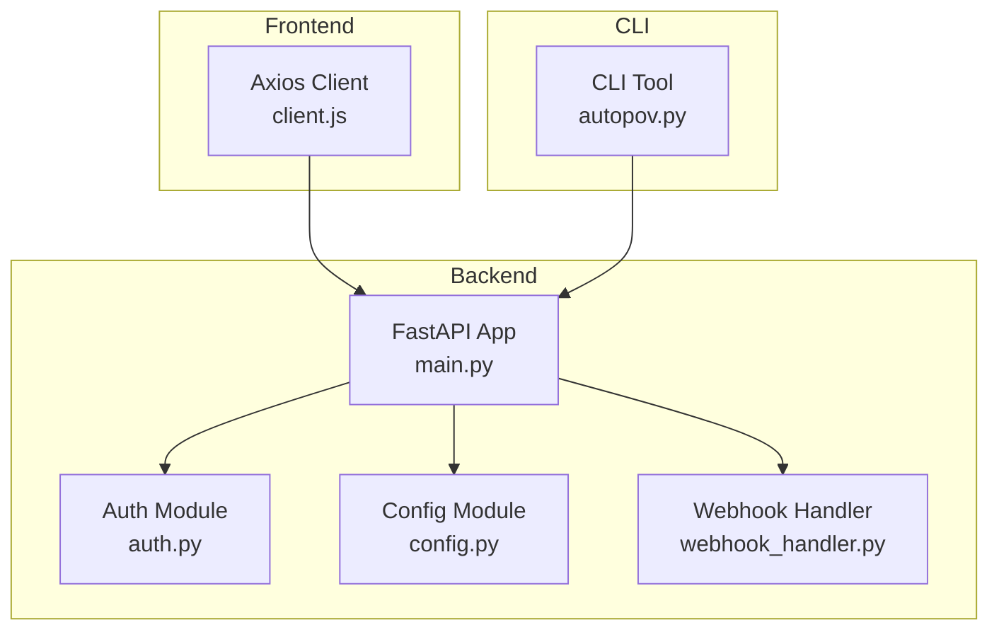
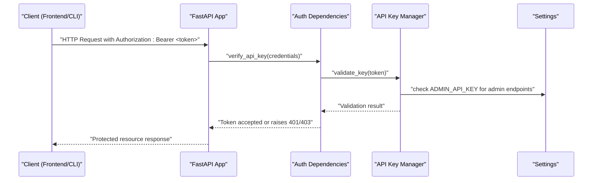
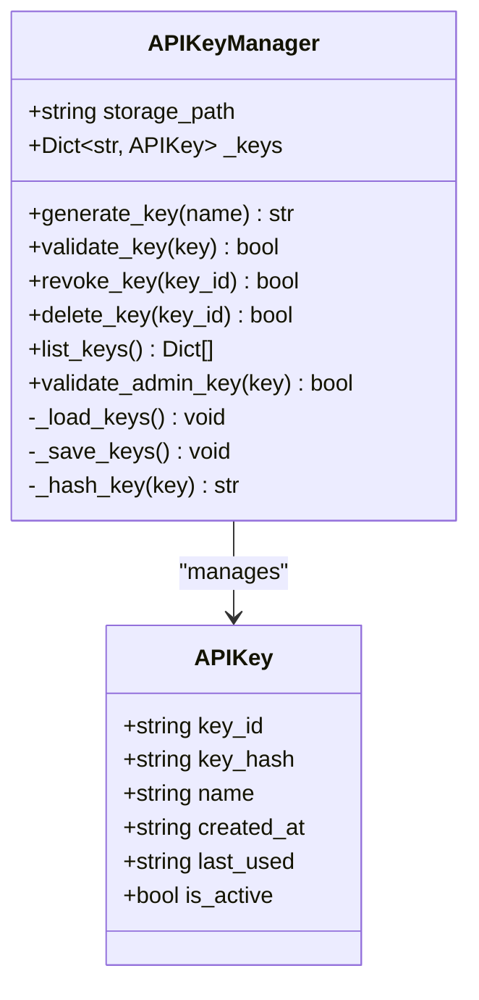
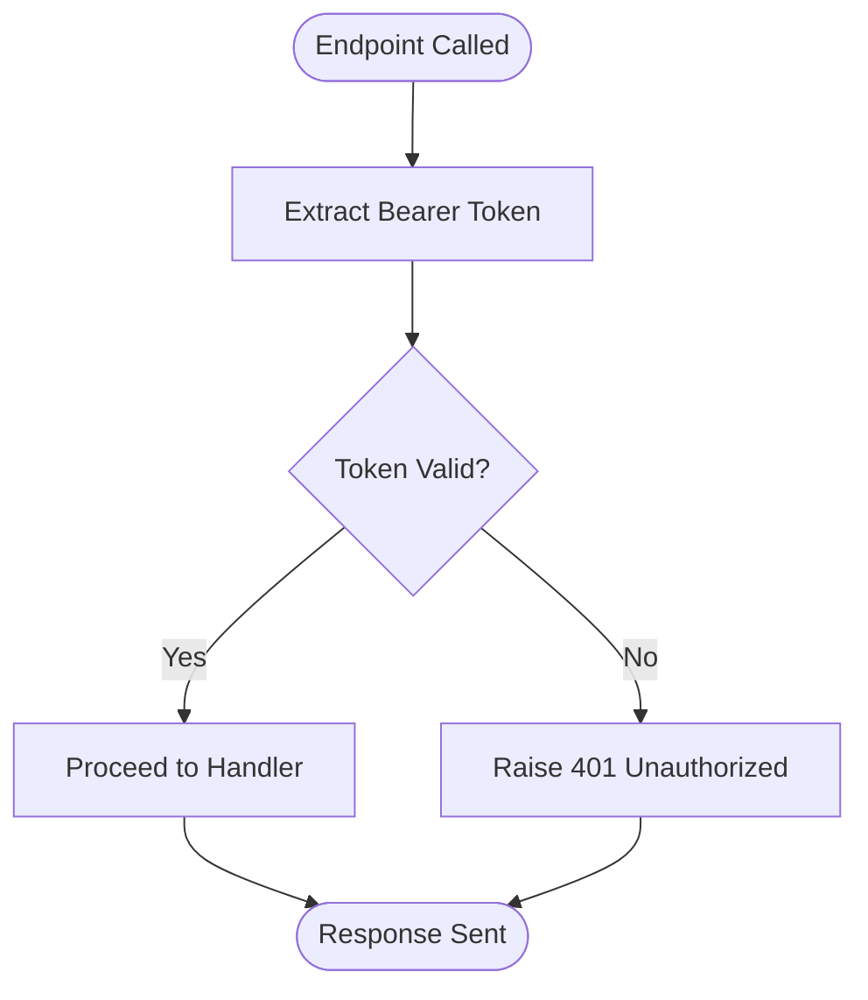
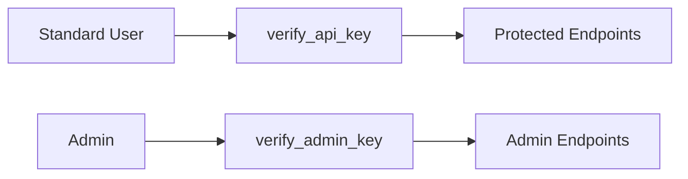
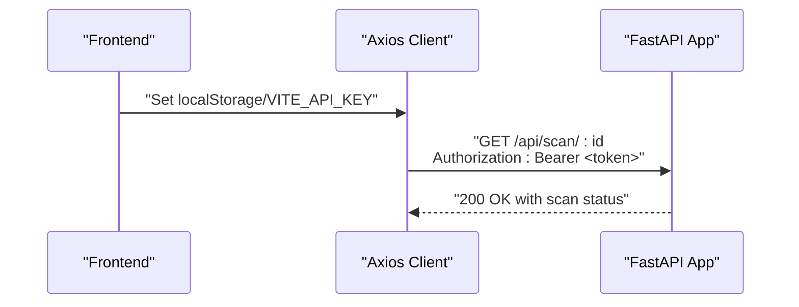
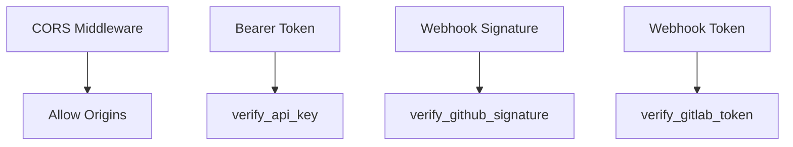
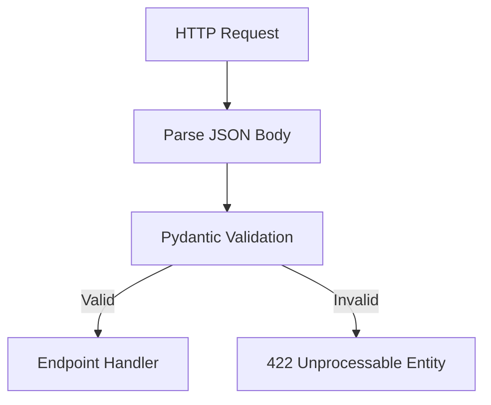
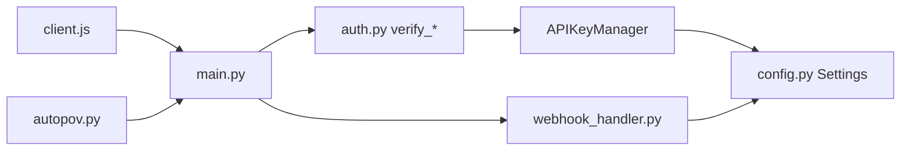

# Authentication and Access Control

<cite>
**Referenced Files in This Document**
- [auth.py](file://autopov/app/auth.py)
- [main.py](file://autopov/app/main.py)
- [config.py](file://autopov/app/config.py)
- [client.js](file://autopov/frontend/src/api/client.js)
- [webhook_handler.py](file://autopov/app/webhook_handler.py)
- [test_auth.py](file://autopov/tests/test_auth.py)
- [autopov.py](file://autopov/cli/autopov.py)
- [README.md](file://autopov/README.md)
- [requirements.txt](file://autopov/requirements.txt)
</cite>

## Table of Contents
1. [Introduction](#introduction)
2. [Project Structure](#project-structure)
3. [Core Components](#core-components)
4. [Architecture Overview](#architecture-overview)
5. [Detailed Component Analysis](#detailed-component-analysis)
6. [Dependency Analysis](#dependency-analysis)
7. [Performance Considerations](#performance-considerations)
8. [Troubleshooting Guide](#troubleshooting-guide)
9. [Conclusion](#conclusion)
10. [Appendices](#appendices)

## Introduction
This document provides comprehensive coverage of AutoPoV’s authentication and access control mechanisms. It focuses on securing API endpoints and user management through API key generation, validation, rotation, and administrative controls. It also explains authorization patterns, sessionless token-based authentication, security headers, input validation and sanitization, practical configuration examples, and best practices for credential storage and audit logging. Guidance is included for integrating with external authentication systems and implementing multi-factor authentication.

## Project Structure
AutoPoV implements authentication centrally in the FastAPI backend with a dedicated module for API key lifecycle management and a global FastAPI application that enforces bearer token authentication on protected endpoints. The frontend and CLI clients propagate the Bearer token automatically, while webhook handlers enforce provider-specific signatures for external integrations.

**Diagram sources**
- [main.py](file://autopov/app/main.py#L102-L121)
- [auth.py](file://autopov/app/auth.py#L137-L167)
- [config.py](file://autopov/app/config.py#L13-L210)
- [client.js](file://autopov/frontend/src/api/client.js#L1-L69)
- [webhook_handler.py](file://autopov/app/webhook_handler.py#L15-L363)
- [autopov.py](file://autopov/cli/autopov.py#L25-L87)

**Section sources**
- [main.py](file://autopov/app/main.py#L102-L121)
- [auth.py](file://autopov/app/auth.py#L137-L167)
- [config.py](file://autopov/app/config.py#L13-L210)
- [client.js](file://autopov/frontend/src/api/client.js#L1-L69)
- [webhook_handler.py](file://autopov/app/webhook_handler.py#L15-L363)
- [autopov.py](file://autopov/cli/autopov.py#L25-L87)

## Core Components
- API Key Manager: Generates, stores, validates, revokes, and lists API keys. Keys are stored hashed with SHA-256 and persisted to disk.
- Authentication Dependencies: FastAPI dependency functions that validate Bearer tokens and enforce admin-only access.
- Configuration: Centralized settings including admin API key and webhook secrets.
- Webhook Handlers: Provider-specific signature verification for GitHub and GitLab webhooks.
- Frontend Client: Automatic Bearer token injection for authenticated requests.
- CLI Tool: Programmatic API key generation and authenticated requests.

**Section sources**
- [auth.py](file://autopov/app/auth.py#L32-L167)
- [config.py](file://autopov/app/config.py#L26-L28)
- [webhook_handler.py](file://autopov/app/webhook_handler.py#L25-L73)
- [client.js](file://autopov/frontend/src/api/client.js#L18-L25)
- [autopov.py](file://autopov/cli/autopov.py#L46-L87)

## Architecture Overview
AutoPoV uses a sessionless, token-based authentication model with Bearer tokens. API endpoints are protected by FastAPI dependencies that validate the token against the API key store. Administrative actions (key generation, listing, revocation) require an admin API key configured in settings. Webhooks are secured via cryptographic signatures verified by the webhook handler.

**Diagram sources**
- [main.py](file://autopov/app/main.py#L178-L320)
- [auth.py](file://autopov/app/auth.py#L137-L162)
- [config.py](file://autopov/app/config.py#L26-L28)

## Detailed Component Analysis

### API Key Management
- Generation: Creates a random token with a secure prefix and stores a SHA-256 hash. Persists to a JSON file in the data directory.
- Validation: Compares the provided token’s hash to stored hashes and updates last-used timestamps.
- Revocation/Deletion: Marks keys inactive or removes them from storage.
- Listing: Returns key metadata without exposing hashes.
- Admin Key: Validates a separate admin API key for privileged operations.

**Diagram sources**
- [auth.py](file://autopov/app/auth.py#L22-L134)

**Section sources**
- [auth.py](file://autopov/app/auth.py#L32-L134)
- [config.py](file://autopov/app/config.py#L102-L107)

### Authentication Dependencies
- verify_api_key: Enforces Bearer token validation on all protected endpoints. Raises 401 Unauthorized on failure.
- verify_admin_key: Enforces admin-only access for key management endpoints. Raises 403 Forbidden on failure.

**Diagram sources**
- [auth.py](file://autopov/app/auth.py#L137-L162)

**Section sources**
- [auth.py](file://autopov/app/auth.py#L137-L162)
- [main.py](file://autopov/app/main.py#L178-L320)

### Authorization Patterns
- Role-based separation:
  - Standard users: authenticated via API key for scanning, reporting, and history.
  - Administrators: require admin API key for key generation, listing, and revocation.
- Endpoint protection:
  - Protected endpoints depend on verify_api_key.
  - Admin-only endpoints depend on verify_admin_key.

**Diagram sources**
- [main.py](file://autopov/app/main.py#L479-L511)
- [auth.py](file://autopov/app/auth.py#L137-L162)

**Section sources**
- [main.py](file://autopov/app/main.py#L479-L511)
- [auth.py](file://autopov/app/auth.py#L137-L162)

### Session Management and Token-Based Authentication
- Sessionless: No server-side sessions. Authentication relies on bearer tokens.
- Token propagation:
  - Frontend Axios client injects Authorization header automatically.
  - CLI tool passes Bearer token in headers for all requests.
- Token lifecycle:
  - Tokens are long-lived and validated server-side.
  - Rotation is supported by generating new keys and revoking old ones.

**Diagram sources**
- [client.js](file://autopov/frontend/src/api/client.js#L6-L25)
- [main.py](file://autopov/app/main.py#L320-L347)

**Section sources**
- [client.js](file://autopov/frontend/src/api/client.js#L6-L25)
- [autopov.py](file://autopov/cli/autopov.py#L56-L87)

### Security Headers Implementation
- CORS: Enabled with allow-all headers for configured origins to support frontend integration.
- Authentication headers: Bearer token in Authorization header enforced by dependencies.
- Webhook security: GitHub and GitLab signatures validated server-side.

**Diagram sources**
- [main.py](file://autopov/app/main.py#L113-L120)
- [auth.py](file://autopov/app/auth.py#L137-L162)
- [webhook_handler.py](file://autopov/app/webhook_handler.py#L25-L73)

**Section sources**
- [main.py](file://autopov/app/main.py#L113-L120)
- [webhook_handler.py](file://autopov/app/webhook_handler.py#L25-L73)

### Input Validation and Sanitization
- Pydantic models define request schemas with defaults and field constraints for scan endpoints.
- Validation occurs automatically during request parsing.
- Webhook payloads are validated and parsed before processing.

**Diagram sources**
- [main.py](file://autopov/app/main.py#L29-L43)
- [webhook_handler.py](file://autopov/app/webhook_handler.py#L196-L265)

**Section sources**
- [main.py](file://autopov/app/main.py#L29-L43)
- [webhook_handler.py](file://autopov/app/webhook_handler.py#L196-L265)

### Practical Examples

#### API Key Configuration
- Set admin key in environment variables.
- Generate API keys via CLI or admin endpoints.
- Store keys securely and rotate periodically.

**Section sources**
- [README.md](file://autopov/README.md#L88-L101)
- [config.py](file://autopov/app/config.py#L26-L28)
- [autopov.py](file://autopov/cli/autopov.py#L371-L408)

#### Access Control Implementation
- Protect endpoints with verify_api_key.
- Restrict key management with verify_admin_key.

**Section sources**
- [main.py](file://autopov/app/main.py#L178-L320)
- [main.py](file://autopov/app/main.py#L479-L511)

#### Security Middleware Setup
- Configure CORS for frontend origins.
- Ensure Authorization header is present and valid.

**Section sources**
- [main.py](file://autopov/app/main.py#L113-L120)
- [client.js](file://autopov/frontend/src/api/client.js#L18-L25)

### Integration with External Authentication Systems
- Current implementation uses bearer tokens. To integrate external systems (e.g., OAuth, SSO), replace bearer token validation with provider-specific checks and issue short-lived access tokens for internal API usage.
- Multi-factor authentication can be layered by requiring MFA at the identity provider level and validating MFA status in the auth dependency.

[No sources needed since this section provides general guidance]

### Audit Logging for Authentication Events
- Track key creation, validation attempts, revocation, and admin actions.
- Log failed authentication attempts with IP and timestamp for monitoring.

[No sources needed since this section provides general guidance]

## Dependency Analysis
- FastAPI app depends on auth dependencies for endpoint protection.
- Auth module depends on configuration for admin key and storage path.
- Webhook handler depends on configuration for provider secrets.
- Frontend and CLI depend on bearer token propagation.

**Diagram sources**
- [main.py](file://autopov/app/main.py#L19-L25)
- [auth.py](file://autopov/app/auth.py#L137-L167)
- [config.py](file://autopov/app/config.py#L13-L210)
- [webhook_handler.py](file://autopov/app/webhook_handler.py#L12-L13)
- [client.js](file://autopov/frontend/src/api/client.js#L1-L69)
- [autopov.py](file://autopov/cli/autopov.py#L25-L87)

**Section sources**
- [main.py](file://autopov/app/main.py#L19-L25)
- [auth.py](file://autopov/app/auth.py#L137-L167)
- [config.py](file://autopov/app/config.py#L13-L210)
- [webhook_handler.py](file://autopov/app/webhook_handler.py#L12-L13)
- [client.js](file://autopov/frontend/src/api/client.js#L1-L69)
- [autopov.py](file://autopov/cli/autopov.py#L25-L87)

## Performance Considerations
- API key validation is O(n) over stored keys; consider indexing or caching for high throughput.
- Persisting to disk on every validation/revocation introduces I/O overhead; batch writes or periodic sync could reduce latency.
- Webhook signature verification uses constant-time comparison to prevent timing attacks.

[No sources needed since this section provides general guidance]

## Troubleshooting Guide
- 401 Unauthorized: Verify Bearer token format and that the key is active and unrevoked.
- 403 Forbidden: Confirm admin key is set and correct for admin endpoints.
- CORS errors: Ensure frontend origin is included in allowed origins.
- Webhook failures: Validate provider secret and signature/token correctness.

**Section sources**
- [auth.py](file://autopov/app/auth.py#L141-L146)
- [auth.py](file://autopov/app/auth.py#L155-L160)
- [main.py](file://autopov/app/main.py#L113-L120)
- [webhook_handler.py](file://autopov/app/webhook_handler.py#L213-L218)

## Conclusion
AutoPoV implements a robust, sessionless authentication system centered on bearer tokens with strong administrative controls. API keys are securely managed and validated, while webhook endpoints are protected via cryptographic signatures. The system is extensible to support external authentication providers and MFA through layered identity verification.

## Appendices

### API Endpoints and Authentication Matrix
- Protected endpoints: Require Bearer token via verify_api_key.
- Admin endpoints: Require Bearer token via verify_admin_key.
- Webhook endpoints: Require provider-specific signatures/tokens.

**Section sources**
- [main.py](file://autopov/app/main.py#L178-L320)
- [main.py](file://autopov/app/main.py#L434-L475)
- [auth.py](file://autopov/app/auth.py#L137-L162)

### Security Best Practices Checklist
- Rotate API keys regularly and revoke unused keys.
- Store admin keys securely and restrict access.
- Use HTTPS in production and enforce strict CORS policies.
- Monitor authentication failures and suspicious activity.
- Consider rate limiting and IP allowlisting for sensitive endpoints.

[No sources needed since this section provides general guidance]