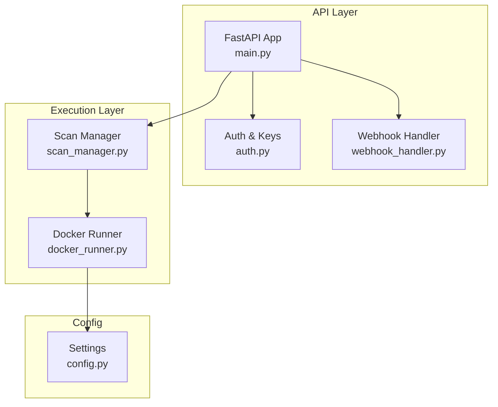
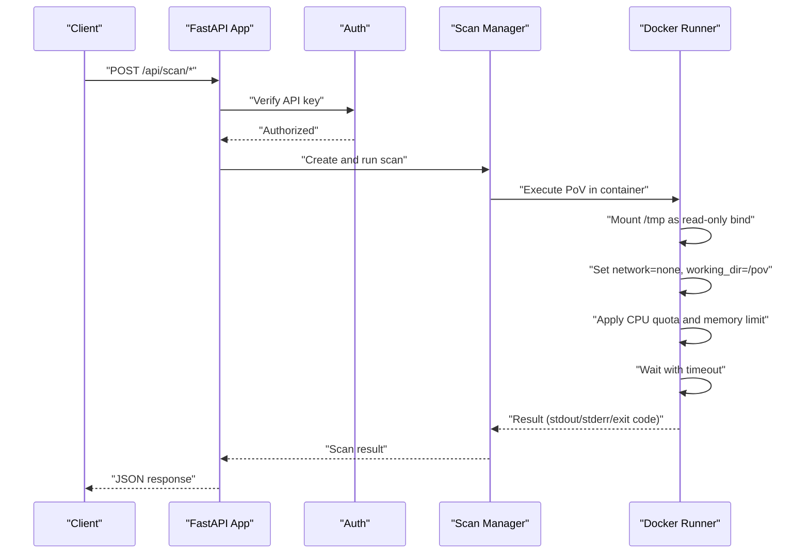
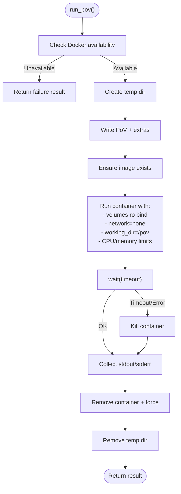
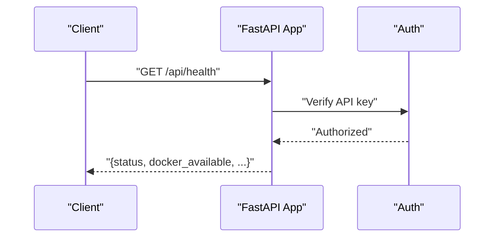
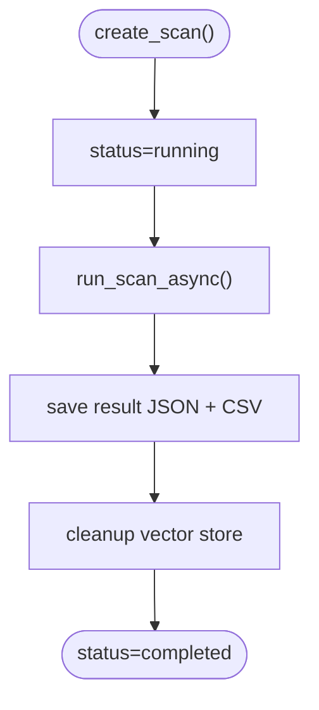
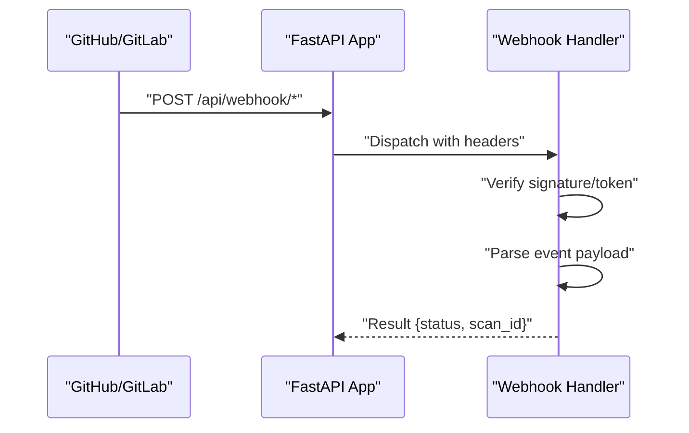
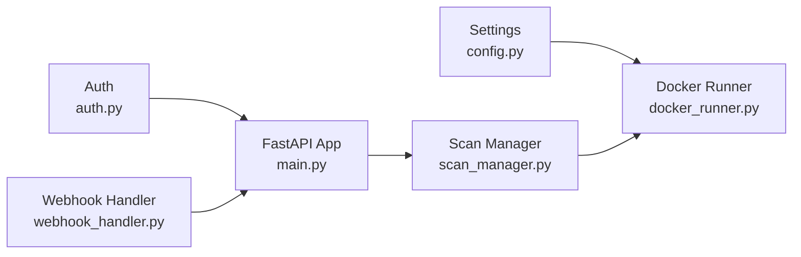

# Docker Container Security

<cite>
**Referenced Files in This Document**
- [docker_runner.py](file://autopov/agents/docker_runner.py)
- [config.py](file://autopov/app/config.py)
- [main.py](file://autopov/app/main.py)
- [scan_manager.py](file://autopov/app/scan_manager.py)
- [run.sh](file://autopov/run.sh)
- [auth.py](file://autopov/app/auth.py)
- [webhook_handler.py](file://autopov/app/webhook_handler.py)
- [verifier.py](file://autopov/agents/verifier.py)
- [investigator.py](file://autopov/agents/investigator.py)
</cite>

## Table of Contents
1. [Introduction](#introduction)
2. [Project Structure](#project-structure)
3. [Core Components](#core-components)
4. [Architecture Overview](#architecture-overview)
5. [Detailed Component Analysis](#detailed-component-analysis)
6. [Dependency Analysis](#dependency-analysis)
7. [Performance Considerations](#performance-considerations)
8. [Troubleshooting Guide](#troubleshooting-guide)
9. [Conclusion](#conclusion)
10. [Appendices](#appendices)

## Introduction
This document explains AutoPoV’s Docker container security implementation for isolating and securing vulnerability execution environments. It covers isolation mechanisms (network, volumes, working directory), resource limiting (CPU, memory, timeouts), lifecycle management (creation, execution, cleanup, error handling), best practices for container images and privilege control, and operational guidance for monitoring, logging, and compliance in production.

## Project Structure
AutoPoV orchestrates vulnerability scanning and PoV execution through a FastAPI service. The Docker runtime is encapsulated in a dedicated runner that creates isolated containers per PoV execution. Configuration is centralized via environment-driven settings, and the API enforces authentication and rate-limiting-friendly usage patterns.

**Diagram sources**
- [main.py](file://autopov/app/main.py#L102-L117)
- [auth.py](file://autopov/app/auth.py#L137-L167)
- [webhook_handler.py](file://autopov/app/webhook_handler.py#L15-L362)
- [scan_manager.py](file://autopov/app/scan_manager.py#L40-L200)
- [docker_runner.py](file://autopov/agents/docker_runner.py#L27-L192)
- [config.py](file://autopov/app/config.py#L78-L84)

**Section sources**
- [main.py](file://autopov/app/main.py#L102-L117)
- [config.py](file://autopov/app/config.py#L78-L84)

## Core Components
- Docker Runner: Creates and manages containers for PoV execution with strict isolation and resource limits.
- Configuration: Centralized environment-driven settings for Docker behavior and system capabilities.
- API and Auth: Enforce access control and expose endpoints that trigger scans and manage results.
- Scan Manager: Coordinates scan lifecycle and persists results for auditability.

Security-relevant highlights:
- Network isolation via Docker’s “none” network mode.
- Volume mounting with read-only bind mounts.
- Working directory restriction inside the container.
- CPU quota and memory limit enforcement.
- Execution timeout with controlled termination.
- Cleanup of temporary host artifacts and containers.

**Section sources**
- [docker_runner.py](file://autopov/agents/docker_runner.py#L27-L192)
- [config.py](file://autopov/app/config.py#L78-L84)
- [main.py](file://autopov/app/main.py#L161-L171)
- [scan_manager.py](file://autopov/app/scan_manager.py#L201-L235)

## Architecture Overview
The system integrates API requests, authentication, and scan orchestration with a Docker execution engine that enforces strong isolation and resource controls.

**Diagram sources**
- [main.py](file://autopov/app/main.py#L174-L216)
- [auth.py](file://autopov/app/auth.py#L137-L167)
- [scan_manager.py](file://autopov/app/scan_manager.py#L118-L175)
- [docker_runner.py](file://autopov/agents/docker_runner.py#L121-L150)

## Detailed Component Analysis

### Docker Runner: Isolation and Resource Controls
The Docker Runner encapsulates all container security and lifecycle logic. It:
- Ensures the target image exists (pulling if missing).
- Mounts a temporary host directory as a read-only bind mount under a fixed working directory.
- Disables networking via “none” network mode.
- Applies CPU quota and memory limits.
- Enforces a hard execution timeout with controlled termination.
- Captures logs and cleans up both container and host artifacts.

**Diagram sources**
- [docker_runner.py](file://autopov/agents/docker_runner.py#L62-L192)

Key security controls:
- Network isolation: network_mode='none'
- Filesystem isolation: read-only bind mount with working_dir='/pov'
- Resource caps: mem_limit and cpu_quota
- Time bounding: timeout-based container wait

Operational outcomes:
- Deterministic execution window with hard termination.
- Minimal host footprint after cleanup.
- Clear separation between host and container filesystems.

**Section sources**
- [docker_runner.py](file://autopov/agents/docker_runner.py#L121-L150)
- [docker_runner.py](file://autopov/agents/docker_runner.py#L188-L192)
- [config.py](file://autopov/app/config.py#L78-L84)

### Configuration: Environment-Driven Security Defaults
Security-related defaults are configured via environment variables and validated centrally:
- DOCKER_IMAGE: base image used for PoV execution.
- DOCKER_TIMEOUT: maximum seconds allowed for a single PoV run.
- DOCKER_MEMORY_LIMIT: memory cap for the container.
- DOCKER_CPU_LIMIT: fractional CPU allocation cap.
- DOCKER_ENABLED: toggles Docker availability checks.

These settings are consumed by the Docker Runner and exposed in health/status endpoints.

**Section sources**
- [config.py](file://autopov/app/config.py#L78-L84)
- [main.py](file://autopov/app/main.py#L161-L171)

### API and Authentication: Access Control and Audit
- API keys are required for most endpoints; admin-only endpoints require a separate admin key.
- Keys are stored hashed and validated at runtime.
- Health endpoint surfaces Docker availability for quick diagnostics.

**Diagram sources**
- [main.py](file://autopov/app/main.py#L161-L171)
- [auth.py](file://autopov/app/auth.py#L137-L167)

**Section sources**
- [auth.py](file://autopov/app/auth.py#L137-L167)
- [main.py](file://autopov/app/main.py#L161-L171)

### Scan Manager: Lifecycle and Persistence
The Scan Manager coordinates scan creation, execution, persistence, and cleanup:
- Creates scan records with metadata and logs.
- Persists results to JSON and CSV for historical auditing.
- Cleans up vector store artifacts and scan state.

**Diagram sources**
- [scan_manager.py](file://autopov/app/scan_manager.py#L50-L175)
- [scan_manager.py](file://autopov/app/scan_manager.py#L201-L235)

**Section sources**
- [scan_manager.py](file://autopov/app/scan_manager.py#L50-L175)
- [scan_manager.py](file://autopov/app/scan_manager.py#L201-L235)

### Webhook Handler: Secure Event Ingestion
The webhook handler verifies signatures/tokens and parses provider-specific payloads. It triggers scans only when appropriate events occur, reducing unnecessary executions.

**Diagram sources**
- [webhook_handler.py](file://autopov/app/webhook_handler.py#L196-L265)
- [webhook_handler.py](file://autopov/app/webhook_handler.py#L267-L336)

**Section sources**
- [webhook_handler.py](file://autopov/app/webhook_handler.py#L196-L265)
- [webhook_handler.py](file://autopov/app/webhook_handler.py#L267-L336)

### PoV Generation and Validation: Input Sanitization Signals
While PoVs are executed in containers, the generator and validator apply static checks and LLM-based validation to reduce risk and improve quality:
- AST-based syntax validation.
- Standard library-only import enforcement.
- CWE-specific heuristics.
- LLM-based validation and suggestions.

These steps reduce the likelihood of unsafe or ineffective PoVs reaching the container runtime.

**Section sources**
- [verifier.py](file://autopov/agents/verifier.py#L177-L227)
- [verifier.py](file://autopov/agents/verifier.py#L265-L291)

## Dependency Analysis
The Docker Runner depends on configuration settings and the Docker SDK. The API depends on authentication and scan orchestration. Webhooks depend on provider-specific secrets and event parsing.

**Diagram sources**
- [config.py](file://autopov/app/config.py#L78-L84)
- [docker_runner.py](file://autopov/agents/docker_runner.py#L27-L50)
- [auth.py](file://autopov/app/auth.py#L137-L167)
- [webhook_handler.py](file://autopov/app/webhook_handler.py#L15-L362)
- [main.py](file://autopov/app/main.py#L102-L117)
- [scan_manager.py](file://autopov/app/scan_manager.py#L40-L175)

**Section sources**
- [docker_runner.py](file://autopov/agents/docker_runner.py#L27-L50)
- [config.py](file://autopov/app/config.py#L78-L84)
- [main.py](file://autopov/app/main.py#L102-L117)
- [auth.py](file://autopov/app/auth.py#L137-L167)
- [webhook_handler.py](file://autopov/app/webhook_handler.py#L15-L362)
- [scan_manager.py](file://autopov/app/scan_manager.py#L40-L175)

## Performance Considerations
- CPU quota: Set via fractional CPU units; tune based on workload characteristics.
- Memory limit: Prevents memory exhaustion; monitor for frequent OOM conditions.
- Timeout: Balances safety vs. long-running PoVs; adjust per expected execution time.
- Image caching: Reuse base images to minimize pull latency.
- Concurrency: Limit simultaneous PoV runs to avoid resource contention.

[No sources needed since this section provides general guidance]

## Troubleshooting Guide
Common issues and resolutions:
- Docker not available:
  - Verify Docker daemon and client connectivity.
  - Check DOCKER_ENABLED and health endpoint.
- Container fails to start:
  - Inspect returned stderr and exit code.
  - Confirm image pull succeeded and working_dir matches mounted path.
- Execution exceeds timeout:
  - Increase DOCKER_TIMEOUT or optimize PoV logic.
  - Review CPU quota and memory limit settings.
- Network-dependent failures:
  - Containers run with network=None by design; PoVs must be self-contained.
- Resource exhaustion:
  - Adjust DOCKER_MEMORY_LIMIT and DOCKER_CPU_LIMIT.
- Logs not captured:
  - Ensure container writes to stdout/stderr and that logs are collected post-execution.

Operational checks:
- Health endpoint indicates Docker availability.
- Scan Manager persists results for later inspection.
- Webhook verification ensures only trusted events trigger scans.

**Section sources**
- [docker_runner.py](file://autopov/agents/docker_runner.py#L168-L187)
- [docker_runner.py](file://autopov/agents/docker_runner.py#L135-L143)
- [main.py](file://autopov/app/main.py#L161-L171)
- [scan_manager.py](file://autopov/app/scan_manager.py#L201-L235)
- [webhook_handler.py](file://autopov/app/webhook_handler.py#L213-L242)

## Conclusion
AutoPoV’s Docker container security model centers on strong isolation (no network, read-only mounts, restricted working directory), bounded resource usage (CPU quota, memory limit, timeout), and robust lifecycle management (creation, execution, cleanup, error handling). Combined with API authentication, webhook verification, and pre-execution validation, this approach minimizes risk while enabling reliable, auditable vulnerability execution.

[No sources needed since this section summarizes without analyzing specific files]

## Appendices

### Practical Security Configuration Examples
- Network isolation: Use network_mode='none'.
- Volume mounting: Bind host temp dir as read-only under '/pov'.
- Working directory: Restrict execution to '/pov'.
- CPU quota: Set via cpu_quota proportional to desired fraction.
- Memory limit: Set via mem_limit string (e.g., "512m").
- Timeout: Configure via DOCKER_TIMEOUT.

**Section sources**
- [docker_runner.py](file://autopov/agents/docker_runner.py#L121-L133)
- [config.py](file://autopov/app/config.py#L78-L84)

### Monitoring, Logging, and Compliance
- Monitoring:
  - Use Docker stats via the runner’s stats endpoint.
  - Track scan metrics and history via the metrics endpoint.
- Logging:
  - Capture stdout/stderr from containers.
  - Persist results to JSON/CSV for audit trails.
- Compliance:
  - Enforce API key policies and admin-only endpoints.
  - Restrict webhook secrets and verify signatures/tokens.
  - Keep base images current and scan for vulnerabilities periodically.

**Section sources**
- [docker_runner.py](file://autopov/agents/docker_runner.py#L346-L370)
- [scan_manager.py](file://autopov/app/scan_manager.py#L304-L334)
- [auth.py](file://autopov/app/auth.py#L137-L167)
- [webhook_handler.py](file://autopov/app/webhook_handler.py#L213-L242)