# Input Validation and Sanitization

<cite>
**Referenced Files in This Document**
- [main.py](file://autopov/app/main.py)
- [source_handler.py](file://autopov/app/source_handler.py)
- [git_handler.py](file://autopov/app/git_handler.py)
- [ingest_codebase.py](file://autopov/agents/ingest_codebase.py)
- [config.py](file://autopov/app/config.py)
- [auth.py](file://autopov/app/auth.py)
- [webhook_handler.py](file://autopov/app/webhook_handler.py)
- [scan_manager.py](file://autopov/app/scan_manager.py)
- [verifier.py](file://autopov/agents/verifier.py)
- [SqlInjection.ql](file://autopov/codeql_queries/SqlInjection.ql)
- [BufferOverflow.ql](file://autopov/codeql_queries/BufferOverflow.ql)
- [IntegerOverflow.ql](file://autopov/codeql_queries/IntegerOverflow.ql)
- [UseAfterFree.ql](file://autopov/codeql_queries/UseAfterFree.ql)
- [test_source_handler.py](file://autopov/tests/test_source_handler.py)
- [test_git_handler.py](file://autopov/tests/test_git_handler.py)
</cite>

## Table of Contents
1. [Introduction](#introduction)
2. [Project Structure](#project-structure)
3. [Core Components](#core-components)
4. [Architecture Overview](#architecture-overview)
5. [Detailed Component Analysis](#detailed-component-analysis)
6. [Dependency Analysis](#dependency-analysis)
7. [Performance Considerations](#performance-considerations)
8. [Troubleshooting Guide](#troubleshooting-guide)
9. [Conclusion](#conclusion)

## Introduction
This document focuses on AutoPoV’s input validation and sanitization processes designed to prevent security vulnerabilities when handling untrusted code ingestion and user input. It covers validation strategies for Git repositories, ZIP/TAR archives, and direct code paste, along with sanitization techniques to mitigate path traversal, malicious code injection, and unsafe file handling. It also documents file-type validation, binary detection, and integration points for static analysis and threat scanning.

## Project Structure
AutoPoV exposes REST endpoints for initiating scans from multiple input sources. The application delegates ingestion and validation to dedicated handlers and agents, while enforcing authentication and secure temporary storage.

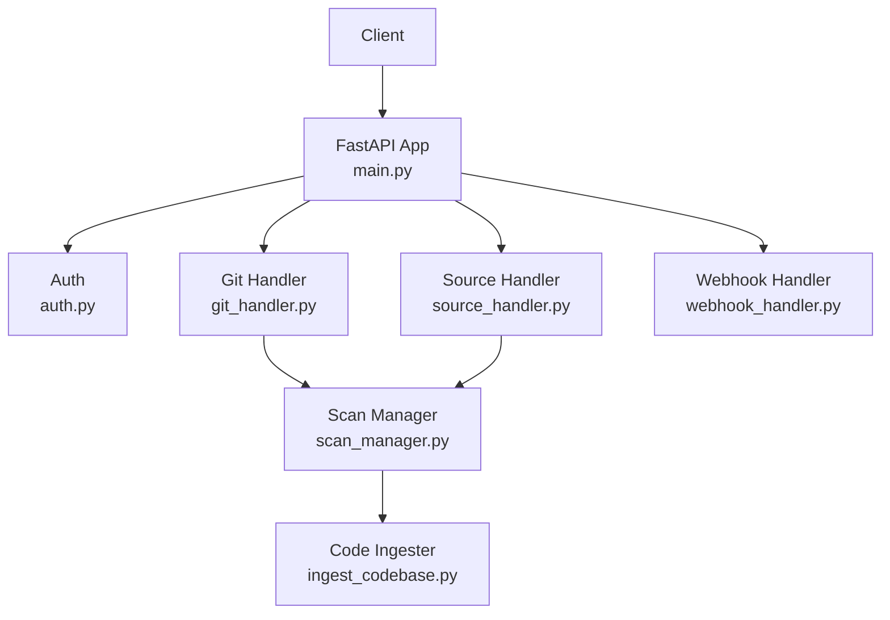

**Diagram sources**
- [main.py](file://autopov/app/main.py#L177-L316)
- [git_handler.py](file://autopov/app/git_handler.py#L60-L124)
- [source_handler.py](file://autopov/app/source_handler.py#L31-L124)
- [scan_manager.py](file://autopov/app/scan_manager.py#L86-L175)
- [ingest_codebase.py](file://autopov/agents/ingest_codebase.py#L201-L307)
- [webhook_handler.py](file://autopov/app/webhook_handler.py#L196-L336)

**Section sources**
- [main.py](file://autopov/app/main.py#L102-L121)
- [config.py](file://autopov/app/config.py#L102-L107)

## Core Components
- Input sources and ingestion:
  - Git repositories: validated provider detection, credential injection, and path-safe cloning.
  - ZIP/TAR archives: path-traversal checks, extraction safeguards, and single-root directory normalization.
  - Raw code paste: language-aware filename assignment and UTF-8 writing.
- Validation and sanitization:
  - Path traversal protection via absolute path checks against extraction roots.
  - Binary file detection to avoid unsafe processing.
  - API key authentication and bearer token verification.
  - Webhook signature/token verification for trusted triggers.
- Static analysis integration:
  - Code ingestion supports language detection and chunking for downstream analysis.
  - CodeQL queries for SQL injection, buffer overflow, integer overflow, and use-after-free.

**Section sources**
- [git_handler.py](file://autopov/app/git_handler.py#L43-L58)
- [git_handler.py](file://autopov/app/git_handler.py#L104-L123)
- [source_handler.py](file://autopov/app/source_handler.py#L56-L63)
- [source_handler.py](file://autopov/app/source_handler.py#L115-L122)
- [source_handler.py](file://autopov/app/source_handler.py#L226-L228)
- [auth.py](file://autopov/app/auth.py#L137-L148)
- [webhook_handler.py](file://autopov/app/webhook_handler.py#L25-L55)
- [webhook_handler.py](file://autopov/app/webhook_handler.py#L57-L73)
- [ingest_codebase.py](file://autopov/agents/ingest_codebase.py#L122-L139)
- [SqlInjection.ql](file://autopov/codeql_queries/SqlInjection.ql#L17-L61)
- [BufferOverflow.ql](file://autopov/codeql_queries/BufferOverflow.ql#L16-L53)
- [IntegerOverflow.ql](file://autopov/codeql_queries/IntegerOverflow.ql#L18-L55)
- [UseAfterFree.ql](file://autopov/codeql_queries/UseAfterFree.ql#L19-L34)

## Architecture Overview
The input validation and sanitization pipeline ensures that untrusted inputs are handled safely before code scanning and analysis.

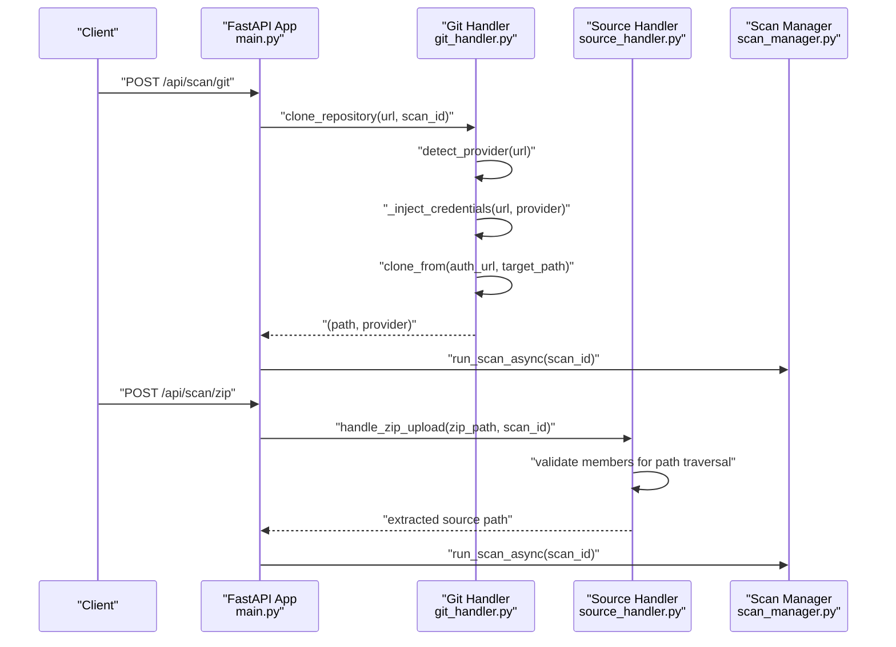

**Diagram sources**
- [main.py](file://autopov/app/main.py#L177-L219)
- [main.py](file://autopov/app/main.py#L222-L271)
- [git_handler.py](file://autopov/app/git_handler.py#L60-L124)
- [source_handler.py](file://autopov/app/source_handler.py#L31-L78)
- [scan_manager.py](file://autopov/app/scan_manager.py#L86-L116)

## Detailed Component Analysis

### Git Repository Input Validation and Sanitization
- Provider detection and credential injection:
  - Detects GitHub, GitLab, or Bitbucket and injects tokens into HTTPS URLs to enable authenticated cloning.
- Path safety:
  - Sanitizes scan identifiers to be filesystem-safe and constructs a safe target directory under the configured temporary directory.
- Extraction and cleanup:
  - Clones with optional branch/commit and removes the .git directory to reduce risk and footprint.
- Error handling:
  - Cleans up partial clones on failures.

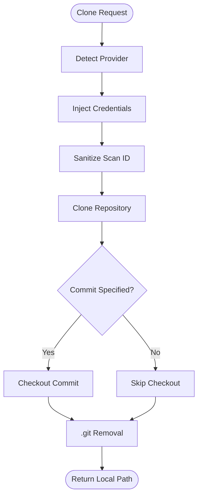

**Diagram sources**
- [git_handler.py](file://autopov/app/git_handler.py#L43-L58)
- [git_handler.py](file://autopov/app/git_handler.py#L84-L117)

**Section sources**
- [git_handler.py](file://autopov/app/git_handler.py#L43-L58)
- [git_handler.py](file://autopov/app/git_handler.py#L56-L58)
- [git_handler.py](file://autopov/app/git_handler.py#L84-L117)

### ZIP Archive Input Validation and Sanitization
- Path traversal protection:
  - Iterates archive members and verifies each path remains within the intended extraction root using absolute path checks.
- Extraction safeguards:
  - Creates a fresh “source” directory per scan and normalizes single-root archives by moving contents up.
- File handling:
  - Writes extracted files to UTF-8 to avoid encoding issues.

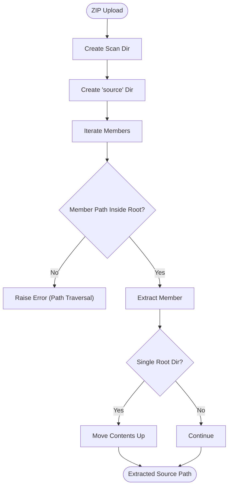

**Diagram sources**
- [source_handler.py](file://autopov/app/source_handler.py#L31-L78)

**Section sources**
- [source_handler.py](file://autopov/app/source_handler.py#L56-L63)
- [source_handler.py](file://autopov/app/source_handler.py#L65-L76)
- [source_handler.py](file://autopov/app/source_handler.py#L226-L228)

### TAR Archive Input Validation and Sanitization
- Similar to ZIP, with support for gzip, bz2, and xz compression.
- Validates each member’s path against the extraction root to prevent path traversal.

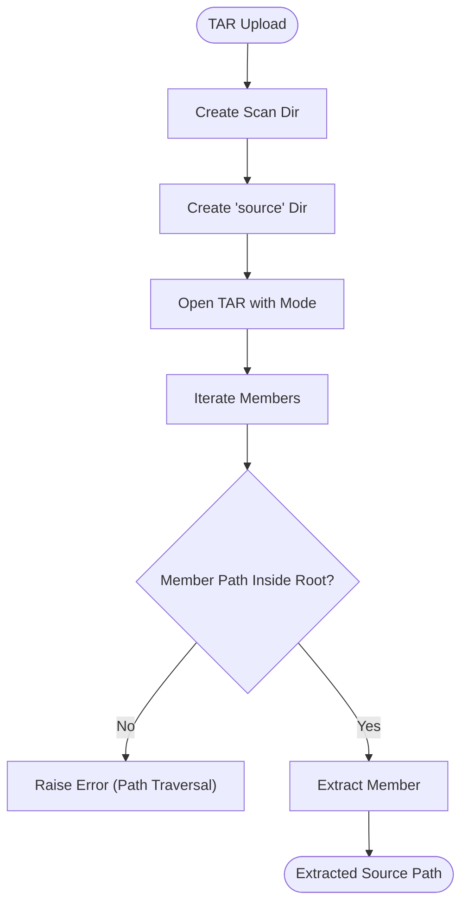

**Diagram sources**
- [source_handler.py](file://autopov/app/source_handler.py#L80-L124)

**Section sources**
- [source_handler.py](file://autopov/app/source_handler.py#L115-L122)

### Raw Code Paste Input Validation and Sanitization
- Filename assignment:
  - Derives extension from language mapping if not provided.
- Safe writing:
  - Writes code to UTF-8-encoded files under a dedicated “source” directory.
- Directory normalization:
  - Ensures a single “source” directory exists per scan.

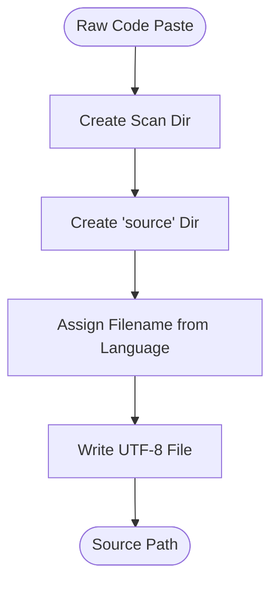

**Diagram sources**
- [source_handler.py](file://autopov/app/source_handler.py#L191-L230)

**Section sources**
- [source_handler.py](file://autopov/app/source_handler.py#L232-L265)
- [source_handler.py](file://autopov/app/source_handler.py#L226-L228)

### Authentication and Authorization
- API key verification:
  - Enforces Bearer token authentication for protected endpoints.
  - Validates admin-only endpoints with a separate admin key.
- Secure storage:
  - API keys are hashed using SHA-256 and stored with metadata.

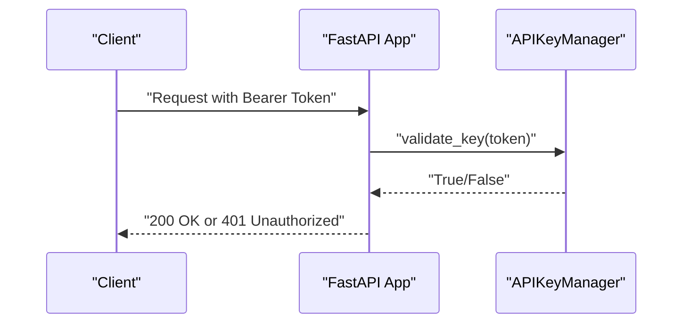

**Diagram sources**
- [auth.py](file://autopov/app/auth.py#L137-L148)
- [auth.py](file://autopov/app/auth.py#L81-L95)

**Section sources**
- [auth.py](file://autopov/app/auth.py#L137-L148)
- [auth.py](file://autopov/app/auth.py#L151-L162)

### Webhook Security
- GitHub signature verification:
  - HMAC-SHA256 verification using the configured secret.
- GitLab token verification:
  - HMAC constant-time comparison against the configured token.
- Event parsing:
  - Parses push and pull/merge request events and filters non-triggering events.

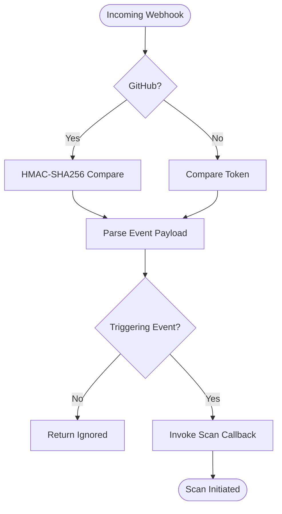

**Diagram sources**
- [webhook_handler.py](file://autopov/app/webhook_handler.py#L25-L55)
- [webhook_handler.py](file://autopov/app/webhook_handler.py#L57-L73)
- [webhook_handler.py](file://autopov/app/webhook_handler.py#L196-L265)
- [webhook_handler.py](file://autopov/app/webhook_handler.py#L267-L336)

**Section sources**
- [webhook_handler.py](file://autopov/app/webhook_handler.py#L25-L55)
- [webhook_handler.py](file://autopov/app/webhook_handler.py#L57-L73)
- [webhook_handler.py](file://autopov/app/webhook_handler.py#L196-L265)
- [webhook_handler.py](file://autopov/app/webhook_handler.py#L267-L336)

### Code Ingestion and Static Analysis Integration
- Code ingestion:
  - Skips non-code and binary files, reads UTF-8 content, chunks code for embeddings, and stores in ChromaDB.
- Language detection:
  - Maps file extensions to languages for metadata and chunking.
- Static analysis:
  - CodeQL queries detect SQL injection, buffer overflow, integer overflow, and use-after-free patterns.

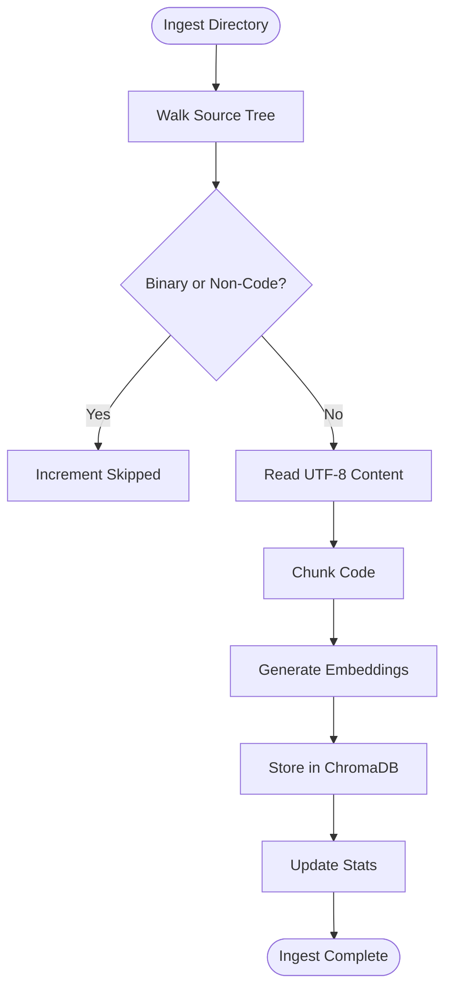

**Diagram sources**
- [ingest_codebase.py](file://autopov/agents/ingest_codebase.py#L201-L307)

**Section sources**
- [ingest_codebase.py](file://autopov/agents/ingest_codebase.py#L122-L139)
- [ingest_codebase.py](file://autopov/agents/ingest_codebase.py#L169-L199)
- [SqlInjection.ql](file://autopov/codeql_queries/SqlInjection.ql#L17-L61)
- [BufferOverflow.ql](file://autopov/codeql_queries/BufferOverflow.ql#L16-L53)
- [IntegerOverflow.ql](file://autopov/codeql_queries/IntegerOverflow.ql#L18-L55)
- [UseAfterFree.ql](file://autopov/codeql_queries/UseAfterFree.ql#L19-L34)

### PoV Script Validation and Malicious Code Mitigation
- AST-based syntax validation prevents malformed scripts.
- Enforces a required trigger message to confirm vulnerability demonstration.
- Restricts imports to Python standard library to minimize external risks.
- CWE-specific heuristics guide PoV quality.
- LLM-based validation augments automated checks.

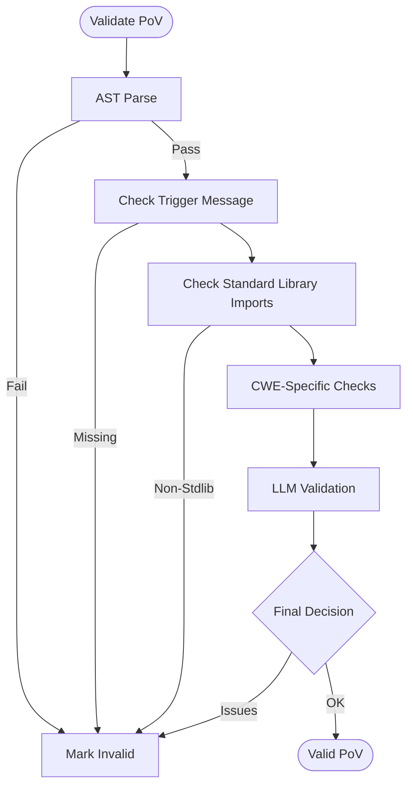

**Diagram sources**
- [verifier.py](file://autopov/agents/verifier.py#L151-L227)

**Section sources**
- [verifier.py](file://autopov/agents/verifier.py#L177-L227)

## Dependency Analysis
- Input endpoints depend on authentication and route to handlers:
  - Git scan endpoint → Git handler → Scan manager.
  - ZIP upload endpoint → Source handler → Scan manager.
  - Raw code paste endpoint → Source handler → Scan manager.
- Webhooks depend on signature/token verification and scan callback registration.
- Code ingestion depends on configuration for chunk sizes and embedding models.

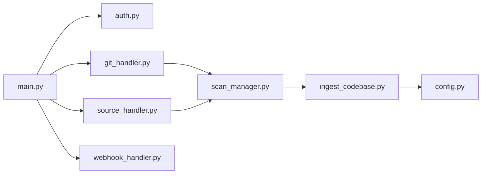

**Diagram sources**
- [main.py](file://autopov/app/main.py#L177-L316)
- [git_handler.py](file://autopov/app/git_handler.py#L60-L124)
- [source_handler.py](file://autopov/app/source_handler.py#L31-L78)
- [webhook_handler.py](file://autopov/app/webhook_handler.py#L196-L336)
- [scan_manager.py](file://autopov/app/scan_manager.py#L86-L175)
- [ingest_codebase.py](file://autopov/agents/ingest_codebase.py#L44-L58)
- [config.py](file://autopov/app/config.py#L89-L93)

**Section sources**
- [main.py](file://autopov/app/main.py#L177-L316)
- [config.py](file://autopov/app/config.py#L89-L93)

## Performance Considerations
- Temporary directory management:
  - Handlers create per-scan directories under a configured temporary path to isolate workspaces.
- Batched embedding insertion:
  - Code ingestion writes embeddings in batches to ChromaDB to balance memory and throughput.
- Binary and non-code filtering:
  - Reduces unnecessary processing and improves ingestion performance.
- Concurrency:
  - Scans run in a thread pool executor to keep the API responsive.

[No sources needed since this section provides general guidance]

## Troubleshooting Guide
- Path traversal detected in archive:
  - Occurs when archive members escape the extraction root; verify archive integrity and sanitize inputs.
- Invalid webhook signature/token:
  - Ensure secrets match and signatures are computed with the correct algorithm.
- API key invalid/expired:
  - Regenerate API keys and ensure Bearer token format.
- Scan fails with missing tools:
  - Verify Docker, CodeQL, and Joern availability as indicated by health checks.

**Section sources**
- [source_handler.py](file://autopov/app/source_handler.py#L56-L63)
- [webhook_handler.py](file://autopov/app/webhook_handler.py#L213-L218)
- [auth.py](file://autopov/app/auth.py#L141-L146)
- [main.py](file://autopov/app/main.py#L165-L174)

## Conclusion
AutoPoV implements robust input validation and sanitization across Git repositories, ZIP/TAR archives, and raw code paste. Path traversal protections, binary detection, API key enforcement, and webhook verification collectively reduce the risk of malicious code injection and unsafe file handling. Integration with code ingestion and static analysis further strengthens vulnerability detection. Adhering to the recommended practices and configurations outlined here will help maintain a secure and reliable code ingestion pipeline in production environments.