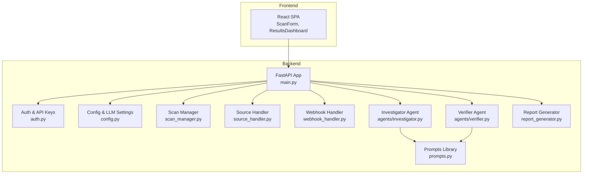
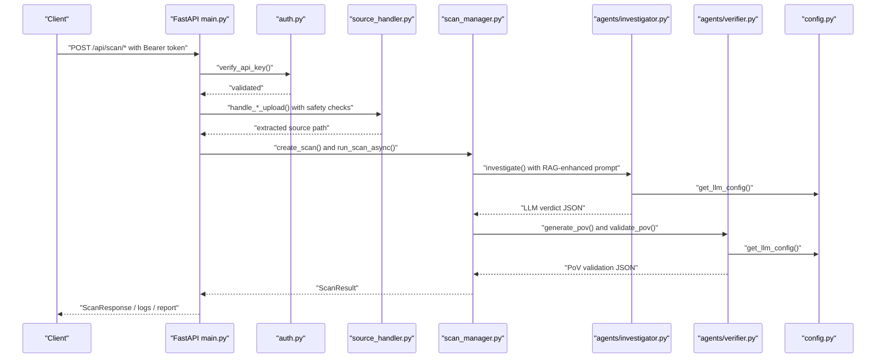
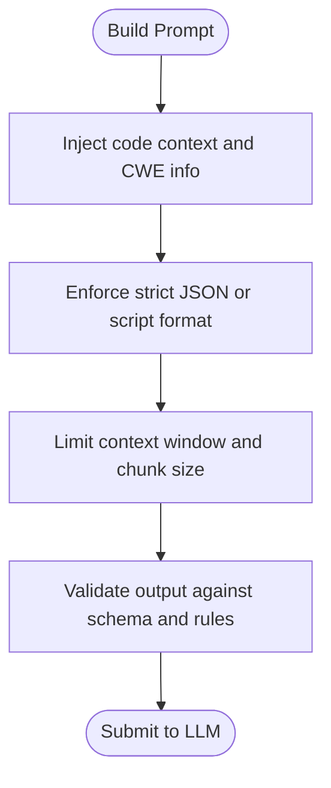
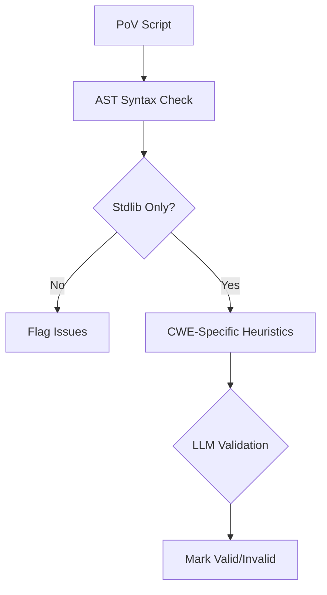
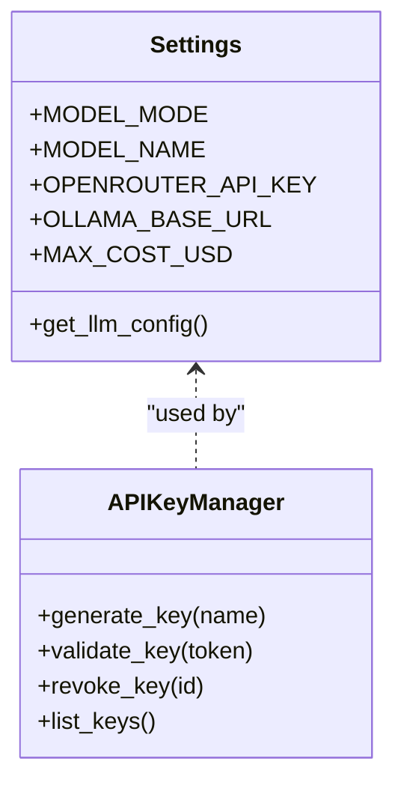
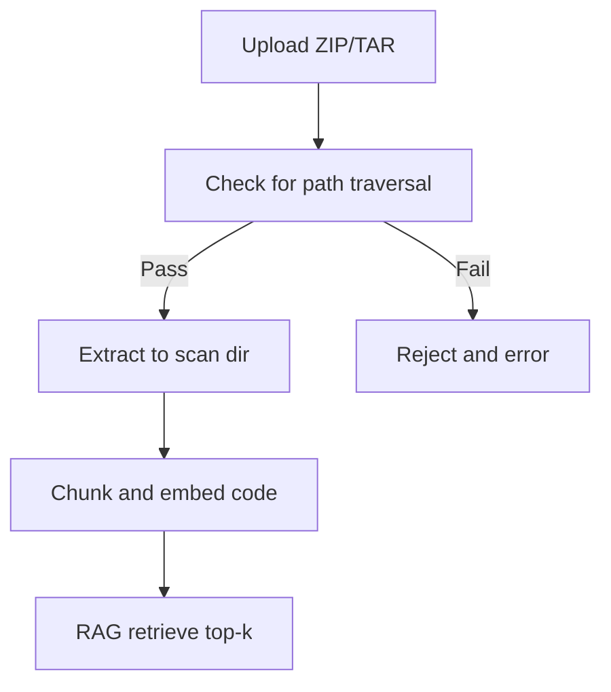
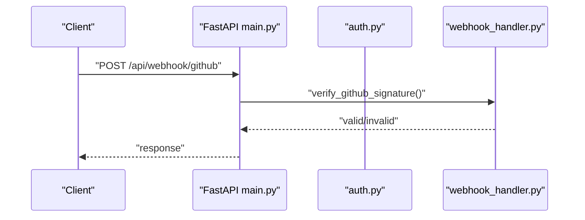
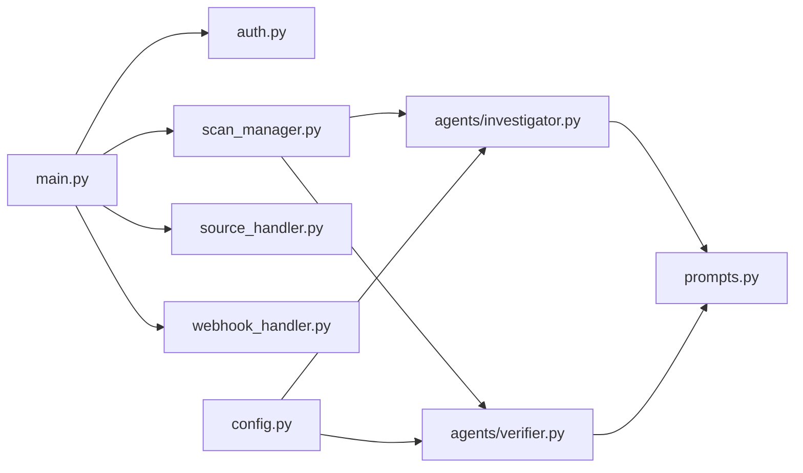

# LLM Security and Prompt Protection

<cite>
**Referenced Files in This Document**
- [prompts.py](file://autopov/prompts.py)
- [config.py](file://autopov/app/config.py)
- [auth.py](file://autopov/app/auth.py)
- [main.py](file://autopov/app/main.py)
- [investigator.py](file://autopov/agents/investigator.py)
- [verifier.py](file://autopov/agents/verifier.py)
- [source_handler.py](file://autopov/app/source_handler.py)
- [scan_manager.py](file://autopov/app/scan_manager.py)
- [report_generator.py](file://autopov/app/report_generator.py)
- [webhook_handler.py](file://autopov/app/webhook_handler.py)
- [analyse.py](file://autopov/analyse.py)
- [SqlInjection.ql](file://autopov/codeql_queries/SqlInjection.ql)
- [BufferOverflow.ql](file://autopov/codeql_queries/BufferOverflow.ql)
</cite>

## Table of Contents
1. [Introduction](#introduction)
2. [Project Structure](#project-structure)
3. [Core Components](#core-components)
4. [Architecture Overview](#architecture-overview)
5. [Detailed Component Analysis](#detailed-component-analysis)
6. [Dependency Analysis](#dependency-analysis)
7. [Performance Considerations](#performance-considerations)
8. [Troubleshooting Guide](#troubleshooting-guide)
9. [Conclusion](#conclusion)
10. [Appendices](#appendices)

## Introduction
This document provides comprehensive guidance for AutoPoV’s Large Language Model (LLM) security measures with a focus on protecting against prompt injection attacks and ensuring responsible AI usage. It documents secure prompt engineering practices, guardrails, and operational safeguards for LLM interactions, including input sanitization, context limiting, instruction-following enforcement, rate limiting, input length restrictions, output filtering, credential management, and monitoring for suspicious behavior. Practical examples and threat modeling are included to help operators deploy AutoPoV securely and compliantly.

## Project Structure
AutoPoV integrates LLMs into a vulnerability discovery pipeline that combines static analysis (CodeQL, Joern) with LLM-based investigation and Proof-of-Vulnerability (PoV) generation. The backend is a FastAPI application that orchestrates scanning, enforces authentication, and manages LLM configuration. Prompts are centralized for reproducibility and security hardening.

**Diagram sources**
- [main.py](file://autopov/app/main.py#L102-L121)
- [auth.py](file://autopov/app/auth.py#L19-L175)
- [config.py](file://autopov/app/config.py#L13-L209)
- [scan_manager.py](file://autopov/app/scan_manager.py#L40-L343)
- [source_handler.py](file://autopov/app/source_handler.py#L18-L379)
- [webhook_handler.py](file://autopov/app/webhook_handler.py#L15-L362)
- [investigator.py](file://autopov/agents/investigator.py#L37-L412)
- [verifier.py](file://autopov/agents/verifier.py#L40-L400)
- [report_generator.py](file://autopov/app/report_generator.py#L68-L358)
- [prompts.py](file://autopov/prompts.py#L7-L374)

**Section sources**
- [main.py](file://autopov/app/main.py#L102-L121)
- [config.py](file://autopov/app/config.py#L13-L209)

## Core Components
- Centralized prompts with strict JSON schemas and explicit instructions reduce ambiguity and guard against prompt injection.
- LLM configuration supports online (OpenRouter) and offline (Ollama) modes with API key management and embedding model selection.
- Authentication via bearer tokens and admin-only endpoints prevents unauthorized access.
- Source ingestion validates archives and rejects path traversal attempts.
- Investigator and Verifier agents enforce output validation and CWE-specific checks.
- Cost tracking and resource limits mitigate abuse.

**Section sources**
- [prompts.py](file://autopov/prompts.py#L7-L374)
- [config.py](file://autopov/app/config.py#L30-L88)
- [auth.py](file://autopov/app/auth.py#L137-L170)
- [source_handler.py](file://autopov/app/source_handler.py#L55-L123)
- [investigator.py](file://autopov/agents/investigator.py#L254-L365)
- [verifier.py](file://autopov/agents/verifier.py#L151-L227)

## Architecture Overview
The system enforces security at multiple layers: input ingestion, prompt construction, LLM invocation, output validation, and access control.

**Diagram sources**
- [main.py](file://autopov/app/main.py#L177-L316)
- [auth.py](file://autopov/app/auth.py#L137-L170)
- [source_handler.py](file://autopov/app/source_handler.py#L31-L78)
- [scan_manager.py](file://autopov/app/scan_manager.py#L86-L175)
- [investigator.py](file://autopov/agents/investigator.py#L254-L365)
- [verifier.py](file://autopov/agents/verifier.py#L79-L149)
- [config.py](file://autopov/app/config.py#L173-L189)

## Detailed Component Analysis

### Secure Prompt Engineering Practices
- Explicit JSON schemas and strict formatting reduce model hallucinations and injection risks.
- Instruction-following enforcement via explicit “Respond in JSON” and “Respond with ONLY the script” directives.
- Context limiting through chunk sizes and RAG retrieval with top-k constraints.
- Guardrails via CWE-specific checks and validation rules.

**Diagram sources**
- [prompts.py](file://autopov/prompts.py#L24-L43)
- [prompts.py](file://autopov/prompts.py#L46-L78)
- [prompts.py](file://autopov/prompts.py#L81-L108)
- [investigator.py](file://autopov/agents/investigator.py#L295-L303)
- [verifier.py](file://autopov/agents/verifier.py#L105-L130)

**Section sources**
- [prompts.py](file://autopov/prompts.py#L24-L43)
- [prompts.py](file://autopov/prompts.py#L46-L78)
- [prompts.py](file://autopov/prompts.py#L81-L108)
- [investigator.py](file://autopov/agents/investigator.py#L295-L303)
- [verifier.py](file://autopov/agents/verifier.py#L105-L130)

### Guardrail Implementation
- JSON schema enforcement ensures structured outputs and reduces uncontrolled text generation.
- CWE-specific validators and AST-based checks prevent unsafe PoV scripts.
- LLM-based validation complements static checks for nuanced reasoning.

**Diagram sources**
- [verifier.py](file://autopov/agents/verifier.py#L177-L227)
- [verifier.py](file://autopov/agents/verifier.py#L265-L291)
- [verifier.py](file://autopov/agents/verifier.py#L293-L330)

**Section sources**
- [verifier.py](file://autopov/agents/verifier.py#L177-L227)
- [verifier.py](file://autopov/agents/verifier.py#L265-L291)
- [verifier.py](file://autopov/agents/verifier.py#L293-L330)

### LLM Interaction Security Measures
- API key enforcement for LLM endpoints and admin-only operations.
- Mode-aware LLM configuration with base URLs and model selection.
- Cost tracking and configurable maximum cost to cap spending.
- Temperature tuning for deterministic outputs during validation.

**Diagram sources**
- [config.py](file://autopov/app/config.py#L13-L209)
- [auth.py](file://autopov/app/auth.py#L32-L131)

**Section sources**
- [config.py](file://autopov/app/config.py#L30-L88)
- [config.py](file://autopov/app/config.py#L173-L189)
- [auth.py](file://autopov/app/auth.py#L137-L170)

### Input Sanitization and Context Limiting
- ZIP/TAR extraction includes path traversal checks.
- Code context retrieval uses top-k RAG and bounded line windows.
- Static analysis (CodeQL) provides sanitization and mitigation signals.

**Diagram sources**
- [source_handler.py](file://autopov/app/source_handler.py#L55-L123)
- [investigator.py](file://autopov/agents/investigator.py#L242-L252)
- [BufferOverflow.ql](file://autopov/codeql_queries/BufferOverflow.ql#L46-L52)
- [SqlInjection.ql](file://autopov/codeql_queries/SqlInjection.ql#L54-L60)

**Section sources**
- [source_handler.py](file://autopov/app/source_handler.py#L55-L123)
- [investigator.py](file://autopov/agents/investigator.py#L242-L252)
- [BufferOverflow.ql](file://autopov/codeql_queries/BufferOverflow.ql#L46-L52)
- [SqlInjection.ql](file://autopov/codeql_queries/SqlInjection.ql#L54-L60)

### Output Filtering and Post-Processing
- JSON extraction strips markdown code blocks.
- CWE-specific heuristics and LLM validation ensure PoV correctness.
- Reports exclude sensitive fields and summarize findings safely.

**Section sources**
- [investigator.py](file://autopov/agents/investigator.py#L317-L335)
- [verifier.py](file://autopov/agents/verifier.py#L125-L129)
- [verifier.py](file://autopov/agents/verifier.py#L316-L330)
- [report_generator.py](file://autopov/app/report_generator.py#L115-L118)

### Rate Limiting and Resource Controls
- Thread pool executor limits concurrent scans.
- Cost tracking and maximum cost thresholds.
- Docker execution environment isolates PoV execution.

**Section sources**
- [scan_manager.py](file://autopov/app/scan_manager.py#L46-L48)
- [config.py](file://autopov/app/config.py#L85-L87)
- [report_generator.py](file://autopov/app/report_generator.py#L272-L300)

### API Key Security and External Service Authentication
- Bearer token authentication with fallback to query param for streaming.
- Admin-only endpoints for key management.
- GitHub/GitLab webhook signatures validated with HMAC.

**Diagram sources**
- [main.py](file://autopov/app/main.py#L434-L453)
- [webhook_handler.py](file://autopov/app/webhook_handler.py#L25-L74)

**Section sources**
- [auth.py](file://autopov/app/auth.py#L137-L170)
- [webhook_handler.py](file://autopov/app/webhook_handler.py#L25-L74)

### Monitoring and Observability
- Health endpoint exposes availability of Docker, CodeQL, and Joern.
- Metrics endpoint aggregates scan statistics.
- Streaming logs via Server-Sent Events for live monitoring.

**Section sources**
- [main.py](file://autopov/app/main.py#L164-L174)
- [main.py](file://autopov/app/main.py#L513-L517)
- [main.py](file://autopov/app/main.py#L350-L385)

### Practical Examples of Secure Prompt Design
- Investigation prompt enforces JSON schema and includes explicit guidelines for CWE checks.
- PoV generation prompt restricts output to Python standard library and requires deterministic behavior.
- Retry analysis prompt asks the model to diagnose failures and propose fixes.

**Section sources**
- [prompts.py](file://autopov/prompts.py#L7-L43)
- [prompts.py](file://autopov/prompts.py#L46-L78)
- [prompts.py](file://autopov/prompts.py#L176-L209)

### Threat Modeling for AI Systems
- Prompt injection: Mitigated by strict formatting, JSON schema enforcement, and output parsing.
- Malicious inputs: Mitigated by path traversal checks, AST validation, and stdlib-only constraints.
- Excessive costs: Mitigated by cost tracking and maximum cost thresholds.
- Unauthorized access: Mitigated by bearer token auth and admin-only endpoints.

**Section sources**
- [prompts.py](file://autopov/prompts.py#L24-L43)
- [source_handler.py](file://autopov/app/source_handler.py#L55-L123)
- [verifier.py](file://autopov/agents/verifier.py#L177-L227)
- [config.py](file://autopov/app/config.py#L85-L87)
- [auth.py](file://autopov/app/auth.py#L137-L170)

### Privacy and Compliance Considerations
- API keys and secrets are managed via environment variables and hashed storage.
- Reports exclude raw code and sensitive fields; only summarized metrics are exposed.
- Docker isolation reduces risk of unintended code execution.

**Section sources**
- [config.py](file://autopov/app/config.py#L26-L58)
- [auth.py](file://autopov/app/auth.py#L59-L95)
- [report_generator.py](file://autopov/app/report_generator.py#L115-L118)
- [report_generator.py](file://autopov/app/report_generator.py#L272-L300)

## Dependency Analysis
The system exhibits low coupling between components, with clear separation of concerns:
- FastAPI routes depend on authentication and scan orchestration.
- Agents depend on prompts and configuration.
- Webhook handler depends on configuration for secrets.

**Diagram sources**
- [main.py](file://autopov/app/main.py#L19-L25)
- [investigator.py](file://autopov/agents/investigator.py#L27-L29)
- [verifier.py](file://autopov/agents/verifier.py#L27-L32)
- [config.py](file://autopov/app/config.py#L13-L209)

**Section sources**
- [main.py](file://autopov/app/main.py#L19-L25)
- [investigator.py](file://autopov/agents/investigator.py#L27-L29)
- [verifier.py](file://autopov/agents/verifier.py#L27-L32)
- [config.py](file://autopov/app/config.py#L13-L209)

## Performance Considerations
- Use offline models (Ollama) for reduced latency and cost when appropriate.
- Tune temperature for deterministic outputs during validation.
- Monitor Docker availability and adjust concurrency accordingly.
- Track and cap costs to avoid unexpected usage spikes.

[No sources needed since this section provides general guidance]

## Troubleshooting Guide
- Authentication failures: Verify bearer token and admin key configuration.
- LLM invocation errors: Confirm API keys and base URLs; check model availability.
- Webhook signature errors: Validate secrets and headers.
- PoV validation failures: Review CWE-specific heuristics and LLM feedback.

**Section sources**
- [auth.py](file://autopov/app/auth.py#L137-L170)
- [investigator.py](file://autopov/agents/investigator.py#L57-L87)
- [verifier.py](file://autopov/agents/verifier.py#L53-L77)
- [webhook_handler.py](file://autopov/app/webhook_handler.py#L25-L74)

## Conclusion
AutoPoV’s LLM security posture is built on layered protections: strict prompt engineering, robust input validation, output filtering, authentication, and cost/resource controls. By enforcing JSON schemas, limiting context, validating outputs, and securing credentials, the system minimizes prompt injection risks and promotes responsible AI usage. Operators should monitor logs, enforce admin-only key management, and align with organizational policies for privacy and compliance.

[No sources needed since this section summarizes without analyzing specific files]

## Appendices

### Best Practices Checklist
- Always enforce JSON schema and strip markdown blocks from LLM outputs.
- Limit context window and use top-k retrieval for RAG.
- Validate PoV scripts with AST and stdlib-only constraints.
- Use admin-only endpoints for key management.
- Monitor health and metrics endpoints regularly.
- Apply cost tracking and maximum cost thresholds.

[No sources needed since this section provides general guidance]