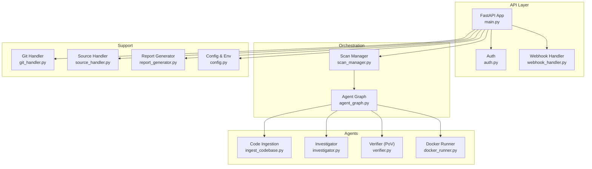
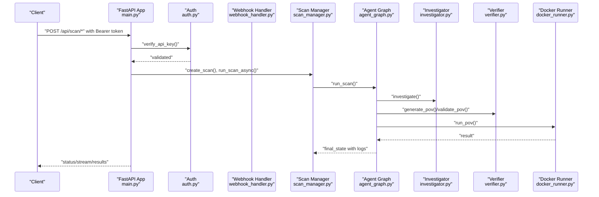
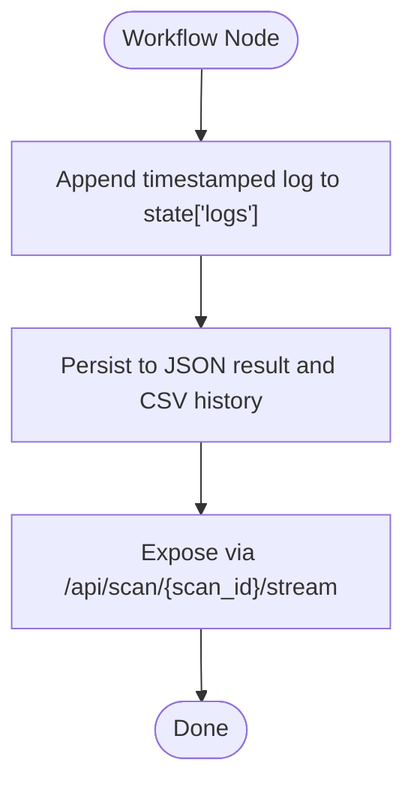
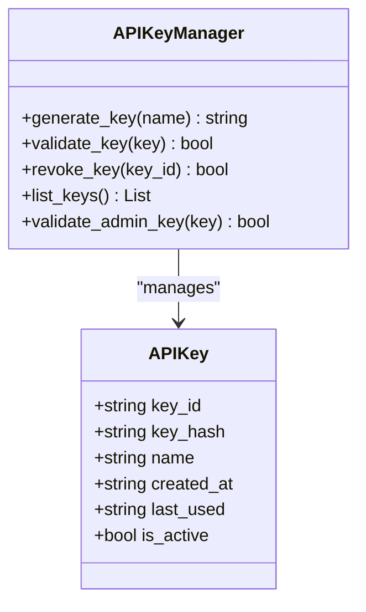
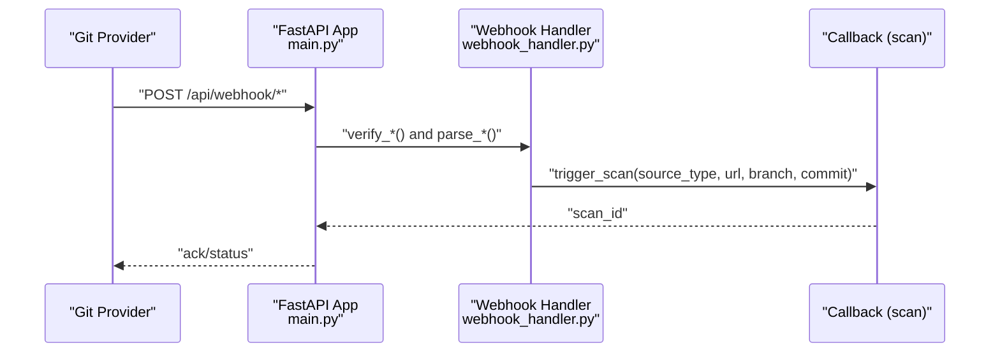
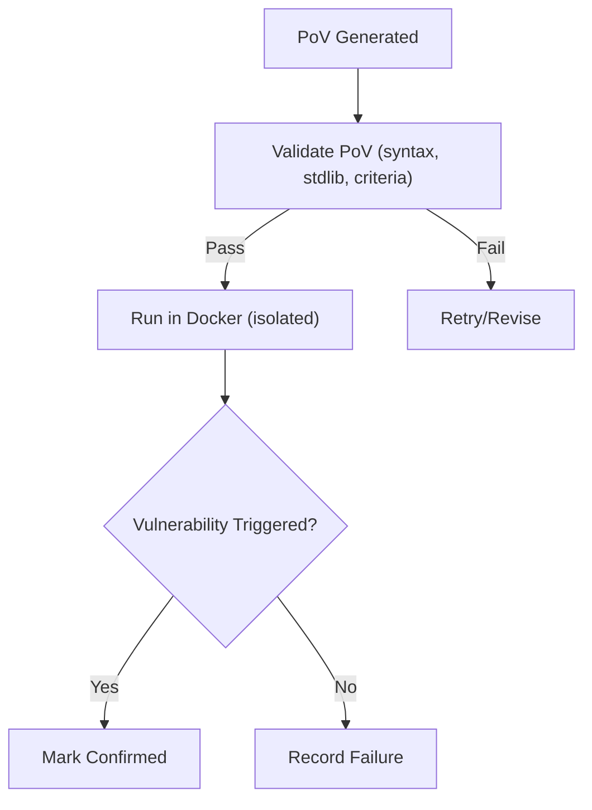
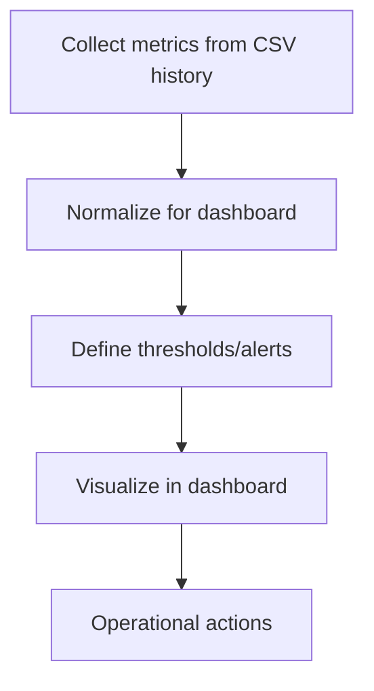
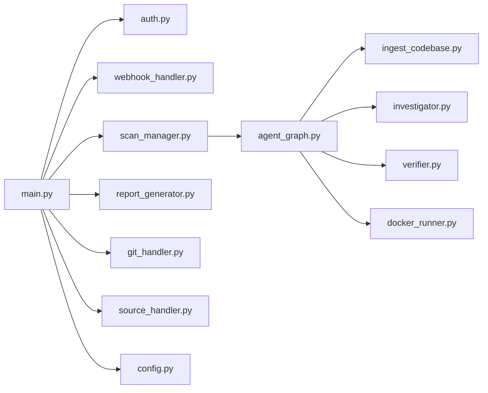

# Security Monitoring and Incident Response

<cite>
**Referenced Files in This Document**
- [main.py](file://autopov/app/main.py)
- [auth.py](file://autopov/app/auth.py)
- [config.py](file://autopov/app/config.py)
- [webhook_handler.py](file://autopov/app/webhook_handler.py)
- [scan_manager.py](file://autopov/app/scan_manager.py)
- [report_generator.py](file://autopov/app/report_generator.py)
- [source_handler.py](file://autopov/app/source_handler.py)
- [git_handler.py](file://autopov/app/git_handler.py)
- [agent_graph.py](file://autopov/app/agent_graph.py)
- [investigator.py](file://autopov/agents/investigator.py)
- [docker_runner.py](file://autopov/agents/docker_runner.py)
- [verifier.py](file://autopov/agents/verifier.py)
- [ingest_codebase.py](file://autopov/agents/ingest_codebase.py)
- [prompts.py](file://autopov/prompts.py)
- [LiveLog.jsx](file://autopov/frontend/src/components/LiveLog.jsx)
</cite>

## Table of Contents
1. [Introduction](#introduction)
2. [Project Structure](#project-structure)
3. [Core Components](#core-components)
4. [Architecture Overview](#architecture-overview)
5. [Detailed Component Analysis](#detailed-component-analysis)
6. [Dependency Analysis](#dependency-analysis)
7. [Performance Considerations](#performance-considerations)
8. [Troubleshooting Guide](#troubleshooting-guide)
9. [Conclusion](#conclusion)
10. [Appendices](#appendices)

## Introduction
This document describes AutoPoV’s security monitoring and incident response capabilities with a focus on detecting, responding to, and recovering from security incidents. It covers security logging and audit trails, monitoring strategies for system health and resource usage, incident response procedures, security metrics and alerting, and practical examples for setup, response playbooks, and forensic analysis. It also addresses automation, continuous monitoring, and integration with external security tools, along with guidance for compliance reporting and maintaining posture over time.

## Project Structure
AutoPoV is a FastAPI-based service orchestrating a LangGraph agent workflow that performs autonomous vulnerability scanning and PoV validation. Key areas relevant to security monitoring and incident response include:
- API surface with authentication and authorization
- Webhook handlers for Git providers
- Scan orchestration and logging
- Metrics and reporting
- Forensic execution in isolated containers

**Diagram sources**
- [main.py](file://autopov/app/main.py#L102-L121)
- [auth.py](file://autopov/app/auth.py#L137-L171)
- [webhook_handler.py](file://autopov/app/webhook_handler.py#L15-L363)
- [scan_manager.py](file://autopov/app/scan_manager.py#L40-L344)
- [agent_graph.py](file://autopov/app/agent_graph.py#L78-L582)
- [ingest_codebase.py](file://autopov/agents/ingest_codebase.py#L41-L407)
- [investigator.py](file://autopov/agents/investigator.py#L37-L413)
- [verifier.py](file://autopov/agents/verifier.py#L40-L401)
- [docker_runner.py](file://autopov/agents/docker_runner.py#L27-L379)
- [git_handler.py](file://autopov/app/git_handler.py#L18-L222)
- [source_handler.py](file://autopov/app/source_handler.py#L18-L380)
- [report_generator.py](file://autopov/app/report_generator.py#L68-L359)
- [config.py](file://autopov/app/config.py#L13-L210)

**Section sources**
- [main.py](file://autopov/app/main.py#L102-L121)
- [config.py](file://autopov/app/config.py#L13-L210)

## Core Components
- Authentication and Authorization: Bearer token-based API key management with admin controls.
- Webhook Integration: GitHub and GitLab webhook handling with signature/token verification and event parsing.
- Scan Orchestration: Centralized scan lifecycle, logs, and metrics.
- Forensic Execution: Safe, isolated container execution of PoV scripts.
- Reporting: JSON/PDF reports and PoV artifacts for evidence and compliance.
- Logging and Audit Trails: Timestamped logs stored in scan state and persisted results.

**Section sources**
- [auth.py](file://autopov/app/auth.py#L32-L176)
- [webhook_handler.py](file://autopov/app/webhook_handler.py#L15-L363)
- [scan_manager.py](file://autopov/app/scan_manager.py#L40-L344)
- [docker_runner.py](file://autopov/agents/docker_runner.py#L27-L379)
- [report_generator.py](file://autopov/app/report_generator.py#L68-L359)
- [agent_graph.py](file://autopov/app/agent_graph.py#L516-L572)

## Architecture Overview
The system integrates API endpoints, authentication, Git providers, and a LangGraph-based agent workflow. The workflow ingests code, runs CodeQL or LLM-only analysis, investigates findings, generates and validates PoVs, executes them in Docker, and records outcomes with timestamps and costs.

**Diagram sources**
- [main.py](file://autopov/app/main.py#L177-L385)
- [auth.py](file://autopov/app/auth.py#L137-L171)
- [webhook_handler.py](file://autopov/app/webhook_handler.py#L196-L336)
- [scan_manager.py](file://autopov/app/scan_manager.py#L86-L116)
- [agent_graph.py](file://autopov/app/agent_graph.py#L532-L572)
- [investigator.py](file://autopov/agents/investigator.py#L254-L365)
- [verifier.py](file://autopov/agents/verifier.py#L79-L149)
- [docker_runner.py](file://autopov/agents/docker_runner.py#L62-L191)

## Detailed Component Analysis

### Security Logging and Audit Trails
- Logs are timestamped and appended to scan state during workflow execution.
- Logs persist in JSON results and CSV history for later retrieval and auditing.
- Live log streaming supports real-time visibility via server-sent events.

**Diagram sources**
- [agent_graph.py](file://autopov/app/agent_graph.py#L516-L520)
- [scan_manager.py](file://autopov/app/scan_manager.py#L201-L235)
- [main.py](file://autopov/app/main.py#L350-L385)

**Section sources**
- [agent_graph.py](file://autopov/app/agent_graph.py#L516-L520)
- [scan_manager.py](file://autopov/app/scan_manager.py#L201-L235)
- [main.py](file://autopov/app/main.py#L350-L385)

### Authentication and Access Control
- API key generation, hashing, and validation with optional query param support for streaming.
- Admin-only endpoints for key management guarded by admin key validation.
- Keys are stored securely hashed and tracked with usage timestamps.

**Diagram sources**
- [auth.py](file://autopov/app/auth.py#L22-L131)

**Section sources**
- [auth.py](file://autopov/app/auth.py#L32-L176)

### Webhook-Based Continuous Monitoring
- GitHub and GitLab webhooks are verified using signatures/tokens and parsed into actionable events.
- Events trigger scans automatically when applicable (e.g., push or pull request).
- Callback registration enables decoupled scan initiation.

**Diagram sources**
- [main.py](file://autopov/app/main.py#L433-L475)
- [webhook_handler.py](file://autopov/app/webhook_handler.py#L196-L336)
- [webhook_handler.py](file://autopov/app/webhook_handler.py#L21-L24)

**Section sources**
- [webhook_handler.py](file://autopov/app/webhook_handler.py#L15-L363)
- [main.py](file://autopov/app/main.py#L123-L161)

### Forensic Execution and Recovery
- PoV scripts are validated for syntax and standard library constraints.
- Executed inside isolated Docker containers with strict limits and no network access.
- Results include success indicators, exit codes, and captured logs for forensic review.

**Diagram sources**
- [verifier.py](file://autopov/agents/verifier.py#L151-L227)
- [docker_runner.py](file://autopov/agents/docker_runner.py#L62-L191)
- [agent_graph.py](file://autopov/app/agent_graph.py#L403-L433)

**Section sources**
- [verifier.py](file://autopov/agents/verifier.py#L40-L401)
- [docker_runner.py](file://autopov/agents/docker_runner.py#L27-L379)
- [agent_graph.py](file://autopov/app/agent_graph.py#L403-L433)

### Security Metrics, Alerting, and Dashboards
- Metrics endpoint exposes scan statistics (total/completed/failed, active scans, total confirmed, total cost).
- CSV history and JSON results enable downstream dashboards and alerting systems.
- Live log streaming supports real-time alerting hooks for anomalies.

**Diagram sources**
- [scan_manager.py](file://autopov/app/scan_manager.py#L304-L334)
- [main.py](file://autopov/app/main.py#L513-L517)

**Section sources**
- [scan_manager.py](file://autopov/app/scan_manager.py#L304-L334)
- [main.py](file://autopov/app/main.py#L513-L517)

### Compliance Reporting and Evidence Preservation
- JSON and PDF reports include scan metadata, metrics, and confirmed findings.
- PoV scripts are saved as artifacts for evidence and repeatable testing.
- Reports support internal and external compliance needs.

**Section sources**
- [report_generator.py](file://autopov/app/report_generator.py#L68-L359)

### Practical Examples

#### Security Monitoring Setup
- Configure environment variables for API keys, model selection, and tool availability.
- Enable Docker and static analysis tools to maximize detection coverage.
- Set up webhook endpoints with provider-specific secrets.

**Section sources**
- [config.py](file://autopov/app/config.py#L13-L210)
- [webhook_handler.py](file://autopov/app/webhook_handler.py#L25-L73)

#### Incident Response Playbook
- Detection: Use webhook triggers and scheduled scans to detect changes.
- Containment: Limit exposure by isolating PoV execution and restricting container privileges.
- Eradication: Review failed PoV attempts and refine prompts or validation rules.
- Recovery: Re-run scans after fixes; confirm with PoV; update dashboards.

**Section sources**
- [webhook_handler.py](file://autopov/app/webhook_handler.py#L196-L336)
- [docker_runner.py](file://autopov/agents/docker_runner.py#L62-L191)
- [verifier.py](file://autopov/agents/verifier.py#L332-L391)

#### Forensic Analysis Procedures
- Inspect scan logs for timestamps and node transitions.
- Review JSON results and CSV history for trends and anomalies.
- Examine PoV artifacts and Docker execution logs for root cause.

**Section sources**
- [agent_graph.py](file://autopov/app/agent_graph.py#L516-L520)
- [scan_manager.py](file://autopov/app/scan_manager.py#L201-L235)
- [docker_runner.py](file://autopov/agents/docker_runner.py#L110-L191)

## Dependency Analysis
The system exhibits clear separation of concerns:
- API layer depends on auth, webhook handler, scan manager, and report generator.
- Scan manager coordinates agent graph and persists state.
- Agent graph orchestrates ingestion, investigation, PoV generation/validation, and Docker execution.
- Supporting modules encapsulate Git operations, source handling, and configuration.

**Diagram sources**
- [main.py](file://autopov/app/main.py#L13-L26)
- [agent_graph.py](file://autopov/app/agent_graph.py#L22-L27)

**Section sources**
- [main.py](file://autopov/app/main.py#L13-L26)
- [agent_graph.py](file://autopov/app/agent_graph.py#L22-L27)

## Performance Considerations
- Container isolation and resource limits prevent runaway workloads.
- Batched ingestion and embeddings reduce overhead.
- Cost tracking and configurable retries balance accuracy and performance.
- Streaming logs minimize latency for real-time monitoring.

[No sources needed since this section provides general guidance]

## Troubleshooting Guide
Common issues and remedies:
- Invalid or expired API key: Verify token and ensure admin key for privileged endpoints.
- Webhook signature/token mismatch: Confirm provider secret configuration and payload parsing.
- Tool unavailability (Docker, CodeQL, Joern): Check environment and fallback behavior.
- Scan stuck or failed: Inspect logs, CSV history, and JSON results for error details.
- PoV failures: Use retry analysis and adjust prompts or validation rules.

**Section sources**
- [auth.py](file://autopov/app/auth.py#L137-L171)
- [webhook_handler.py](file://autopov/app/webhook_handler.py#L213-L265)
- [config.py](file://autopov/app/config.py#L123-L171)
- [scan_manager.py](file://autopov/app/scan_manager.py#L177-L199)
- [verifier.py](file://autopov/agents/verifier.py#L332-L391)

## Conclusion
AutoPoV provides a robust, automated framework for security monitoring and incident response. Its layered architecture ensures secure, auditable, and repeatable vulnerability detection and PoV validation. By leveraging webhook-driven continuous monitoring, strict containerized execution, comprehensive logging, and standardized reporting, teams can maintain strong security posture and respond quickly to incidents.

[No sources needed since this section summarizes without analyzing specific files]

## Appendices

### Security Monitoring Checklist
- Enforce API key authentication for all endpoints.
- Validate webhook signatures/tokens before triggering scans.
- Monitor system health and tool availability via health checks.
- Track metrics and alert on thresholds (failed scans, anomaly spikes).
- Preserve logs and artifacts for audits and forensics.

**Section sources**
- [main.py](file://autopov/app/main.py#L164-L174)
- [scan_manager.py](file://autopov/app/scan_manager.py#L304-L334)

### Example: Live Log Visualization
The frontend displays live logs with timestamp formatting and color-coded messages for quick situational awareness.

**Section sources**
- [LiveLog.jsx](file://autopov/frontend/src/components/LiveLog.jsx#L1-L67)