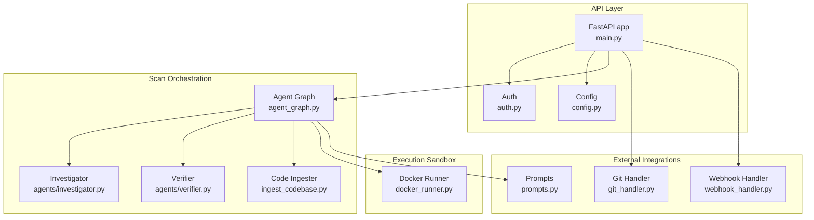
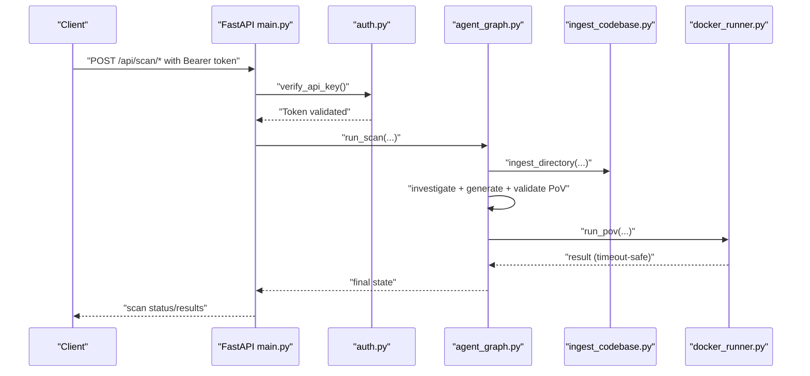
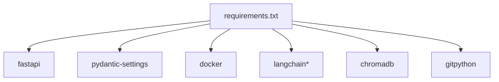

# Security and Safety

<cite>
**Referenced Files in This Document**
- [auth.py](file://autopov/app/auth.py)
- [config.py](file://autopov/app/config.py)
- [main.py](file://autopov/app/main.py)
- [source_handler.py](file://autopov/app/source_handler.py)
- [webhook_handler.py](file://autopov/app/webhook_handler.py)
- [git_handler.py](file://autopov/app/git_handler.py)
- [docker_runner.py](file://autopov/agents/docker_runner.py)
- [prompts.py](file://autopov/prompts.py)
- [agent_graph.py](file://autopov/app/agent_graph.py)
- [ingest_codebase.py](file://autopov/agents/ingest_codebase.py)
- [requirements.txt](file://autopov/requirements.txt)
</cite>

## Table of Contents
1. [Introduction](#introduction)
2. [Project Structure](#project-structure)
3. [Core Components](#core-components)
4. [Architecture Overview](#architecture-overview)
5. [Detailed Component Analysis](#detailed-component-analysis)
6. [Dependency Analysis](#dependency-analysis)
7. [Performance Considerations](#performance-considerations)
8. [Troubleshooting Guide](#troubleshooting-guide)
9. [Conclusion](#conclusion)
10. [Appendices](#appendices)

## Introduction
This document details AutoPoV’s security and safety measures designed to protect both the system and external environments during vulnerability analysis. It covers container isolation and runtime safeguards, authentication and authorization, input validation and sanitization, LLM interaction safety, prompt injection prevention, sensitive data handling, practical security configurations, threat modeling, vulnerability assessment, incident response, monitoring, compliance, and production deployment guidance with audit logging.

## Project Structure
AutoPoV is a FastAPI application orchestrating a LangGraph-based agent workflow. Security-relevant modules include:
- Authentication and authorization (API keys)
- Configuration and environment variables
- Input handlers for uploads and Git repositories
- Webhook handlers for secure CI/CD triggers
- Docker-based sandboxing for PoV execution
- LLM prompts and agent orchestration
- Vector store ingestion and retrieval

**Diagram sources**
- [main.py](file://autopov/app/main.py#L102-L117)
- [auth.py](file://autopov/app/auth.py#L19-L19)
- [config.py](file://autopov/app/config.py#L13-L210)
- [agent_graph.py](file://autopov/app/agent_graph.py#L78-L134)
- [docker_runner.py](file://autopov/agents/docker_runner.py#L27-L379)
- [git_handler.py](file://autopov/app/git_handler.py#L18-L222)
- [webhook_handler.py](file://autopov/app/webhook_handler.py#L15-L363)
- [prompts.py](file://autopov/prompts.py#L1-L374)
- [ingest_codebase.py](file://autopov/agents/ingest_codebase.py#L41-L407)

**Section sources**
- [main.py](file://autopov/app/main.py#L102-L117)
- [config.py](file://autopov/app/config.py#L13-L210)

## Core Components
- Authentication and Authorization:
  - Bearer token authentication with SHA-256 hashed API keys stored securely on disk.
  - Admin-only endpoints protected by a dedicated admin key.
- Input Validation and Sanitization:
  - ZIP/TAR uploads guarded against path traversal.
  - Raw code paste with language-aware file naming.
  - Git repository cloning with credential injection and path sanitization.
- Container Isolation and Execution Safeguards:
  - Docker containers run with strict limits: memory, CPU quota, read-only volume, and disabled networking.
  - Execution timeouts enforced; container killed on timeout.
- LLM Interaction Safety:
  - Centralized prompts with explicit constraints for PoV generation and validation.
  - Offline and online LLM modes with configurable base URLs and model selection.
- Secure Webhooks:
  - GitHub and GitLab signatures/tokens verified before triggering scans.
- Cost and Resource Controls:
  - Configurable Docker limits and optional cost tracking.

**Section sources**
- [auth.py](file://autopov/app/auth.py#L32-L168)
- [source_handler.py](file://autopov/app/source_handler.py#L31-L124)
- [git_handler.py](file://autopov/app/git_handler.py#L25-L124)
- [docker_runner.py](file://autopov/agents/docker_runner.py#L27-L192)
- [prompts.py](file://autopov/prompts.py#L46-L109)
- [webhook_handler.py](file://autopov/app/webhook_handler.py#L25-L74)
- [config.py](file://autopov/app/config.py#L78-L87)

## Architecture Overview
The system enforces security at multiple layers: API access control, input sanitization, container sandboxing, and LLM prompt constraints. The agent graph coordinates ingestion, analysis, PoV generation, validation, and Docker execution.

**Diagram sources**
- [main.py](file://autopov/app/main.py#L175-L314)
- [auth.py](file://autopov/app/auth.py#L137-L148)
- [agent_graph.py](file://autopov/app/agent_graph.py#L532-L572)
- [ingest_codebase.py](file://autopov/agents/ingest_codebase.py#L201-L307)
- [docker_runner.py](file://autopov/agents/docker_runner.py#L62-L192)

## Detailed Component Analysis

### Authentication and Authorization
- API key management:
  - Keys are SHA-256 hashed and persisted to disk; plaintext keys are never returned after generation.
  - Admin-only endpoints require a separate admin key environment variable.
- Access control:
  - FastAPI dependencies enforce bearer token verification for most endpoints.
  - Admin endpoints require a second verification step.

Best practices:
- Rotate API keys regularly and revoke unused keys.
- Store keys in a secrets manager or environment variables.
- Limit admin key usage to trusted administrative tasks.

**Section sources**
- [auth.py](file://autopov/app/auth.py#L32-L168)
- [main.py](file://autopov/app/main.py#L475-L508)

### Input Validation and Sanitization
- ZIP/TAR uploads:
  - Path traversal checks ensure extracted members remain inside the destination directory.
- Raw code paste:
  - Language-to-extension mapping determines safe filenames; UTF-8 with error fallback.
- Git repositories:
  - Credentials injected into URLs based on provider; scan IDs sanitized for filesystem safety.

Recommendations:
- Enforce maximum upload sizes and file counts.
- Scan archives for malicious content before extraction.
- Normalize and validate all user-provided paths.

**Section sources**
- [source_handler.py](file://autopov/app/source_handler.py#L31-L124)
- [source_handler.py](file://autopov/app/source_handler.py#L191-L230)
- [git_handler.py](file://autopov/app/git_handler.py#L25-L124)

### Docker Security Configuration
- Isolation:
  - Network disabled for containers.
  - Read-only bind mount for PoV files.
- Resource limits:
  - Memory limit and CPU quota configured via settings.
- Execution safeguards:
  - Long-running executions are terminated with kill and timeout handling.
  - Logs captured and container removed after execution.

Operational guidance:
- Tune memory and CPU quotas based on workload.
- Monitor container stats and adjust limits.
- Use minimal base images and avoid privileged operations.

**Section sources**
- [docker_runner.py](file://autopov/agents/docker_runner.py#L27-L192)
- [config.py](file://autopov/app/config.py#L78-L87)

### LLM Interactions, Prompt Injection Prevention, and Sensitive Data Handling
- Prompt constraints:
  - PoV generation prompts require deterministic scripts and explicit “VULNERABILITY TRIGGERED” markers.
  - Validation prompts enforce standard library usage, determinism, and correctness criteria.
- Data handling:
  - Vector store ingestion skips binary files and filters code extensions.
  - Embeddings are computed locally or via configured providers; API keys are required for online embeddings.
- Risk mitigation:
  - Restrict model capabilities to deterministic, constrained tasks.
  - Avoid exposing internal system details in prompts or logs.

**Section sources**
- [prompts.py](file://autopov/prompts.py#L46-L109)
- [prompts.py](file://autopov/prompts.py#L176-L209)
- [ingest_codebase.py](file://autopov/agents/ingest_codebase.py#L122-L140)
- [ingest_codebase.py](file://autopov/agents/ingest_codebase.py#L60-L88)

### Webhook Security
- GitHub:
  - HMAC-SHA256 signature verification using a shared secret.
- GitLab:
  - Token verification via shared secret header.
- Event filtering:
  - Only specific events (e.g., push, pull/merge requests) trigger scans.

Operational guidance:
- Store secrets in environment variables.
- Validate headers and payload integrity before invoking scan callbacks.

**Section sources**
- [webhook_handler.py](file://autopov/app/webhook_handler.py#L25-L74)
- [webhook_handler.py](file://autopov/app/webhook_handler.py#L196-L336)
- [main.py](file://autopov/app/main.py#L431-L472)

### Agent Workflow and Safety Gates
- Conditional transitions:
  - PoV generation only proceeds when confidence thresholds are met.
  - Retries are bounded by maximum attempts.
- Logging and auditing:
  - All steps record timestamps and outcomes; final state includes logs and metrics.
- Cost control:
  - Optional cost tracking enabled by default.

**Section sources**
- [agent_graph.py](file://autopov/app/agent_graph.py#L488-L515)
- [agent_graph.py](file://autopov/app/agent_graph.py#L516-L531)
- [config.py](file://autopov/app/config.py#L85-L87)

## Dependency Analysis
Security-related dependencies and their roles:
- FastAPI and pydantic-settings for API and configuration.
- Docker SDK for container sandboxing.
- LangChain ecosystem for LLMs and embeddings.
- ChromaDB for vector storage.
- GitPython for repository cloning.

**Diagram sources**
- [requirements.txt](file://autopov/requirements.txt#L1-L42)

**Section sources**
- [requirements.txt](file://autopov/requirements.txt#L1-L42)

## Performance Considerations
- Container resource tuning reduces contention and prevents runaway workloads.
- Batch embedding and retrieval minimize repeated I/O.
- CodeQL availability checks enable graceful fallback to LLM-only analysis.

[No sources needed since this section provides general guidance]

## Troubleshooting Guide
Common security-related issues and resolutions:
- Docker not available:
  - Verify Docker daemon and client connectivity; the runner reports availability and ping failures.
- API key errors:
  - Confirm bearer token matches stored hash; ensure admin key is set for admin endpoints.
- Upload failures:
  - Check path traversal protections and file size limits.
- Webhook errors:
  - Validate signatures/tokens and event types; confirm callback registration.

**Section sources**
- [docker_runner.py](file://autopov/agents/docker_runner.py#L50-L61)
- [auth.py](file://autopov/app/auth.py#L137-L162)
- [source_handler.py](file://autopov/app/source_handler.py#L57-L61)
- [webhook_handler.py](file://autopov/app/webhook_handler.py#L213-L218)

## Conclusion
AutoPoV implements layered security controls: strict API access, robust input sanitization, hardened container execution, and constrained LLM prompts. These measures collectively reduce risk to the system and external environments during vulnerability analysis. Production deployments should complement these defaults with secrets management, network segmentation, runtime monitoring, and regular audits.

[No sources needed since this section summarizes without analyzing specific files]

## Appendices

### Practical Security Configuration Examples
- Environment variables (selected):
  - ADMIN_API_KEY: Admin-only access key
  - WEBHOOK_SECRET: Shared secret for webhook verification
  - OPENROUTER_API_KEY: Online embeddings key
  - OLLAMA_BASE_URL: Offline LLM base URL
  - GITHUB_TOKEN/GITLAB_TOKEN/BITBUCKET_TOKEN: Provider credentials for private repos
  - DOCKER_*: Container limits and timeouts
- Example toggles:
  - MODEL_MODE: online/offline
  - DOCKER_ENABLED: Enable/disable sandboxing
  - COST_TRACKING_ENABLED: Enable cost tracking

**Section sources**
- [config.py](file://autopov/app/config.py#L26-L87)
- [config.py](file://autopov/app/config.py#L117-L121)

### Threat Modeling and Mitigations
- Threat: Malicious upload leading to path traversal
  - Mitigation: Path traversal checks in archive extraction
- Threat: Exfiltration via LLM prompts
  - Mitigation: Constrained prompts and deterministic outputs
- Threat: Privileged container execution
  - Mitigation: Disabled networking, read-only mounts, resource limits
- Threat: Unauthorized webhook triggers
  - Mitigation: Signature/token verification and event filtering

**Section sources**
- [source_handler.py](file://autopov/app/source_handler.py#L57-L61)
- [prompts.py](file://autopov/prompts.py#L46-L78)
- [docker_runner.py](file://autopov/agents/docker_runner.py#L129-L133)
- [webhook_handler.py](file://autopov/app/webhook_handler.py#L25-L74)

### Incident Response Procedures
- Immediate actions:
  - Revoke compromised API keys and rotate secrets.
  - Review webhook logs and signatures for tampering.
  - Inspect Docker execution logs and container artifacts.
- Forensic steps:
  - Correlate scan logs with container outputs.
  - Audit vector store collections for anomalies.
- Monitoring and alerts:
  - Track scan metrics, error rates, and cost spikes.
  - Alert on repeated validation failures or timeouts.

**Section sources**
- [auth.py](file://autopov/app/auth.py#L97-L111)
- [webhook_handler.py](file://autopov/app/webhook_handler.py#L213-L265)
- [docker_runner.py](file://autopov/agents/docker_runner.py#L135-L143)
- [agent_graph.py](file://autopov/app/agent_graph.py#L308-L325)

### Compliance Considerations
- Data minimization:
  - Vector store ingestion excludes binaries and unknown file types.
- Least privilege:
  - Admin endpoints restricted; API keys scoped to operational needs.
- Auditability:
  - Persistent scan history and logs for traceability.

**Section sources**
- [ingest_codebase.py](file://autopov/agents/ingest_codebase.py#L122-L140)
- [main.py](file://autopov/app/main.py#L475-L508)
- [scan_manager.py](file://autopov/app/scan_manager.py#L201-L235)