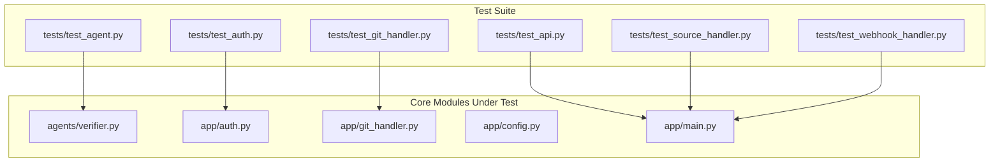
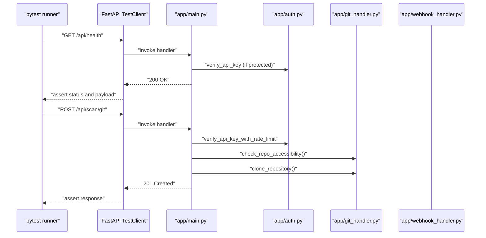
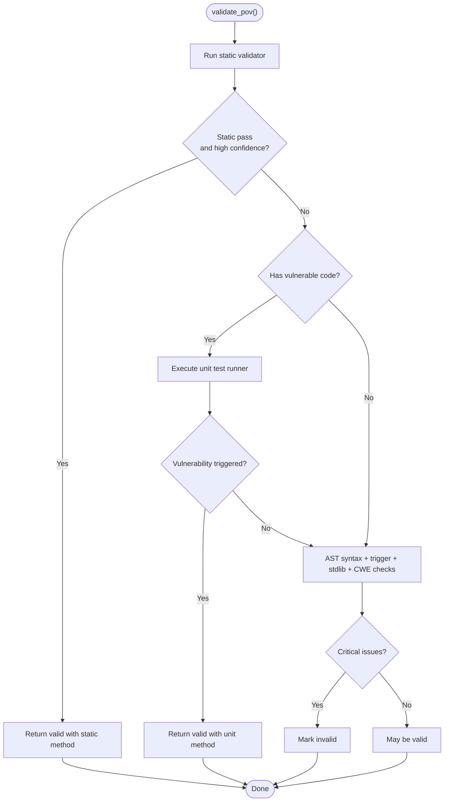
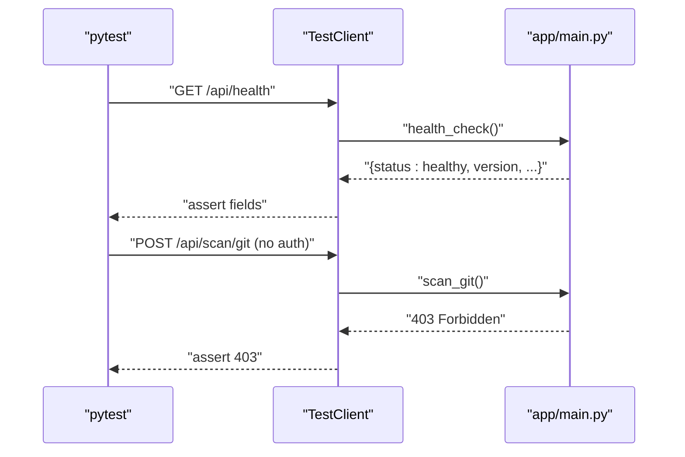
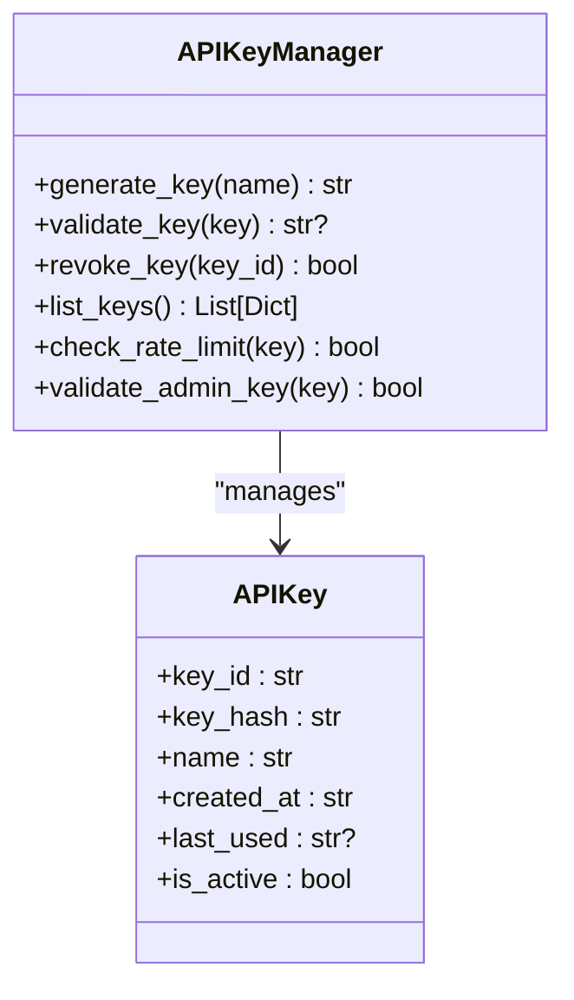
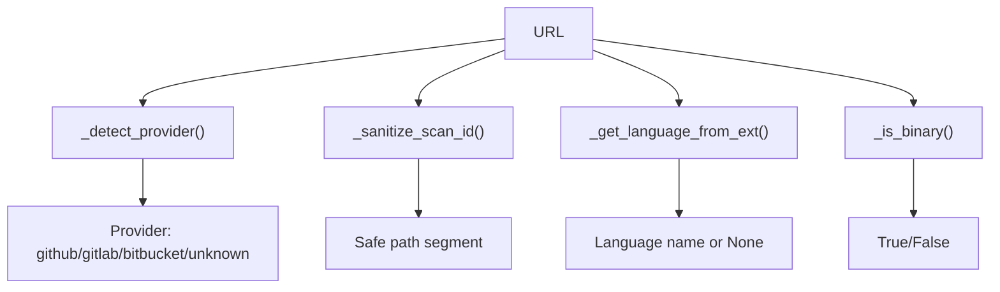
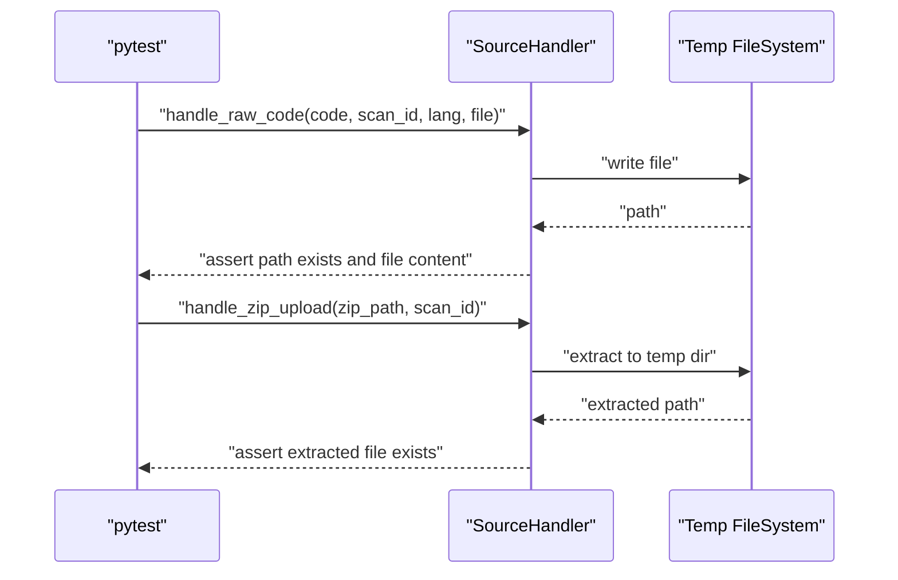
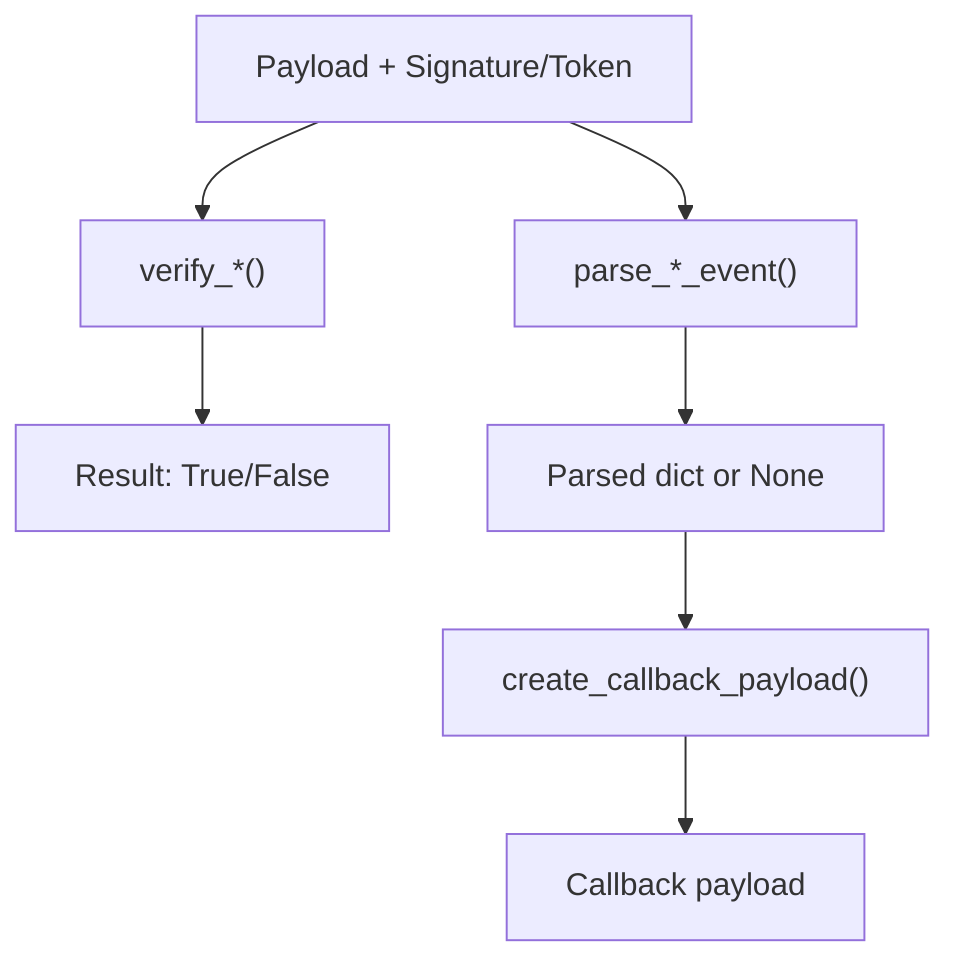
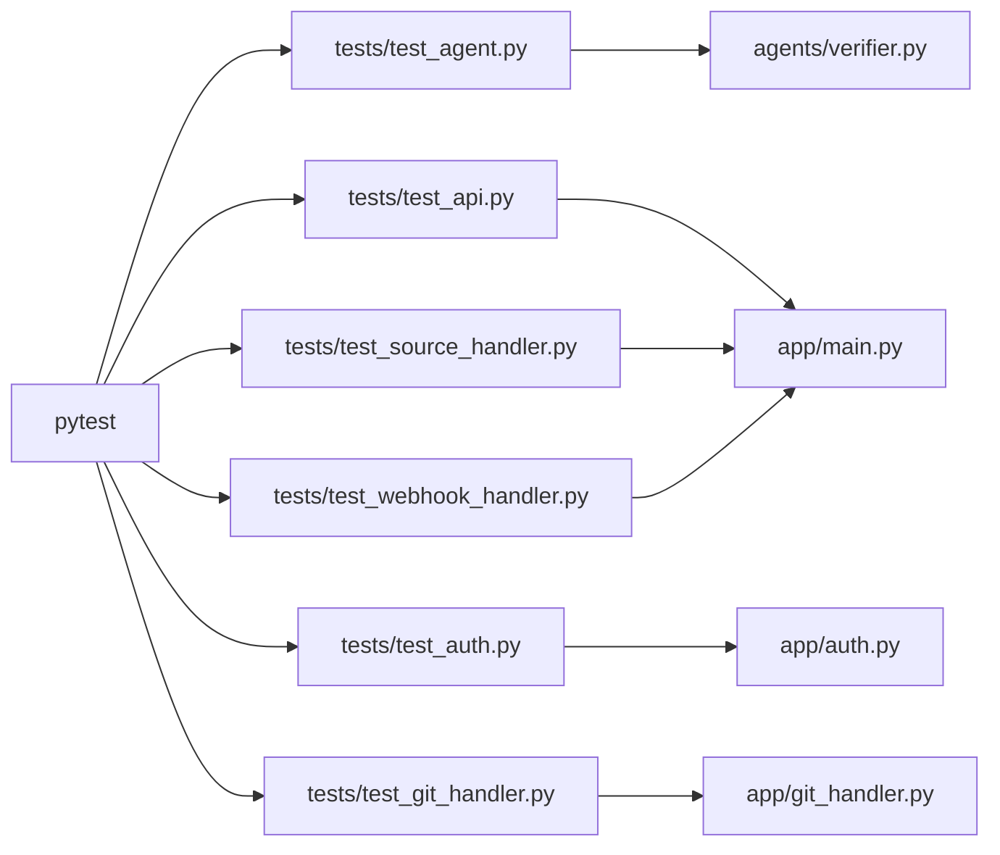

# Testing & Quality Assurance

<cite>
**Referenced Files in This Document**
- [tests/__init__.py](file://tests/__init__.py)
- [tests/test_agent.py](file://tests/test_agent.py)
- [tests/test_api.py](file://tests/test_api.py)
- [tests/test_auth.py](file://tests/test_auth.py)
- [tests/test_git_handler.py](file://tests/test_git_handler.py)
- [tests/test_source_handler.py](file://tests/test_source_handler.py)
- [tests/test_webhook_handler.py](file://tests/test_webhook_handler.py)
- [agents/verifier.py](file://agents/verifier.py)
- [app/auth.py](file://app/auth.py)
- [app/git_handler.py](file://app/git_handler.py)
- [app/config.py](file://app/config.py)
- [app/main.py](file://app/main.py)
- [requirements.txt](file://requirements.txt)
</cite>

## Table of Contents
1. [Introduction](#introduction)
2. [Project Structure](#project-structure)
3. [Core Components](#core-components)
4. [Architecture Overview](#architecture-overview)
5. [Detailed Component Analysis](#detailed-component-analysis)
6. [Dependency Analysis](#dependency-analysis)
7. [Performance Considerations](#performance-considerations)
8. [Troubleshooting Guide](#troubleshooting-guide)
9. [Conclusion](#conclusion)
10. [Appendices](#appendices)

## Introduction
This document describes AutoPoV’s quality assurance framework and testing practices. It covers the pytest-based test suite, testing strategies for agents and backend components, test data and mocking patterns, environment configuration, and best practices for API validation, security testing, and performance regression testing. It also provides guidance for writing new tests, continuous integration setup, debugging techniques, interpreting results, and collecting quality metrics.

## Project Structure
The test suite resides under the tests directory and targets core application modules and agents. The primary test categories are:
- Unit tests for agent logic (PoV verifier)
- Integration tests for API endpoints and authentication
- Component tests for Git operations, source handling, and webhook processing

**Diagram sources**
- [tests/test_agent.py:1-71](file://tests/test_agent.py#L1-L71)
- [tests/test_api.py:1-60](file://tests/test_api.py#L1-L60)
- [tests/test_auth.py:1-66](file://tests/test_auth.py#L1-L66)
- [tests/test_git_handler.py:1-63](file://tests/test_git_handler.py#L1-L63)
- [tests/test_source_handler.py:1-79](file://tests/test_source_handler.py#L1-L79)
- [tests/test_webhook_handler.py:1-166](file://tests/test_webhook_handler.py#L1-L166)
- [agents/verifier.py:1-562](file://agents/verifier.py#L1-L562)
- [app/auth.py:1-256](file://app/auth.py#L1-L256)
- [app/git_handler.py:1-392](file://app/git_handler.py#L1-L392)
- [app/config.py:1-255](file://app/config.py#L1-L255)
- [app/main.py:1-768](file://app/main.py#L1-L768)

**Section sources**
- [tests/__init__.py:1-4](file://tests/__init__.py#L1-L4)
- [requirements.txt:36-40](file://requirements.txt#L36-L40)

## Core Components
- VulnerabilityVerifier: Validates PoV scripts using static analysis, unit test execution, and LLM fallback; includes syntax checks, standard library restrictions, and CWE-specific validations.
- APIKeyManager: Manages API key lifecycle, hashing, rate limiting, and admin key verification.
- GitHandler: Handles provider detection, credential injection, repository accessibility checks, cloning, and cleanup.
- FastAPI endpoints: Expose health, scan initiation, status streaming, reports, webhooks, and admin operations guarded by authentication and rate limits.

**Section sources**
- [agents/verifier.py:42-562](file://agents/verifier.py#L42-L562)
- [app/auth.py:40-256](file://app/auth.py#L40-L256)
- [app/git_handler.py:20-392](file://app/git_handler.py#L20-L392)
- [app/main.py:175-768](file://app/main.py#L175-L768)

## Architecture Overview
The test suite targets the FastAPI application surface and internal components. Tests exercise:
- API endpoints via TestClient
- Authentication and rate-limiting dependencies
- Git operations with mocked subprocess and network calls
- Webhook signature/token verification and payload parsing
- Source handling for raw code and ZIP uploads
- Agent validation logic for PoV scripts

**Diagram sources**
- [tests/test_api.py:16-40](file://tests/test_api.py#L16-L40)
- [app/main.py:204-286](file://app/main.py#L204-L286)
- [app/auth.py:192-236](file://app/auth.py#L192-L236)
- [app/git_handler.py:155-294](file://app/git_handler.py#L155-L294)

## Detailed Component Analysis

### VulnerabilityVerifier Tests
These tests validate PoV script correctness and safety:
- Syntax error detection
- Absence of required trigger phrase
- Acceptance of valid scripts
- Standard library module detection

**Diagram sources**
- [agents/verifier.py:225-387](file://agents/verifier.py#L225-L387)
- [tests/test_agent.py:17-71](file://tests/test_agent.py#L17-L71)

**Section sources**
- [tests/test_agent.py:1-71](file://tests/test_agent.py#L1-L71)
- [agents/verifier.py:225-387](file://agents/verifier.py#L225-L387)

### API Endpoint Tests
These tests validate:
- Health endpoint returns expected status and version
- Authentication-required endpoints reject unauthenticated requests
- Webhook endpoints handle missing signatures/tokens gracefully

**Diagram sources**
- [tests/test_api.py:16-40](file://tests/test_api.py#L16-L40)
- [app/main.py:175-201](file://app/main.py#L175-L201)

**Section sources**
- [tests/test_api.py:1-60](file://tests/test_api.py#L1-L60)
- [app/main.py:175-201](file://app/main.py#L175-L201)

### Authentication and Rate Limiting Tests
These tests validate:
- API key generation, validation, revocation, and listing
- Rate-limit enforcement behavior
- Admin key verification

**Diagram sources**
- [app/auth.py:40-186](file://app/auth.py#L40-L186)
- [tests/test_auth.py:27-56](file://tests/test_auth.py#L27-L56)

**Section sources**
- [tests/test_auth.py:1-66](file://tests/test_auth.py#L1-L66)
- [app/auth.py:40-186](file://app/auth.py#L40-L186)

### Git Handler Tests
These tests validate:
- Provider detection from URLs
- Sanitized scan IDs
- Language detection from extensions
- Binary file detection
- Temporary directory usage for tests

**Diagram sources**
- [app/git_handler.py:45-383](file://app/git_handler.py#L45-L383)
- [tests/test_git_handler.py:20-63](file://tests/test_git_handler.py#L20-L63)

**Section sources**
- [tests/test_git_handler.py:1-63](file://tests/test_git_handler.py#L1-L63)
- [app/git_handler.py:45-383](file://app/git_handler.py#L45-L383)

### Source Handler Tests
These tests validate:
- Handling raw code paste with language and filename
- ZIP upload extraction and file presence
- Source info aggregation (files, lines, languages)
- Binary file detection in extracted content

**Diagram sources**
- [tests/test_source_handler.py:26-54](file://tests/test_source_handler.py#L26-L54)
- [app/main.py:288-347](file://app/main.py#L288-L347)

**Section sources**
- [tests/test_source_handler.py:1-79](file://tests/test_source_handler.py#L1-L79)

### Webhook Handler Tests
These tests validate:
- GitHub signature verification with HMAC-SHA256
- GitLab token verification
- Parsing GitHub push and pull_request events
- Parsing GitLab push events
- Callback payload creation

**Diagram sources**
- [tests/test_webhook_handler.py:21-166](file://tests/test_webhook_handler.py#L21-L166)
- [app/main.py:647-688](file://app/main.py#L647-L688)

**Section sources**
- [tests/test_webhook_handler.py:1-166](file://tests/test_webhook_handler.py#L1-L166)
- [app/main.py:647-688](file://app/main.py#L647-L688)

## Dependency Analysis
- Test dependencies: pytest, pytest-asyncio, httpx for asynchronous endpoint testing, and FastAPI TestClient.
- Runtime dependencies: FastAPI, Pydantic, LangChain ecosystem, ChromaDB, Docker SDK, GitPython, pandas, fpdf2, requests, click, rich, python-dotenv, semgrep.

**Diagram sources**
- [requirements.txt:36-40](file://requirements.txt#L36-L40)
- [tests/test_agent.py:5-6](file://tests/test_agent.py#L5-L6)
- [tests/test_api.py:5-7](file://tests/test_api.py#L5-L7)
- [tests/test_auth.py:5-8](file://tests/test_auth.py#L5-L8)
- [tests/test_git_handler.py:5-9](file://tests/test_git_handler.py#L5-L9)
- [tests/test_source_handler.py:5-9](file://tests/test_source_handler.py#L5-L9)
- [tests/test_webhook_handler.py:5-10](file://tests/test_webhook_handler.py#L5-L10)

**Section sources**
- [requirements.txt:1-44](file://requirements.txt#L1-L44)

## Performance Considerations
- Prefer unit tests for CPU-heavy logic (static validation, CWE checks) to avoid external dependencies.
- Mock expensive operations (network calls, LLM invocations) to reduce flakiness and runtime variance.
- Use deterministic fixtures and controlled timeouts for Git operations and API calls.
- For API tests, keep payloads minimal and avoid unnecessary background tasks during assertions.

## Troubleshooting Guide
Common issues and resolutions:
- Authentication failures: Ensure API keys are generated and validated; confirm rate limits are not exceeded.
- Git clone failures: Verify provider tokens and repository accessibility; check timeouts and branch existence.
- Webhook signature/token mismatches: Confirm secrets are set and signatures match expected algorithms.
- API endpoint errors: Validate request payloads and headers; ensure CORS and middleware configurations align with test client expectations.

**Section sources**
- [app/auth.py:192-236](file://app/auth.py#L192-L236)
- [app/git_handler.py:155-294](file://app/git_handler.py#L155-L294)
- [tests/test_webhook_handler.py:21-62](file://tests/test_webhook_handler.py#L21-L62)
- [tests/test_api.py:29-40](file://tests/test_api.py#L29-L40)

## Conclusion
AutoPoV’s testing framework combines focused unit tests for agent logic with robust integration tests for API endpoints, authentication, Git operations, source handling, and webhooks. By leveraging pytest fixtures, mocks, and deterministic configurations, the suite ensures reliable validation of critical functionality, supports secure API behavior, and provides a foundation for continuous integration and performance regression testing.

## Appendices

### Writing New Tests
Guidelines:
- Place tests under the tests directory following existing naming patterns.
- Use pytest fixtures for shared setup (e.g., temporary files, managers).
- Mock external dependencies (network, subprocess, LLM) to isolate logic.
- Validate both positive and negative outcomes (e.g., missing signatures, invalid payloads).
- Keep assertions explicit and focused on observable behavior.

### Continuous Integration Setup
Recommended steps:
- Install dependencies from requirements.txt.
- Configure environment variables for secrets and model settings.
- Run pytest with coverage and parallelism flags as appropriate.
- Include linting and static analysis (e.g., semgrep) in CI.

**Section sources**
- [requirements.txt:36-40](file://requirements.txt#L36-L40)

### Test Data Management
- Use temporary files and directories for I/O-bound tests.
- Manage secrets via environment variables and settings overrides in tests.
- Avoid relying on persistent state; clean up after each test.

### Mock Setups for External Dependencies
- Use unittest.mock.patch and monkeypatch for environment variables and secrets.
- Replace subprocess calls with controlled mocks for Git operations.
- Stub HTTP clients for provider APIs.

### Test Environment Configuration
- Configure settings for model mode (online/offline), provider tokens, and webhook secrets.
- Ensure required tools (Docker, CodeQL, Joern) availability or mark tests accordingly.

**Section sources**
- [app/config.py:13-255](file://app/config.py#L13-L255)

### API Endpoint Validation Checklist
- Health endpoint returns 200 with expected fields.
- Protected endpoints reject unauthorized requests.
- Webhook endpoints handle missing signatures/tokens and return structured errors.
- Scan endpoints accept valid payloads and respond with created status.

**Section sources**
- [tests/test_api.py:16-60](file://tests/test_api.py#L16-L60)
- [app/main.py:175-201](file://app/main.py#L175-L201)

### Security Testing Procedures
- Verify API key hashing and timing-safe comparisons.
- Enforce rate limits and admin-only endpoints.
- Validate webhook signatures and tokens.
- Restrict non-stdlib imports in PoV scripts.

**Section sources**
- [app/auth.py:107-186](file://app/auth.py#L107-L186)
- [tests/test_webhook_handler.py:21-62](file://tests/test_webhook_handler.py#L21-L62)
- [agents/verifier.py:328-366](file://agents/verifier.py#L328-L366)

### Performance Regression Testing
- Measure execution time for critical paths (PoV generation, validation).
- Track token usage and cost estimates where applicable.
- Compare metrics across model modes and configurations.

**Section sources**
- [agents/verifier.py:117-223](file://agents/verifier.py#L117-L223)
- [app/config.py:212-231](file://app/config.py#L212-L231)

### Debugging Techniques
- Use verbose pytest output and targeted logging.
- Inspect FastAPI request contexts and headers in endpoint tests.
- Validate intermediate results in multi-step flows (e.g., scan status streaming).

**Section sources**
- [app/main.py:548-583](file://app/main.py#L548-L583)

### Test Result Interpretation
- Unit tests: Pass/fail indicates correctness of isolated logic.
- Integration tests: Status codes and payload structures reflect API behavior.
- Webhook tests: Signature/token verification results determine security posture.

**Section sources**
- [tests/test_api.py:16-60](file://tests/test_api.py#L16-L60)
- [tests/test_webhook_handler.py:21-166](file://tests/test_webhook_handler.py#L21-L166)

### Quality Metrics Collection
- Track test coverage for critical modules.
- Monitor API latency and error rates in integration tests.
- Aggregate metrics from scan results and agent performance.

**Section sources**
- [app/main.py:754-757](file://app/main.py#L754-L757)