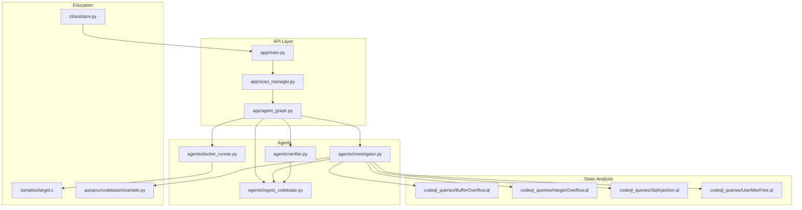
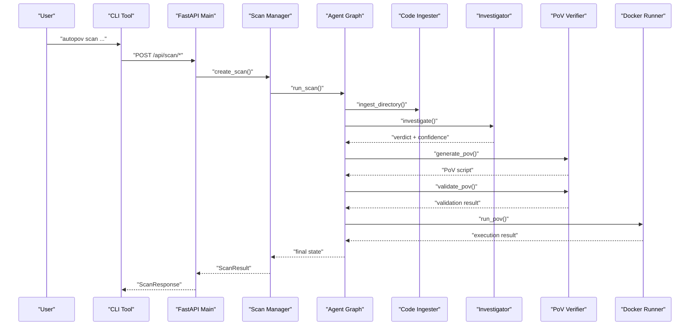
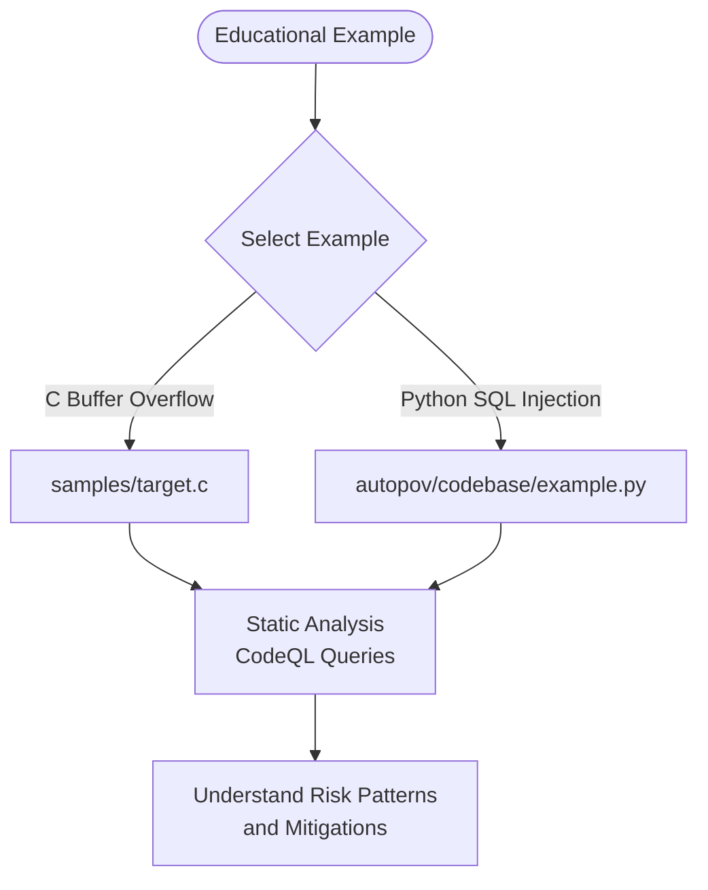
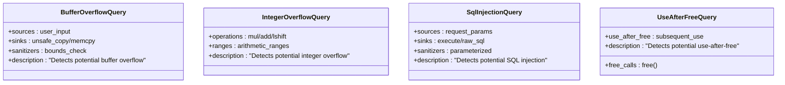
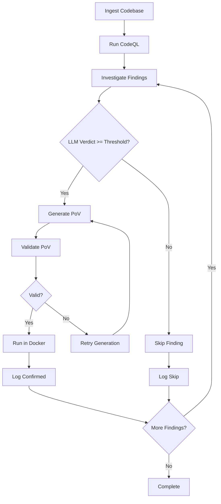
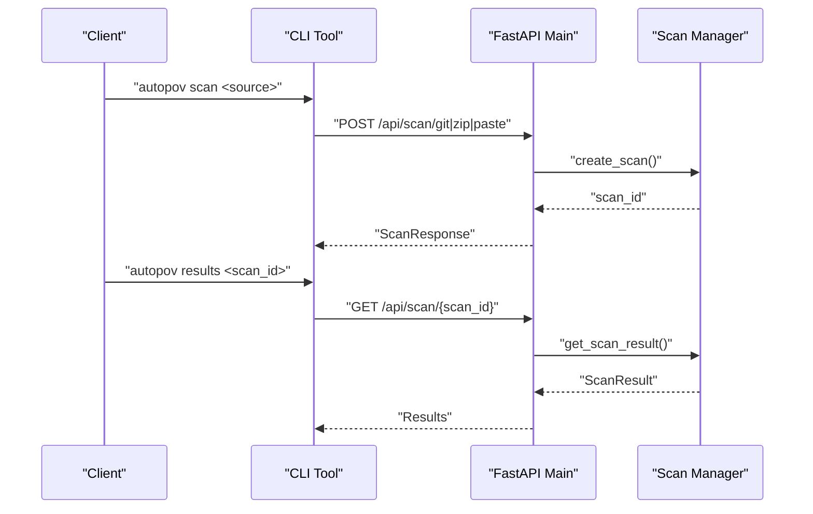
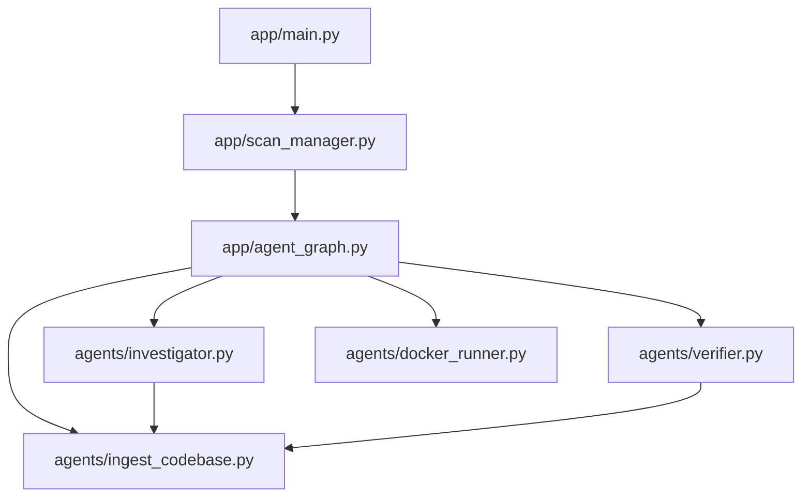

# Sample Vulnerability Files and Educational Examples

<cite>
**Referenced Files in This Document**
- [README.md](file://autopov/README.md)
- [target.c](file://samples/target.c)
- [example.py](file://autopov/codebase/example.py)
- [BufferOverflow.ql](file://autopov/codeql_queries/BufferOverflow.ql)
- [IntegerOverflow.ql](file://autopov/codeql_queries/IntegerOverflow.ql)
- [SqlInjection.ql](file://autopov/codeql_queries/SqlInjection.ql)
- [UseAfterFree.ql](file://autopov/codeql_queries/UseAfterFree.ql)
- [main.py](file://autopov/app/main.py)
- [agent_graph.py](file://autopov/app/agent_graph.py)
- [scan_manager.py](file://autopov/app/scan_manager.py)
- [autopov.py](file://autopov/cli/autopov.py)
- [ingest_codebase.py](file://autopov/agents/ingest_codebase.py)
- [investigator.py](file://autopov/agents/investigator.py)
- [verifier.py](file://autopov/agents/verifier.py)
- [docker_runner.py](file://autopov/agents/docker_runner.py)
</cite>

## Table of Contents
1. [Introduction](#introduction)
2. [Project Structure](#project-structure)
3. [Core Components](#core-components)
4. [Architecture Overview](#architecture-overview)
5. [Detailed Component Analysis](#detailed-component-analysis)
6. [Dependency Analysis](#dependency-analysis)
7. [Performance Considerations](#performance-considerations)
8. [Troubleshooting Guide](#troubleshooting-guide)
9. [Conclusion](#conclusion)

## Introduction
This document provides an educational overview of vulnerability files and examples within the AutoPoV framework. It focuses on three categories of learning materials:
- Real-world vulnerable code examples for hands-on study
- Educational CodeQL queries that demonstrate static analysis patterns for common vulnerabilities
- The automated workflow that detects, verifies, and benchmarks vulnerabilities

The goal is to help learners understand how static analysis, AI-driven reasoning, and safe execution environments work together to identify and validate security weaknesses.

## Project Structure
The repository organizes functionality into clear layers:
- Backend API and orchestration (FastAPI, scan manager, agent graph)
- Agents for ingestion, investigation, verification, and Docker execution
- Static analysis assets (CodeQL queries)
- CLI and sample codebases for education and testing
- Frontend dashboard for monitoring and results

**Diagram sources**
- [main.py](file://autopov/app/main.py#L104-L113)
- [agent_graph.py](file://autopov/app/agent_graph.py#L84-L159)
- [scan_manager.py](file://autopov/app/scan_manager.py#L40-L348)
- [ingest_codebase.py](file://autopov/agents/ingest_codebase.py#L41-L407)
- [investigator.py](file://autopov/agents/investigator.py#L37-L418)
- [verifier.py](file://autopov/agents/verifier.py#L40-L401)
- [docker_runner.py](file://autopov/agents/docker_runner.py#L27-L379)
- [BufferOverflow.ql](file://autopov/codeql_queries/BufferOverflow.ql#L1-L59)
- [IntegerOverflow.ql](file://autopov/codeql_queries/IntegerOverflow.ql#L1-L62)
- [SqlInjection.ql](file://autopov/codeql_queries/SqlInjection.ql#L1-L67)
- [UseAfterFree.ql](file://autopov/codeql_queries/UseAfterFree.ql#L1-L41)
- [target.c](file://samples/target.c#L1-L16)
- [example.py](file://autopov/codebase/example.py#L1-L55)
- [autopov.py](file://autopov/cli/autopov.py#L1-L588)

**Section sources**
- [README.md](file://autopov/README.md#L1-L242)
- [main.py](file://autopov/app/main.py#L104-L113)

## Core Components
This section highlights the key components that enable vulnerability detection and verification:

- API Layer
  - FastAPI application with endpoints for scanning, streaming logs, retrieving results, and managing API keys
  - Webhook handlers for GitHub/GitLab integrations
- Agent Graph
  - LangGraph workflow orchestrating ingestion, CodeQL analysis, LLM investigation, PoV generation/validation, and Docker execution
- Scan Manager
  - Manages scan lifecycle, persists results, and maintains history
- Agents
  - Code ingestion with chunking and embeddings
  - LLM-based investigation with RAG and optional Joern analysis
  - PoV generation and validation with safety checks
  - Docker execution with resource limits and sandboxing
- Static Analysis Queries
  - CodeQL queries for Buffer Overflow, Integer Overflow, SQL Injection, and Use After Free
- Education Materials
  - Vulnerable C example and Python example for SQL injection
  - CLI tool for automation and reporting

**Section sources**
- [main.py](file://autopov/app/main.py#L166-L577)
- [agent_graph.py](file://autopov/app/agent_graph.py#L78-L732)
- [scan_manager.py](file://autopov/app/scan_manager.py#L40-L348)
- [ingest_codebase.py](file://autopov/agents/ingest_codebase.py#L41-L407)
- [investigator.py](file://autopov/agents/investigator.py#L37-L418)
- [verifier.py](file://autopov/agents/verifier.py#L40-L401)
- [docker_runner.py](file://autopov/agents/docker_runner.py#L27-L379)
- [BufferOverflow.ql](file://autopov/codeql_queries/BufferOverflow.ql#L1-L59)
- [IntegerOverflow.ql](file://autopov/codeql_queries/IntegerOverflow.ql#L1-L62)
- [SqlInjection.ql](file://autopov/codeql_queries/SqlInjection.ql#L1-L67)
- [UseAfterFree.ql](file://autopov/codeql_queries/UseAfterFree.ql#L1-L41)
- [target.c](file://samples/target.c#L1-L16)
- [example.py](file://autopov/codebase/example.py#L1-L55)
- [autopov.py](file://autopov/cli/autopov.py#L1-L588)

## Architecture Overview
The system follows a hybrid approach combining static analysis and AI reasoning:
- Static analysis (CodeQL) identifies candidate vulnerabilities
- LLM investigation validates and contextualizes findings
- PoV scripts are generated and validated
- Docker execution safely triggers PoVs to confirm vulnerabilities

**Diagram sources**
- [autopov.py](file://autopov/cli/autopov.py#L113-L281)
- [main.py](file://autopov/app/main.py#L191-L358)
- [scan_manager.py](file://autopov/app/scan_manager.py#L86-L204)
- [agent_graph.py](file://autopov/app/agent_graph.py#L682-L722)
- [ingest_codebase.py](file://autopov/agents/ingest_codebase.py#L201-L307)
- [investigator.py](file://autopov/agents/investigator.py#L259-L371)
- [verifier.py](file://autopov/agents/verifier.py#L79-L149)
- [docker_runner.py](file://autopov/agents/docker_runner.py#L62-L192)

## Detailed Component Analysis

### Vulnerable Code Examples
These examples illustrate common vulnerabilities for educational purposes:
- C example with a classic buffer overflow scenario
- Python example demonstrating SQL injection patterns

**Diagram sources**
- [target.c](file://samples/target.c#L4-L8)
- [example.py](file://autopov/codebase/example.py#L9-L23)

**Section sources**
- [target.c](file://samples/target.c#L1-L16)
- [example.py](file://autopov/codebase/example.py#L1-L55)

### CodeQL Queries for Static Analysis
The repository includes educational CodeQL queries for four CWE families:
- Buffer Overflow (CWE-119)
- Integer Overflow (CWE-190)
- SQL Injection (CWE-89)
- Use After Free (CWE-416)

**Diagram sources**
- [BufferOverflow.ql](file://autopov/codeql_queries/BufferOverflow.ql#L16-L53)
- [IntegerOverflow.ql](file://autopov/codeql_queries/IntegerOverflow.ql#L15-L61)
- [SqlInjection.ql](file://autopov/codeql_queries/SqlInjection.ql#L17-L61)
- [UseAfterFree.ql](file://autopov/codeql_queries/UseAfterFree.ql#L16-L34)

**Section sources**
- [BufferOverflow.ql](file://autopov/codeql_queries/BufferOverflow.ql#L1-L59)
- [IntegerOverflow.ql](file://autopov/codeql_queries/IntegerOverflow.ql#L1-L62)
- [SqlInjection.ql](file://autopov/codeql_queries/SqlInjection.ql#L1-L67)
- [UseAfterFree.ql](file://autopov/codeql_queries/UseAfterFree.ql#L1-L41)

### Agent Graph Workflow
The LangGraph workflow coordinates the entire vulnerability detection pipeline:
- Ingestion: chunk code and embed into ChromaDB
- CodeQL: run targeted queries per CWE family
- Investigation: LLM evaluates findings with RAG context
- PoV Generation/Validation: create and validate PoV scripts
- Docker Execution: safely run PoVs to confirm vulnerabilities

**Diagram sources**
- [agent_graph.py](file://autopov/app/agent_graph.py#L84-L159)
- [agent_graph.py](file://autopov/app/agent_graph.py#L627-L665)

**Section sources**
- [agent_graph.py](file://autopov/app/agent_graph.py#L78-L732)

### API Endpoints and CLI Integration
The API exposes endpoints for initiating scans, streaming logs, retrieving results, and managing API keys. The CLI wraps these endpoints for automation and reporting.

**Diagram sources**
- [autopov.py](file://autopov/cli/autopov.py#L113-L281)
- [main.py](file://autopov/app/main.py#L191-L396)
- [scan_manager.py](file://autopov/app/scan_manager.py#L241-L298)

**Section sources**
- [autopov.py](file://autopov/cli/autopov.py#L1-L588)
- [main.py](file://autopov/app/main.py#L166-L577)
- [scan_manager.py](file://autopov/app/scan_manager.py#L40-L348)

## Dependency Analysis
The system exhibits layered dependencies:
- API depends on scan manager and agent graph
- Agent graph depends on ingestion, investigation, verification, and Docker runner
- Investigation leverages RAG and optional Joern analysis
- Verification enforces safety rules and uses LLM for advanced validation
- Docker runner encapsulates container execution with strict limits

**Diagram sources**
- [main.py](file://autopov/app/main.py#L19-L25)
- [agent_graph.py](file://autopov/app/agent_graph.py#L22-L26)
- [scan_manager.py](file://autopov/app/scan_manager.py#L16-L18)
- [ingest_codebase.py](file://autopov/agents/ingest_codebase.py#L33)
- [investigator.py](file://autopov/agents/investigator.py#L27-L29)
- [verifier.py](file://autopov/agents/verifier.py#L27-L32)
- [docker_runner.py](file://autopov/agents/docker_runner.py#L19)

**Section sources**
- [main.py](file://autopov/app/main.py#L19-L25)
- [agent_graph.py](file://autopov/app/agent_graph.py#L22-L26)
- [scan_manager.py](file://autopov/app/scan_manager.py#L16-L18)

## Performance Considerations
- Embedding and retrieval scale with codebase size; batching reduces overhead
- CodeQL queries benefit from language-specific extractors and pack syntax
- LLM inference costs depend on token usage and model mode (online/offline)
- Docker execution is constrained by memory, CPU, and timeouts to prevent resource exhaustion
- Thread pools and asynchronous execution improve throughput for multiple scans

[No sources needed since this section provides general guidance]

## Troubleshooting Guide
Common issues and resolutions:
- Missing dependencies
  - Install required packages for embeddings, ChromaDB, Docker, and optional tools (CodeQL, Joern)
- API key problems
  - Generate and configure API keys via CLI or web UI; verify environment variables
- Docker not available
  - Ensure Docker is installed and accessible; the runner falls back gracefully
- CodeQL not available
  - The system continues with LLM-only analysis when CodeQL is missing
- Webhook failures
  - Verify webhook URLs, secrets, and event types; check backend logs for errors

**Section sources**
- [main.py](file://autopov/app/main.py#L167-L176)
- [docker_runner.py](file://autopov/agents/docker_runner.py#L50-L61)
- [investigator.py](file://autopov/agents/investigator.py#L117-L119)
- [README.md](file://autopov/README.md#L39-L46)

## Conclusion
The AutoPoV framework demonstrates a practical approach to vulnerability detection and verification by combining static analysis, AI reasoning, and safe execution. The included sample vulnerability files and CodeQL queries serve as valuable educational resources for understanding risk patterns and mitigation strategies. By leveraging the API, CLI, and agent graph, users can automate discovery, validation, and benchmarking of security weaknesses across diverse codebases.