# Testing and Quality Assurance

<cite>
**Referenced Files in This Document**
- [test_agent.py](file://autopov/tests/test_agent.py)
- [test_api.py](file://autopov/tests/test_api.py)
- [test_auth.py](file://autopov/tests/test_auth.py)
- [test_git_handler.py](file://autopov/tests/test_git_handler.py)
- [test_source_handler.py](file://autopov/tests/test_source_handler.py)
- [test_webhook_handler.py](file://autopov/tests/test_webhook_handler.py)
- [main.py](file://autopov/app/main.py)
- [auth.py](file://autopov/app/auth.py)
- [webhook_handler.py](file://autopov/app/webhook_handler.py)
- [git_handler.py](file://autopov/app/git_handler.py)
- [source_handler.py](file://autopov/app/source_handler.py)
- [verifier.py](file://autopov/agents/verifier.py)
- [docker_runner.py](file://autopov/agents/docker_runner.py)
- [config.py](file://autopov/app/config.py)
- [BufferOverflow.ql](file://autopov/codeql_queries/BufferOverflow.ql)
- [target.c](file://autopov/samples/target.c)
- [package.json](file://autopov/frontend/package.json)
- [prompts.py](file://autopov/prompts.py)
</cite>

## Update Summary
**Changes Made**
- Added comprehensive documentation for the new vulnerability sample file (samples/target.c) demonstrating buffer overflow vulnerabilities
- Enhanced buffer overflow testing methodology with practical sample vulnerability demonstration
- Updated testing strategies to include C/C++ vulnerability detection and validation using CodeQL queries
- Integrated CWE-119 specific validation rules and Docker-based vulnerability testing workflows
- Expanded agent verification testing to include buffer overflow-specific patterns and detection

## Table of Contents
1. [Introduction](#introduction)
2. [Project Structure](#project-structure)
3. [Core Components](#core-components)
4. [Architecture Overview](#architecture-overview)
5. [Detailed Component Analysis](#detailed-component-analysis)
6. [Sample Vulnerability Testing](#sample-vulnerability-testing)
7. [Dependency Analysis](#dependency-analysis)
8. [Performance Considerations](#performance-considerations)
9. [Troubleshooting Guide](#troubleshooting-guide)
10. [Conclusion](#conclusion)
11. [Appendices](#appendices)

## Introduction
This document describes AutoPoV's comprehensive testing and quality assurance framework with a focus on ensuring system reliability and correctness. It covers the organization of the test suite (unit, integration, and component tests), testing methodologies for API endpoints, agent workflows, authentication systems, and frontend components. The framework now includes specialized testing for buffer overflow vulnerabilities using practical sample files and CodeQL-based detection. It also documents mock usage, test fixtures, environment setup, continuous integration practices, automated workflows, quality gates, and guidance for writing new tests, running suites, and interpreting results. Specialized topics include testing agent-based systems, Docker integration testing, and LLM interaction testing.

## Project Structure
The test suite resides under autopov/tests and targets core backend modules and agents. Each test file corresponds to a major component area:
- API endpoints and routing: test_api.py
- Authentication and API key management: test_auth.py
- Git operations and repository handling: test_git_handler.py
- Source handling (ZIP, raw code, uploads): test_source_handler.py
- Webhook handlers (GitHub/GitLab): test_webhook_handler.py
- Agent verifier (PoV generation/validation): test_agent.py

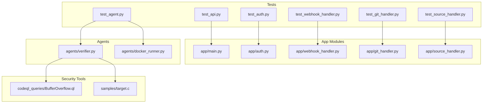

**Diagram sources**
- [test_api.py](file://autopov/tests/test_api.py#L1-L60)
- [test_auth.py](file://autopov/tests/test_auth.py#L1-L66)
- [test_git_handler.py](file://autopov/tests/test_git_handler.py#L1-L63)
- [test_source_handler.py](file://autopov/tests/test_source_handler.py#L1-L79)
- [test_webhook_handler.py](file://autopov/tests/test_webhook_handler.py#L1-L166)
- [test_agent.py](file://autopov/tests/test_agent.py#L1-L71)
- [main.py](file://autopov/app/main.py#L1-L529)
- [auth.py](file://autopov/app/auth.py#L1-L168)
- [webhook_handler.py](file://autopov/app/webhook_handler.py#L1-L363)
- [git_handler.py](file://autopov/app/git_handler.py#L1-L222)
- [source_handler.py](file://autopov/app/source_handler.py#L1-L380)
- [verifier.py](file://autopov/agents/verifier.py#L1-L401)
- [docker_runner.py](file://autopov/agents/docker_runner.py#L1-L379)
- [BufferOverflow.ql](file://autopov/codeql_queries/BufferOverflow.ql#L1-L59)
- [target.c](file://autopov/samples/target.c#L1-L16)

**Section sources**
- [test_api.py](file://autopov/tests/test_api.py#L1-L60)
- [test_auth.py](file://autopov/tests/test_auth.py#L1-L66)
- [test_git_handler.py](file://autopov/tests/test_git_handler.py#L1-L63)
- [test_source_handler.py](file://autopov/tests/test_source_handler.py#L1-L79)
- [test_webhook_handler.py](file://autopov/tests/test_webhook_handler.py#L1-L166)
- [test_agent.py](file://autopov/tests/test_agent.py#L1-L71)

## Core Components
- API endpoints and routing: health checks, scan initiation, status streaming, history, reports, webhooks, and admin key management.
- Authentication: Bearer token verification, admin key enforcement, and API key storage with hashing and persistence.
- Git operations: provider detection, credential injection, cloning, commit/branch checkout, cleanup, and repository info extraction.
- Source handling: ZIP/TAR extraction, raw code paste, file/folder uploads, cleanup, and binary detection.
- Webhook handlers: GitHub/GitLab signature/token verification, event parsing, and triggering scans via callbacks.
- Agent verifier: PoV generation and validation using LLMs, AST-based checks, and CWE-specific rules.
- Docker runner: Secure execution of PoV scripts in isolated containers with resource limits and network isolation.
- CodeQL integration: Automated vulnerability detection using custom queries for buffer overflow and other security issues.

**Section sources**
- [main.py](file://autopov/app/main.py#L161-L529)
- [auth.py](file://autopov/app/auth.py#L32-L167)
- [git_handler.py](file://autopov/app/git_handler.py#L18-L222)
- [source_handler.py](file://autopov/app/source_handler.py#L18-L380)
- [webhook_handler.py](file://autopov/app/webhook_handler.py#L15-L363)
- [verifier.py](file://autopov/agents/verifier.py#L40-L401)
- [docker_runner.py](file://autopov/agents/docker_runner.py#L27-L379)
- [BufferOverflow.ql](file://autopov/codeql_queries/BufferOverflow.ql#L1-L59)

## Architecture Overview
The test suite targets the FastAPI application and its dependencies. Tests leverage:
- FastAPI TestClient for endpoint-level integration tests.
- Pydantic models and dependency injection to exercise auth and service layers.
- Mocking and monkeypatching for external secrets and environment-dependent behavior.
- Fixture-based setup for temporary storage, directories, and test data.
- Sample vulnerability files for practical testing of security detection capabilities.
- Docker containers for secure execution of potentially malicious PoV scripts.

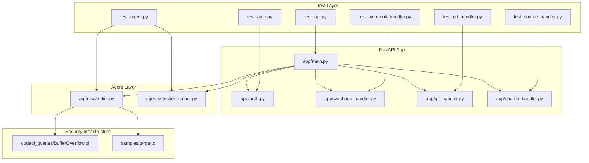

**Diagram sources**
- [test_api.py](file://autopov/tests/test_api.py#L1-L60)
- [test_auth.py](file://autopov/tests/test_auth.py#L1-L66)
- [test_webhook_handler.py](file://autopov/tests/test_webhook_handler.py#L1-L166)
- [test_git_handler.py](file://autopov/tests/test_git_handler.py#L1-L63)
- [test_source_handler.py](file://autopov/tests/test_source_handler.py#L1-L79)
- [test_agent.py](file://autopov/tests/test_agent.py#L1-L71)
- [main.py](file://autopov/app/main.py#L1-L529)
- [auth.py](file://autopov/app/auth.py#L1-L168)
- [webhook_handler.py](file://autopov/app/webhook_handler.py#L1-L363)
- [git_handler.py](file://autopov/app/git_handler.py#L1-L222)
- [source_handler.py](file://autopov/app/source_handler.py#L1-L380)
- [verifier.py](file://autopov/agents/verifier.py#L1-L401)
- [docker_runner.py](file://autopov/agents/docker_runner.py#L1-L379)
- [BufferOverflow.ql](file://autopov/codeql_queries/BufferOverflow.ql#L1-L59)
- [target.c](file://autopov/samples/target.c#L1-L16)

## Detailed Component Analysis

### API Endpoint Testing
- Health endpoint: verifies status and version fields.
- Scan endpoints: ensure authentication is enforced and unauthorized requests are rejected.
- Webhook endpoints: validate error responses when signatures/tokens are missing.

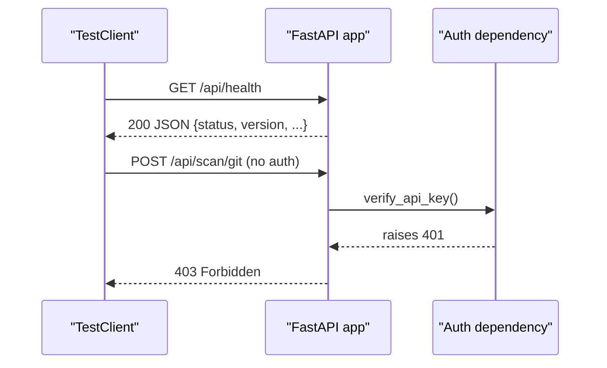

**Diagram sources**
- [test_api.py](file://autopov/tests/test_api.py#L13-L40)
- [main.py](file://autopov/app/main.py#L161-L216)
- [auth.py](file://autopov/app/auth.py#L137-L148)

**Section sources**
- [test_api.py](file://autopov/tests/test_api.py#L1-L60)
- [main.py](file://autopov/app/main.py#L161-L216)
- [auth.py](file://autopov/app/auth.py#L137-L148)

### Authentication and API Keys
- API key generation, validation, revocation, and listing are covered.
- Temporary storage is used to avoid persistent state across tests.
- Admin key enforcement is tested conceptually.

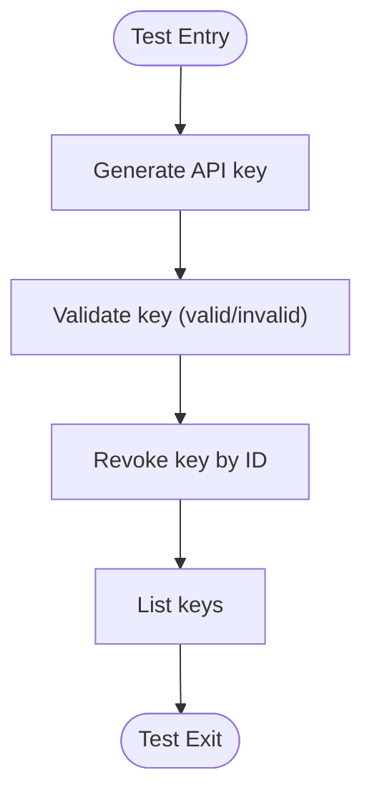

**Diagram sources**
- [test_auth.py](file://autopov/tests/test_auth.py#L27-L55)
- [auth.py](file://autopov/app/auth.py#L63-L124)

**Section sources**
- [test_auth.py](file://autopov/tests/test_auth.py#L1-L66)
- [auth.py](file://autopov/app/auth.py#L32-L167)

### Git Handler Testing
- Provider detection for GitHub, GitLab, Bitbucket, and unknown providers.
- Sanitization of scan IDs for filesystem safety.
- Language detection from file extensions.
- Binary file detection using a small read chunk heuristic.

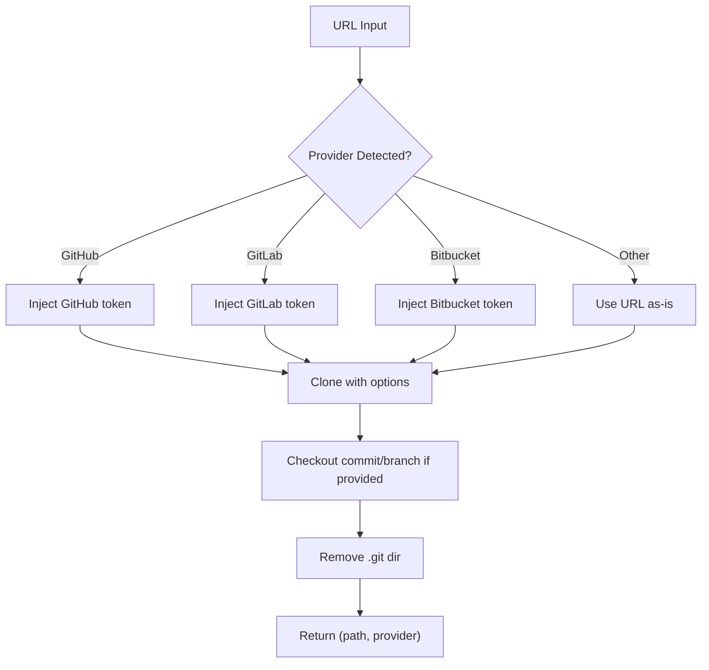

**Diagram sources**
- [test_git_handler.py](file://autopov/tests/test_git_handler.py#L20-L49)
- [git_handler.py](file://autopov/app/git_handler.py#L43-L124)

**Section sources**
- [test_git_handler.py](file://autopov/tests/test_git_handler.py#L1-L63)
- [git_handler.py](file://autopov/app/git_handler.py#L18-L222)

### Source Handler Testing
- Raw code paste: creates a file under a scan-scoped directory.
- ZIP upload: extracts securely, guards against path traversal, flattens single-root folders.
- Source info aggregation: counts files, lines, and languages.
- Binary detection: identifies binary files for potential specialized parsing.

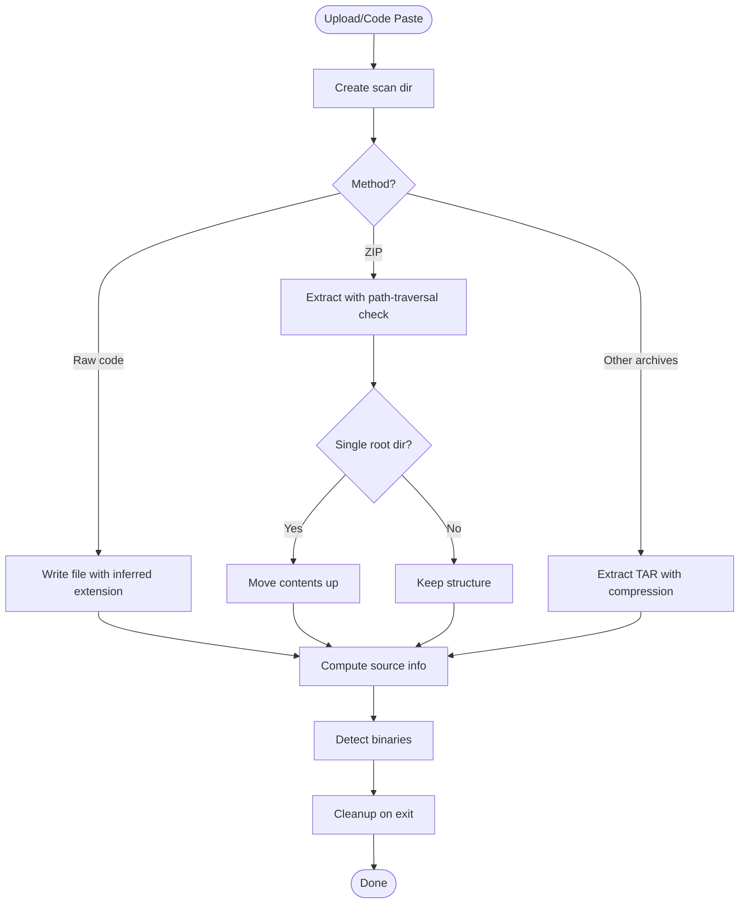

**Diagram sources**
- [test_source_handler.py](file://autopov/tests/test_source_handler.py#L26-L78)
- [source_handler.py](file://autopov/app/source_handler.py#L31-L380)

**Section sources**
- [test_source_handler.py](file://autopov/tests/test_source_handler.py#L1-L79)
- [source_handler.py](file://autopov/app/source_handler.py#L18-L380)

### Webhook Handler Testing
- GitHub signature verification using HMAC-SHA256 and constant-time comparison.
- GitLab token verification using constant-time comparison.
- Event parsing for push and pull/merge request events with trigger decisions.
- Callback payload creation for reporting scan outcomes.

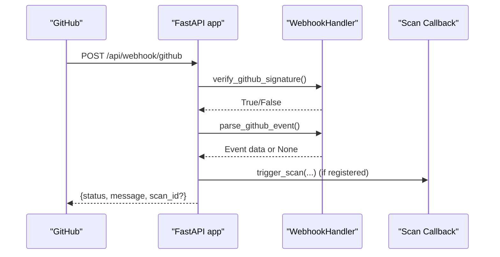

**Diagram sources**
- [test_webhook_handler.py](file://autopov/tests/test_webhook_handler.py#L21-L122)
- [webhook_handler.py](file://autopov/app/webhook_handler.py#L25-L132)
- [main.py](file://autopov/app/main.py#L120-L158)

**Section sources**
- [test_webhook_handler.py](file://autopov/tests/test_webhook_handler.py#L1-L166)
- [webhook_handler.py](file://autopov/app/webhook_handler.py#L15-L363)
- [main.py](file://autopov/app/main.py#L120-L158)

### Agent Verifier Testing
- Validates PoV scripts for syntax errors and required trigger phrase.
- Ensures only standard library modules are imported.
- CWE-specific checks (e.g., SQL keywords for CWE-89).
- LLM-based validation and suggestions.

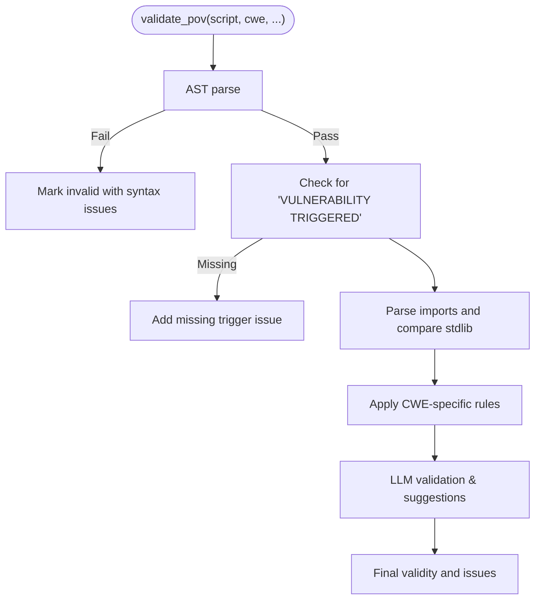

**Diagram sources**
- [test_agent.py](file://autopov/tests/test_agent.py#L17-L70)
- [verifier.py](file://autopov/agents/verifier.py#L151-L227)

**Section sources**
- [test_agent.py](file://autopov/tests/test_agent.py#L1-L71)
- [verifier.py](file://autopov/agents/verifier.py#L40-L401)

### Frontend Component Testing
- The frontend package.json defines development and build scripts, linting, and React dependencies. While no dedicated frontend test files are present in the repository snapshot, the testing strategy should include:
  - Unit tests for React components using a testing library (e.g., React Testing Library).
  - API integration tests to validate UI interactions with backend endpoints.
  - Snapshot or visual regression tests for key pages/components.

**Section sources**
- [package.json](file://autopov/frontend/package.json#L1-L34)

## Sample Vulnerability Testing

### Buffer Overflow Detection with CodeQL
AutoPoV includes comprehensive buffer overflow vulnerability detection using CodeQL queries. The framework utilizes a custom query (`BufferOverflow.ql`) that detects potential buffer overflow vulnerabilities in C/C++ code by analyzing data flow between user inputs and unsafe buffer operations.

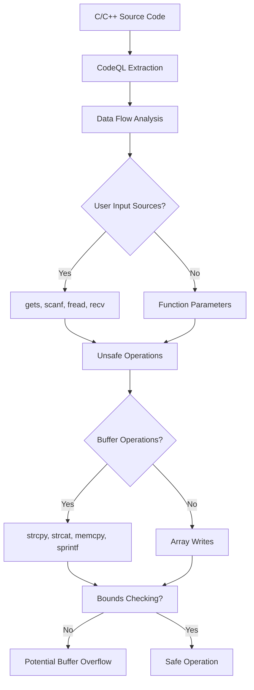

**Diagram sources**
- [BufferOverflow.ql](file://autopov/codeql_queries/BufferOverflow.ql#L16-L53)

### Practical Sample Vulnerability Demonstration
The framework includes a practical sample vulnerability file (`samples/target.c`) that demonstrates a classic buffer overflow scenario. This file serves as both a teaching example and a test case for vulnerability detection systems.

**Sample Vulnerability Analysis:**
- **File:** `samples/target.c`
- **Vulnerability Type:** Buffer overflow (CWE-119)
- **Root Cause:** `strcpy` function used without bounds checking
- **Risk Level:** High severity
- **Detection Method:** CodeQL data flow analysis

**Section sources**
- [BufferOverflow.ql](file://autopov/codeql_queries/BufferOverflow.ql#L1-L59)
- [target.c](file://autopov/samples/target.c#L1-L16)

### CWE-119 Specific Validation and Testing
The agent verifier includes specific validation rules for buffer overflow vulnerabilities (CWE-119). These rules ensure that PoV scripts effectively trigger buffer overflow conditions by checking for relevant patterns and providing suggestions for improvement.

**CWE-119 Validation Features:**
- Pattern matching for buffer-related terms (buffer, overflow, size, length, *)
- Validation of PoV script effectiveness for triggering buffer overflow
- Suggestions for improving PoV script specificity and reliability

**Section sources**
- [verifier.py](file://autopov/agents/verifier.py#L265-L291)
- [prompts.py](file://autopov/prompts.py#L71-L77)

### Docker-Based Vulnerability Testing
AutoPoV's Docker runner provides a secure environment for testing potentially malicious PoV scripts. The system isolates execution in containers with resource limits and network restrictions.

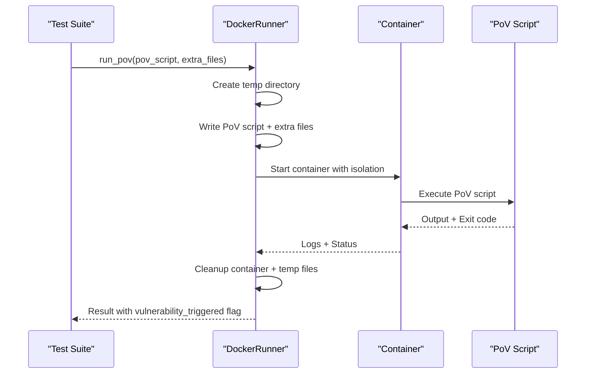

**Diagram sources**
- [docker_runner.py](file://autopov/agents/docker_runner.py#L62-L192)

**Section sources**
- [docker_runner.py](file://autopov/agents/docker_runner.py#L27-L379)

## Dependency Analysis
The tests depend on the application modules and FastAPI's TestClient. Key dependency chains:
- API tests depend on app/main.py and auth.py for route definitions and dependency injection.
- Webhook tests depend on app/webhook_handler.py and app/config.py for secrets and event parsing.
- Git and source handler tests depend on app/git_handler.py and app/source_handler.py for core logic.
- Agent tests depend on agents/verifier.py for PoV generation/validation.
- Security tests depend on codeql_queries/BufferOverflow.ql and samples/target.c for vulnerability detection.

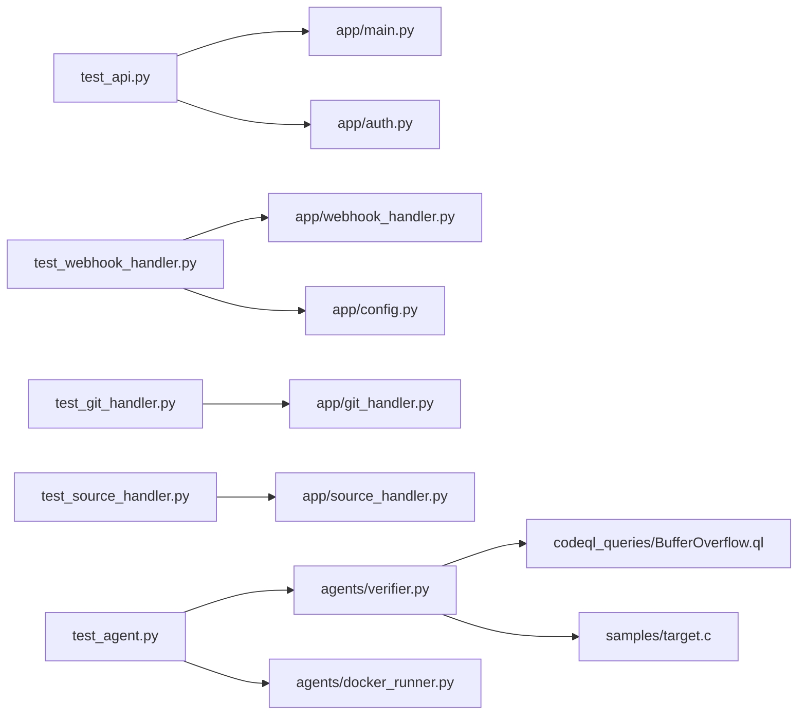

**Diagram sources**
- [test_api.py](file://autopov/tests/test_api.py#L1-L60)
- [test_auth.py](file://autopov/tests/test_auth.py#L1-L66)
- [test_webhook_handler.py](file://autopov/tests/test_webhook_handler.py#L1-L166)
- [test_git_handler.py](file://autopov/tests/test_git_handler.py#L1-L63)
- [test_source_handler.py](file://autopov/tests/test_source_handler.py#L1-L79)
- [test_agent.py](file://autopov/tests/test_agent.py#L1-L71)
- [main.py](file://autopov/app/main.py#L1-L529)
- [auth.py](file://autopov/app/auth.py#L1-L168)
- [webhook_handler.py](file://autopov/app/webhook_handler.py#L1-L363)
- [git_handler.py](file://autopov/app/git_handler.py#L1-L222)
- [source_handler.py](file://autopov/app/source_handler.py#L1-L380)
- [verifier.py](file://autopov/agents/verifier.py#L1-L401)
- [docker_runner.py](file://autopov/agents/docker_runner.py#L1-L379)
- [BufferOverflow.ql](file://autopov/codeql_queries/BufferOverflow.ql#L1-L59)
- [target.c](file://autopov/samples/target.c#L1-L16)
- [config.py](file://autopov/app/config.py#L1-L210)

**Section sources**
- [test_api.py](file://autopov/tests/test_api.py#L1-L60)
- [test_auth.py](file://autopov/tests/test_auth.py#L1-L66)
- [test_webhook_handler.py](file://autopov/tests/test_webhook_handler.py#L1-L166)
- [test_git_handler.py](file://autopov/tests/test_git_handler.py#L1-L63)
- [test_source_handler.py](file://autopov/tests/test_source_handler.py#L1-L79)
- [test_agent.py](file://autopov/tests/test_agent.py#L1-L71)
- [main.py](file://autopov/app/main.py#L1-L529)
- [auth.py](file://autopov/app/auth.py#L1-L168)
- [webhook_handler.py](file://autopov/app/webhook_handler.py#L1-L363)
- [git_handler.py](file://autopov/app/git_handler.py#L1-L222)
- [source_handler.py](file://autopov/app/source_handler.py#L1-L380)
- [verifier.py](file://autopov/agents/verifier.py#L1-L401)
- [docker_runner.py](file://autopov/agents/docker_runner.py#L1-L379)
- [config.py](file://autopov/app/config.py#L1-L210)

## Performance Considerations
- Prefer lightweight fixtures and temporary directories to minimize I/O overhead.
- Use mocking for external systems (e.g., LLMs, Git providers) to avoid flaky network-bound tests.
- For API tests, reuse a single TestClient instance per session to reduce startup costs.
- Limit expensive operations in tests; defer heavy computations to integration tests.
- Docker container execution should be configured with appropriate resource limits to prevent resource exhaustion.
- CodeQL analysis should be optimized for test scenarios to avoid unnecessary processing overhead.

## Troubleshooting Guide
Common issues and resolutions:
- Authentication failures: ensure API keys are generated and passed in Authorization headers; verify admin key usage for admin endpoints.
- Webhook signature/token mismatches: confirm secrets are set in environment/configuration and signatures/tokens match expectations.
- Git clone failures: verify tokens and URLs; ensure provider detection matches the repository host.
- Source extraction errors: validate ZIP/TAR integrity and guard against path traversal.
- LLM availability: configure online/offline model settings and credentials; tests should gracefully handle missing dependencies.
- Docker execution failures: verify Docker installation and permissions; check container resource limits and timeouts.
- CodeQL query failures: ensure CodeQL CLI is installed and database creation succeeds; verify query syntax and dependencies.

**Section sources**
- [test_auth.py](file://autopov/tests/test_auth.py#L27-L55)
- [test_webhook_handler.py](file://autopov/tests/test_webhook_handler.py#L21-L122)
- [test_git_handler.py](file://autopov/tests/test_git_handler.py#L60-L63)
- [test_source_handler.py](file://autopov/tests/test_source_handler.py#L41-L78)
- [verifier.py](file://autopov/agents/verifier.py#L46-L77)
- [config.py](file://autopov/app/config.py#L173-L189)
- [docker_runner.py](file://autopov/agents/docker_runner.py#L37-L61)

## Conclusion
AutoPoV's comprehensive test suite provides robust coverage across API endpoints, authentication, Git and source handling, webhooks, agent verification, and security vulnerability detection. The inclusion of practical sample vulnerability files and CodeQL-based detection enhances the framework's ability to validate security scanning capabilities. By leveraging fixtures, mocks, targeted integration tests, and secure Docker execution environments, the framework ensures reliability and correctness. Extending tests to cover frontend components and adding CI/CD quality gates will further strengthen the QA process.

## Appendices

### Practical Examples

- Writing a new unit test for a new API endpoint:
  - Add a test method in test_api.py using FastAPI TestClient to call the endpoint.
  - Use Depends hooks to simulate authenticated/admin contexts.
  - Assert status codes and response shapes.

- Running the test suite:
  - Execute pytest from the repository root to discover and run all tests in autopov/tests.

- Interpreting test results:
  - Focus on assertion failures for status codes, field presence, and error messages.
  - For authentication tests, verify 401/403 responses and WWW-Authenticate headers.

- Testing agent-based systems:
  - Mock LLM clients in verifiers to avoid network calls.
  - Use deterministic inputs to validate AST parsing and CWE-specific rules.

- Docker integration testing:
  - Use config.py helpers to detect Docker availability and adjust test behavior accordingly.
  - For containerized environments, run tests with Docker enabled and appropriate resource limits.
  - Test vulnerability detection by running PoV scripts that trigger "VULNERABILITY TRIGGERED" output.

- LLM interaction testing:
  - Configure model mode (online/offline) via environment variables.
  - Validate that missing dependencies raise clear exceptions and that fallbacks are handled.

- Buffer overflow vulnerability testing:
  - Use the sample target.c file as a test case for CodeQL detection.
  - Verify that the BufferOverflow.ql query correctly identifies the vulnerability.
  - Test Docker-based execution of PoV scripts that exploit the vulnerability.
  - Validate CWE-119 specific patterns in PoV scripts using verifier._validate_cwe_specific().

- Test maintenance and regression testing:
  - Keep fixtures minimal and isolated.
  - Add regression tests for bug fixes and feature additions.
  - Periodically review and update tests that depend on external services or environment variables.

**Section sources**
- [test_api.py](file://autopov/tests/test_api.py#L1-L60)
- [test_auth.py](file://autopov/tests/test_auth.py#L1-L66)
- [test_webhook_handler.py](file://autopov/tests/test_webhook_handler.py#L1-L166)
- [test_git_handler.py](file://autopov/tests/test_git_handler.py#L1-L63)
- [test_source_handler.py](file://autopov/tests/test_source_handler.py#L1-L79)
- [test_agent.py](file://autopov/tests/test_agent.py#L1-L71)
- [config.py](file://autopov/app/config.py#L123-L189)
- [verifier.py](file://autopov/agents/verifier.py#L46-L77)
- [BufferOverflow.ql](file://autopov/codeql_queries/BufferOverflow.ql#L1-L59)
- [target.c](file://autopov/samples/target.c#L1-L16)
- [docker_runner.py](file://autopov/agents/docker_runner.py#L62-L192)
- [prompts.py](file://autopov/prompts.py#L71-L77)