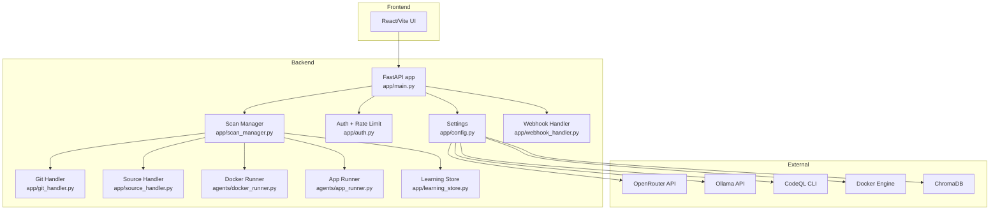
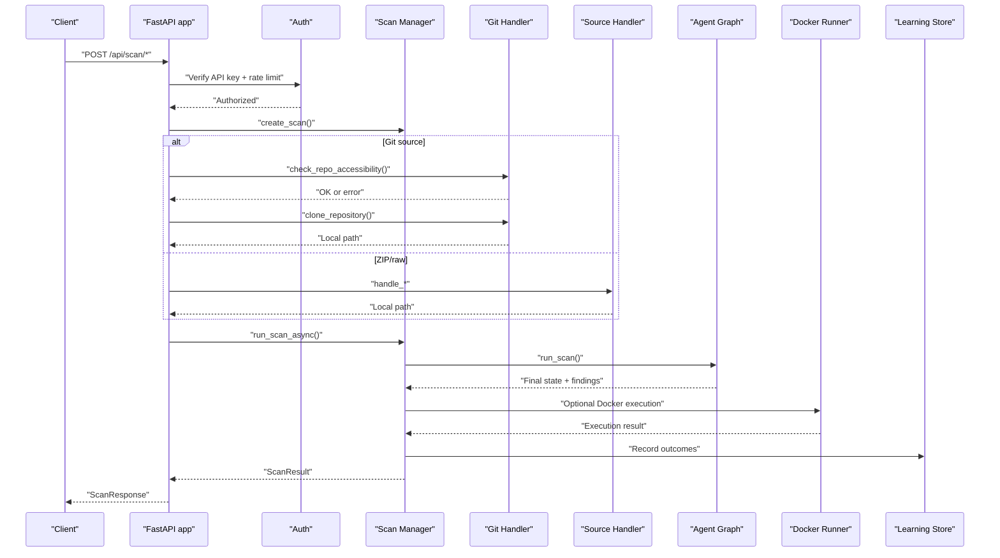
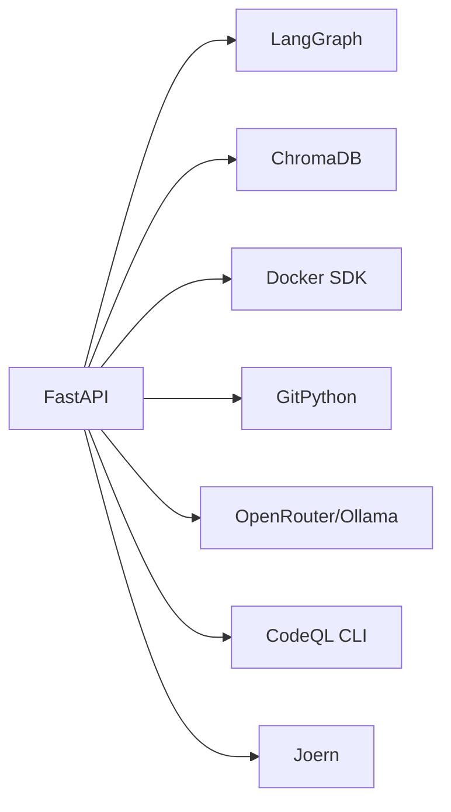

# Troubleshooting & FAQ

<cite>
**Referenced Files in This Document**
- [README.md](file://README.md)
- [app/main.py](file://app/main.py)
- [app/config.py](file://app/config.py)
- [app/auth.py](file://app/auth.py)
- [app/scan_manager.py](file://app/scan_manager.py)
- [app/webhook_handler.py](file://app/webhook_handler.py)
- [app/git_handler.py](file://app/git_handler.py)
- [app/source_handler.py](file://app/source_handler.py)
- [agents/docker_runner.py](file://agents/docker_runner.py)
- [agents/app_runner.py](file://agents/app_runner.py)
- [app/learning_store.py](file://app/learning_store.py)
- [docker-compose.yml](file://docker-compose.yml)
- [Dockerfile.backend](file://Dockerfile.backend)
- [requirements.txt](file://requirements.txt)
- [run.sh](file://run.sh)
- [cli/autopov.py](file://cli/autopov.py)
- [data/api_keys.json](file://data/api_keys.json)
</cite>

## Table of Contents
1. [Introduction](#introduction)
2. [Project Structure](#project-structure)
3. [Core Components](#core-components)
4. [Architecture Overview](#architecture-overview)
5. [Detailed Component Analysis](#detailed-component-analysis)
6. [Dependency Analysis](#dependency-analysis)
7. [Performance Considerations](#performance-considerations)
8. [Troubleshooting Guide](#troubleshooting-guide)
9. [Conclusion](#conclusion)
10. [Appendices](#appendices)

## Introduction
This document provides comprehensive troubleshooting and FAQ guidance for deploying and operating AutoPoV. It covers installation issues, environment setup, Docker configuration, runtime failures, debugging techniques, network/API/webhook problems, resource constraints, security-related issues, and escalation procedures.

## Project Structure
AutoPoV is a FastAPI backend with a React/Vite frontend, orchestrated by LangGraph agents. Key runtime components include:
- Backend API and agent orchestration
- Authentication and rate limiting
- Git and ZIP/raw code ingestion
- Webhook handlers for GitHub/GitLab
- Docker-based sandbox execution
- Learning store for model routing
- CLI and health endpoints

**Diagram sources**
- [app/main.py:114-122](file://app/main.py#L114-L122)
- [app/config.py:13-254](file://app/config.py#L13-L254)
- [app/auth.py:192-255](file://app/auth.py#L192-L255)
- [app/scan_manager.py:47-662](file://app/scan_manager.py#L47-L662)
- [app/webhook_handler.py:15-362](file://app/webhook_handler.py#L15-L362)
- [app/git_handler.py:20-391](file://app/git_handler.py#L20-L391)
- [app/source_handler.py:18-381](file://app/source_handler.py#L18-L381)
- [agents/docker_runner.py:27-376](file://agents/docker_runner.py#L27-L376)
- [agents/app_runner.py:19-199](file://agents/app_runner.py#L19-L199)
- [app/learning_store.py:14-255](file://app/learning_store.py#L14-L255)

**Section sources**
- [README.md:89-124](file://README.md#L89-L124)
- [app/main.py:114-122](file://app/main.py#L114-L122)
- [app/config.py:13-254](file://app/config.py#L13-L254)

## Core Components
- FastAPI application with health, scan, report, webhook, and admin endpoints
- Configuration loader supporting environment-driven settings and availability checks
- Authentication with HMAC-safe admin key and SHA-256 hashed API keys plus rate limiting
- Scan lifecycle manager coordinating agent graph execution and persisting results
- Git and ZIP/raw code ingestion with safety checks and timeouts
- Webhook handlers verifying signatures/tokens and triggering scans
- Docker runner enforcing sandbox constraints and timeouts
- Learning store recording agent outcomes for adaptive routing

**Section sources**
- [app/main.py:175-767](file://app/main.py#L175-L767)
- [app/config.py:162-211](file://app/config.py#L162-L211)
- [app/auth.py:192-255](file://app/auth.py#L192-L255)
- [app/scan_manager.py:234-365](file://app/scan_manager.py#L234-L365)
- [app/webhook_handler.py:196-336](file://app/webhook_handler.py#L196-L336)
- [agents/docker_runner.py:50-191](file://agents/docker_runner.py#L50-L191)
- [app/learning_store.py:126-248](file://app/learning_store.py#L126-L248)

## Architecture Overview
End-to-end flow from request to sandbox execution and reporting.

**Diagram sources**
- [app/main.py:204-400](file://app/main.py#L204-L400)
- [app/scan_manager.py:234-365](file://app/scan_manager.py#L234-L365)
- [app/git_handler.py:155-294](file://app/git_handler.py#L155-L294)
- [app/source_handler.py:31-191](file://app/source_handler.py#L31-L191)
- [agents/docker_runner.py:62-191](file://agents/docker_runner.py#L62-L191)
- [app/learning_store.py:61-123](file://app/learning_store.py#L61-L123)

## Detailed Component Analysis

### Installation and Environment Setup
Common issues:
- Missing prerequisites (Python, Node.js, Docker)
- Missing or incorrect .env configuration
- Dependency conflicts and missing optional tools (CodeQL, Joern)

Resolution steps:
- Confirm Python 3.11+ and Node.js 20+ are installed
- Create and edit .env with required keys (OpenRouter API key, Admin API key)
- Install dependencies per requirements.txt
- Optional: Install CodeQL CLI and Joern for enhanced analysis

Diagnostic commands:
- Backend: [run.sh backend:78-98](file://run.sh#L78-L98)
- Frontend: [run.sh frontend:102-117](file://run.sh#L102-L117)
- Both: [run.sh both:121-160](file://run.sh#L121-L160)
- Health check: [run.sh health:613-636](file://run.sh#L613-L636)

**Section sources**
- [README.md:130-177](file://README.md#L130-L177)
- [run.sh:36-98](file://run.sh#L36-L98)
- [requirements.txt:1-44](file://requirements.txt#L1-L44)

### Docker Configuration and Sandbox Execution
Symptoms:
- Docker not available or unreachable
- Container fails to start or times out
- Sandbox denies network access

Checks:
- Availability checks in settings and Docker runner
- Verify Docker daemon is running and accessible
- Confirm image pull and container creation succeed
- Review timeout and resource limits

Key behaviors:
- Docker runner ensures image exists, runs with no network, memory/cpu limits, and timeout
- Sandbox prints “VULNERABILITY TRIGGERED” in stdout to detect success

**Section sources**
- [app/config.py:162-174](file://app/config.py#L162-L174)
- [agents/docker_runner.py:50-191](file://agents/docker_runner.py#L50-L191)
- [docker-compose.yml:1-41](file://docker-compose.yml#L1-L41)
- [Dockerfile.backend:20-41](file://Dockerfile.backend#L20-L41)

### Authentication and Rate Limiting
Symptoms:
- 401 Unauthorized on API calls
- 429 Too Many Requests after repeated scans

Root causes:
- Invalid or expired API key
- Admin key mismatch (timing-safe HMAC comparison)
- Exceeded per-key rate limit (10 scans per 60 seconds)

Mitigations:
- Regenerate API keys via admin endpoints
- Use correct Bearer token or api_key query param for SSE
- Reduce frequency or share keys across CI jobs

**Section sources**
- [app/auth.py:192-255](file://app/auth.py#L192-L255)
- [app/main.py:691-724](file://app/main.py#L691-L724)

### Webhook Configuration
Symptoms:
- Webhook rejected due to invalid signature/token
- No scan triggered despite push/Pull Request

Checks:
- Correct webhook secret configured in .env
- Payload signature/token verified before triggering scan
- Callback registered to start scan asynchronously

**Section sources**
- [app/webhook_handler.py:25-73](file://app/webhook_handler.py#L25-L73)
- [app/webhook_handler.py:196-336](file://app/webhook_handler.py#L196-L336)
- [app/main.py:101-105](file://app/main.py#L101-L105)

### Git and ZIP/Code Ingestion
Symptoms:
- Repository not found or access denied
- Large repository clone timeout
- ZIP/TAR path traversal or extraction errors

Resolutions:
- Provide provider tokens for private repos
- Use branch/commit parameters
- Prefer ZIP upload for very large repos
- Ensure ZIP/TAR integrity and safe extraction

**Section sources**
- [app/git_handler.py:155-294](file://app/git_handler.py#L155-L294)
- [app/source_handler.py:31-191](file://app/source_handler.py#L31-L191)

### Agent Execution and Validation Pipeline
Symptoms:
- Agent stuck or scan fails mid-execution
- Validation escalations (static → unit test → Docker) failing

Actions:
- Inspect live logs via /api/scan/{scan_id}/stream
- Check scan history and CSV logs
- Replay findings against alternative models for benchmarking

**Section sources**
- [app/scan_manager.py:512-602](file://app/scan_manager.py#L512-L602)
- [app/main.py:548-583](file://app/main.py#L548-L583)
- [README.md:399-412](file://README.md#L399-L412)

### Debugging Techniques
- LangSmith tracing: enable via environment variables in settings
- Live SSE logs: /api/scan/{scan_id}/stream
- CLI health and metrics: autopov health, autopov metrics
- Report generation failures: inspect error responses and logs

**Section sources**
- [app/config.py:82-84](file://app/config.py#L82-L84)
- [app/main.py:548-583](file://app/main.py#L548-L583)
- [cli/autopov.py:613-636](file://cli/autopov.py#L613-L636)
- [cli/autopov.py:580-606](file://cli/autopov.py#L580-L606)

## Dependency Analysis
Runtime dependencies and their roles:
- FastAPI/Uvicorn for API server
- LangChain/LangGraph for agent orchestration
- ChromaDB for embeddings
- Docker SDK for sandbox execution
- GitPython for repository operations
- Optional: CodeQL CLI, Joern, Ollama

**Diagram sources**
- [requirements.txt:3-43](file://requirements.txt#L3-L43)
- [app/config.py:30-90](file://app/config.py#L30-L90)

**Section sources**
- [requirements.txt:1-44](file://requirements.txt#L1-L44)
- [app/config.py:30-90](file://app/config.py#L30-L90)

## Performance Considerations
- Cost control: MAX_COST_USD caps per scan; cost tracking enabled by default
- Resource limits: Docker memory and CPU quotas; configurable timeouts
- Concurrency: ThreadPoolExecutor for scan execution
- Disk cleanup: automatic removal of old result files and CSV rebuild

Recommendations:
- Monitor metrics endpoint for throughput and latency
- Adjust routing mode (auto/fixed/learning) based on workload
- Use replay to benchmark models and reduce cost variance

**Section sources**
- [app/config.py:99-101](file://app/config.py#L99-L101)
- [agents/docker_runner.py:344-367](file://agents/docker_runner.py#L344-L367)
- [app/scan_manager.py:604-653](file://app/scan_manager.py#L604-L653)
- [app/learning_store.py:126-186](file://app/learning_store.py#L126-L186)

## Troubleshooting Guide

### Installation Issues
- Missing Python or Node.js:
  - Verify versions and reinstall if needed
  - Use [run.sh:36-56](file://run.sh#L36-L56) to check and install
- Virtual environment not activated:
  - Ensure venv is created and activated before pip install
  - Re-run [run.sh backend:78-98](file://run.sh#L78-L98)
- Missing .env:
  - Copy [.env.example:158-169](file://README.md#L158-L169) and fill required keys
- Dependency conflicts:
  - Reinstall from [requirements.txt:1-44](file://requirements.txt#L1-L44)
  - Use fresh venv if necessary

**Section sources**
- [run.sh:58-98](file://run.sh#L58-L98)
- [README.md:158-169](file://README.md#L158-L169)
- [requirements.txt:1-44](file://requirements.txt#L1-L44)

### Environment Setup Problems
- OpenRouter API key missing:
  - Required for online reasoning mode
  - Set OPENROUTER_API_KEY in .env
- Admin key misconfigured:
  - Admin key validated with HMAC-compare digest
  - Ensure ADMIN_API_KEY matches exactly
- Model mode mismatch:
  - MODEL_MODE must be online/offline
  - MODEL_NAME must match available providers

**Section sources**
- [app/config.py:156-160](file://app/config.py#L156-L160)
- [app/auth.py:180-185](file://app/auth.py#L180-L185)

### Docker Configuration Errors
- Docker not available:
  - Check [settings.is_docker_available():162-174](file://app/config.py#L162-L174)
  - Ensure Docker daemon is running
- Permission denied or ping fails:
  - Install docker-py and grant permissions
  - Verify [agents/docker_runner.py:37-48](file://agents/docker_runner.py#L37-L48)
- Image pull or run failures:
  - Confirm DOCKER_IMAGE and CODEQL paths
  - Review [docker-compose.yml:18-26](file://docker-compose.yml#L18-L26) and [Dockerfile.backend:11-41](file://Dockerfile.backend#L11-L41)

**Section sources**
- [app/config.py:162-174](file://app/config.py#L162-L174)
- [agents/docker_runner.py:37-48](file://agents/docker_runner.py#L37-L48)
- [docker-compose.yml:18-26](file://docker-compose.yml#L18-L26)
- [Dockerfile.backend:11-41](file://Dockerfile.backend#L11-L41)

### Runtime Troubleshooting
- Agent failures:
  - Inspect live logs via [app/main.py:548-583](file://app/main.py#L548-L583)
  - Use [app/scan_manager.py:419-493](file://app/scan_manager.py#L419-L493) to fetch persisted logs
- Model routing issues:
  - Switch routing mode or review [app/learning_store.py:188-248](file://app/learning_store.py#L188-L248)
- Validation pipeline problems:
  - Escalate from static → unit test → Docker
  - Check Docker runner results and timeouts

**Section sources**
- [app/main.py:548-583](file://app/main.py#L548-L583)
- [app/scan_manager.py:419-493](file://app/scan_manager.py#L419-L493)
- [app/learning_store.py:188-248](file://app/learning_store.py#L188-L248)

### Network Connectivity and API Keys
- 401 Unauthorized:
  - Validate API key via [app/auth.py:192-218](file://app/auth.py#L192-L218)
  - For SSE, pass api_key query param
- 429 Too Many Requests:
  - Respect rate limit: 10 scans per 60 seconds per key
- Webhook signature/token errors:
  - Verify [app/webhook_handler.py:25-73](file://app/webhook_handler.py#L25-L73)
  - Ensure secrets match provider configurations

**Section sources**
- [app/auth.py:192-236](file://app/auth.py#L192-L236)
- [app/webhook_handler.py:25-73](file://app/webhook_handler.py#L25-L73)

### Webhook Configuration Challenges
- Invalid signature or token:
  - GitHub: verify X-Hub-Signature-256 against secret
  - GitLab: verify X-Gitlab-Token
- No scan triggered:
  - Ensure callback registered and repo URL present
  - Check event types and actions mapped to triggers

**Section sources**
- [app/webhook_handler.py:196-336](file://app/webhook_handler.py#L196-L336)
- [app/main.py:101-105](file://app/main.py#L101-L105)

### Resource Constraints and Bottlenecks
- Memory/CPU limits:
  - Adjust DOCKER_MEMORY_LIMIT and DOCKER_CPU_LIMIT
  - Review [agents/docker_runner.py:344-367](file://agents/docker_runner.py#L344-L367)
- Disk usage:
  - Use admin cleanup endpoint to remove old results
  - See [app/scan_manager.py:512-561](file://app/scan_manager.py#L512-L561)
- Cost overrun:
  - Tune MAX_COST_USD and model routing mode

**Section sources**
- [agents/docker_runner.py:344-367](file://agents/docker_runner.py#L344-L367)
- [app/scan_manager.py:512-561](file://app/scan_manager.py#L512-L561)
- [app/config.py:99-101](file://app/config.py#L99-L101)

### Security-Related Troubleshooting
- Authentication issues:
  - Admin key uses HMAC-compare digest
  - API keys are SHA-256 hashed and never stored in plaintext
- Rate limiting:
  - Enforced per key hash with sliding window
- Sandbox execution failures:
  - Containers run with no network and strict resource limits
  - Failure modes include timeouts and container errors

**Section sources**
- [app/auth.py:180-185](file://app/auth.py#L180-L185)
- [app/auth.py:129-146](file://app/auth.py#L129-L146)
- [agents/docker_runner.py:122-150](file://agents/docker_runner.py#L122-L150)

### Diagnostic Commands and Log Locations
- Health and tool availability:
  - GET /api/health
  - CLI: autopov health
- Logs:
  - SSE: /api/scan/{scan_id}/stream
  - Persisted logs: CSV in results/runs/scan_history.csv
- Reports:
  - GET /api/report/{scan_id}?format=json|pdf
- Metrics:
  - GET /api/metrics
- CLI helpers:
  - autopov health, autopov metrics, autopov history

**Section sources**
- [app/main.py:176-185](file://app/main.py#L176-L185)
- [app/main.py:548-583](file://app/main.py#L548-L583)
- [app/scan_manager.py:460-481](file://app/scan_manager.py#L460-L481)
- [cli/autopov.py:613-636](file://cli/autopov.py#L613-L636)
- [cli/autopov.py:580-606](file://cli/autopov.py#L580-L606)

### Escalation Procedures
- For persistent agent failures:
  - Collect logs via SSE and CSV
  - Replay findings with alternative models
  - Inspect learning store stats
- For infrastructure issues:
  - Verify Docker availability and permissions
  - Confirm optional tools (CodeQL, Joern) are installed
- For API/webhook issues:
  - Validate secrets and signatures
  - Check CORS and allowed origins

**Section sources**
- [app/main.py:548-583](file://app/main.py#L548-L583)
- [app/scan_manager.py:460-481](file://app/scan_manager.py#L460-L481)
- [app/learning_store.py:126-186](file://app/learning_store.py#L126-L186)
- [app/webhook_handler.py:25-73](file://app/webhook_handler.py#L25-L73)

## Conclusion
This guide consolidates installation, runtime, and operational troubleshooting for AutoPoV. Use the diagnostics and escalation steps above to isolate issues quickly, leverage logs and metrics for insights, and apply the recommended mitigations for environment, Docker, authentication, and performance concerns.

## Appendices

### Configuration Reference
- Core environment variables:
  - OPENROUTER_API_KEY, ADMIN_API_KEY, MODEL_MODE, MODEL_NAME, ROUTING_MODE
  - DOCKER_ENABLED, DOCKER_IMAGE, DOCKER_TIMEOUT, DOCKER_MEMORY_LIMIT, DOCKER_CPU_LIMIT
  - MAX_COST_USD, LANGCHAIN_TRACING_V2, LANGCHAIN_API_KEY
- Agent routing modes:
  - auto, fixed, learning

**Section sources**
- [README.md:288-328](file://README.md#L288-L328)
- [app/config.py:30-101](file://app/config.py#L30-L101)

### API Keys Management
- Generate, list, and revoke API keys via admin endpoints
- Keys stored with SHA-256 hashes and last_used timestamps

**Section sources**
- [app/auth.py:88-178](file://app/auth.py#L88-L178)
- [data/api_keys.json:1-42](file://data/api_keys.json#L1-L42)