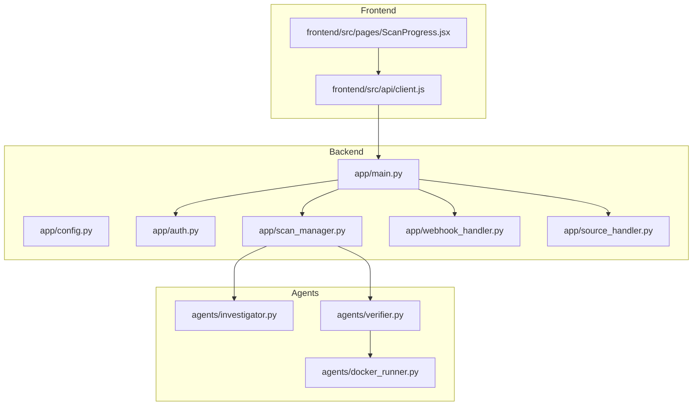
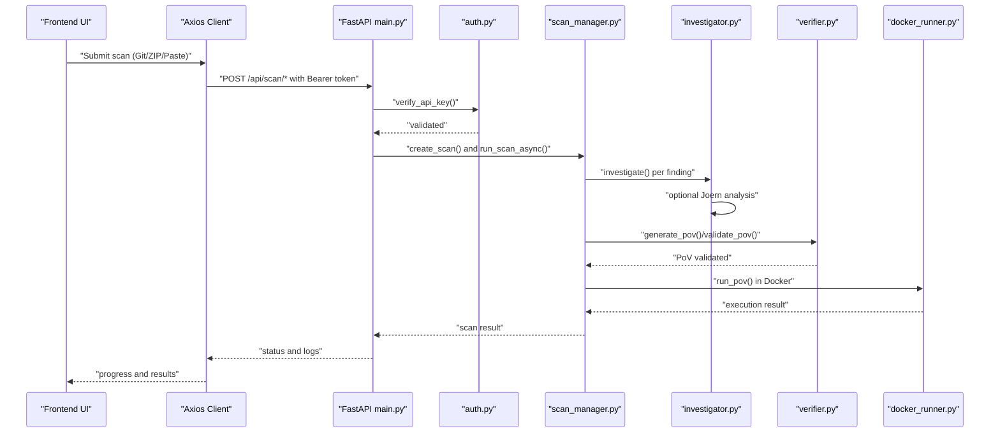
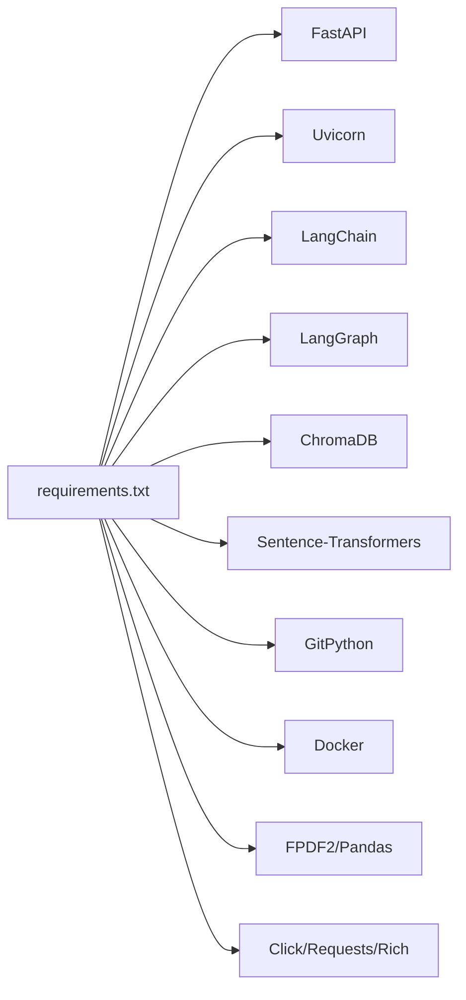
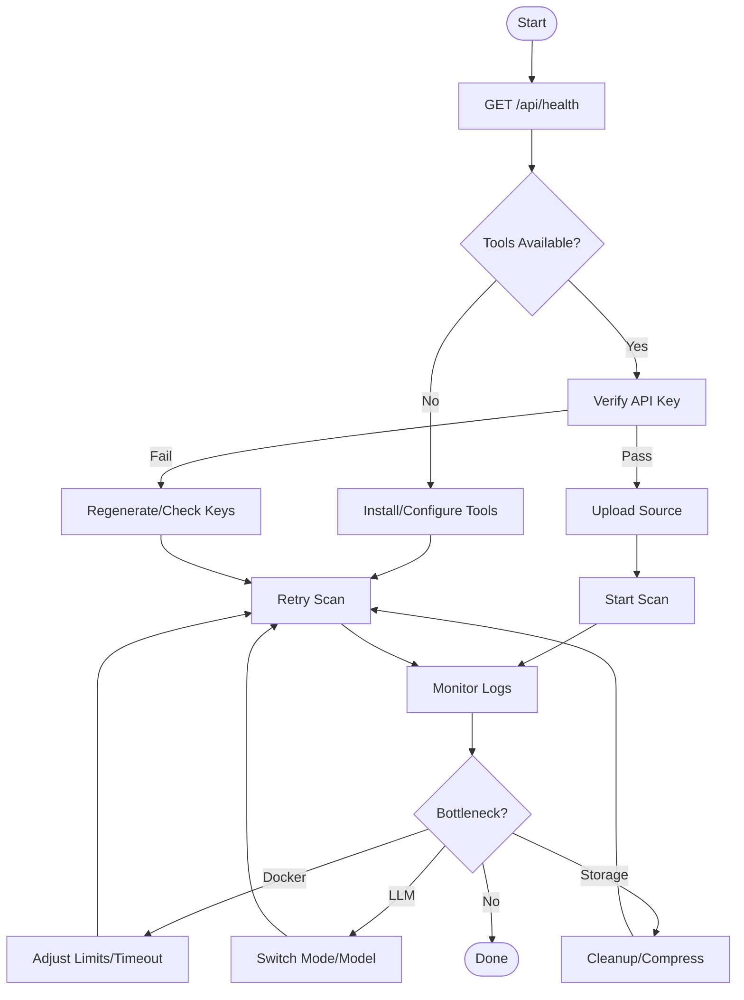

# Troubleshooting and FAQ

<cite>
**Referenced Files in This Document**
- [README.md](file://autopov/README.md)
- [run.sh](file://autopov/run.sh)
- [requirements.txt](file://autopov/requirements.txt)
- [app/main.py](file://autopov/app/main.py)
- [app/config.py](file://autopov/app/config.py)
- [app/auth.py](file://autopov/app/auth.py)
- [app/scan_manager.py](file://autopov/app/scan_manager.py)
- [app/webhook_handler.py](file://autopov/app/webhook_handler.py)
- [app/source_handler.py](file://autopov/app/source_handler.py)
- [agents/docker_runner.py](file://autopov/agents/docker_runner.py)
- [agents/investigator.py](file://autopov/agents/investigator.py)
- [agents/verifier.py](file://autopov/agents/verifier.py)
- [frontend/src/api/client.js](file://autopov/frontend/src/api/client.js)
- [frontend/src/pages/ScanProgress.jsx](file://autopov/frontend/src/pages/ScanProgress.jsx)
- [tests/test_api.py](file://autopov/tests/test_api.py)
- [tests/test_auth.py](file://autopov/tests/test_auth.py)
</cite>

## Table of Contents
1. [Introduction](#introduction)
2. [Project Structure](#project-structure)
3. [Core Components](#core-components)
4. [Architecture Overview](#architecture-overview)
5. [Detailed Component Analysis](#detailed-component-analysis)
6. [Dependency Analysis](#dependency-analysis)
7. [Performance Considerations](#performance-considerations)
8. [Troubleshooting Guide](#troubleshooting-guide)
9. [FAQ](#faq)
10. [Conclusion](#conclusion)

## Introduction
This document provides a comprehensive troubleshooting and FAQ guide for AutoPoV. It focuses on diagnosing and resolving common issues across backend API, frontend UI, agent workflows, and external tool integrations. It covers Docker execution failures, LLM connectivity issues, API authentication errors, and performance bottlenecks. You will also find systematic approaches for interpreting error messages, analyzing logs, and applying practical fixes for environment setup, configuration, and runtime errors.

## Project Structure
AutoPoV is a full-stack application composed of:
- Backend API (FastAPI) with authentication, scanning orchestration, and webhook handlers
- Agents for code ingestion, vulnerability investigation, PoV generation/verification, and Docker execution
- Frontend (React) with real-time scan progress and reporting
- CLI tooling and test suite

**Diagram sources**
- [app/main.py](file://autopov/app/main.py#L102-L118)
- [app/config.py](file://autopov/app/config.py#L13-L210)
- [app/auth.py](file://autopov/app/auth.py#L32-L168)
- [app/scan_manager.py](file://autopov/app/scan_manager.py#L40-L344)
- [app/webhook_handler.py](file://autopov/app/webhook_handler.py#L15-L363)
- [app/source_handler.py](file://autopov/app/source_handler.py#L18-L380)
- [agents/investigator.py](file://autopov/agents/investigator.py#L37-L413)
- [agents/verifier.py](file://autopov/agents/verifier.py#L40-L401)
- [agents/docker_runner.py](file://autopov/agents/docker_runner.py#L27-L379)
- [frontend/src/api/client.js](file://autopov/frontend/src/api/client.js#L1-L69)
- [frontend/src/pages/ScanProgress.jsx](file://autopov/frontend/src/pages/ScanProgress.jsx#L1-L136)

**Section sources**
- [README.md](file://autopov/README.md#L17-L35)
- [run.sh](file://autopov/run.sh#L1-L233)
- [requirements.txt](file://autopov/requirements.txt#L1-L42)

## Core Components
- Backend API: Exposes endpoints for scanning, status streaming, reports, webhooks, and metrics. Implements Bearer token authentication and admin-only key management.
- Configuration: Centralized settings with environment variables for LLMs, Docker, tools, and paths.
- Authentication: API key generation, hashing, and validation with admin key enforcement.
- Scan Manager: Orchestrates scan lifecycle, state persistence, and metrics.
- Webhook Handler: Validates signatures/tokens and parses provider events to trigger scans.
- Source Handler: Safely extracts and normalizes uploaded code sources.
- Agents:
  - Investigator: LLM-based vulnerability investigation with optional Joern CPG analysis.
  - Verifier: Generates and validates PoV scripts with syntax checks and CWE-specific rules.
  - Docker Runner: Executes PoV scripts in isolated containers with resource limits and timeouts.
- Frontend: Axios client for API calls and real-time progress via Server-Sent Events (SSE).

**Section sources**
- [app/main.py](file://autopov/app/main.py#L13-L525)
- [app/config.py](file://autopov/app/config.py#L13-L210)
- [app/auth.py](file://autopov/app/auth.py#L32-L168)
- [app/scan_manager.py](file://autopov/app/scan_manager.py#L40-L344)
- [app/webhook_handler.py](file://autopov/app/webhook_handler.py#L15-L363)
- [app/source_handler.py](file://autopov/app/source_handler.py#L18-L380)
- [agents/investigator.py](file://autopov/agents/investigator.py#L37-L413)
- [agents/verifier.py](file://autopov/agents/verifier.py#L40-L401)
- [agents/docker_runner.py](file://autopov/agents/docker_runner.py#L27-L379)
- [frontend/src/api/client.js](file://autopov/frontend/src/api/client.js#L1-L69)
- [frontend/src/pages/ScanProgress.jsx](file://autopov/frontend/src/pages/ScanProgress.jsx#L1-L136)

## Architecture Overview
End-to-end flow from UI to agents and external tools:

**Diagram sources**
- [frontend/src/pages/ScanProgress.jsx](file://autopov/frontend/src/pages/ScanProgress.jsx#L15-L72)
- [frontend/src/api/client.js](file://autopov/frontend/src/api/client.js#L28-L68)
- [app/main.py](file://autopov/app/main.py#L174-L382)
- [app/auth.py](file://autopov/app/auth.py#L137-L167)
- [app/scan_manager.py](file://autopov/app/scan_manager.py#L86-L200)
- [agents/investigator.py](file://autopov/agents/investigator.py#L254-L366)
- [agents/verifier.py](file://autopov/agents/verifier.py#L79-L228)
- [agents/docker_runner.py](file://autopov/agents/docker_runner.py#L62-L192)

## Detailed Component Analysis

### Backend API and Authentication
Common issues:
- Authentication failures (401/403) due to missing/expired/admin key
- CORS misconfiguration causing blocked requests
- Endpoint misuse (missing Bearer token)

Diagnostic steps:
- Confirm Bearer token presence and validity via verify_api_key
- Verify admin key for admin endpoints via verify_admin_key
- Check CORS origins match frontend URL
- Validate endpoint paths and headers

Practical fixes:
- Generate and store a valid API key using admin key
- Ensure Authorization header is set in requests
- Align FRONTEND_URL with the UI origin

**Section sources**
- [app/main.py](file://autopov/app/main.py#L13-L525)
- [app/auth.py](file://autopov/app/auth.py#L137-L167)
- [tests/test_api.py](file://autopov/tests/test_api.py#L26-L40)

### Configuration and Environment
Common issues:
- Missing environment variables for LLMs, Docker, or tools
- Incorrect tool availability checks
- Misconfigured paths or ports

Diagnostic steps:
- Review settings.get_llm_config() and tool availability helpers
- Verify DOCKER_ENABLED and tool CLI paths
- Ensure required directories exist via settings.ensure_directories()

Practical fixes:
- Populate .env with required keys and adjust model mode
- Install and configure Docker, CodeQL, Joern, and Kaitai Struct compiler as needed
- Adjust API_HOST/API_PORT and FRONTEND_URL

**Section sources**
- [app/config.py](file://autopov/app/config.py#L13-L210)
- [run.sh](file://autopov/run.sh#L84-L98)

### Scan Orchestration and Logs
Common issues:
- Scans stuck in “running” or failing silently
- Missing logs or incomplete results
- Thread pool exhaustion or long-running tasks

Diagnostic steps:
- Use GET /api/scan/{scan_id} for status and logs
- Stream logs via GET /api/scan/{scan_id}/stream
- Inspect scan state transitions and error fields

Practical fixes:
- Increase thread pool workers if needed
- Reduce concurrency or split large codebases
- Ensure proper cleanup after failures

**Section sources**
- [app/main.py](file://autopov/app/main.py#L316-L382)
- [app/scan_manager.py](file://autopov/app/scan_manager.py#L237-L303)

### Webhook Integration
Common issues:
- Invalid signatures/tokens leading to ignored events
- Unsupported event types or malformed payloads
- Callback registration not set

Diagnostic steps:
- Verify provider-side webhook secrets/tokens
- Check event type filtering and trigger conditions
- Confirm scan callback registration

Practical fixes:
- Set GITHUB_WEBHOOK_SECRET or GITLAB_WEBHOOK_SECRET
- Ensure event types align with supported triggers
- Re-register callback during app startup

**Section sources**
- [app/webhook_handler.py](file://autopov/app/webhook_handler.py#L15-L363)
- [app/main.py](file://autopov/app/main.py#L120-L158)
- [tests/test_api.py](file://autopov/tests/test_api.py#L42-L60)

### Source Handling (Uploads)
Common issues:
- Path traversal attempts in archives
- Large archives or unsupported formats
- Binary-heavy codebases requiring specialized parsing

Diagnostic steps:
- Validate archive extraction and path traversal protections
- Check file type detection and binary handling
- Monitor disk usage for large uploads

Practical fixes:
- Sanitize archives and avoid nested root folders
- Split large uploads into smaller chunks
- Consider Kaitai Struct compiler for binary formats

**Section sources**
- [app/source_handler.py](file://autopov/app/source_handler.py#L31-L125)
- [app/config.py](file://autopov/app/config.py#L74-L77)

### LLM Connectivity and Agent Workflows
Common issues:
- Missing online/offline dependencies
- API key misconfiguration
- LLM response parsing failures
- CWE-specific limitations (e.g., C/C++ for certain CWEs)

Diagnostic steps:
- Confirm model mode and corresponding API/base URLs
- Verify langchain-openai or langchain-ollama availability
- Inspect JSON parsing fallbacks and error messages

Practical fixes:
- Install required LangChain packages for chosen mode
- Set OPENROUTER_API_KEY or OLLAMA_BASE_URL appropriately
- Adjust temperature and prompt formatting

**Section sources**
- [app/config.py](file://autopov/app/config.py#L30-L88)
- [agents/investigator.py](file://autopov/agents/investigator.py#L50-L87)
- [agents/verifier.py](file://autopov/agents/verifier.py#L46-L77)

### Docker Execution Failures
Common issues:
- Docker SDK not available or daemon unreachable
- Image pull failures or timeouts
- Resource limits causing early termination
- Missing “VULNERABILITY TRIGGERED” output

Diagnostic steps:
- Check DockerRunner.is_available() and client ping
- Inspect container exit codes and stderr logs
- Validate memory/cpu/timeouts and network isolation

Practical fixes:
- Install docker-py and ensure Docker service is running
- Pull required image manually or increase timeout
- Adjust memory_limit, cpu_quota, and timeout
- Ensure PoV prints the required trigger phrase

**Section sources**
- [agents/docker_runner.py](file://autopov/agents/docker_runner.py#L50-L61)
- [agents/docker_runner.py](file://autopov/agents/docker_runner.py#L113-L151)
- [agents/docker_runner.py](file://autopov/agents/docker_runner.py#L168-L187)

### Frontend UI and Real-Time Updates
Common issues:
- Missing API key in localStorage or environment
- SSE connection failures falling back to polling
- CORS errors preventing UI from loading

Diagnostic steps:
- Confirm Bearer token is injected by axios interceptors
- Verify VITE_API_URL and CORS on backend
- Monitor eventSource onmessage and onerror

Practical fixes:
- Set VITE_API_URL and API key in environment
- Ensure backend allows frontend origin
- Gracefully handle SSE errors and continue polling

**Section sources**
- [frontend/src/api/client.js](file://autopov/frontend/src/api/client.js#L1-L69)
- [frontend/src/pages/ScanProgress.jsx](file://autopov/frontend/src/pages/ScanProgress.jsx#L15-L72)

## Dependency Analysis
External dependencies and their roles:
- FastAPI/Uvicorn: Backend server and ASGI
- LangChain/LangGraph: Agent workflows and LLM integration
- ChromaDB/Sentence-Transformers: Vector store and embeddings
- GitPython: Git repository handling
- Docker: PoV sandbox execution
- FPDF2/Pandas: Reporting and analytics
- Click/Requests/Rich: CLI and utilities

Potential conflicts:
- Version mismatches in LangChain packages
- Missing optional tools (CodeQL, Joern, Kaitai Struct) impacting analysis depth

**Diagram sources**
- [requirements.txt](file://autopov/requirements.txt#L1-L42)

**Section sources**
- [requirements.txt](file://autopov/requirements.txt#L1-L42)

## Performance Considerations
- Concurrency and throughput:
  - Tune thread pool size in scan manager for heavy workloads
  - Consider batching agent operations where safe
- Resource limits:
  - Adjust Docker memory_limit, cpu_quota, and timeout
  - Monitor tool CLI resource usage (CodeQL, Joern)
- Cost control:
  - Enable cost tracking and set MAX_COST_USD
- I/O and storage:
  - Ensure sufficient disk space for temp and results directories
  - Compress large reports and avoid unnecessary file copies

[No sources needed since this section provides general guidance]

## Troubleshooting Guide

### Systematic Troubleshooting Flow

### Docker Execution Failures
Symptoms:
- Docker not available or ping fails
- Container exits with non-zero code
- Timeout or killed container
- Missing “VULNERABILITY TRIGGERED”

Actions:
- Confirm docker-py installation and Docker service status
- Manually pull the configured image
- Increase timeout and adjust memory/cpu quotas
- Ensure PoV script prints the required trigger phrase

**Section sources**
- [agents/docker_runner.py](file://autopov/agents/docker_runner.py#L50-L61)
- [agents/docker_runner.py](file://autopov/agents/docker_runner.py#L135-L151)
- [agents/docker_runner.py](file://autopov/agents/docker_runner.py#L168-L187)

### LLM Connectivity Issues
Symptoms:
- ImportError for online/offline LLM libraries
- Missing API keys or invalid base URLs
- JSON parsing errors in agent responses

Actions:
- Install langchain-openai or langchain-ollama depending on mode
- Set OPENROUTER_API_KEY or OLLAMA_BASE_URL
- Validate model names and base URLs
- Inspect fallback parsing and error messages

**Section sources**
- [app/config.py](file://autopov/app/config.py#L30-L88)
- [agents/investigator.py](file://autopov/agents/investigator.py#L57-L87)
- [agents/verifier.py](file://autopov/agents/verifier.py#L53-L77)

### API Authentication Errors
Symptoms:
- 401/403 responses for protected endpoints
- Admin-only endpoints rejected

Actions:
- Generate API key with admin key
- Store Bearer token in localStorage or environment
- Verify verify_api_key and verify_admin_key behavior

**Section sources**
- [app/auth.py](file://autopov/app/auth.py#L137-L167)
- [tests/test_api.py](file://autopov/tests/test_api.py#L29-L40)

### Frontend/UI Issues
Symptoms:
- Missing API key in requests
- SSE errors falling back to polling
- CORS errors blocking UI

Actions:
- Set VITE_API_URL and API key in environment
- Ensure backend CORS allows frontend origin
- Handle SSE errors gracefully and continue polling

**Section sources**
- [frontend/src/api/client.js](file://autopov/frontend/src/api/client.js#L1-L69)
- [frontend/src/pages/ScanProgress.jsx](file://autopov/frontend/src/pages/ScanProgress.jsx#L46-L72)

### Webhook Integration Problems
Symptoms:
- Ignored events due to invalid signature/token
- Unsupported event types
- No scan triggered despite valid payload

Actions:
- Set provider webhook secrets/tokens
- Verify event type filtering and trigger conditions
- Confirm scan callback registration

**Section sources**
- [app/webhook_handler.py](file://autopov/app/webhook_handler.py#L25-L74)
- [app/webhook_handler.py](file://autopov/app/webhook_handler.py#L196-L266)
- [app/webhook_handler.py](file://autopov/app/webhook_handler.py#L267-L336)

### Performance Bottlenecks
Symptoms:
- Slow scans, timeouts, or high costs
- Disk pressure from large uploads/results
- Agent thread pool saturation

Actions:
- Adjust Docker resource limits and timeouts
- Switch model mode or reduce prompt sizes
- Optimize storage and compress reports
- Scale thread pool or split scans

**Section sources**
- [app/config.py](file://autopov/app/config.py#L78-L88)
- [agents/docker_runner.py](file://autopov/agents/docker_runner.py#L32-L36)
- [app/scan_manager.py](file://autopov/app/scan_manager.py#L46-L48)

## FAQ

Q1: How do I start the backend and frontend?
- Use the run script to start backend, frontend, or both. Ensure .env is configured and dependencies are installed.

Q2: Why am I getting authentication errors?
- Ensure you have a valid API key generated with the admin key and included in the Authorization header.

Q3: How do I fix Docker execution failures?
- Install docker-py, ensure Docker is running, pull the configured image, and adjust resource limits and timeout.

Q4: How do I switch between online and offline LLM modes?
- Set MODEL_MODE to “online” or “offline” and configure the corresponding API key/base URL.

Q5: How can I monitor scan progress?
- Use the progress page or poll GET /api/scan/{scan_id}, and optionally stream logs via SSE.

Q6: How do I enable webhooks?
- Configure provider webhook secrets/tokens, set webhook URLs, and ensure the callback is registered.

Q7: How do I troubleshoot missing tools (CodeQL, Joern)?
- Install the tools and ensure CLI paths are correct; the health endpoint reports availability.

Q8: How do I generate and manage API keys?
- Use the admin key to generate API keys and list/revoke as needed.

Q9: How do I interpret scan results and logs?
- Check status and logs endpoints; logs are streamed via SSE and persisted for later retrieval.

Q10: Where can I find community resources and support?
- Refer to the project’s documentation and contribution guidelines for research and support channels.

**Section sources**
- [README.md](file://autopov/README.md#L75-L144)
- [run.sh](file://autopov/run.sh#L77-L161)
- [app/main.py](file://autopov/app/main.py#L161-L171)
- [app/auth.py](file://autopov/app/auth.py#L476-L508)
- [frontend/src/pages/ScanProgress.jsx](file://autopov/frontend/src/pages/ScanProgress.jsx#L15-L72)

## Conclusion
This guide provides a structured approach to diagnosing and resolving AutoPoV issues across backend, frontend, agents, and external tools. By following the diagnostic steps, applying the recommended fixes, and leveraging the provided references, you can quickly identify root causes, optimize performance, and maintain a reliable deployment.