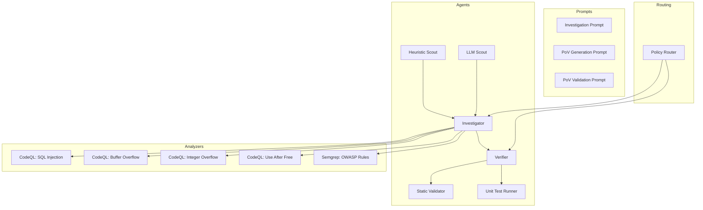
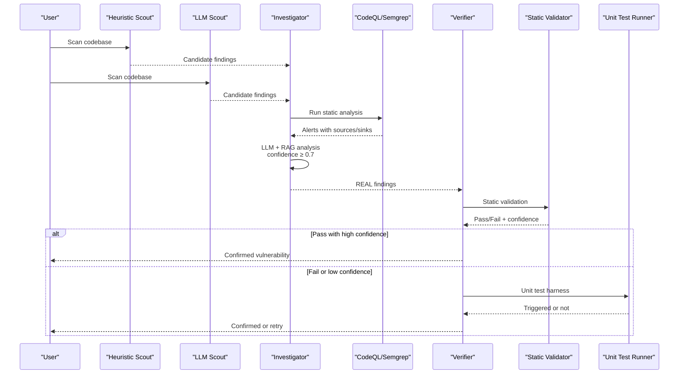
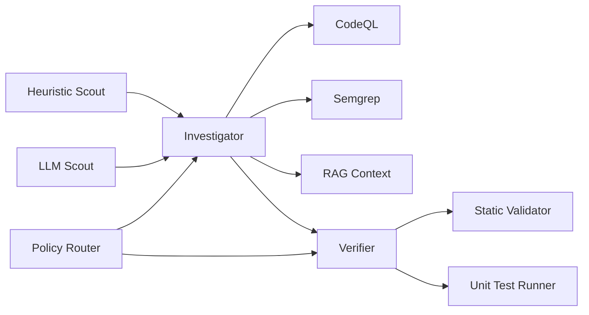

# CWE Categories

<cite>
**Referenced Files in This Document**
- [README.md](file://README.md)
- [prompts.py](file://prompts.py)
- [heuristic_scout.py](file://agents/heuristic_scout.py)
- [llm_scout.py](file://agents/llm_scout.py)
- [investigator.py](file://agents/investigator.py)
- [verifier.py](file://agents/verifier.py)
- [static_validator.py](file://agents/static_validator.py)
- [unit_test_runner.py](file://agents/unit_test_runner.py)
- [policy.py](file://app/policy.py)
- [SqlInjection.ql](file://codeql_queries/SqlInjection.ql)
- [BufferOverflow.ql](file://codeql_queries/BufferOverflow.ql)
- [IntegerOverflow.ql](file://codeql_queries/IntegerOverflow.ql)
- [UseAfterFree.ql](file://codeql_queries/UseAfterFree.ql)
- [owasp-min.yml](file://semgrep-rules/owasp-min.yml)
</cite>

## Table of Contents
1. [Introduction](#introduction)
2. [Project Structure](#project-structure)
3. [Core Components](#core-components)
4. [Architecture Overview](#architecture-overview)
5. [Detailed Component Analysis](#detailed-component-analysis)
6. [Dependency Analysis](#dependency-analysis)
7. [Performance Considerations](#performance-considerations)
8. [Troubleshooting Guide](#troubleshooting-guide)
9. [Conclusion](#conclusion)

## Introduction
This document explains AutoPoV’s supported CWE categories and vulnerability classifications, detailing detection strategies, tooling, and reasoning approaches. AutoPoV integrates multiple complementary techniques—pattern-based heuristics, LLM-powered scouts, CodeQL static analysis, Semgrep rules, and hybrid validation—to detect and classify 20+ CWE families across multiple languages. For each category, we describe detection strategies, the implemented CodeQL/Semgrep patterns, LLM reasoning prompts, confidence scoring, and validation workflows.

## Project Structure
AutoPoV organizes its vulnerability detection across agents, prompts, and analyzers:
- Agents: Heuristic Scout, LLM Scout, Investigator, Verifier, Static Validator, Unit Test Runner
- Prompts: Centralized LLM prompts for investigation, PoV generation, validation, and summarization
- Analyzers: CodeQL queries for SQLi, buffer overflows, integer overflows, and use-after-free
- Semgrep rules: OWASP-focused rules for SQLi, XSS, command injection, and path traversal
- Policy routing: Adaptive model selection per stage, CWE, and language

**Diagram sources**
- [heuristic_scout.py:13-242](file://agents/heuristic_scout.py#L13-L242)
- [llm_scout.py:32-208](file://agents/llm_scout.py#L32-L208)
- [investigator.py:270-510](file://agents/investigator.py#L270-L510)
- [verifier.py:90-562](file://agents/verifier.py#L90-L562)
- [static_validator.py:22-305](file://agents/static_validator.py#L22-L305)
- [unit_test_runner.py:28-344](file://agents/unit_test_runner.py#L28-L344)
- [SqlInjection.ql:1-67](file://codeql_queries/SqlInjection.ql#L1-L67)
- [BufferOverflow.ql:1-59](file://codeql_queries/BufferOverflow.ql#L1-L59)
- [IntegerOverflow.ql:1-62](file://codeql_queries/IntegerOverflow.ql#L1-L62)
- [UseAfterFree.ql:1-41](file://codeql_queries/UseAfterFree.ql#L1-L41)
- [owasp-min.yml:1-53](file://semgrep-rules/owasp-min.yml#L1-L53)
- [prompts.py:7-121](file://prompts.py#L7-L121)
- [policy.py:12-40](file://app/policy.py#L12-L40)

**Section sources**
- [README.md:330-342](file://README.md#L330-L342)
- [prompts.py:7-121](file://prompts.py#L7-L121)
- [heuristic_scout.py:13-242](file://agents/heuristic_scout.py#L13-L242)
- [llm_scout.py:32-208](file://agents/llm_scout.py#L32-L208)
- [investigator.py:270-510](file://agents/investigator.py#L270-L510)
- [verifier.py:90-562](file://agents/verifier.py#L90-L562)
- [static_validator.py:22-305](file://agents/static_validator.py#L22-L305)
- [unit_test_runner.py:28-344](file://agents/unit_test_runner.py#L28-L344)
- [policy.py:12-40](file://app/policy.py#L12-L40)
- [SqlInjection.ql:1-67](file://codeql_queries/SqlInjection.ql#L1-L67)
- [BufferOverflow.ql:1-59](file://codeql_queries/BufferOverflow.ql#L1-L59)
- [IntegerOverflow.ql:1-62](file://codeql_queries/IntegerOverflow.ql#L1-L62)
- [UseAfterFree.ql:1-41](file://codeql_queries/UseAfterFree.ql#L1-L41)
- [owasp-min.yml:1-53](file://semgrep-rules/owasp-min.yml#L1-L53)

## Core Components
- Heuristic Scout: Lightweight pattern matching across 20+ CWE families to quickly surface candidates.
- LLM Scout: LLM-driven candidate discovery across sampled files with confidence scores.
- Investigator Agent: Deep LLM + RAG analysis to decide REAL or FALSE_POSITIVE with confidence and cost tracking.
- Verifier Agent: Generates PoV scripts and validates them via static, unit test, and LLM fallback.
- Static Validator: Fast, deterministic checks for PoV script correctness and attack pattern presence.
- Unit Test Runner: Executes PoVs against isolated vulnerable code in a controlled environment.
- CodeQL Queries: High-confidence static flows for SQLi, buffer overflows, integer overflows, and use-after-free.
- Semgrep Rules: OWASP-focused rulesets for SQLi, XSS, command injection, and path traversal.
- Policy Router: Selects optimal reasoning models per stage, CWE, and language using adaptive routing.

**Section sources**
- [README.md:330-342](file://README.md#L330-L342)
- [prompts.py:7-121](file://prompts.py#L7-L121)
- [heuristic_scout.py:13-242](file://agents/heuristic_scout.py#L13-L242)
- [llm_scout.py:32-208](file://agents/llm_scout.py#L32-L208)
- [investigator.py:270-510](file://agents/investigator.py#L270-L510)
- [verifier.py:90-562](file://agents/verifier.py#L90-L562)
- [static_validator.py:22-305](file://agents/static_validator.py#L22-L305)
- [unit_test_runner.py:28-344](file://agents/unit_test_runner.py#L28-L344)
- [policy.py:12-40](file://app/policy.py#L12-L40)
- [SqlInjection.ql:1-67](file://codeql_queries/SqlInjection.ql#L1-L67)
- [BufferOverflow.ql:1-59](file://codeql_queries/BufferOverflow.ql#L1-L59)
- [IntegerOverflow.ql:1-62](file://codeql_queries/IntegerOverflow.ql#L1-L62)
- [UseAfterFree.ql:1-41](file://codeql_queries/UseAfterFree.ql#L1-L41)
- [owasp-min.yml:1-53](file://semgrep-rules/owasp-min.yml#L1-L53)

## Architecture Overview
AutoPoV’s workflow merges multiple detection modalities:
- Heuristic and LLM scouts propose candidates.
- CodeQL and Semgrep provide static confirmations.
- Investigator Agent performs LLM + RAG analysis with confidence scoring.
- Verifier Agent generates and validates PoV scripts through static, unit test, and LLM steps.
- Policy Router selects the best model per stage and task.

**Diagram sources**
- [heuristic_scout.py:188-234](file://agents/heuristic_scout.py#L188-L234)
- [llm_scout.py:88-200](file://agents/llm_scout.py#L88-L200)
- [investigator.py:270-433](file://agents/investigator.py#L270-L433)
- [verifier.py:225-387](file://agents/verifier.py#L225-L387)
- [static_validator.py:123-233](file://agents/static_validator.py#L123-L233)
- [unit_test_runner.py:34-116](file://agents/unit_test_runner.py#L34-L116)

**Section sources**
- [README.md:34-69](file://README.md#L34-L69)
- [investigator.py:270-433](file://agents/investigator.py#L270-L433)
- [verifier.py:225-387](file://agents/verifier.py#L225-L387)

## Detailed Component Analysis

### Injection: CWE-89 SQL Injection
- Detection strategies:
  - Heuristic Scout: Pattern-matching for SQL-like concatenations and string formatting with user input.
  - CodeQL: Tracks taint from HTTP sources to SQL execution sinks with sanitizers for parameterized queries.
  - Semgrep: OWASP rules for PHP SQL usage patterns.
- LLM reasoning: Prompts emphasize checking for parameterization and sanitization around SQL operations.
- Validation: Static Validator checks for SQL keywords and payloads; Unit Test Runner executes PoV against isolated SQL logic.
- Confidence threshold: Investigator confidence ≥ 0.7 for REAL.
- Practical example: A candidate with user input flowing into an execute call without parameterization triggers CodeQL and prompts LLM analysis; PoV attempts UNION-based payloads validated statically and via unit test.

**Section sources**
- [heuristic_scout.py:19-27](file://agents/heuristic_scout.py#L19-L27)
- [SqlInjection.ql:17-66](file://codeql_queries/SqlInjection.ql#L17-L66)
- [owasp-min.yml:2-13](file://semgrep-rules/owasp-min.yml#L2-L13)
- [prompts.py:8-43](file://prompts.py#L8-L43)
- [static_validator.py:27-39](file://agents/static_validator.py#L27-L39)
- [unit_test_runner.py:34-116](file://agents/unit_test_runner.py#L34-L116)
- [investigator.py:270-433](file://agents/investigator.py#L270-L433)

### Injection: CWE-79 XSS
- Detection strategies:
  - Heuristic Scout: Matches DOM manipulation and template rendering with request data.
  - Semgrep: OWASP rules for PHP echo/print with user input.
- LLM reasoning: Prompts highlight HTML injection and event handlers.
- Validation: Static Validator looks for script tags and event handlers; Unit Test Runner validates PoV against rendering logic.
- Confidence threshold: Investigator confidence ≥ 0.7 for REAL.

**Section sources**
- [heuristic_scout.py:28-34](file://agents/heuristic_scout.py#L28-L34)
- [owasp-min.yml:14-25](file://semgrep-rules/owasp-min.yml#L14-L25)
- [prompts.py:8-43](file://prompts.py#L8-L43)
- [static_validator.py:40-52](file://agents/static_validator.py#L40-L52)
- [unit_test_runner.py:34-116](file://agents/unit_test_runner.py#L34-L116)

### Injection: CWE-94 Code Injection
- Detection strategies:
  - Heuristic Scout: Matches eval/exec/import patterns with request data.
- LLM reasoning: Prompts focus on dynamic code invocation and sandboxing.
- Validation: Static Validator checks for eval/exec patterns; Unit Test Runner executes PoV in isolated context.

**Section sources**
- [heuristic_scout.py:49-54](file://agents/heuristic_scout.py#L49-L54)
- [prompts.py:8-43](file://prompts.py#L8-L43)
- [static_validator.py:53-65](file://agents/static_validator.py#L53-L65)
- [unit_test_runner.py:34-116](file://agents/unit_test_runner.py#L34-L116)

### Access Control: CWE-22 Path Traversal
- Detection strategies:
  - Heuristic Scout: Matches path joins and parent-directory patterns.
  - Semgrep: OWASP rules for include/read with user input.
- LLM reasoning: Prompts emphasize path normalization and file access checks.
- Validation: Static Validator checks for ../ patterns; Unit Test Runner validates file access PoV.

**Section sources**
- [heuristic_scout.py:35-41](file://agents/heuristic_scout.py#L35-L41)
- [owasp-min.yml:40-53](file://semgrep-rules/owasp-min.yml#L40-L53)
- [prompts.py:8-43](file://prompts.py#L8-L43)
- [static_validator.py:66-78](file://agents/static_validator.py#L66-L78)
- [unit_test_runner.py:34-116](file://agents/unit_test_runner.py#L34-L116)

### Access Control: CWE-352 CSRF
- Detection strategies:
  - Heuristic Scout: Matches CSRF exemptions and middleware toggles.
- LLM reasoning: Prompts focus on CSRF token presence and enforcement.
- Validation: Static Validator checks for CSRF-related patterns; Unit Test Runner simulates cross-origin requests.

**Section sources**
- [heuristic_scout.py:81-86](file://agents/heuristic_scout.py#L81-L86)
- [prompts.py:8-43](file://prompts.py#L8-L43)
- [static_validator.py:22-305](file://agents/static_validator.py#L22-L305)
- [unit_test_runner.py:34-116](file://agents/unit_test_runner.py#L34-L116)

### Access Control: CWE-287 Broken Authentication
- Detection strategies:
  - Heuristic Scout: Matches weak auth checks and bypass patterns.
- LLM reasoning: Prompts emphasize credential handling and session management.
- Validation: Static Validator checks for hardcoded credentials; Unit Test Runner tries default credentials.

**Section sources**
- [heuristic_scout.py:87-92](file://agents/heuristic_scout.py#L87-L92)
- [prompts.py:8-43](file://prompts.py#L8-L43)
- [static_validator.py:105-117](file://agents/static_validator.py#L105-L117)
- [unit_test_runner.py:34-116](file://agents/unit_test_runner.py#L34-L116)

### Memory Safety: CWE-119 Buffer Overflow
- Detection strategies:
  - Heuristic Scout: Matches unsafe C-style operations.
  - CodeQL: Tracks taint into buffer operations without bounds checks.
- LLM reasoning: Prompts emphasize buffer sizes and copy operations.
- Validation: Static Validator checks for buffer and length indicators; Unit Test Runner executes PoV against C-like logic.

**Section sources**
- [heuristic_scout.py:144-149](file://agents/heuristic_scout.py#L144-L149)
- [BufferOverflow.ql:16-58](file://codeql_queries/BufferOverflow.ql#L16-L58)
- [prompts.py:8-43](file://prompts.py#L8-L43)
- [static_validator.py:27-39](file://agents/static_validator.py#L27-L39)
- [unit_test_runner.py:34-116](file://agents/unit_test_runner.py#L34-L116)

### Memory Safety: CWE-416 Use After Free
- Detection strategies:
  - Heuristic Scout: Matches free calls.
  - CodeQL: Identifies use-after-free patterns with control-flow analysis.
  - Investigator Agent: Optional Joern CPG analysis for deeper pointer flow.
- LLM reasoning: Prompts focus on pointer lifetimes and memory safety.
- Validation: Static Validator flags C-specific patterns; Unit Test Runner executes PoV in C context.

**Section sources**
- [heuristic_scout.py:154-156](file://agents/heuristic_scout.py#L154-L156)
- [UseAfterFree.ql:16-41](file://codeql_queries/UseAfterFree.ql#L16-L41)
- [investigator.py:105-201](file://agents/investigator.py#L105-L201)
- [prompts.py:8-43](file://prompts.py#L8-L43)
- [static_validator.py:429-444](file://agents/static_validator.py#L429-L444)
- [unit_test_runner.py:34-116](file://agents/unit_test_runner.py#L34-L116)

### Memory Safety: CWE-190 Integer Overflow
- Detection strategies:
  - Heuristic Scout: Matches arithmetic operations with large operands.
  - CodeQL: Range analysis for overflow-prone operations and array indices.
- LLM reasoning: Prompts emphasize bounds checking and large-value handling.
- Validation: Static Validator checks for large numeric patterns; Unit Test Runner exercises overflow conditions.

**Section sources**
- [heuristic_scout.py:150-153](file://agents/heuristic_scout.py#L150-L153)
- [IntegerOverflow.ql:18-61](file://codeql_queries/IntegerOverflow.ql#L18-L61)
- [prompts.py:8-43](file://prompts.py#L8-L43)
- [static_validator.py:446-449](file://agents/static_validator.py#L446-L449)
- [unit_test_runner.py:34-116](file://agents/unit_test_runner.py#L34-L116)

### Sensitive Data Exposure: CWE-312 Insecure Data Storage
- Detection strategies:
  - Heuristic Scout: Matches cleartext assignments and logging of secrets.
- LLM reasoning: Prompts emphasize encryption and secure storage.
- Validation: Static Validator checks for cleartext and logging indicators; Unit Test Runner validates remediation.

**Section sources**
- [heuristic_scout.py:68-72](file://agents/heuristic_scout.py#L68-L72)
- [prompts.py:8-43](file://prompts.py#L8-L43)
- [static_validator.py:22-305](file://agents/static_validator.py#L22-L305)
- [unit_test_runner.py:34-116](file://agents/unit_test_runner.py#L34-L116)

### Sensitive Data Exposure: CWE-798 Hardcoded Credentials
- Detection strategies:
  - Heuristic Scout: Matches hardcoded secrets and credentials.
- LLM reasoning: Prompts emphasize secret management and rotation.
- Validation: Static Validator checks for credential patterns; Unit Test Runner tries default credentials.

**Section sources**
- [heuristic_scout.py:62-67](file://agents/heuristic_scout.py#L62-L67)
- [prompts.py:8-43](file://prompts.py#L8-L43)
- [static_validator.py:105-117](file://agents/static_validator.py#L105-L117)
- [unit_test_runner.py:34-116](file://agents/unit_test_runner.py#L34-L116)

### Cryptography: CWE-327 Broken Crypto
- Detection strategies:
  - Heuristic Scout: Matches deprecated algorithms and weak primitives.
- LLM reasoning: Prompts emphasize modern cryptographic standards.
- Validation: Static Validator checks for deprecated crypto patterns; Unit Test Runner validates remediation.

**Section sources**
- [heuristic_scout.py:73-80](file://agents/heuristic_scout.py#L73-L80)
- [prompts.py:8-43](file://prompts.py#L8-L43)
- [static_validator.py:22-305](file://agents/static_validator.py#L22-L305)
- [unit_test_runner.py:34-116](file://agents/unit_test_runner.py#L34-L116)

### Design: CWE-502 Deserialization
- Detection strategies:
  - Heuristic Scout: Matches deserialization APIs.
- LLM reasoning: Prompts emphasize safe deserialization and object validation.
- Validation: Static Validator checks for pickle/yaml/marshal patterns; Unit Test Runner executes PoV.

**Section sources**
- [heuristic_scout.py:55-61](file://agents/heuristic_scout.py#L55-L61)
- [prompts.py:8-43](file://prompts.py#L8-L43)
- [static_validator.py:92-104](file://agents/static_validator.py#L92-L104)
- [unit_test_runner.py:34-116](file://agents/unit_test_runner.py#L34-L116)

### Design: CWE-601 Open Redirect
- Detection strategies:
  - Heuristic Scout: Matches redirect functions with request data.
- LLM reasoning: Prompts emphasize trusted domain checks.
- Validation: Static Validator checks for redirect patterns; Unit Test Runner validates redirection.

**Section sources**
- [heuristic_scout.py:99-104](file://agents/heuristic_scout.py#L99-L104)
- [prompts.py:8-43](file://prompts.py#L8-L43)
- [static_validator.py:22-305](file://agents/static_validator.py#L22-L305)
- [unit_test_runner.py:34-116](file://agents/unit_test_runner.py#L34-L116)

### Additional Categories (Selected)
- CWE-78 Command Injection: Heuristic Scout patterns for shell execution; Semgrep PHP rules; Static Validator checks for shell operators; Unit Test Runner executes PoV.
- CWE-306 Missing Auth: Heuristic Scout patterns for anonymous routes; Static Validator checks for permission classes; Unit Test Runner validates protected endpoints.
- CWE-918 SSRF: Heuristic Scout patterns for outbound HTTP calls; Static Validator checks for URL handling; Unit Test Runner validates redirection.
- CWE-434 Unrestricted Upload: Heuristic Scout patterns for file saves; Static Validator checks for upload handling; Unit Test Runner validates malicious payloads.
- CWE-611 XXE: Heuristic Scout patterns for XML parsers; Static Validator checks for entity resolution; Unit Test Runner validates XML parsing.
- CWE-400 DoS: Heuristic Scout patterns for loops and resource-heavy operations; Static Validator checks for regex and sleep patterns; Unit Test Runner validates resource exhaustion.
- CWE-384 Session Fixation: Heuristic Scout patterns for session handling; Static Validator checks for session ID assignment; Unit Test Runner validates session lifecycle.
- CWE-200 Information Disclosure: Heuristic Scout patterns for debug flags and stack traces; Static Validator checks for sensitive output; Unit Test Runner validates remediation.

**Section sources**
- [heuristic_scout.py:42-48](file://agents/heuristic_scout.py#L42-L48)
- [owasp-min.yml:26-38](file://semgrep-rules/owasp-min.yml#L26-L38)
- [prompts.py:8-43](file://prompts.py#L8-L43)
- [static_validator.py:22-305](file://agents/static_validator.py#L22-L305)
- [unit_test_runner.py:34-116](file://agents/unit_test_runner.py#L34-L116)

## Dependency Analysis
- Agent coupling:
  - Heuristic Scout and LLM Scout feed Investigator Agent with candidates.
  - Investigator depends on CodeQL/Semgrep for static confirmations and on RAG for context.
  - Verifier escalates from Static Validator to Unit Test Runner to LLM validation.
- External dependencies:
  - CodeQL CLI for static analysis.
  - Semgrep for rule-based scanning.
  - Optional Joern for CPG analysis on use-after-free.
  - Policy Router selects models based on historical performance.
- Potential circular dependencies:
  - None observed among agents; routing is centralized.

**Diagram sources**
- [heuristic_scout.py:188-234](file://agents/heuristic_scout.py#L188-L234)
- [llm_scout.py:88-200](file://agents/llm_scout.py#L88-L200)
- [investigator.py:270-433](file://agents/investigator.py#L270-L433)
- [verifier.py:225-387](file://agents/verifier.py#L225-L387)
- [static_validator.py:123-233](file://agents/static_validator.py#L123-L233)
- [unit_test_runner.py:34-116](file://agents/unit_test_runner.py#L34-L116)
- [policy.py:12-40](file://app/policy.py#L12-L40)

**Section sources**
- [policy.py:12-40](file://app/policy.py#L12-L40)
- [investigator.py:270-433](file://agents/investigator.py#L270-L433)
- [verifier.py:225-387](file://agents/verifier.py#L225-L387)

## Performance Considerations
- Cost tracking: Investigator and Verifier compute costs from token usage; Policy Router selects models to optimize confirmed-per-dollar.
- Early pruning: Static Validator provides fast pass/fail; Unit Test Runner reserved for ambiguous cases.
- Confidence threshold: Investigator requires confidence ≥ 0.7 for REAL verdicts.
- Scalability: Heuristic and LLM Scouts cap file counts and findings to control cost and latency.

[No sources needed since this section provides general guidance]

## Troubleshooting Guide
- Investigator failures:
  - Inspect token usage extraction and cost calculation; verify OpenRouter API key and model availability.
- Verifier validation issues:
  - Static Validator may flag missing “VULNERABILITY TRIGGERED” or non-stdlib imports; adjust PoV to meet requirements.
  - Unit Test Runner timeouts indicate heavy computation or infinite loops; simplify PoV or increase limits.
- Policy routing:
  - If no recommendation available, Policy Router falls back to auto router; ensure Learning Store has sufficient data.

**Section sources**
- [investigator.py:334-472](file://agents/investigator.py#L334-L472)
- [verifier.py:148-189](file://agents/verifier.py#L148-L189)
- [static_validator.py:123-233](file://agents/static_validator.py#L123-L233)
- [unit_test_runner.py:236-287](file://agents/unit_test_runner.py#L236-L287)
- [policy.py:18-32](file://app/policy.py#L18-L32)

## Conclusion
AutoPoV’s multi-modal approach to vulnerability detection combines pattern-based heuristics, LLM scouts, CodeQL, Semgrep, and hybrid validation to comprehensively cover 20+ CWE families. The Investigator Agent applies confidence thresholds and cost-aware routing, while the Verifier Agent ensures robust PoV generation and validation. This layered strategy improves precision, reduces false positives, and accelerates autonomous vulnerability research.