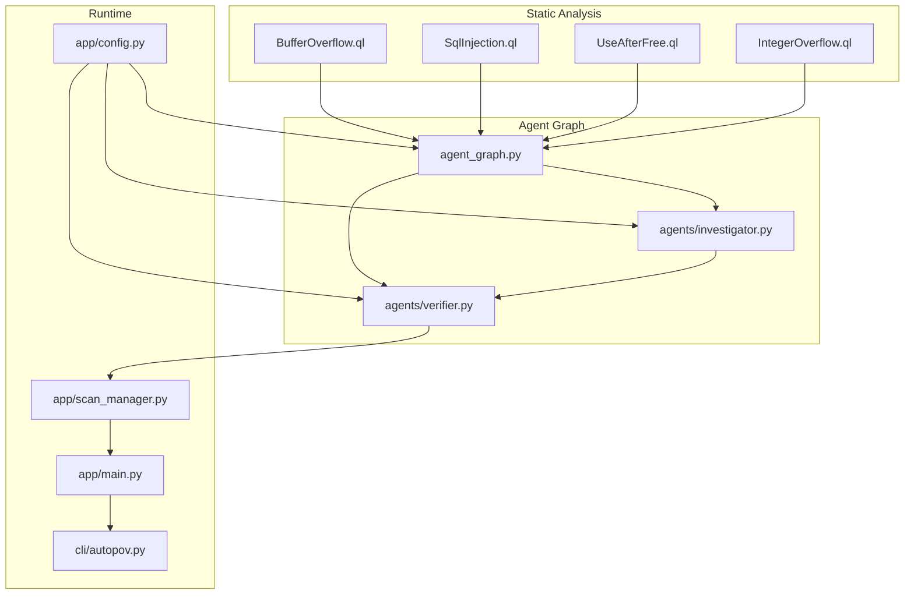
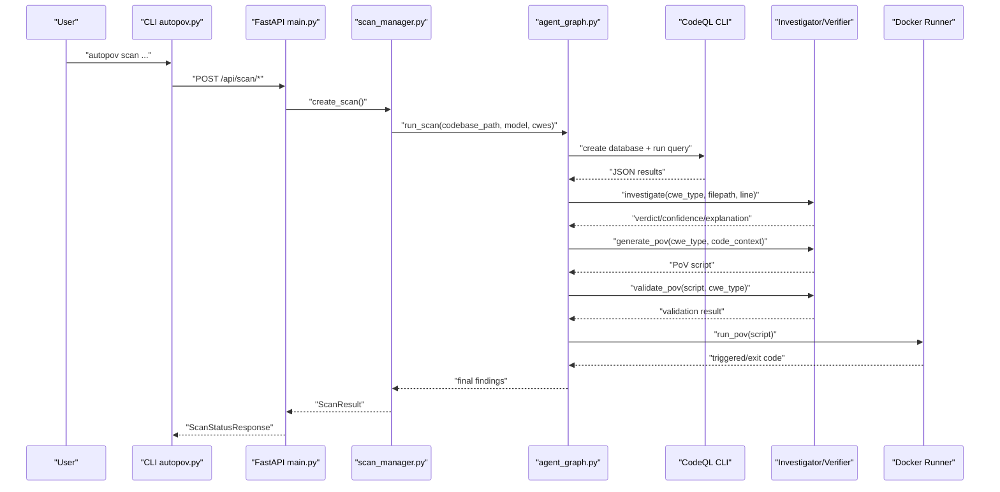
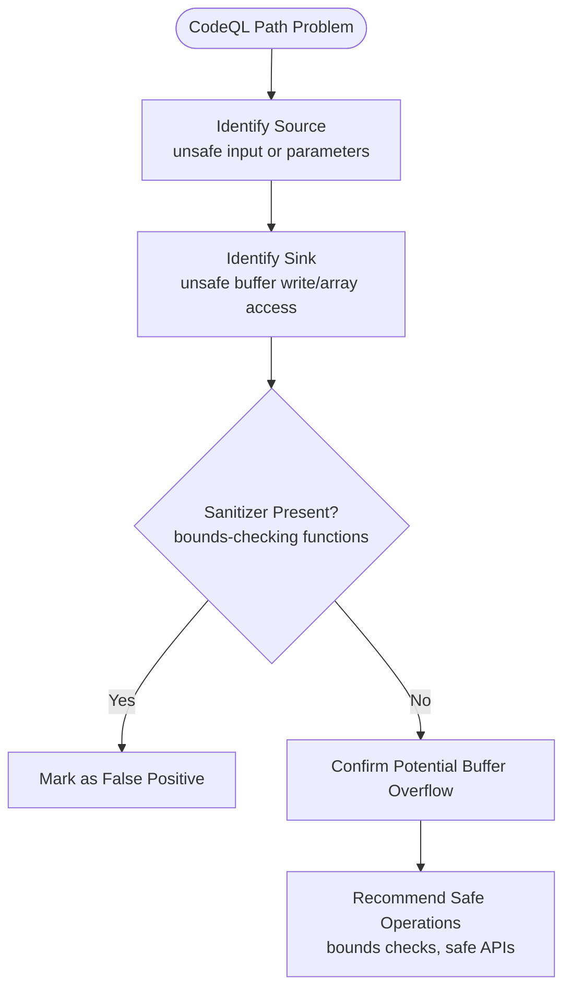
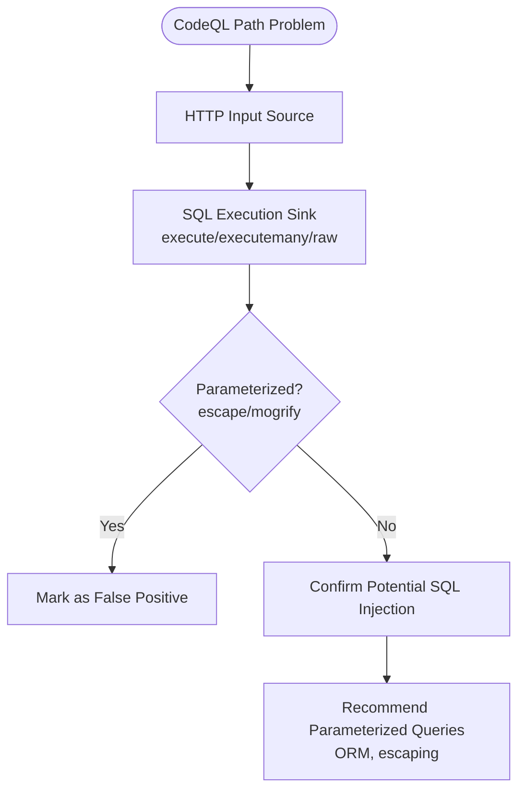
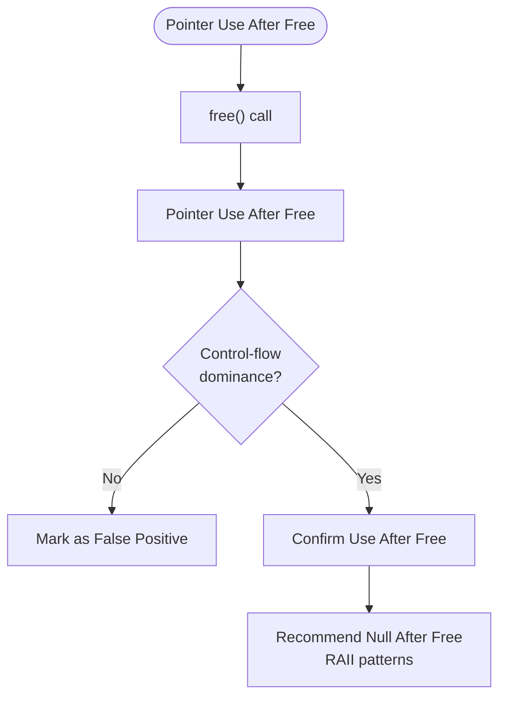
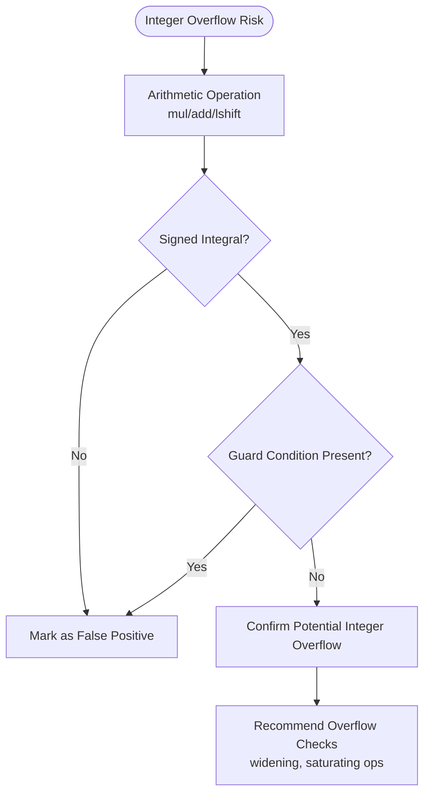
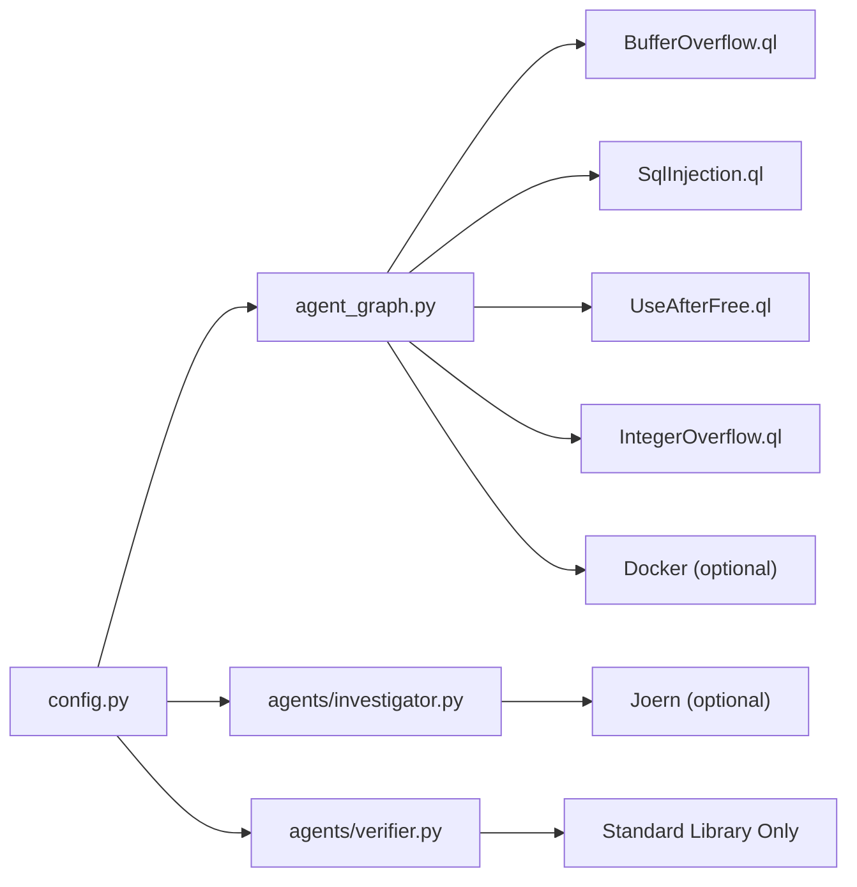

# CWE Detection Patterns

<cite>
**Referenced Files in This Document**
- [README.md](file://autopov/README.md)
- [BufferOverflow.ql](file://autopov/codeql_queries/BufferOverflow.ql)
- [SqlInjection.ql](file://autopov/codeql_queries/SqlInjection.ql)
- [UseAfterFree.ql](file://autopov/codeql_queries/UseAfterFree.ql)
- [IntegerOverflow.ql](file://autopov/codeql_queries/IntegerOverflow.ql)
- [agent_graph.py](file://autopov/app/agent_graph.py)
- [investigator.py](file://autopov/agents/investigator.py)
- [verifier.py](file://autopov/agents/verifier.py)
- [prompts.py](file://autopov/prompts.py)
- [scan_manager.py](file://autopov/app/scan_manager.py)
- [config.py](file://autopov/app/config.py)
- [main.py](file://autopov/app/main.py)
- [autopov.py](file://autopov/cli/autopov.py)
- [target.c](file://samples/target.c)
</cite>

## Table of Contents
1. [Introduction](#introduction)
2. [Project Structure](#project-structure)
3. [Core Components](#core-components)
4. [Architecture Overview](#architecture-overview)
5. [Detailed Component Analysis](#detailed-component-analysis)
6. [Dependency Analysis](#dependency-analysis)
7. [Performance Considerations](#performance-considerations)
8. [Troubleshooting Guide](#troubleshooting-guide)
9. [Conclusion](#conclusion)
10. [Appendices](#appendices)

## Introduction
This document describes the CWE-specific detection patterns implemented in AutoPoV for the four primary vulnerability types supported by the framework: CWE-119 (Buffer Overflow), CWE-89 (SQL Injection), CWE-416 (Use After Free), and CWE-190 (Integer Overflow). It explains detection methodologies, characteristic patterns, validation criteria, and false positive mitigation strategies. Practical examples of detection triggers, code patterns, and remediation approaches are included to guide both technical and non-technical readers.

## Project Structure
AutoPoV integrates static analysis (CodeQL) with AI-driven reasoning (LangGraph + LLMs) to detect, verify, and benchmark vulnerabilities. The detection pipeline is orchestrated by a LangGraph workflow that ingests code, runs CodeQL queries, performs LLM-based investigation, generates Proof-of-Vulnerability (PoV) scripts, validates them, and executes them in Docker when applicable.

**Diagram sources**
- [agent_graph.py](file://autopov/app/agent_graph.py#L84-L134)
- [investigator.py](file://autopov/agents/investigator.py#L254-L365)
- [verifier.py](file://autopov/agents/verifier.py#L79-L149)
- [config.py](file://autopov/app/config.py#L13-L100)
- [scan_manager.py](file://autopov/app/scan_manager.py#L118-L175)
- [main.py](file://autopov/app/main.py#L177-L316)
- [autopov.py](file://autopov/cli/autopov.py#L104-L210)

**Section sources**
- [README.md](file://autopov/README.md#L1-L242)
- [agent_graph.py](file://autopov/app/agent_graph.py#L1-L582)
- [config.py](file://autopov/app/config.py#L1-L210)

## Core Components
- Static analyzers (CodeQL queries) define sources, sinks, sanitizers, and path conditions for each CWE.
- The agent graph orchestrates ingestion, CodeQL execution, investigation, PoV generation/validation, and Docker execution.
- The investigator agent augments findings with LLM reasoning and optional Joern CPG analysis for use-after-free.
- The verifier agent validates PoV scripts for correctness, safety, and CWE-specific requirements.
- Configuration governs tool availability, resource limits, and runtime behavior.

**Section sources**
- [BufferOverflow.ql](file://autopov/codeql_queries/BufferOverflow.ql#L16-L59)
- [SqlInjection.ql](file://autopov/codeql_queries/SqlInjection.ql#L17-L67)
- [UseAfterFree.ql](file://autopov/codeql_queries/UseAfterFree.ql#L16-L41)
- [IntegerOverflow.ql](file://autopov/codeql_queries/IntegerOverflow.ql#L15-L62)
- [agent_graph.py](file://autopov/app/agent_graph.py#L163-L278)
- [investigator.py](file://autopov/agents/investigator.py#L89-L184)
- [verifier.py](file://autopov/agents/verifier.py#L151-L291)
- [config.py](file://autopov/app/config.py#L73-L100)

## Architecture Overview
The AutoPoV pipeline is a hybrid SAST + LLM workflow. CodeQL produces structured findings; LLMs refine and contextualize them; PoVs are generated and validated; Docker execution confirms triggers.

**Diagram sources**
- [main.py](file://autopov/app/main.py#L177-L316)
- [scan_manager.py](file://autopov/app/scan_manager.py#L118-L175)
- [agent_graph.py](file://autopov/app/agent_graph.py#L163-L278)
- [investigator.py](file://autopov/agents/investigator.py#L254-L365)
- [verifier.py](file://autopov/agents/verifier.py#L79-L149)

## Detailed Component Analysis

### CWE-119: Buffer Overflow Detection
Detection methodology:
- Sources: unsafe input functions and function parameters.
- Sinks: unsafe buffer write operations and array writes without bounds checking.
- Sanitizers: bounds-checking functions (e.g., length and size functions) reduce risk.
- Path problem: taint-tracking from source to sink without sanitizer in between.

Characteristic patterns:
- Unsafe copy/move/sprintf operations writing into fixed-size buffers.
- Direct array indexing without explicit bounds checks.
- Calls relying on external input without size validation.

Validation criteria:
- Confirm presence of unsafe sink and absence of explicit bounds checks.
- Verify taint path exists from user input or parameters.
- Mitigate false positives by detecting defensive guards or prior sanitization.

False positive mitigation:
- Prefer sinks that operate on fixed-size buffers or arrays.
- Require evidence of missing bounds checks or guards.
- Use LLM to assess intent and context.

Remediation approaches:
- Replace unsafe operations with safe equivalents that enforce bounds.
- Enforce compile-time or runtime bounds checks.
- Apply input validation and canonicalization before buffer operations.

Practical examples:
- Example C pattern: copying untrusted input into a small fixed-size buffer without size checks.
- Example detection trigger: CodeQL identifies a taint path from a user input source to a buffer write sink.

**Section sources**
- [BufferOverflow.ql](file://autopov/codeql_queries/BufferOverflow.ql#L16-L59)
- [prompts.py](file://autopov/prompts.py#L39-L43)
- [target.c](file://samples/target.c#L4-L8)

**Diagram sources**
- [BufferOverflow.ql](file://autopov/codeql_queries/BufferOverflow.ql#L19-L52)

### CWE-89: SQL Injection Detection
Detection methodology:
- Sources: HTTP request inputs (query/form/body/environment).
- Sinks: SQL execution sinks and string formatting that produces SQL.
- Sanitizers: parameterized queries and escaping functions.

Characteristic patterns:
- Dynamic SQL construction via string concatenation or formatting containing SQL keywords.
- Direct execution of user-supplied SQL strings.

Validation criteria:
- Presence of user input sources and SQL execution sinks.
- Absence of parameterization or escaping.
- LLM assessment of query construction patterns.

False positive mitigation:
- Require evidence of SQL keyword presence in formatted strings.
- Prefer sinks that use prepared statements or ORM parameterization.
- Use LLM to distinguish benign string formatting from SQL assembly.

Remediation approaches:
- Use parameterized queries or ORM with bound parameters.
- Escape or quote user inputs consistently.
- Normalize and validate SQL inputs against allowlists.

Practical examples:
- Example detection trigger: CodeQL detects a taint path from request input to a SQL formatting sink containing SQL keywords.

**Section sources**
- [SqlInjection.ql](file://autopov/codeql_queries/SqlInjection.ql#L17-L67)
- [prompts.py](file://autopov/prompts.py#L40-L43)

**Diagram sources**
- [SqlInjection.ql](file://autopov/codeql_queries/SqlInjection.ql#L20-L60)

### CWE-416: Use After Free Detection
Detection methodology:
- Identify calls to free() that may lead to dangling pointer usage.
- Detect pointer usage after the free call in control-flow order.
- Use guards to avoid false positives from uninitialized or conditionally protected pointers.

Characteristic patterns:
- Pointer dereference immediately after free().
- Use of the same variable/pointer after deallocation.
- Control-flow dominance ensuring usage occurs after the free call.

Validation criteria:
- Same pointer variable used post-free.
- Control-flow ordering (strictly dominates) between free and use.
- Optional: Joern CPG analysis for deeper pointer/data flow insights.

False positive mitigation:
- Require control-flow dominance and identical pointer target.
- Exclude cases with intervening reassignment or initialization.
- Use LLM to interpret complex pointer semantics.

Remediation approaches:
- Set pointers to null after free().
- Avoid reusing freed pointers; allocate fresh memory when needed.
- Use RAII or smart pointer patterns to prevent manual memory mismanagement.

Practical examples:
- Example detection trigger: CodeQL identifies a free() call followed by a use of the same pointer in a later basic block.

**Section sources**
- [UseAfterFree.ql](file://autopov/codeql_queries/UseAfterFree.ql#L16-L41)
- [investigator.py](file://autopov/agents/investigator.py#L89-L184)

**Diagram sources**
- [UseAfterFree.ql](file://autopov/codeql_queries/UseAfterFree.ql#L19-L34)

### CWE-190: Integer Overflow Detection
Detection methodology:
- Identify arithmetic operations that can overflow without guards.
- Focus on multiplication, addition, and left shifts of signed integers.
- Detect array index calculations that may overflow without bounds checks.

Characteristic patterns:
- Signed integer arithmetic with operands that can exceed representable range.
- Large shift amounts increasing the risk of overflow.
- Index computations combining variables without overflow checks.

Validation criteria:
- Operation type (mul/add/lshift) on signed integral types.
- Absence of guard conditions controlling the operation.
- Array index calculations without prior bounds checks.

False positive mitigation:
- Exclude unsigned types and literals.
- Require operands to be non-literals to increase risk.
- Consider guard conditions that mitigate overflow.

Remediation approaches:
- Use wider integer types for intermediate calculations.
- Apply explicit overflow checks before arithmetic.
- Employ saturating arithmetic or checked arithmetic libraries.

Practical examples:
- Example detection trigger: CodeQL identifies a signed multiplication or shift without guards.

**Section sources**
- [IntegerOverflow.ql](file://autopov/codeql_queries/IntegerOverflow.ql#L15-L62)

**Diagram sources**
- [IntegerOverflow.ql](file://autopov/codeql_queries/IntegerOverflow.ql#L18-L55)

## Dependency Analysis
The detection pipeline depends on:
- CodeQL CLI availability for database creation and query execution.
- LLM availability (online or offline) for investigation and PoV validation.
- Docker availability for PoV execution (optional).
- Optional Joern availability for use-after-free CPG analysis.

**Diagram sources**
- [config.py](file://autopov/app/config.py#L73-L100)
- [agent_graph.py](file://autopov/app/agent_graph.py#L163-L278)
- [investigator.py](file://autopov/agents/investigator.py#L89-L184)
- [verifier.py](file://autopov/agents/verifier.py#L151-L291)

**Section sources**
- [config.py](file://autopov/app/config.py#L137-L172)
- [agent_graph.py](file://autopov/app/agent_graph.py#L163-L191)

## Performance Considerations
- CodeQL database creation and query execution are bounded by timeouts; failures fall back to LLM-only analysis.
- LLM inference costs are estimated and tracked; offline mode reduces cost but increases latency variability.
- Docker execution is constrained by memory, CPU, and timeout settings to prevent runaway processes.
- Joern analysis is optional and only invoked for use-after-free to reduce overhead.

[No sources needed since this section provides general guidance]

## Troubleshooting Guide
Common issues and resolutions:
- CodeQL not available: The pipeline falls back to LLM-only analysis. Ensure CodeQL CLI is installed and accessible.
- Joern not available: Use-after-free detection is limited; install and configure Joern for enhanced coverage.
- Docker disabled or unavailable: PoV execution is skipped; enable Docker or run PoVs manually.
- PoV validation failures: The verifier checks syntax, required print statements, standard library usage, and CWE-specific requirements. Review suggestions and regenerate PoVs accordingly.
- LLM parsing errors: Investigator and verifier parse JSON responses; ensure model outputs are valid JSON and avoid markdown formatting in unexpected places.

**Section sources**
- [agent_graph.py](file://autopov/app/agent_graph.py#L168-L173)
- [investigator.py](file://autopov/agents/investigator.py#L315-L336)
- [verifier.py](file://autopov/agents/verifier.py#L177-L227)
- [config.py](file://autopov/app/config.py#L123-L172)

## Conclusion
AutoPoV’s CWE detection patterns combine precise static analysis with robust LLM reasoning and automated PoV validation. By leveraging CodeQL sinks and sanitizers, and augmenting with LLM interpretation and Docker execution, the framework provides actionable, low-false-positive results for buffer overflows, SQL injection, use-after-free, and integer overflow vulnerabilities.

[No sources needed since this section summarizes without analyzing specific files]

## Appendices

### Appendix A: CWE Support Matrix
- CWE-119: Buffer Overflow — CodeQL sources/sinks + LLM validation.
- CWE-89: SQL Injection — HTTP input sources + SQL sinks + parameterization checks.
- CWE-416: Use After Free — free() usage + pointer control-flow analysis + optional Joern.
- CWE-190: Integer Overflow — arithmetic operations + guard absence + index calculations.

**Section sources**
- [README.md](file://autopov/README.md#L194-L202)
- [config.py](file://autopov/app/config.py#L94-L100)

### Appendix B: Example Code Pattern (CWE-119)
- A minimal example demonstrates a function copying untrusted input into a small fixed-size buffer, a classic trigger for buffer overflow.

**Section sources**
- [target.c](file://samples/target.c#L4-L8)