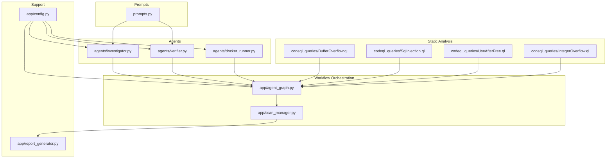
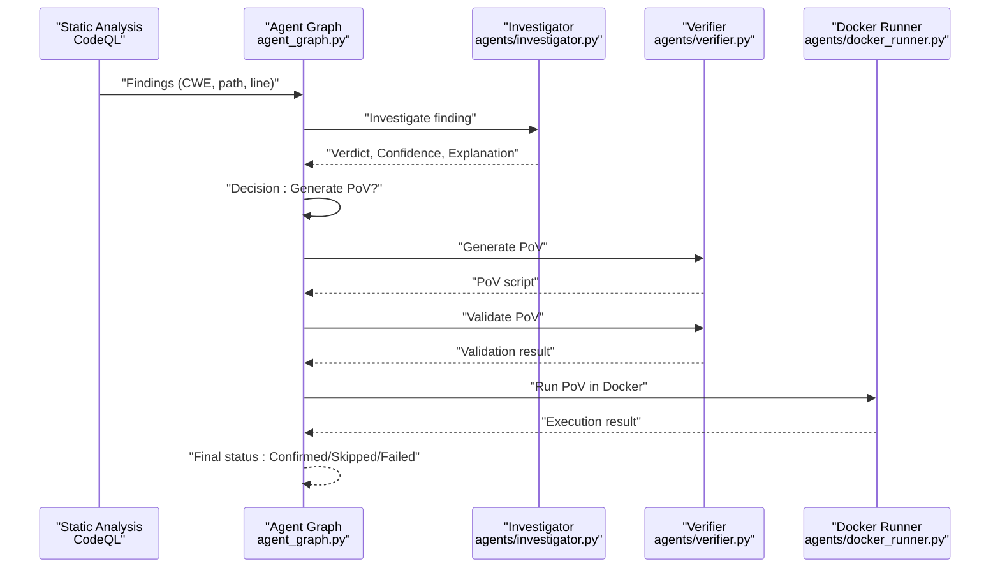
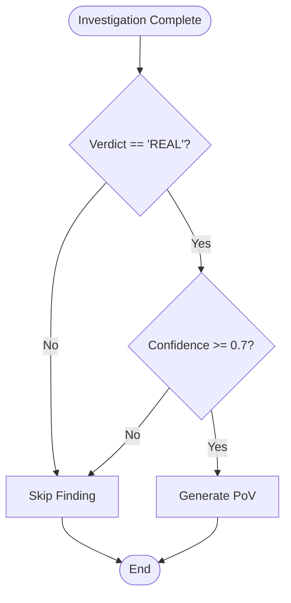
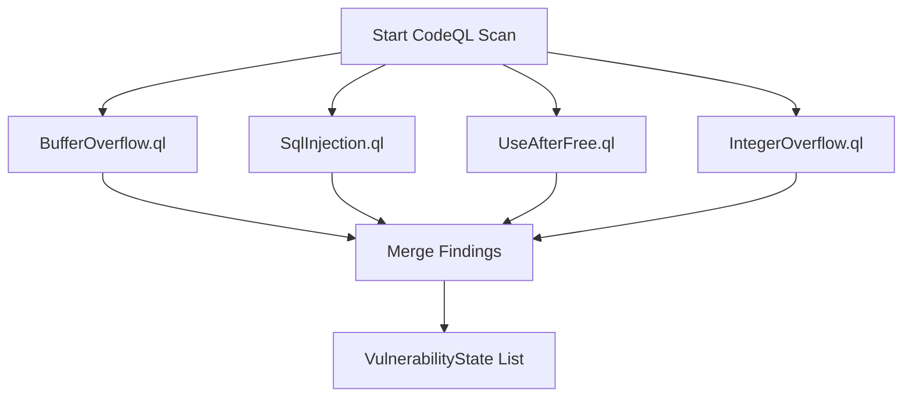
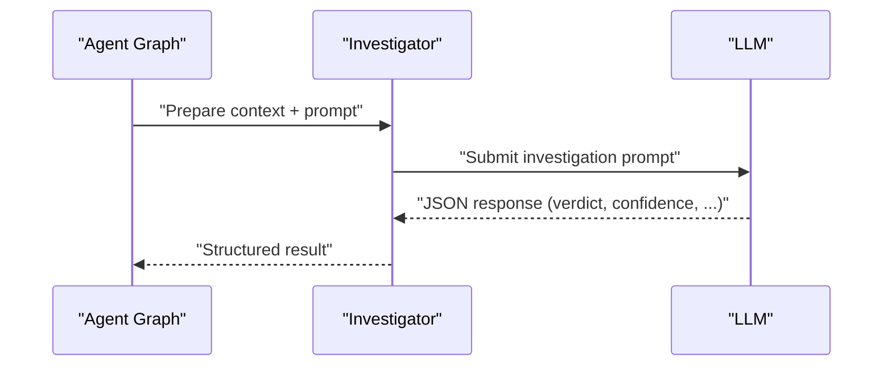
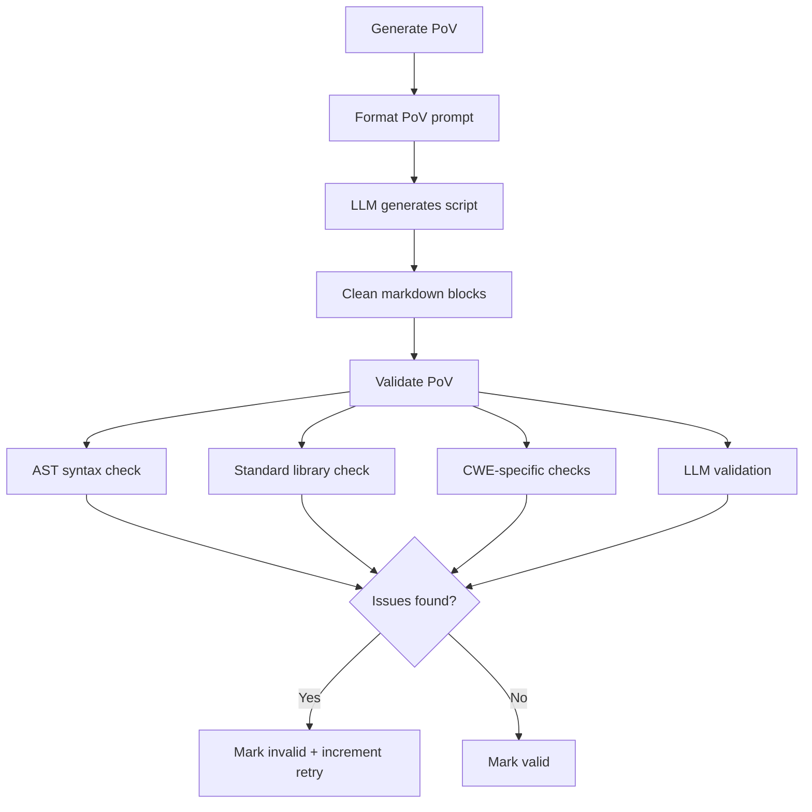
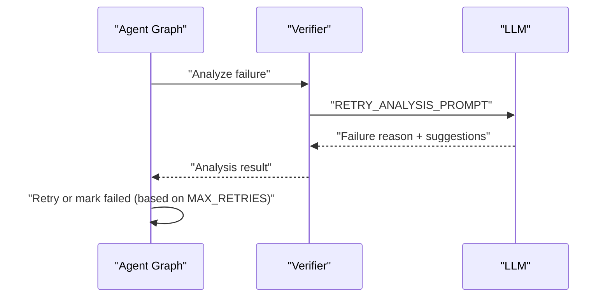
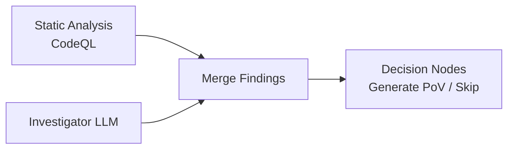
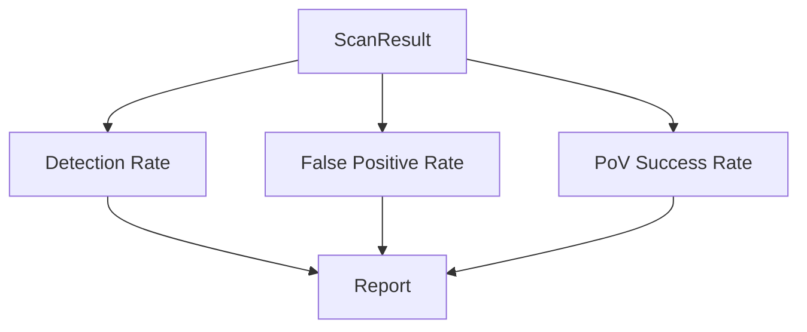
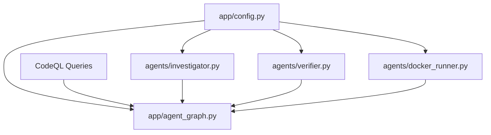

# Confidence Scoring and Validation

<cite>
**Referenced Files in This Document**
- [prompts.py](file://autopov/prompts.py)
- [investigator.py](file://autopov/agents/investigator.py)
- [verifier.py](file://autopov/agents/verifier.py)
- [agent_graph.py](file://autopov/app/agent_graph.py)
- [config.py](file://autopov/app/config.py)
- [docker_runner.py](file://autopov/agents/docker_runner.py)
- [scan_manager.py](file://autopov/app/scan_manager.py)
- [report_generator.py](file://autopov/app/report_generator.py)
- [BufferOverflow.ql](file://autopov/codeql_queries/BufferOverflow.ql)
- [SqlInjection.ql](file://autopov/codeql_queries/SqlInjection.ql)
- [UseAfterFree.ql](file://autopov/codeql_queries/UseAfterFree.ql)
- [IntegerOverflow.ql](file://autopov/codeql_queries/IntegerOverflow.ql)
</cite>

## Table of Contents
1. [Introduction](#introduction)
2. [Project Structure](#project-structure)
3. [Core Components](#core-components)
4. [Architecture Overview](#architecture-overview)
5. [Detailed Component Analysis](#detailed-component-analysis)
6. [Dependency Analysis](#dependency-analysis)
7. [Performance Considerations](#performance-considerations)
8. [Troubleshooting Guide](#troubleshooting-guide)
9. [Conclusion](#conclusion)
10. [Appendices](#appendices)

## Introduction
This document explains the confidence scoring and validation system used by AutoPoV to verify vulnerabilities and ensure high-quality results. It covers the multi-stage validation pipeline: initial static analysis filtering, LLM-based reasoning, and Proof-of-Vulnerability (PoV) script generation and execution. It also documents the confidence scoring algorithm, thresholds, and decision criteria, along with mechanisms to reduce false positives, retry strategies for failed PoV attempts, and practical examples of interpreting confidence scores and validation workflows.

## Project Structure
AutoPoV organizes its vulnerability verification workflow across several modules:
- Prompts define the instruction templates for LLM reasoning and PoV tasks.
- Agents implement specialized capabilities: investigation, PoV generation/validation, and Docker execution.
- The agent graph orchestrates the end-to-end workflow with configurable thresholds and retries.
- Supporting modules handle configuration, static analysis queries, reporting, and scan lifecycle management.

**Diagram sources**
- [prompts.py](file://autopov/prompts.py#L1-L374)
- [investigator.py](file://autopov/agents/investigator.py#L1-L413)
- [verifier.py](file://autopov/agents/verifier.py#L1-L401)
- [agent_graph.py](file://autopov/app/agent_graph.py#L1-L582)
- [config.py](file://autopov/app/config.py#L1-L210)
- [docker_runner.py](file://autopov/agents/docker_runner.py#L1-L379)
- [scan_manager.py](file://autopov/app/scan_manager.py#L1-L344)
- [report_generator.py](file://autopov/app/report_generator.py#L1-L359)
- [BufferOverflow.ql](file://autopov/codeql_queries/BufferOverflow.ql#L1-L59)
- [SqlInjection.ql](file://autopov/codeql_queries/SqlInjection.ql#L1-L67)
- [UseAfterFree.ql](file://autopov/codeql_queries/UseAfterFree.ql#L1-L41)
- [IntegerOverflow.ql](file://autopov/codeql_queries/IntegerOverflow.ql#L1-L62)

**Section sources**
- [prompts.py](file://autopov/prompts.py#L1-L374)
- [investigator.py](file://autopov/agents/investigator.py#L1-L413)
- [verifier.py](file://autopov/agents/verifier.py#L1-L401)
- [agent_graph.py](file://autopov/app/agent_graph.py#L1-L582)
- [config.py](file://autopov/app/config.py#L1-L210)
- [docker_runner.py](file://autopov/agents/docker_runner.py#L1-L379)
- [scan_manager.py](file://autopov/app/scan_manager.py#L1-L344)
- [report_generator.py](file://autopov/app/report_generator.py#L1-L359)
- [BufferOverflow.ql](file://autopov/codeql_queries/BufferOverflow.ql#L1-L59)
- [SqlInjection.ql](file://autopov/codeql_queries/SqlInjection.ql#L1-L67)
- [UseAfterFree.ql](file://autopov/codeql_queries/UseAfterFree.ql#L1-L41)
- [IntegerOverflow.ql](file://autopov/codeql_queries/IntegerOverflow.ql#L1-L62)

## Core Components
- Confidence scoring and thresholds:
  - Confidence is produced by the LLM during investigation and stored in the vulnerability state.
  - Decision to generate PoV occurs when the LLM verdict is “REAL” and confidence is greater than or equal to a threshold.
- Initial static analysis filtering:
  - CodeQL queries detect potential vulnerability patterns and feed structured findings into the agent graph.
- LLM-based reasoning:
  - The investigator agent analyzes each finding using curated prompts and returns a structured verdict, confidence, and explanation.
- PoV generation and validation:
  - The verifier generates PoV scripts and applies multi-layer validation (syntax, standard library constraints, CWE-specific checks, and LLM validation).
- Docker execution:
  - PoVs run in isolated containers to confirm vulnerability triggers safely.
- Retry mechanism:
  - On validation failure or unsuccessful execution, the system retries PoV generation or execution up to configured limits.

**Section sources**
- [agent_graph.py](file://autopov/app/agent_graph.py#L488-L515)
- [investigator.py](file://autopov/agents/investigator.py#L254-L366)
- [verifier.py](file://autopov/agents/verifier.py#L79-L150)
- [verifier.py](file://autopov/agents/verifier.py#L151-L228)
- [verifier.py](file://autopov/agents/verifier.py#L332-L392)
- [docker_runner.py](file://autopov/agents/docker_runner.py#L62-L192)
- [config.py](file://autopov/app/config.py#L92-L92)

## Architecture Overview
The workflow is orchestrated by a LangGraph-based agent graph that integrates static analysis, LLM reasoning, PoV generation, validation, and execution.

**Diagram sources**
- [agent_graph.py](file://autopov/app/agent_graph.py#L163-L191)
- [agent_graph.py](file://autopov/app/agent_graph.py#L290-L325)
- [agent_graph.py](file://autopov/app/agent_graph.py#L327-L401)
- [agent_graph.py](file://autopov/app/agent_graph.py#L403-L433)
- [investigator.py](file://autopov/agents/investigator.py#L254-L366)
- [verifier.py](file://autopov/agents/verifier.py#L79-L150)
- [verifier.py](file://autopov/agents/verifier.py#L151-L228)
- [docker_runner.py](file://autopov/agents/docker_runner.py#L62-L192)

## Detailed Component Analysis

### Confidence Scoring and Thresholds
- Confidence is a numeric value in the range [0.0, 1.0] returned by the LLM during investigation.
- Decision boundary:
  - Generate PoV: LLM verdict equals “REAL” AND confidence ≥ 0.7.
  - Otherwise, skip the finding.
- Confidence interpretation:
  - High confidence (≥ 0.7): Strong likelihood of a real vulnerability; proceed to PoV generation.
  - Lower confidence (< 0.7): Insufficient evidence; skip to avoid false positives.

**Diagram sources**
- [agent_graph.py](file://autopov/app/agent_graph.py#L488-L500)

**Section sources**
- [investigator.py](file://autopov/agents/investigator.py#L315-L347)
- [agent_graph.py](file://autopov/app/agent_graph.py#L488-L500)

### Initial Static Analysis Filtering
- CodeQL queries detect potential vulnerabilities and produce structured results:
  - BufferOverflow.ql targets unsafe buffer operations and missing bounds checks.
  - SqlInjection.ql targets tainted data reaching SQL execution sinks.
  - UseAfterFree.ql detects pointer reuse after free.
  - IntegerOverflow.ql identifies arithmetic operations at risk of overflow.
- The agent graph runs these queries and converts results into vulnerability states for further investigation.

**Diagram sources**
- [agent_graph.py](file://autopov/app/agent_graph.py#L193-L278)
- [BufferOverflow.ql](file://autopov/codeql_queries/BufferOverflow.ql#L1-L59)
- [SqlInjection.ql](file://autopov/codeql_queries/SqlInjection.ql#L1-L67)
- [UseAfterFree.ql](file://autopov/codeql_queries/UseAfterFree.ql#L1-L41)
- [IntegerOverflow.ql](file://autopov/codeql_queries/IntegerOverflow.ql#L1-L62)

**Section sources**
- [agent_graph.py](file://autopov/app/agent_graph.py#L193-L278)
- [BufferOverflow.ql](file://autopov/codeql_queries/BufferOverflow.ql#L1-L59)
- [SqlInjection.ql](file://autopov/codeql_queries/SqlInjection.ql#L1-L67)
- [UseAfterFree.ql](file://autopov/codeql_queries/UseAfterFree.ql#L1-L41)
- [IntegerOverflow.ql](file://autopov/codeql_queries/IntegerOverflow.ql#L1-L62)

### LLM-Based Reasoning and Contextual Analysis
- The investigator agent constructs:
  - Code context around the alert location.
  - RAG-enhanced context from similar patterns.
  - For specific CWEs (e.g., CWE-416), optional CPG analysis via Joern.
- It submits a structured prompt to the LLM and parses a JSON response containing:
  - Verdict: “REAL” or “FALSE_POSITIVE”
  - Confidence: [0.0, 1.0]
  - Explanation, vulnerable code snippet, root cause, and impact.
- Fallback behavior handles parsing failures by constructing a structured result with a default confidence.

**Diagram sources**
- [investigator.py](file://autopov/agents/investigator.py#L254-L366)
- [prompts.py](file://autopov/prompts.py#L7-L43)

**Section sources**
- [investigator.py](file://autopov/agents/investigator.py#L254-L366)
- [prompts.py](file://autopov/prompts.py#L7-L43)

### PoV Generation and Validation
- Generation:
  - The verifier formats a PoV prompt with CWE, file path, line number, vulnerable code, and explanation, then calls the LLM to produce a Python script.
- Validation:
  - Syntax validation via AST parsing.
  - Enforces presence of a specific trigger message and only standard library usage.
  - CWE-specific checks (pattern matching for buffer sizes, SQL keywords, large integers).
  - LLM-based validation to assess logical correctness and suggest improvements.
- Results:
  - Validation aggregates issues and suggestions; marks PoV invalid if issues exist.

**Diagram sources**
- [verifier.py](file://autopov/agents/verifier.py#L79-L150)
- [verifier.py](file://autopov/agents/verifier.py#L151-L228)
- [verifier.py](file://autopov/agents/verifier.py#L265-L292)
- [verifier.py](file://autopov/agents/verifier.py#L293-L331)

**Section sources**
- [verifier.py](file://autopov/agents/verifier.py#L79-L150)
- [verifier.py](file://autopov/agents/verifier.py#L151-L228)
- [verifier.py](file://autopov/agents/verifier.py#L265-L292)
- [verifier.py](file://autopov/agents/verifier.py#L293-L331)

### Retry Mechanism Using RETRY_ANALYSIS_PROMPT
- When a PoV fails validation or execution, the system analyzes the failure:
  - Submits the original vulnerability details, the failed script, and execution output to the LLM.
  - Requests a structured analysis including failure reason, suggested changes, and whether to try a different approach.
- The agent graph enforces a maximum retry limit; exceeding it leads to marking the finding as failed.

**Diagram sources**
- [verifier.py](file://autopov/agents/verifier.py#L332-L392)
- [prompts.py](file://autopov/prompts.py#L176-L209)
- [agent_graph.py](file://autopov/app/agent_graph.py#L501-L515)
- [config.py](file://autopov/app/config.py#L92-L92)

**Section sources**
- [verifier.py](file://autopov/agents/verifier.py#L332-L392)
- [prompts.py](file://autopov/prompts.py#L176-L209)
- [agent_graph.py](file://autopov/app/agent_graph.py#L501-L515)
- [config.py](file://autopov/app/config.py#L92-L92)

### Cross-Referencing Static Analysis with LLM Results
- Static analysis produces structured findings with file paths and line numbers.
- LLM reasoning enriches these findings with confidence, explanation, and CWE-specific insights.
- The agent graph merges these two sources to drive downstream decisions (PoV generation, validation, execution).

**Diagram sources**
- [agent_graph.py](file://autopov/app/agent_graph.py#L193-L278)
- [investigator.py](file://autopov/agents/investigator.py#L254-L366)

**Section sources**
- [agent_graph.py](file://autopov/app/agent_graph.py#L193-L278)
- [investigator.py](file://autopov/agents/investigator.py#L254-L366)

### Quality Metrics and Reporting
- Metrics computed from scan results:
  - Detection rate: confirmed_vulns / total_findings × 100
  - False positive rate: false_positives / total_findings × 100
  - PoV success rate: confirmed_vulns with vulnerability_triggered / confirmed_vulns × 100
- Reports include JSON and PDF formats with findings details and methodology.

**Diagram sources**
- [report_generator.py](file://autopov/app/report_generator.py#L302-L328)

**Section sources**
- [report_generator.py](file://autopov/app/report_generator.py#L302-L328)

## Dependency Analysis
- Configuration drives model selection, tool availability, and retry limits.
- The agent graph depends on the investigator, verifier, and Docker runner to execute the workflow.
- Static analysis queries feed structured inputs into the agent graph.

**Diagram sources**
- [config.py](file://autopov/app/config.py#L1-L210)
- [agent_graph.py](file://autopov/app/agent_graph.py#L1-L582)
- [investigator.py](file://autopov/agents/investigator.py#L1-L413)
- [verifier.py](file://autopov/agents/verifier.py#L1-L401)
- [docker_runner.py](file://autopov/agents/docker_runner.py#L1-L379)

**Section sources**
- [config.py](file://autopov/app/config.py#L1-L210)
- [agent_graph.py](file://autopov/app/agent_graph.py#L1-L582)

## Performance Considerations
- Cost control:
  - Inference time is estimated for cost tracking; online mode costs are approximated at a fixed rate per second.
- Model temperature:
  - Investigator and verifier use low temperatures to improve determinism during reasoning and validation.
- Resource limits:
  - Docker execution includes timeouts, memory limits, and CPU quotas to prevent runaway processes.
- Retries:
  - Controlled by MAX_RETRIES to balance thoroughness and runtime.

[No sources needed since this section provides general guidance]

## Troubleshooting Guide
- Investigation errors:
  - Investigator returns structured error results with zero confidence and timestamps when exceptions occur.
- LLM parsing failures:
  - If JSON extraction fails, a fallback result is constructed with a default confidence.
- Docker unavailability:
  - Docker runner gracefully reports failure when Docker is not available or when container operations fail.
- Validation failures:
  - Verifier aggregates issues and suggestions; use these to refine PoV generation.

**Section sources**
- [investigator.py](file://autopov/agents/investigator.py#L349-L366)
- [verifier.py](file://autopov/agents/verifier.py#L177-L183)
- [docker_runner.py](file://autopov/agents/docker_runner.py#L81-L91)

## Conclusion
AutoPoV’s confidence scoring and validation system combines static analysis, LLM reasoning, and automated PoV generation with robust validation and retry mechanisms. The 0.7 confidence threshold ensures strong evidence before generating PoVs, while multi-layer validation and Docker execution reduce false positives and confirm real vulnerabilities. Continuous improvement is supported by structured metrics, detailed logging, and iterative refinement of prompts and validation rules.

[No sources needed since this section summarizes without analyzing specific files]

## Appendices

### Practical Examples

- Interpreting confidence scores:
  - Confidence ≥ 0.7: Proceed to PoV generation.
  - Confidence < 0.7: Skip to reduce false positives.
- Validation workflow:
  - Generation → Syntax + Standard Library + CWE-specific + LLM validation → Docker execution → Final status.
- Quality metrics:
  - Detection rate, false positive rate, and PoV success rate enable continuous monitoring and tuning.

[No sources needed since this section provides general guidance]