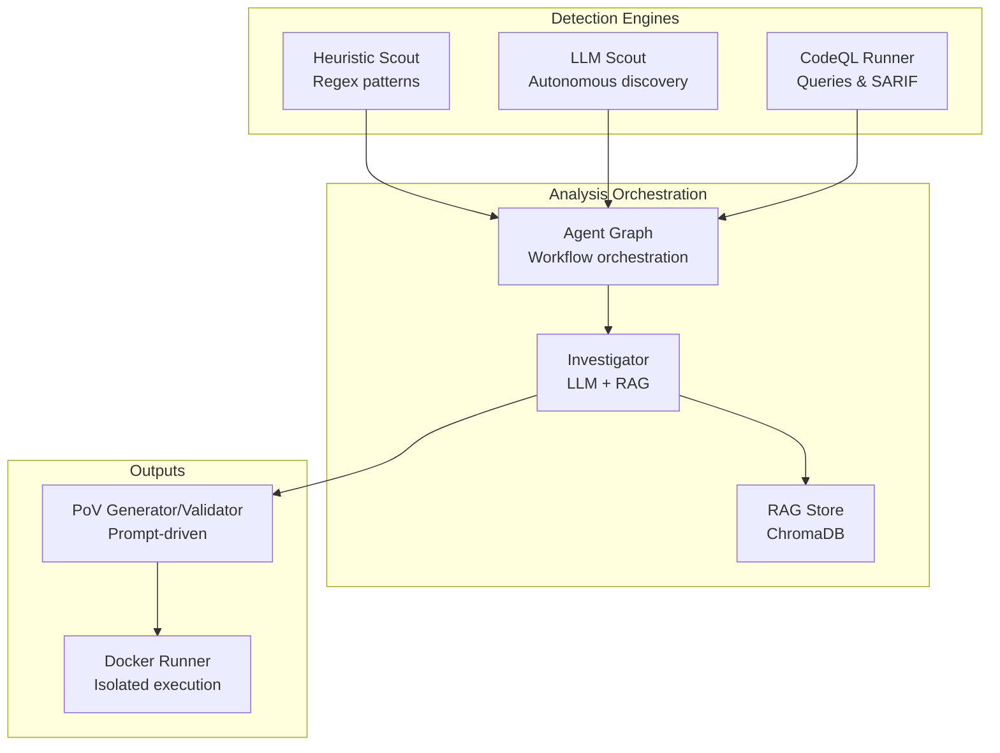
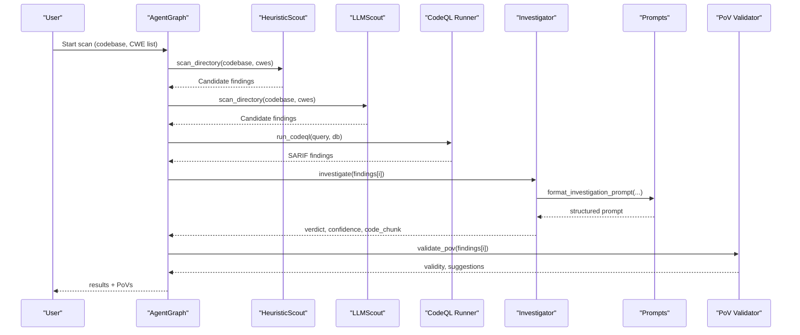
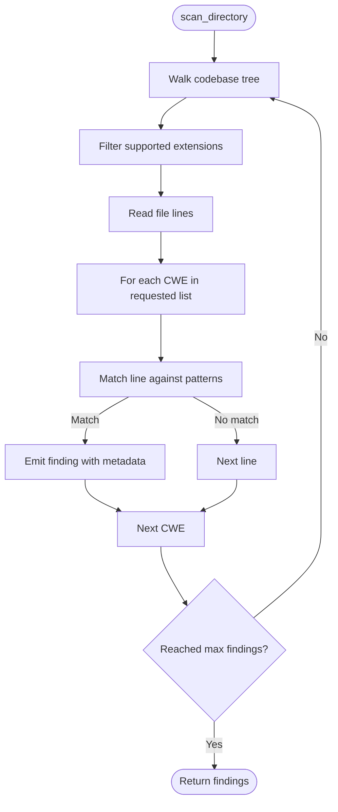
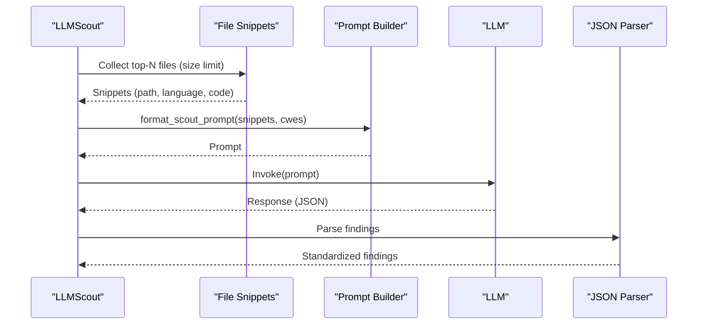
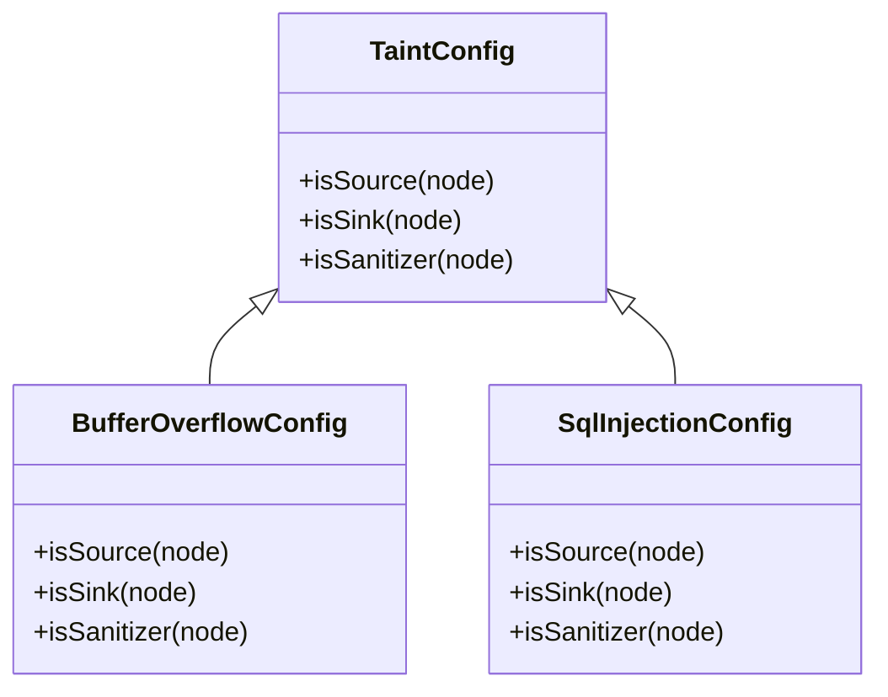
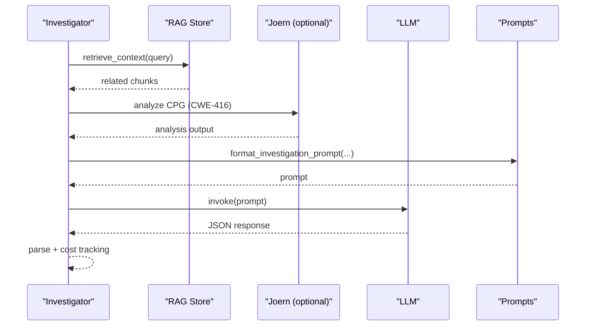
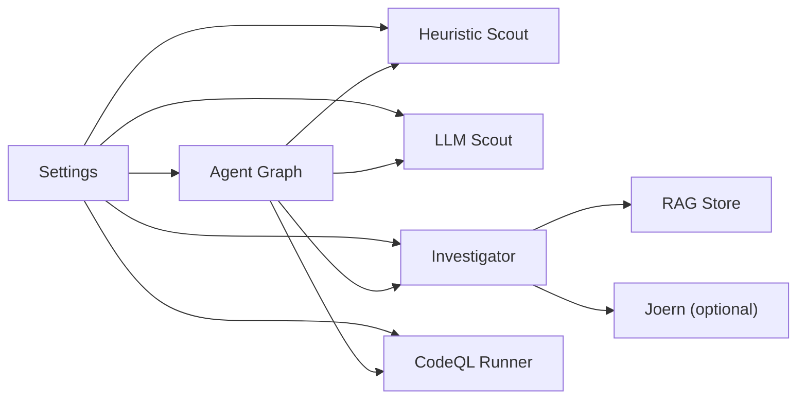

# Custom Rule Development

<cite>
**Referenced Files in This Document**
- [heuristic_scout.py](file://agents/heuristic_scout.py)
- [llm_scout.py](file://agents/llm_scout.py)
- [prompts.py](file://prompts.py)
- [config.py](file://app/config.py)
- [agent_graph.py](file://app/agent_graph.py)
- [investigator.py](file://agents/investigator.py)
- [ingest_codebase.py](file://agents/ingest_codebase.py)
- [BufferOverflow.ql](file://codeql_queries/BufferOverflow.ql)
- [SqlInjection.ql](file://codeql_queries/SqlInjection.ql)
- [owasp-min.yml](file://semgrep-rules/owasp-min.yml)
- [test_patterns.py](file://test_patterns.py)
</cite>

## Table of Contents
1. [Introduction](#introduction)
2. [Project Structure](#project-structure)
3. [Core Components](#core-components)
4. [Architecture Overview](#architecture-overview)
5. [Detailed Component Analysis](#detailed-component-analysis)
6. [Dependency Analysis](#dependency-analysis)
7. [Performance Considerations](#performance-considerations)
8. [Troubleshooting Guide](#troubleshooting-guide)
9. [Conclusion](#conclusion)
10. [Appendices](#appendices)

## Introduction
This document explains how to develop custom detection rules and extend AutoPoV’s vulnerability detection capabilities. It covers:
- Creating custom CodeQL queries with source/sink definitions and taint tracking
- Developing Semgrep rules for pattern-based detection
- Extending the heuristic scout with new pattern recognition algorithms
- Engineering prompts for LLM-based detection and PoV generation
- Step-by-step tutorials for new vulnerability types, integrating third-party tools, and customizing existing logic
- Testing, validation, performance optimization, and deployment strategies

## Project Structure
AutoPoV integrates multiple detection modalities:
- Static analysis via CodeQL
- Lightweight pattern-based heuristics
- LLM-powered autonomous discovery
- LLM-based investigation and PoV generation
- Retrieval-Augmented Generation (RAG) for context
- Optional downstream tools (e.g., Joern for CPG analysis)

**Diagram sources**
- [agent_graph.py:88-168](file://app/agent_graph.py#L88-L168)
- [heuristic_scout.py:13-237](file://agents/heuristic_scout.py#L13-L237)
- [llm_scout.py:32-207](file://agents/llm_scout.py#L32-L207)
- [investigator.py:270-432](file://agents/investigator.py#L270-L432)
- [ingest_codebase.py:207-313](file://agents/ingest_codebase.py#L207-L313)

**Section sources**
- [agent_graph.py:88-168](file://app/agent_graph.py#L88-L168)
- [config.py:108-134](file://app/config.py#L108-L134)

## Core Components
- Heuristic Scout: Lightweight, fast pattern matching across supported languages for common vulnerability families.
- LLM Scout: Autonomous discovery using LLMs over file snippets.
- CodeQL Runner: Executes curated queries and merges results with heuristic/LLM findings.
- Investigator: LLM-based triage with RAG and optional Joern CPG analysis for specific CWEs.
- Prompt Library: Centralized templates for investigation, PoV generation, validation, and retries.
- RAG Store: ChromaDB-backed code embeddings for context retrieval.

Key configuration knobs live in settings for cost control, model selection, and supported CWEs.

**Section sources**
- [heuristic_scout.py:13-237](file://agents/heuristic_scout.py#L13-L237)
- [llm_scout.py:32-207](file://agents/llm_scout.py#L32-L207)
- [agent_graph.py:241-307](file://app/agent_graph.py#L241-L307)
- [prompts.py:7-424](file://prompts.py#L7-L424)
- [ingest_codebase.py:41-413](file://agents/ingest_codebase.py#L41-L413)
- [config.py:46-134](file://app/config.py#L46-L134)

## Architecture Overview
The workflow begins with ingestion, followed by detection engines, and ends with investigation and PoV generation.

**Diagram sources**
- [agent_graph.py:206-307](file://app/agent_graph.py#L206-L307)
- [prompts.py:257-324](file://prompts.py#L257-L324)
- [investigator.py:270-432](file://agents/investigator.py#L270-L432)

## Detailed Component Analysis

### Heuristic Scout: Extending Pattern Recognition
The Heuristic Scout scans codebases using regex patterns mapped to CWE families. It:
- Walks the codebase and filters supported extensions
- Detects language by extension
- Matches lines against predefined patterns for each CWE
- Emits findings with metadata for downstream processing

Extensibility points:
- Add new CWE families by extending the internal patterns dictionary
- Add new regex patterns per CWE
- Adjust max findings and language filters

**Diagram sources**
- [heuristic_scout.py:188-234](file://agents/heuristic_scout.py#L188-L234)

**Section sources**
- [heuristic_scout.py:13-237](file://agents/heuristic_scout.py#L13-L237)
- [test_patterns.py:1-33](file://test_patterns.py#L1-L33)

### LLM Scout: Autonomous Discovery
The LLM Scout proposes candidates by:
- Selecting top N largest files under size limits
- Building a prompt with file snippets and requested CWEs
- Invoking the configured LLM
- Parsing JSON output into standardized findings

Extensibility points:
- Adjust max files, chars per file, and max findings
- Switch model provider (online/offline) via settings
- Tune prompt structure for broader or deeper coverage

**Diagram sources**
- [llm_scout.py:88-200](file://agents/llm_scout.py#L88-L200)
- [prompts.py:413-424](file://prompts.py#L413-L424)

**Section sources**
- [llm_scout.py:32-207](file://agents/llm_scout.py#L32-L207)
- [prompts.py:391-424](file://prompts.py#L391-L424)
- [config.py:46-52](file://app/config.py#L46-L52)

### CodeQL Queries: Source/Sink Definitions and Taint Tracking
AutoPoV executes both curated CodeQL queries and custom ones. The pattern follows:
- Define a Configuration class inheriting from a taint-tracking base
- Override isSource to identify user-controlled inputs
- Override isSink to identify dangerous operations
- Optionally override isSanitizer to mark mitigations
- Select using hasFlowPath and emit findings

Examples:
- BufferOverflow.ql: identifies unsafe buffer operations and missing bounds checks
- SqlInjection.ql: detects SQL execution sinks with user-controlled inputs

**Diagram sources**
- [BufferOverflow.ql:16-53](file://codeql_queries/BufferOverflow.ql#L16-L53)
- [SqlInjection.ql:17-61](file://codeql_queries/SqlInjection.ql#L17-L61)

**Section sources**
- [BufferOverflow.ql:1-59](file://codeql_queries/BufferOverflow.ql#L1-L59)
- [SqlInjection.ql:1-67](file://codeql_queries/SqlInjection.ql#L1-L67)
- [agent_graph.py:506-606](file://app/agent_graph.py#L506-L606)

### Semgrep Rules: Pattern-Based Detection
Semgrep rules define pattern-either constructs to match risky code patterns. Example rule structure:
- id: unique rule identifier
- languages: target language(s)
- pattern-either: list of equivalent risky patterns
- metadata: cwe mapping

Extensibility points:
- Add new rules with appropriate CWE metadata
- Expand pattern-either lists for similar risky constructs
- Scope rules to specific languages

**Section sources**
- [owasp-min.yml:1-53](file://semgrep-rules/owasp-min.yml#L1-L53)

### Prompt Engineering for LLM-Based Detection
AutoPoV centralizes prompts for:
- Investigation: structured JSON with verdict, confidence, explanation, vulnerable code, root cause, and impact
- PoV Generation: deterministic script generation with language-specific guidance
- PoV Validation: automated validation criteria and suggestions
- Retry Analysis: failure diagnosis and improvement suggestions
- Scout Prompt: multi-file JSON output with findings

Best practices:
- Use explicit JSON schemas in prompts
- Provide concrete examples for each CWE family
- Enforce deterministic behavior for PoV scripts
- Include context windows and language hints

**Section sources**
- [prompts.py:7-424](file://prompts.py#L7-L424)

### Investigator Agent: RAG + LLM Triaging
The Investigator:
- Retrieves code context via RAG (ChromaDB)
- Optionally runs Joern for use-after-free analysis
- Calls LLM with structured prompts
- Parses JSON responses and records costs and token usage
- Stores learning traces for policy routing

**Diagram sources**
- [investigator.py:270-432](file://agents/investigator.py#L270-L432)
- [ingest_codebase.py:315-358](file://agents/ingest_codebase.py#L315-L358)

**Section sources**
- [investigator.py:105-201](file://agents/investigator.py#L105-L201)
- [ingest_codebase.py:207-313](file://agents/ingest_codebase.py#L207-L313)

## Dependency Analysis
Key dependencies and relationships:
- Settings drive model mode, providers, cost caps, and supported CWEs
- Agent Graph orchestrates detection engines and investigation
- Investigator depends on RAG store and optional Joern
- CodeQL runner depends on CodeQL CLI availability and packs

**Diagram sources**
- [config.py:46-134](file://app/config.py#L46-L134)
- [agent_graph.py:206-307](file://app/agent_graph.py#L206-L307)
- [investigator.py:105-201](file://agents/investigator.py#L105-L201)
- [ingest_codebase.py:96-121](file://agents/ingest_codebase.py#L96-L121)

**Section sources**
- [config.py:156-231](file://app/config.py#L156-L231)
- [agent_graph.py:241-307](file://app/agent_graph.py#L241-L307)

## Performance Considerations
- Cost control: configure max files, chars per file, max findings, and max cost for scouts; enforce per-run cost caps
- Model selection: choose online/offline models based on latency and budget; tune temperature for determinism
- CodeQL: leverage language detection and curated queries; fallback to heuristic/LLM-only when unavailable
- RAG: chunk size and overlap affect retrieval quality and latency; persist ChromaDB for reuse
- Heuristic patterns: keep regex sets minimal and targeted to reduce false positives while maintaining recall

[No sources needed since this section provides general guidance]

## Troubleshooting Guide
Common issues and resolutions:
- CodeQL not available: the workflow falls back to LLM-only and heuristic discovery; verify CLI path and packs
- LLM provider not available: ensure required SDKs are installed and API keys are configured
- RAG failures: confirm ChromaDB installation and embedding model availability
- Heuristic false positives: refine regex patterns and add language-specific safeguards
- Prompt parsing errors: ensure LLM responds in strict JSON format; handle markdown code block wrappers

**Section sources**
- [agent_graph.py:253-300](file://app/agent_graph.py#L253-L300)
- [llm_scout.py:35-57](file://agents/llm_scout.py#L35-L57)
- [investigator.py:50-103](file://agents/investigator.py#L50-L103)
- [ingest_codebase.py:96-121](file://agents/ingest_codebase.py#L96-L121)

## Conclusion
AutoPoV offers a flexible, multi-modal detection pipeline. Extend it by:
- Adding regex patterns for new CWE families in the Heuristic Scout
- Writing CodeQL configurations with precise source/sink/sanitizer definitions
- Defining Semgrep rules for language-specific risky patterns
- Tuning prompts and models for investigation and PoV generation
- Integrating new detection tools via the Agent Graph and settings

[No sources needed since this section summarizes without analyzing specific files]

## Appendices

### Tutorial: Creating a New CodeQL Query
Steps:
1. Choose a CWE family (e.g., integer overflow)
2. Create a new query file under codeql_queries or integrate with existing packs
3. Define a Configuration class with isSource, isSink, and optional isSanitizer
4. Use hasFlowPath to select findings
5. Test locally with the CodeQL CLI and incorporate into the Agent Graph

References:
- [BufferOverflow.ql:16-53](file://codeql_queries/BufferOverflow.ql#L16-L53)
- [SqlInjection.ql:17-61](file://codeql_queries/SqlInjection.ql#L17-L61)
- [agent_graph.py:506-606](file://app/agent_graph.py#L506-L606)

**Section sources**
- [BufferOverflow.ql:1-59](file://codeql_queries/BufferOverflow.ql#L1-L59)
- [SqlInjection.ql:1-67](file://codeql_queries/SqlInjection.ql#L1-L67)
- [agent_graph.py:475-504](file://app/agent_graph.py#L475-L504)

### Tutorial: Adding a Semgrep Rule
Steps:
1. Decide target language(s) and CWE mapping
2. Add a new rule with pattern-either entries
3. Provide a clear message and severity
4. Validate with Semgrep CLI
5. Place in semgrep-rules directory for inclusion

References:
- [owasp-min.yml:1-53](file://semgrep-rules/owasp-min.yml#L1-L53)

**Section sources**
- [owasp-min.yml:1-53](file://semgrep-rules/owasp-min.yml#L1-L53)

### Tutorial: Extending the Heuristic Scout
Steps:
1. Identify new CWE family and representative patterns
2. Add regex patterns to the patterns dictionary
3. Optionally adjust language filters and max findings
4. Test with test_patterns.py or similar harness
5. Integrate into supported CWE list

References:
- [heuristic_scout.py:18-157](file://agents/heuristic_scout.py#L18-L157)
- [test_patterns.py:1-33](file://test_patterns.py#L1-L33)
- [config.py:108-134](file://app/config.py#L108-L134)

**Section sources**
- [heuristic_scout.py:188-234](file://agents/heuristic_scout.py#L188-L234)
- [test_patterns.py:1-33](file://test_patterns.py#L1-L33)
- [config.py:108-134](file://app/config.py#L108-L134)

### Tutorial: Prompt Engineering for LLM Detection
Steps:
1. Define JSON schema expectations for each prompt role
2. Provide concrete examples for each CWE family
3. Enforce deterministic behavior for PoV scripts
4. Include context windows and language hints
5. Validate with small datasets and iterate

References:
- [prompts.py:7-424](file://prompts.py#L7-L424)

**Section sources**
- [prompts.py:257-324](file://prompts.py#L257-L324)

### Tutorial: Integrating Third-Party Detection Tools
Steps:
1. Wrap tool in a new agent class following existing patterns
2. Expose a scan_directory method returning standardized findings
3. Register the agent in the Agent Graph and settings
4. Add cost and rate-limit controls
5. Validate end-to-end with a small scan

References:
- [agent_graph.py:206-227](file://app/agent_graph.py#L206-L227)
- [config.py:46-52](file://app/config.py#L46-L52)

**Section sources**
- [agent_graph.py:206-227](file://app/agent_graph.py#L206-L227)
- [config.py:46-52](file://app/config.py#L46-L52)

### Tutorial: Customizing Existing Detection Logic
Steps:
1. Adjust supported CWE list in settings
2. Modify prompt templates for stronger guidance
3. Tune heuristic patterns and Scout limits
4. Configure model routing and cost caps
5. Monitor metrics and iterate

References:
- [config.py:108-134](file://app/config.py#L108-L134)
- [prompts.py:391-424](file://prompts.py#L391-L424)
- [heuristic_scout.py:188-234](file://agents/heuristic_scout.py#L188-L234)

**Section sources**
- [config.py:108-134](file://app/config.py#L108-L134)
- [prompts.py:391-424](file://prompts.py#L391-L424)
- [heuristic_scout.py:188-234](file://agents/heuristic_scout.py#L188-L234)

### Rule Testing and Validation Checklist
- CodeQL: compile and run against known-good and bad samples
- Heuristic: measure precision/recall on controlled datasets
- LLM prompts: validate JSON parsing and deterministic outputs
- PoV scripts: ensure “VULNERABILITY TRIGGERED” prints and no external network calls
- Cost tracking: verify token usage and cost calculations

[No sources needed since this section provides general guidance]