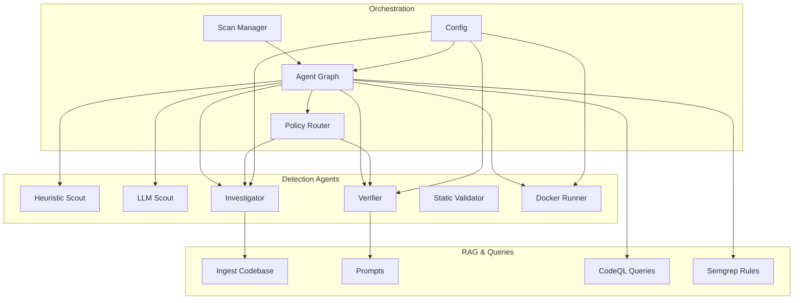
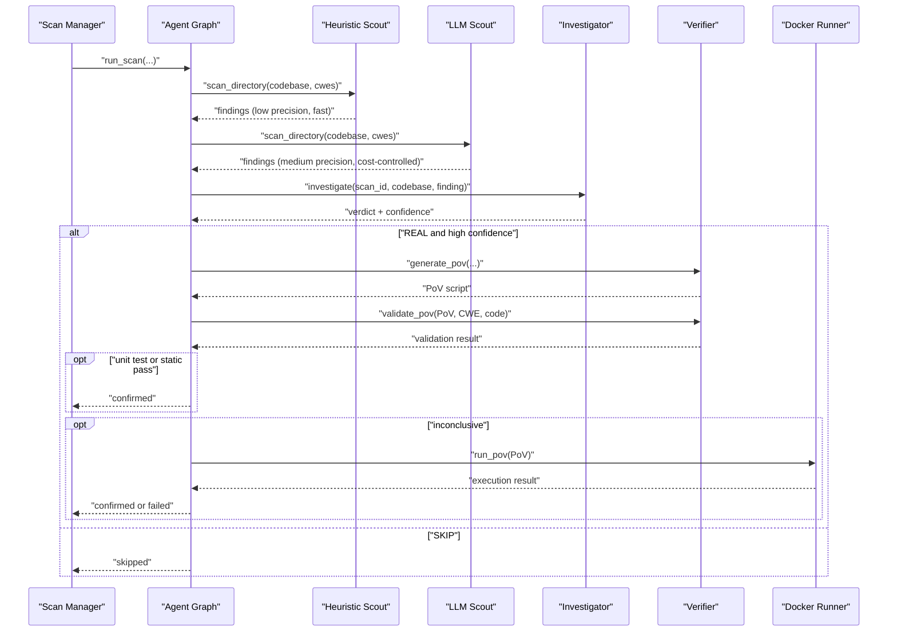
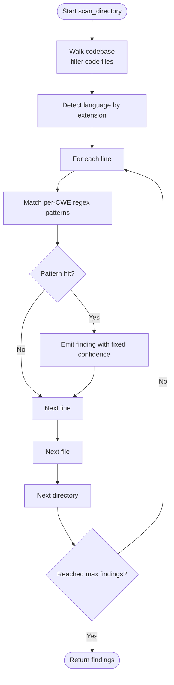
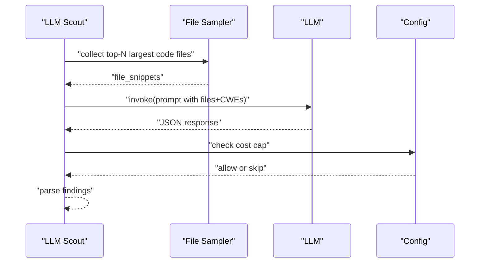
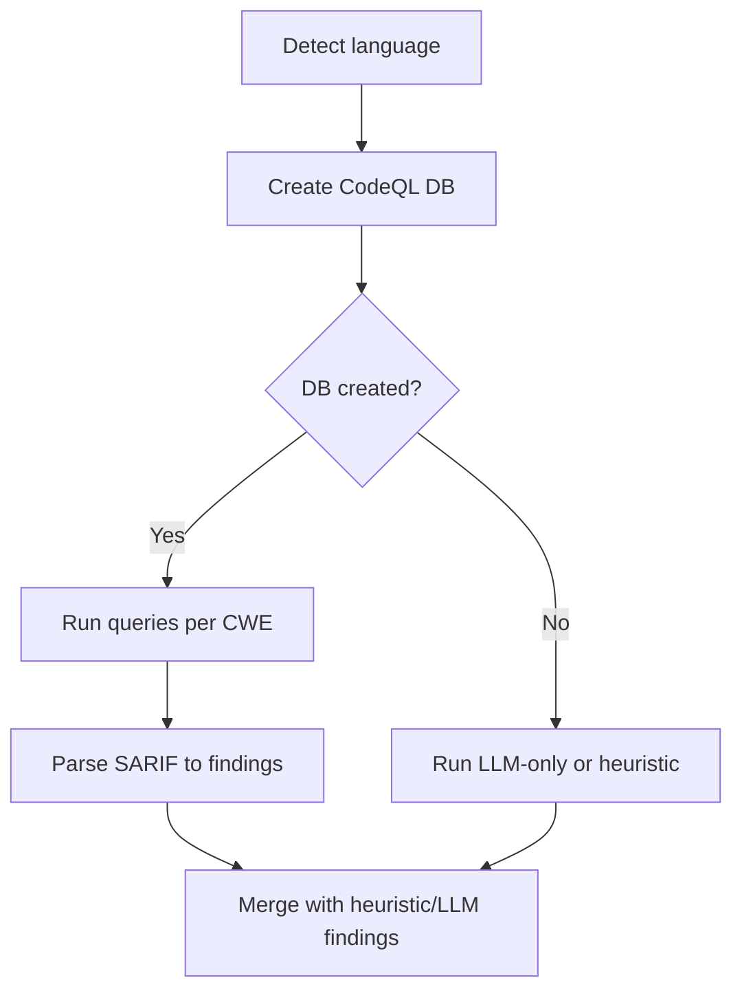
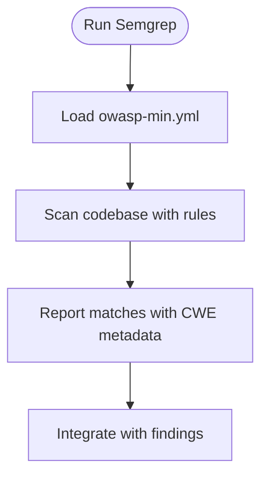
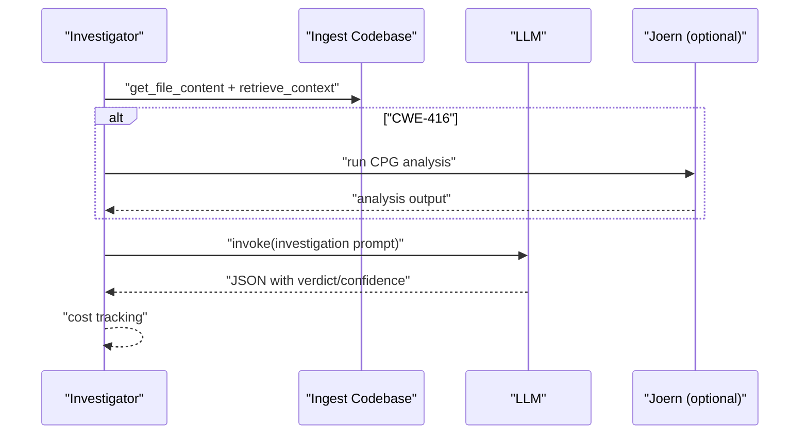
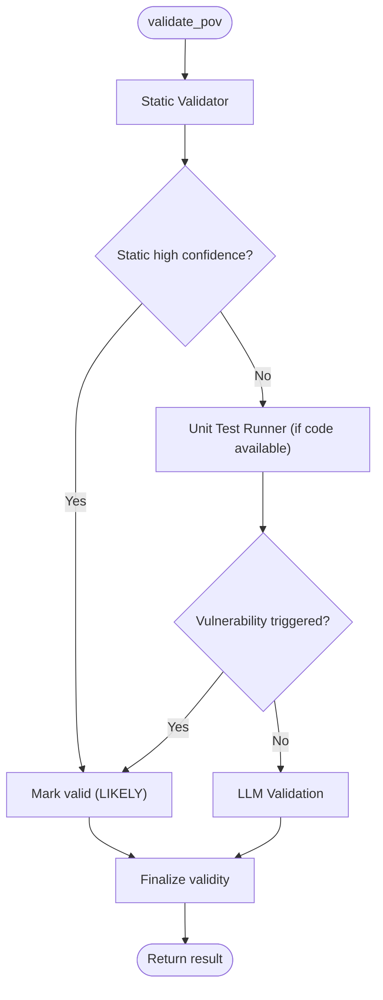
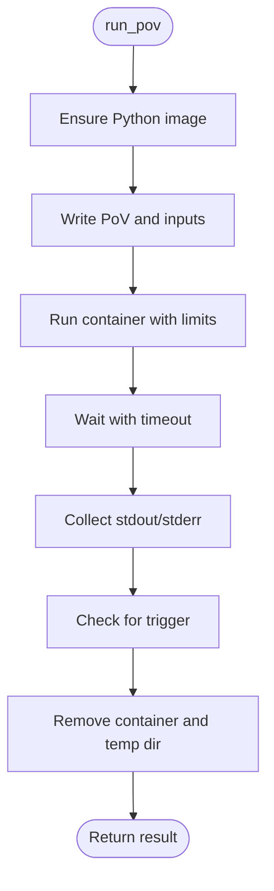
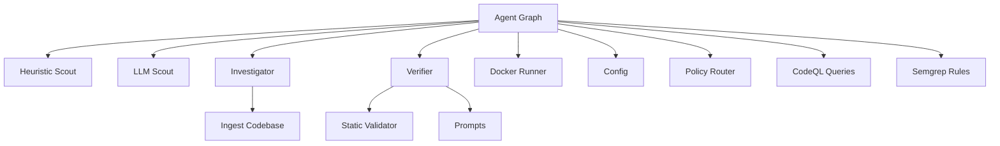

# Detection Methods

<cite>
**Referenced Files in This Document**
- [heuristic_scout.py](file://agents/heuristic_scout.py)
- [llm_scout.py](file://agents/llm_scout.py)
- [investigator.py](file://agents/investigator.py)
- [verifier.py](file://agents/verifier.py)
- [docker_runner.py](file://agents/docker_runner.py)
- [agent_graph.py](file://app/agent_graph.py)
- [scan_manager.py](file://app/scan_manager.py)
- [config.py](file://app/config.py)
- [prompts.py](file://prompts.py)
- [ingest_codebase.py](file://agents/ingest_codebase.py)
- [policy.py](file://app/policy.py)
- [static_validator.py](file://agents/static_validator.py)
- [owasp-min.yml](file://semgrep-rules/owasp-min.yml)
- [SqlInjection.ql](file://codeql_queries/SqlInjection.ql)
- [BufferOverflow.ql](file://codeql_queries/BufferOverflow.ql)
- [UseAfterFree.ql](file://codeql_queries/UseAfterFree.ql)
- [IntegerOverflow.ql](file://codeql_queries/IntegerOverflow.ql)
</cite>

## Table of Contents
1. [Introduction](#introduction)
2. [Project Structure](#project-structure)
3. [Core Components](#core-components)
4. [Architecture Overview](#architecture-overview)
5. [Detailed Component Analysis](#detailed-component-analysis)
6. [Dependency Analysis](#dependency-analysis)
7. [Performance Considerations](#performance-considerations)
8. [Troubleshooting Guide](#troubleshooting-guide)
9. [Conclusion](#conclusion)

## Introduction
This document explains AutoPoV’s three-tier vulnerability detection approach and how its methods complement each other:
- Static analysis using CodeQL queries for precise taint tracking and data flow analysis
- Pattern matching using Semgrep rules for common vulnerability patterns
- LLM-powered reasoning for contextual vulnerability identification

It also covers the heuristic scout’s pattern recognition algorithms, the LLM scout’s reasoning capabilities, and how these integrate into the overall detection pipeline. The document details implementation specifics, strengths/limitations, precision levels, confidence scoring, and practical examples of how each method identifies specific vulnerability types.

## Project Structure
AutoPoV organizes detection logic across specialized agents and orchestration layers:
- Agents implement detection and validation:
  - Heuristic Scout: lightweight pattern matching
  - LLM Scout: LLM-based candidate discovery
  - Investigator: LLM + RAG for contextual analysis
  - Verifier: PoV generation and hybrid validation
  - Static Validator: static analysis of PoV scripts
  - Docker Runner: safe execution of PoVs
- Orchestration:
  - Agent Graph: LangGraph workflow coordinating stages
  - Scan Manager: lifecycle and persistence
  - Config: environment-driven behavior and limits
  - Prompts: structured LLM prompting
  - Ingest Codebase: RAG vectorization

**Diagram sources**
- [agent_graph.py:88-168](file://app/agent_graph.py#L88-L168)
- [scan_manager.py:47-114](file://app/scan_manager.py#L47-L114)
- [config.py:13-254](file://app/config.py#L13-L254)
- [policy.py:12-39](file://app/policy.py#L12-L39)
- [heuristic_scout.py:13-242](file://agents/heuristic_scout.py#L13-L242)
- [llm_scout.py:32-208](file://agents/llm_scout.py#L32-L208)
- [investigator.py:37-519](file://agents/investigator.py#L37-L519)
- [verifier.py:42-562](file://agents/verifier.py#L42-L562)
- [static_validator.py:22-305](file://agents/static_validator.py#L22-L305)
- [docker_runner.py:27-377](file://agents/docker_runner.py#L27-L377)
- [ingest_codebase.py:41-413](file://agents/ingest_codebase.py#L41-L413)
- [prompts.py:7-424](file://prompts.py#L7-L424)

**Section sources**
- [agent_graph.py:88-168](file://app/agent_graph.py#L88-L168)
- [scan_manager.py:47-114](file://app/scan_manager.py#L47-L114)
- [config.py:13-254](file://app/config.py#L13-L254)
- [policy.py:12-39](file://app/policy.py#L12-L39)

## Core Components
- Heuristic Scout: Lightweight pattern matching across multiple CWE families, designed for speed and broad coverage.
- LLM Scout: LLM-based candidate discovery over sampled code, guided by structured prompts and cost caps.
- Investigator: LLM + RAG analysis with optional Joern CPG for deep taint/data-flow insights.
- Verifier: PoV generation and hybrid validation combining static analysis, unit tests, and LLM review.
- Static Validator: Static analysis of PoV scripts to catch structural and CWE-specific issues early.
- Docker Runner: Safe, isolated execution of PoVs with resource limits and no network access.
- Agent Graph: Orchestrates the full pipeline with configurable routing and cost control.
- Config: Centralizes thresholds, limits, and provider settings for cost and performance.
- Prompts: Structured templates for investigation, PoV generation/validation, and retry analysis.
- Ingest Codebase: RAG vectorization for contextual retrieval during investigation.

**Section sources**
- [heuristic_scout.py:13-242](file://agents/heuristic_scout.py#L13-L242)
- [llm_scout.py:32-208](file://agents/llm_scout.py#L32-L208)
- [investigator.py:37-519](file://agents/investigator.py#L37-L519)
- [verifier.py:42-562](file://agents/verifier.py#L42-L562)
- [static_validator.py:22-305](file://agents/static_validator.py#L22-L305)
- [docker_runner.py:27-377](file://agents/docker_runner.py#L27-L377)
- [agent_graph.py:82-168](file://app/agent_graph.py#L82-L168)
- [config.py:13-254](file://app/config.py#L13-L254)
- [prompts.py:7-424](file://prompts.py#L7-L424)
- [ingest_codebase.py:41-413](file://agents/ingest_codebase.py#L41-L413)

## Architecture Overview
The detection pipeline integrates static, pattern-based, and LLM reasoning with robust validation and execution safety.

**Diagram sources**
- [scan_manager.py:234-365](file://app/scan_manager.py#L234-L365)
- [agent_graph.py:691-1057](file://app/agent_graph.py#L691-L1057)
- [heuristic_scout.py:188-234](file://agents/heuristic_scout.py#L188-L234)
- [llm_scout.py:88-200](file://agents/llm_scout.py#L88-L200)
- [investigator.py:270-432](file://agents/investigator.py#L270-L432)
- [verifier.py:90-387](file://agents/verifier.py#L90-L387)
- [docker_runner.py:62-191](file://agents/docker_runner.py#L62-L191)

## Detailed Component Analysis

### Heuristic Scout: Pattern Recognition Algorithms
- Purpose: Rapid, low-cost candidate discovery across multiple CWE families using regex-based patterns.
- Implementation highlights:
  - Per-CWE pattern sets for SQLi, XSS, Path Traversal, Command Injection, Code Injection, Deserialization, hardcoded credentials, crypto weaknesses, CSRF, auth bypass, open redirect, SSRF, file upload, XXE, DoS, session fixation, info disclosure, input validation, buffer overflows, integer overflows, and use-after-free.
  - Language detection by extension; code file filtering; line-by-line scanning with early termination at max findings.
  - Outputs standardized findings with fixed confidence (~0.35) and “heuristic” source metadata.
- Strengths:
  - Extremely fast, scalable across large codebases.
  - Covers common, easily recognizable patterns.
- Limitations:
  - Prone to false positives due to surface-level matching.
  - Cannot reason about context or mitigate controls.
- Precision and Confidence:
  - Confidence set to ~0.35; intended as preliminary candidates for deeper analysis.

**Diagram sources**
- [heuristic_scout.py:188-234](file://agents/heuristic_scout.py#L188-L234)

**Section sources**
- [heuristic_scout.py:13-242](file://agents/heuristic_scout.py#L13-L242)

### LLM Scout: Reasoning Capabilities
- Purpose: Context-aware candidate discovery by prompting an LLM over sampled code snippets.
- Implementation highlights:
  - Limits files by size and character count; sorts by size to prioritize impactful files.
  - Builds a structured prompt enumerating files, languages, and requested CWEs.
  - Uses configured LLM (online or offline) with cost cap enforcement.
  - Parses JSON response into findings with per-item confidence and reasons.
- Strengths:
  - Contextual understanding beyond regex.
  - Can generalize across languages and frameworks.
- Limitations:
  - Cost and latency; depends on prompt quality and model capability.
  - Risk of hallucinations; requires post-processing and validation.
- Precision and Confidence:
  - Confidence derived from LLM response; capped by cost budget.

**Diagram sources**
- [llm_scout.py:88-200](file://agents/llm_scout.py#L88-L200)
- [prompts.py:413-424](file://prompts.py#L413-L424)
- [config.py:46-53](file://app/config.py#L46-L53)

**Section sources**
- [llm_scout.py:32-208](file://agents/llm_scout.py#L32-L208)
- [prompts.py:391-424](file://prompts.py#L391-L424)
- [config.py:46-53](file://app/config.py#L46-L53)

### Static Analysis with CodeQL: Precise Taint/Data Flow
- Purpose: Reliable, precise detection using compiled queries and SARIF output.
- Implementation highlights:
  - Detects language, creates a CodeQL database, runs targeted queries per CWE, parses SARIF results.
  - Supports multiple languages and maps detected language to appropriate packs.
  - Falls back to autonomous discovery if CodeQL is unavailable.
- Strengths:
  - High precision due to static analysis and taint tracking.
  - Standardized output and reproducibility.
- Limitations:
  - Requires CodeQL CLI and packs; slower than pattern matching.
  - Query coverage depends on included packs and custom queries.
- Precision and Confidence:
  - Confidence set to ~0.8 for CodeQL findings; serves as strong baseline.

**Diagram sources**
- [agent_graph.py:241-307](file://app/agent_graph.py#L241-L307)
- [agent_graph.py:506-606](file://app/agent_graph.py#L506-L606)

**Section sources**
- [agent_graph.py:241-307](file://app/agent_graph.py#L241-L307)
- [agent_graph.py:506-606](file://app/agent_graph.py#L506-L606)
- [SqlInjection.ql](file://codeql_queries/SqlInjection.ql)
- [BufferOverflow.ql](file://codeql_queries/BufferOverflow.ql)
- [UseAfterFree.ql](file://codeql_queries/UseAfterFree.ql)
- [IntegerOverflow.ql](file://codeql_queries/IntegerOverflow.ql)

### Pattern Matching with Semgrep: Common Vulnerability Patterns
- Purpose: Fast, declarative detection of common vulnerability patterns across languages.
- Implementation highlights:
  - YAML-based rules define patterns and associated CWEs.
  - Targets PHP-specific patterns for SQLi, XSS, command injection, and path traversal.
- Strengths:
  - Quick to deploy and maintain.
  - Good coverage for well-defined idioms.
- Limitations:
  - Limited to explicit patterns; less flexible than LLM reasoning.
  - Requires rule maintenance and tuning.

**Diagram sources**
- [owasp-min.yml:1-53](file://semgrep-rules/owasp-min.yml#L1-L53)

**Section sources**
- [owasp-min.yml:1-53](file://semgrep-rules/owasp-min.yml#L1-L53)

### Investigator: LLM + RAG + Optional Joern CPG
- Purpose: Contextual analysis of candidates using code context, RAG, and optional deep analysis.
- Implementation highlights:
  - Retrieves code context and related chunks via RAG.
  - Optionally runs Joern for use-after-free to produce CPG insights.
  - Uses structured prompts to produce verifiable JSON with confidence and explanations.
  - Tracks token usage and calculates actual cost.
- Strengths:
  - Combines LLM reasoning with retrievable context.
  - Optional deep analysis for specific CWEs.
- Limitations:
  - Cost and latency; requires embeddings and optional external tools.
  - Relies on prompt quality and model reliability.

**Diagram sources**
- [investigator.py:270-432](file://agents/investigator.py#L270-L432)
- [ingest_codebase.py:315-391](file://agents/ingest_codebase.py#L315-L391)
- [prompts.py:7-44](file://prompts.py#L7-L44)

**Section sources**
- [investigator.py:37-519](file://agents/investigator.py#L37-L519)
- [ingest_codebase.py:41-413](file://agents/ingest_codebase.py#L41-L413)
- [prompts.py:7-44](file://prompts.py#L7-L44)

### Verifier: Hybrid PoV Validation
- Purpose: Generate PoVs and validate them via static analysis, unit tests, and LLM fallback.
- Implementation highlights:
  - Generates PoV scripts with language-aware prompts and cost tracking.
  - Validates via:
    - Static analysis: syntax, required prints, standard library usage, CWE-specific checks, and pattern matching.
    - Unit test execution against vulnerable code when available.
    - LLM validation as a last resort.
  - Records validation method and outcomes.
- Strengths:
  - Multi-layer validation reduces false positives.
  - Early static pass accelerates validation.
- Limitations:
  - Requires access to vulnerable code for unit tests.
  - LLM validation is supplementary and may vary by model.

**Diagram sources**
- [verifier.py:225-387](file://agents/verifier.py#L225-L387)
- [static_validator.py:123-234](file://agents/static_validator.py#L123-L234)

**Section sources**
- [verifier.py:42-562](file://agents/verifier.py#L42-L562)
- [static_validator.py:22-305](file://agents/static_validator.py#L22-L305)

### Docker Runner: Safe Execution
- Purpose: Execute PoVs in isolated containers with strict resource limits and no network access.
- Implementation highlights:
  - Creates ephemeral temp directories, writes PoV and inputs, runs in a minimal Python image, captures logs, and checks for the trigger phrase.
  - Provides batch execution and statistics.
- Strengths:
  - Strong isolation and reproducibility.
  - Prevents unintended side effects.
- Limitations:
  - Requires Docker availability; adds latency.

**Diagram sources**
- [docker_runner.py:62-191](file://agents/docker_runner.py#L62-L191)

**Section sources**
- [docker_runner.py:27-377](file://agents/docker_runner.py#L27-L377)

## Dependency Analysis
Key dependencies and coupling:
- Agent Graph orchestrates all stages and depends on:
  - Heuristic Scout and LLM Scout for candidate generation
  - Investigator for contextual analysis
  - Verifier for PoV generation and validation
  - Docker Runner for execution
  - Config for thresholds and routing
  - Policy Router for model selection
  - Ingest Codebase for RAG context
- Prompts module centralizes LLM prompting across agents.
- Static Validator and Docker Runner are used by Verifier.
- CodeQL queries and Semgrep rules feed into the broader detection ecosystem.

**Diagram sources**
- [agent_graph.py:88-168](file://app/agent_graph.py#L88-L168)
- [heuristic_scout.py:13-242](file://agents/heuristic_scout.py#L13-L242)
- [llm_scout.py:32-208](file://agents/llm_scout.py#L32-L208)
- [investigator.py:37-519](file://agents/investigator.py#L37-L519)
- [verifier.py:42-562](file://agents/verifier.py#L42-L562)
- [static_validator.py:22-305](file://agents/static_validator.py#L22-L305)
- [docker_runner.py:27-377](file://agents/docker_runner.py#L27-L377)
- [ingest_codebase.py:41-413](file://agents/ingest_codebase.py#L41-L413)
- [prompts.py:7-424](file://prompts.py#L7-L424)
- [config.py:13-254](file://app/config.py#L13-L254)
- [policy.py:12-39](file://app/policy.py#L12-L39)

**Section sources**
- [agent_graph.py:88-168](file://app/agent_graph.py#L88-L168)
- [prompts.py:7-424](file://prompts.py#L7-L424)
- [config.py:13-254](file://app/config.py#L13-L254)
- [policy.py:12-39](file://app/policy.py#L12-L39)

## Performance Considerations
- Cost control:
  - LLM Scout has a configurable max cost and token usage extraction for budget enforcement.
  - Investigator and Verifier calculate actual costs from token usage; fallback estimations are deprecated.
  - Configurable max cost for the whole scan and per-stage caps.
- Throughput:
  - Heuristic Scout prioritizes speed; useful for broad coverage.
  - LLM Scout balances cost and context; sampling reduces latency.
  - CodeQL provides precise results but is slower; batching and query reuse help.
- Resource limits:
  - Docker Runner enforces CPU/memory/timeouts; no network access for safety.
- RAG indexing:
  - Ingest Codebase chunks and embeds code; persistent collection per scan improves retrieval performance.

[No sources needed since this section provides general guidance]

## Troubleshooting Guide
- CodeQL not available:
  - Agent Graph falls back to LLM-only and autonomous discovery.
  - Verify CLI path and packs; check availability helpers.
- LLM availability:
  - Investigator and Verifier require configured providers; missing keys or libraries cause exceptions.
  - Policy Router selects models; ensure routing mode and model names are valid.
- Docker not available:
  - Docker Runner returns a clear failure; adjust settings or install Docker.
- Validation failures:
  - Static Validator reports issues and confidence; refine PoV accordingly.
  - LLM validation can suggest improvements; use retry analysis prompts for iterative refinement.

**Section sources**
- [agent_graph.py:253-300](file://app/agent_graph.py#L253-L300)
- [investigator.py:50-103](file://agents/investigator.py#L50-L103)
- [verifier.py:48-88](file://agents/verifier.py#L48-L88)
- [docker_runner.py:50-61](file://agents/docker_runner.py#L50-L61)
- [static_validator.py:123-234](file://agents/static_validator.py#L123-L234)
- [prompts.py:188-221](file://prompts.py#L188-L221)

## Conclusion
AutoPoV’s three-tier detection combines breadth-first pattern matching, context-aware LLM reasoning, and precise static analysis to achieve balanced coverage, speed, and accuracy. Heuristic and LLM scouts quickly surface candidates; Investigator contextualizes them; Verifier validates rigorously using static analysis, unit tests, and LLM fallback; Docker Runner ensures safe execution. Config and policy layers enforce cost and performance constraints while maintaining flexibility across environments.