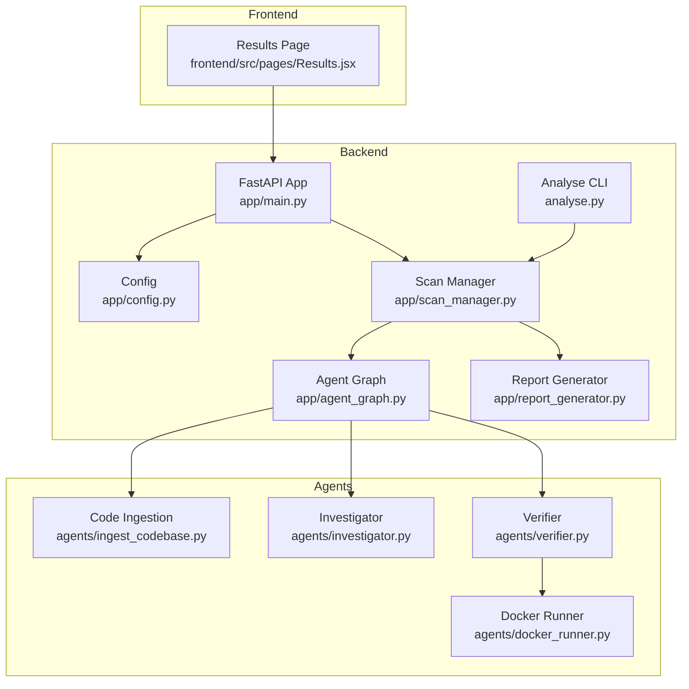
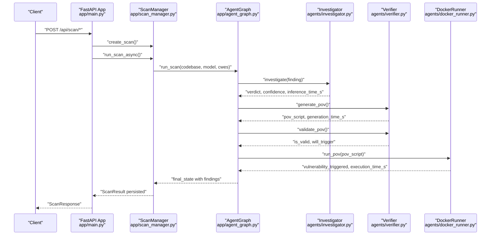
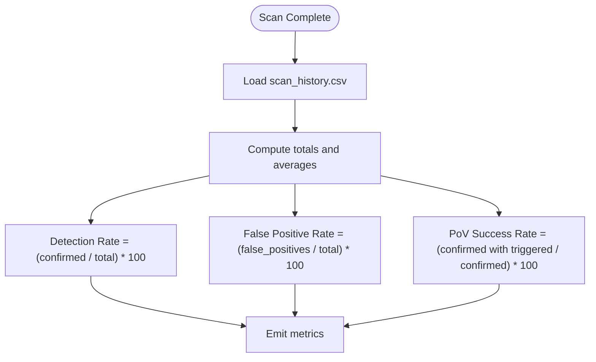
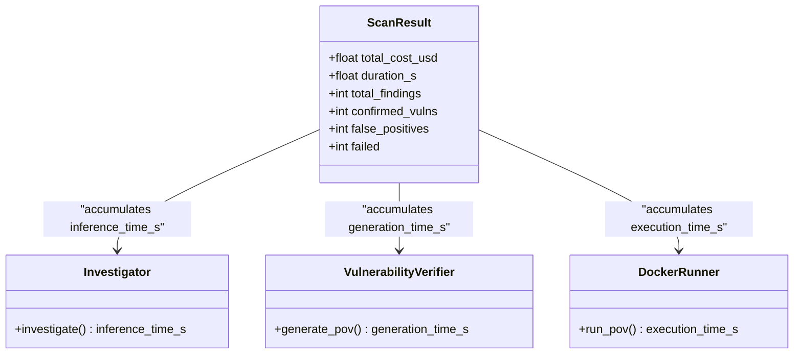
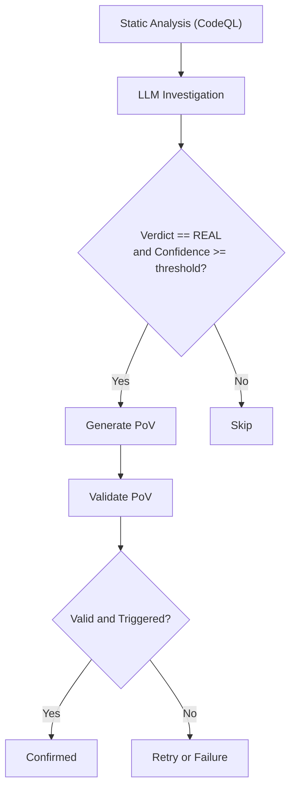
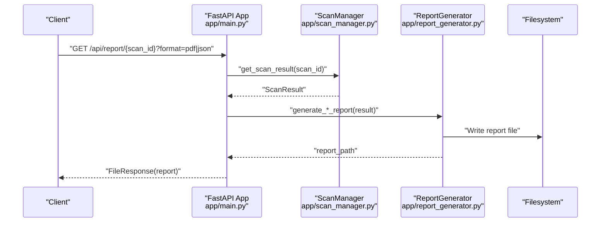
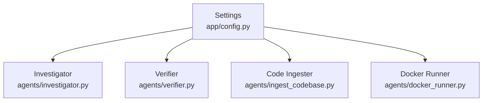

# Detection Performance and Accuracy

<cite>
**Referenced Files in This Document**
- [README.md](file://README.md)
- [run.sh](file://run.sh)
- [app/main.py](file://app/main.py)
- [app/config.py](file://app/config.py)
- [app/agent_graph.py](file://app/agent_graph.py)
- [app/scan_manager.py](file://app/scan_manager.py)
- [app/report_generator.py](file://app/report_generator.py)
- [analyse.py](file://analyse.py)
- [agents/ingest_codebase.py](file://agents/ingest_codebase.py)
- [agents/investigator.py](file://agents/investigator.py)
- [agents/verifier.py](file://agents/verifier.py)
- [agents/docker_runner.py](file://agents/docker_runner.py)
- [prompts.py](file://prompts.py)
- [frontend/src/pages/Results.jsx](file://frontend/src/pages/Results.jsx)
</cite>

## Table of Contents
1. [Introduction](#introduction)
2. [Project Structure](#project-structure)
3. [Core Components](#core-components)
4. [Architecture Overview](#architecture-overview)
5. [Detailed Component Analysis](#detailed-component-analysis)
6. [Dependency Analysis](#dependency-analysis)
7. [Performance Considerations](#performance-considerations)
8. [Troubleshooting Guide](#troubleshooting-guide)
9. [Conclusion](#conclusion)
10. [Appendices](#appendices)

## Introduction
This document explains the detection performance and accuracy measurement systems in AutoPoV, focusing on benchmarking and quality assessment. It covers metrics collection (detection rate, false positive rate, PoV success rate), performance profiling (execution time, resource utilization), accuracy assessment (ground truth comparison, manual validation, statistical analysis), reporting (dashboards, trend analysis, comparative benchmarking), and practical optimization strategies for production deployments.

## Project Structure
AutoPoV is a full-stack research prototype integrating FastAPI, LangGraph agents, static analysis, and LLM-driven verification. The backend orchestrates scans, collects metrics, and generates reports. The frontend provides a results dashboard. The CLI and analysis utilities support automation and benchmarking.

**Diagram sources**
- [app/main.py](file://app/main.py#L102-L121)
- [app/config.py](file://app/config.py#L13-L210)
- [app/agent_graph.py](file://app/agent_graph.py#L78-L135)
- [app/scan_manager.py](file://app/scan_manager.py#L40-L344)
- [app/report_generator.py](file://app/report_generator.py#L68-L359)
- [analyse.py](file://analyse.py#L39-L357)
- [agents/ingest_codebase.py](file://agents/ingest_codebase.py#L41-L407)
- [agents/investigator.py](file://agents/investigator.py#L37-L413)
- [agents/verifier.py](file://agents/verifier.py#L40-L401)
- [agents/docker_runner.py](file://agents/docker_runner.py#L27-L379)
- [frontend/src/pages/Results.jsx](file://frontend/src/pages/Results.jsx#L1-L159)

**Section sources**
- [README.md](file://README.md#L1-L242)
- [run.sh](file://run.sh#L1-L233)

## Core Components
- Metrics collection: ScanResult captures total findings, confirmed vulnerabilities, false positives, failed analyses, total cost, duration, and findings list. ScanManager persists results to JSON and CSV and computes overall metrics.
- Accuracy assessment: Detection rate, false positive rate, and PoV success rate are calculated in the report generator and analysis utilities.
- Reporting: JSON/PDF reports and CLI benchmarking summarize performance across models and scans.
- Performance profiling: Inference time and execution time are tracked per finding and per scan; Docker execution time is recorded for PoV runs.

**Section sources**
- [app/scan_manager.py](file://app/scan_manager.py#L21-L38)
- [app/scan_manager.py](file://app/scan_manager.py#L118-L200)
- [app/scan_manager.py](file://app/scan_manager.py#L304-L334)
- [app/report_generator.py](file://app/report_generator.py#L302-L327)
- [analyse.py](file://analyse.py#L72-L98)
- [analyse.py](file://analyse.py#L216-L247)
- [agents/investigator.py](file://agents/investigator.py#L337-L346)
- [agents/verifier.py](file://agents/verifier.py#L131-L139)
- [agents/docker_runner.py](file://agents/docker_runner.py#L119-L153)

## Architecture Overview
The system follows a LangGraph-based agent workflow that ingests code, runs static analysis, investigates findings with LLMs, generates and validates PoV scripts, executes them in Docker, and aggregates results.

**Diagram sources**
- [app/main.py](file://app/main.py#L177-L316)
- [app/scan_manager.py](file://app/scan_manager.py#L86-L116)
- [app/agent_graph.py](file://app/agent_graph.py#L532-L572)
- [agents/investigator.py](file://agents/investigator.py#L254-L365)
- [agents/verifier.py](file://agents/verifier.py#L79-L149)
- [agents/docker_runner.py](file://agents/docker_runner.py#L62-L191)

## Detailed Component Analysis

### Metrics Collection Framework
- ScanResult fields include counts and durations used to compute detection rate, false positive rate, and PoV success rate.
- ScanManager persists results to JSON and CSV and exposes overall metrics via get_metrics().
- ReportGenerator calculates and includes metrics in JSON/PDF reports.
- Analyse CLI loads CSV history and computes model-wise averages for detection rate, FP rate, and cost per confirmed.

**Diagram sources**
- [app/scan_manager.py](file://app/scan_manager.py#L201-L235)
- [app/scan_manager.py](file://app/scan_manager.py#L304-L334)
- [app/report_generator.py](file://app/report_generator.py#L302-L327)
- [analyse.py](file://analyse.py#L72-L98)
- [analyse.py](file://analyse.py#L107-L159)

**Section sources**
- [app/scan_manager.py](file://app/scan_manager.py#L21-L38)
- [app/scan_manager.py](file://app/scan_manager.py#L118-L200)
- [app/scan_manager.py](file://app/scan_manager.py#L304-L334)
- [app/report_generator.py](file://app/report_generator.py#L302-L327)
- [analyse.py](file://analyse.py#L72-L98)
- [analyse.py](file://analyse.py#L107-L159)

### Performance Profiling and Resource Utilization
- Inference timing: Investigator records inference_time_s per finding; Verifier records generation_time_s; DockerRunner records execution_time_s.
- Scan duration: Calculated from start_time to end_time in ScanResult.
- Cost tracking: Estimated per finding and aggregated in ScanResult; cost per confirmed computed by Analyse CLI.
- Resource limits: DockerRunner enforces memory, CPU quota, and timeout; Code Ingestion batches embeddings to manage memory.

**Diagram sources**
- [app/scan_manager.py](file://app/scan_manager.py#L148-L163)
- [agents/investigator.py](file://agents/investigator.py#L337-L346)
- [agents/verifier.py](file://agents/verifier.py#L131-L139)
- [agents/docker_runner.py](file://agents/docker_runner.py#L119-L153)

**Section sources**
- [agents/investigator.py](file://agents/investigator.py#L337-L346)
- [agents/verifier.py](file://agents/verifier.py#L131-L139)
- [agents/docker_runner.py](file://agents/docker_runner.py#L119-L153)
- [app/scan_manager.py](file://app/scan_manager.py#L143-L146)

### Accuracy Assessment Methodologies
- Ground truth comparison: Supported CWEs and static analysis (CodeQL) provide initial candidates; LLM investigation determines REAL vs FALSE_POSITIVE.
- Manual validation: CWE-specific checks and optional LLM validation improve PoV correctness; failures trigger retry analysis.
- Statistical analysis: Analyse CLI computes averages and recommendations across models; ReportGenerator includes metrics in reports.

**Diagram sources**
- [app/agent_graph.py](file://app/agent_graph.py#L488-L514)
- [agents/investigator.py](file://agents/investigator.py#L254-L365)
- [agents/verifier.py](file://agents/verifier.py#L151-L227)
- [agents/verifier.py](file://agents/verifier.py#L332-L391)

**Section sources**
- [app/agent_graph.py](file://app/agent_graph.py#L488-L514)
- [agents/investigator.py](file://agents/investigator.py#L254-L365)
- [agents/verifier.py](file://agents/verifier.py#L151-L227)
- [agents/verifier.py](file://agents/verifier.py#L332-L391)

### Reporting Mechanisms
- Real-time status: SSE endpoint streams logs until completion.
- Reports: JSON/PDF reports include metrics and findings; PoV scripts are saved separately.
- Dashboards: Results page displays metrics and confirmed findings; Analyse CLI produces CSV/JSON benchmark summaries.

**Diagram sources**
- [app/main.py](file://app/main.py#L400-L431)
- [app/scan_manager.py](file://app/scan_manager.py#L241-L250)
- [app/report_generator.py](file://app/report_generator.py#L120-L118)

**Section sources**
- [app/main.py](file://app/main.py#L350-L385)
- [app/report_generator.py](file://app/report_generator.py#L76-L118)
- [frontend/src/pages/Results.jsx](file://frontend/src/pages/Results.jsx#L30-L48)

### Comparative Benchmarking
- Analyse CLI loads CSV history and computes model-wise averages for detection rate, FP rate, and cost per confirmed.
- Generates CSV and JSON benchmark artifacts for downstream analysis.

**Section sources**
- [analyse.py](file://analyse.py#L100-L159)
- [analyse.py](file://analyse.py#L216-L247)
- [analyse.py](file://analyse.py#L249-L267)

## Dependency Analysis
The system integrates multiple libraries and tools:
- LLM providers (OpenRouter/Ollama) via LangChain
- Vector store (ChromaDB) for RAG
- Static analysis (CodeQL, Joern)
- Docker for secure PoV execution
- Pandas for statistical analysis (optional)

**Diagram sources**
- [app/config.py](file://app/config.py#L173-L189)
- [agents/investigator.py](file://agents/investigator.py#L50-L87)
- [agents/verifier.py](file://agents/verifier.py#L46-L77)
- [agents/ingest_codebase.py](file://agents/ingest_codebase.py#L60-L88)
- [agents/docker_runner.py](file://agents/docker_runner.py#L37-L48)

**Section sources**
- [app/config.py](file://app/config.py#L173-L189)
- [agents/investigator.py](file://agents/investigator.py#L50-L87)
- [agents/verifier.py](file://agents/verifier.py#L46-L77)
- [agents/ingest_codebase.py](file://agents/ingest_codebase.py#L60-L88)
- [agents/docker_runner.py](file://agents/docker_runner.py#L37-L48)

## Performance Considerations
- Cost control: Cost estimation per inference and aggregation in ScanResult; maximum cost configurable.
- Parallelism: ThreadPoolExecutor used for scan execution; batching embeddings reduces memory pressure.
- Resource limits: DockerRunner applies memory, CPU, and timeout constraints; CodeQL/Joern calls include timeouts.
- Scalability: Vector store collections are per-scan; cleanup ensures isolation; consider persistence and indexing strategies for large codebases.

**Section sources**
- [app/agent_graph.py](file://app/agent_graph.py#L521-L531)
- [agents/ingest_codebase.py](file://agents/ingest_codebase.py#L290-L307)
- [agents/docker_runner.py](file://agents/docker_runner.py#L32-L36)
- [agents/ingest_codebase.py](file://agents/ingest_codebase.py#L387-L397)

## Troubleshooting Guide
- Missing dependencies: Docker, CodeQL, or LLM clients can disable features; availability checks return fallback behavior.
- Scan failures: ScanManager sets status to failed and persists result; logs captured in state.
- PoV failures: Verifier performs validation and retry analysis; DockerRunner returns execution details and exit codes.
- Frontend reports: Results page handles loading, errors, and report downloads.

**Section sources**
- [app/config.py](file://app/config.py#L123-L172)
- [app/scan_manager.py](file://app/scan_manager.py#L177-L199)
- [agents/verifier.py](file://agents/verifier.py#L151-L227)
- [agents/docker_runner.py](file://agents/docker_runner.py#L188-L191)
- [frontend/src/pages/Results.jsx](file://frontend/src/pages/Results.jsx#L15-L28)

## Conclusion
AutoPoV provides a comprehensive framework for measuring detection performance and accuracy. It tracks end-to-end execution times, costs, and key metrics (detection rate, false positive rate, PoV success rate), supports comparative benchmarking, and offers robust reporting and visualization. Production deployments should focus on cost control, resource limits, and scalable vector storage to maintain reliability and performance.

## Appendices

### Practical Examples and Strategies
- Performance optimization
  - Tune chunk size and overlap for RAG to balance recall and latency.
  - Batch embedding operations and limit concurrency to avoid memory spikes.
  - Use offline models for controlled resource usage; online models for higher accuracy.
- Accuracy improvement
  - Increase confidence thresholds before PoV generation.
  - Leverage CWE-specific validations and retry analysis to refine PoVs.
  - Incorporate static analysis (CodeQL/Joern) to reduce false positives.
- Continuous monitoring
  - Track overall metrics via /api/metrics and CSV history.
  - Use Analyse CLI for periodic benchmark comparisons across models.
  - Monitor Docker stats and adjust limits based on observed utilization.

**Section sources**
- [app/agent_graph.py](file://app/agent_graph.py#L521-L531)
- [agents/ingest_codebase.py](file://agents/ingest_codebase.py#L50-L54)
- [agents/ingest_codebase.py](file://agents/ingest_codebase.py#L290-L307)
- [agents/verifier.py](file://agents/verifier.py#L265-L291)
- [agents/docker_runner.py](file://agents/docker_runner.py#L32-L36)
- [app/scan_manager.py](file://app/scan_manager.py#L304-L334)
- [analyse.py](file://analyse.py#L216-L247)