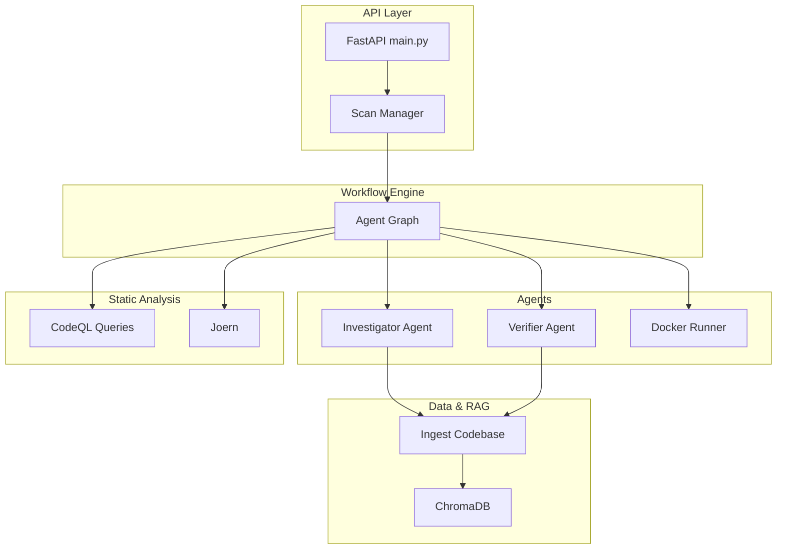
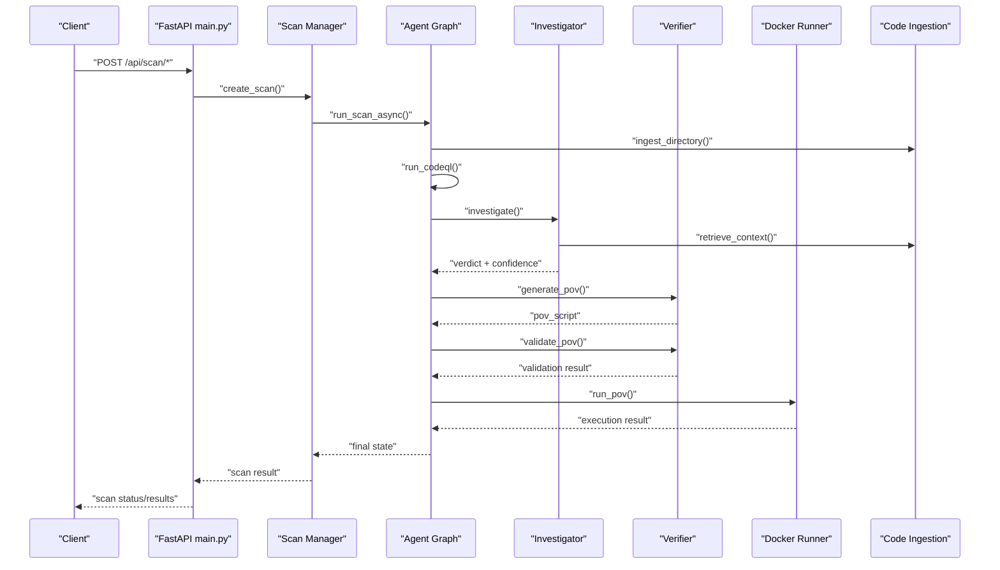
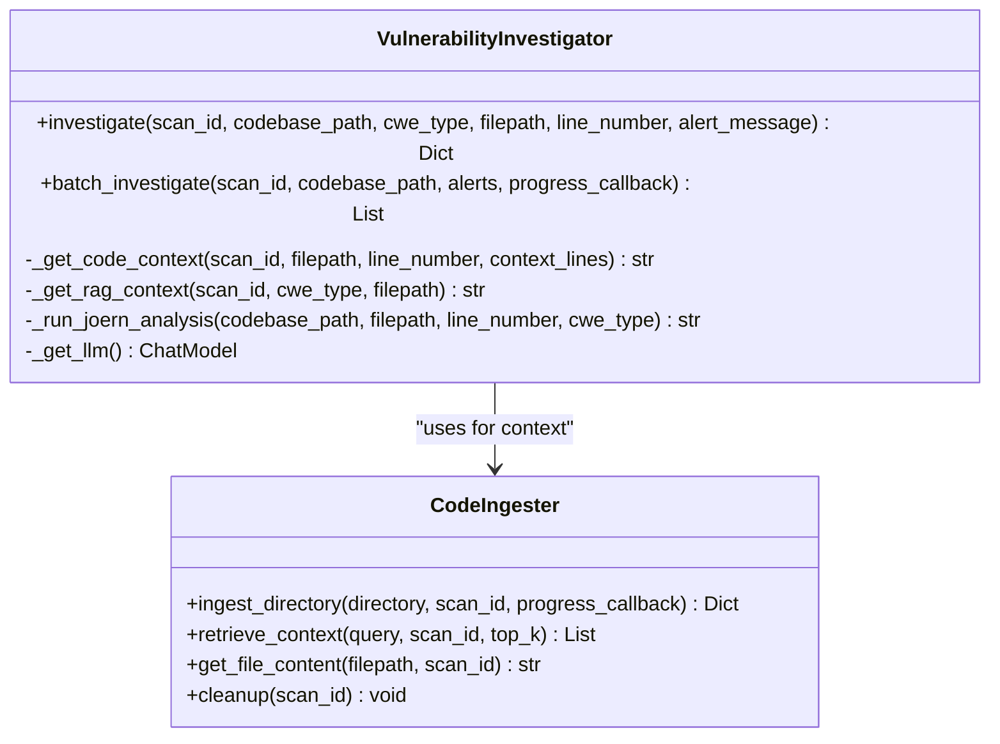
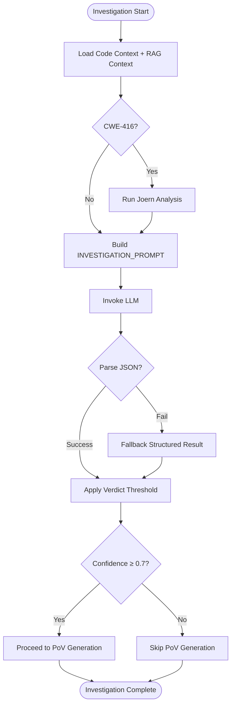
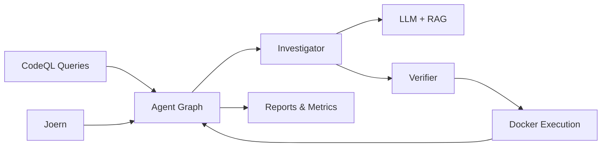
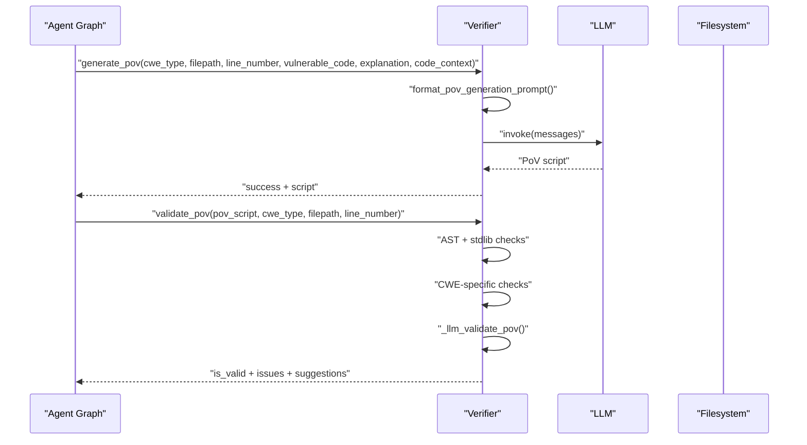
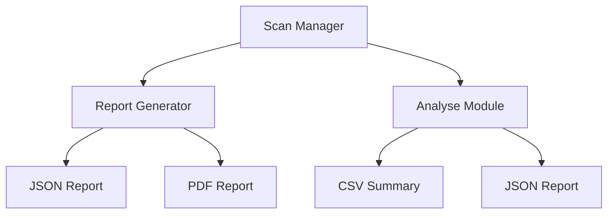
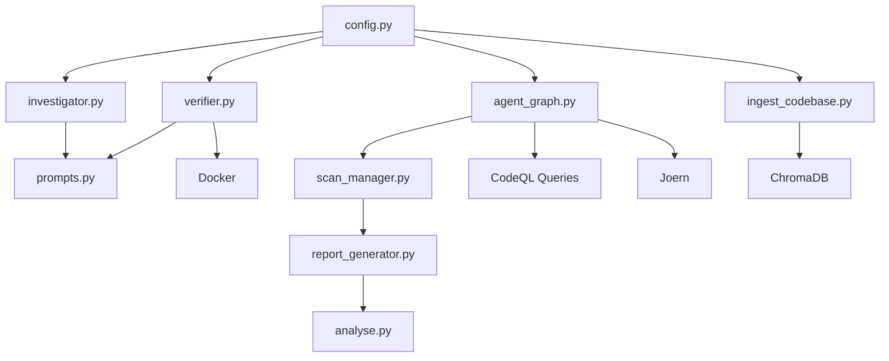

# LLM-Based Vulnerability Analysis

<cite>
**Referenced Files in This Document**
- [investigator.py](file://autopov/agents/investigator.py)
- [prompts.py](file://autopov/prompts.py)
- [agent_graph.py](file://autopov/app/agent_graph.py)
- [config.py](file://autopov/app/config.py)
- [ingest_codebase.py](file://autopov/agents/ingest_codebase.py)
- [verifier.py](file://autopov/agents/verifier.py)
- [scan_manager.py](file://autopov/app/scan_manager.py)
- [report_generator.py](file://autopov/app/report_generator.py)
- [analyse.py](file://autopov/analyse.py)
- [main.py](file://autopov/app/main.py)
- [requirements.txt](file://autopov/requirements.txt)
- [README.md](file://autopov/README.md)
- [BufferOverflow.ql](file://autopov/codeql_queries/BufferOverflow.ql)
- [SqlInjection.ql](file://autopov/codeql_queries/SqlInjection.ql)
- [UseAfterFree.ql](file://autopov/codeql_queries/UseAfterFree.ql)
- [IntegerOverflow.ql](file://autopov/codeql_queries/IntegerOverflow.ql)
</cite>

## Table of Contents
1. [Introduction](#introduction)
2. [Project Structure](#project-structure)
3. [Core Components](#core-components)
4. [Architecture Overview](#architecture-overview)
5. [Detailed Component Analysis](#detailed-component-analysis)
6. [Dependency Analysis](#dependency-analysis)
7. [Performance Considerations](#performance-considerations)
8. [Troubleshooting Guide](#troubleshooting-guide)
9. [Conclusion](#conclusion)
10. [Appendices](#appendices)

## Introduction
This document explains the LLM-based vulnerability analysis system implemented in AutoPoV, focusing on the Investigator Agent’s architecture and its role in validating potential vulnerabilities using Retrieval-Augmented Generation (RAG). It documents the prompt engineering strategy, including INVESTIGATION_PROMPT, CODE_ANALYSIS_PROMPT, and RAG_CONTEXT_PROMPT, along with their parameters and context requirements. It also details the confidence scoring mechanism, verdict determination process, and false positive reduction techniques. The document covers multi-modal analysis combining static analysis results with LLM reasoning, practical examples of prompt formatting and context enhancement, and result interpretation. Finally, it addresses model selection criteria, cost optimization, and continuous improvement strategies for detection accuracy.

## Project Structure
AutoPoV is a FastAPI-based backend with modular agents and a LangGraph-driven workflow. The system integrates:
- Static analysis (CodeQL, Joern) for initial vulnerability pattern detection
- RAG pipeline for context retrieval and augmentation
- LLM agents for investigation, PoV generation, and validation
- Docker-based sandboxing for PoV execution
- Reporting and benchmarking for continuous improvement

**Diagram sources**
- [main.py](file://autopov/app/main.py#L103-L121)
- [scan_manager.py](file://autopov/app/scan_manager.py#L86-L117)
- [agent_graph.py](file://autopov/app/agent_graph.py#L84-L135)
- [investigator.py](file://autopov/agents/investigator.py#L37-L88)
- [verifier.py](file://autopov/agents/verifier.py#L40-L78)
- [ingest_codebase.py](file://autopov/agents/ingest_codebase.py#L41-L116)
- [BufferOverflow.ql](file://autopov/codeql_queries/BufferOverflow.ql#L1-L59)
- [UseAfterFree.ql](file://autopov/codeql_queries/UseAfterFree.ql#L1-L41)

**Section sources**
- [README.md](file://autopov/README.md#L1-L242)
- [requirements.txt](file://autopov/requirements.txt#L1-L42)

## Core Components
- Investigator Agent: Validates CodeQL alerts using LLMs with RAG-enhanced context, produces structured verdicts with confidence scores.
- Verifier Agent: Generates and validates Proof-of-Vulnerability (PoV) scripts using LLMs and static checks.
- Agent Graph: Orchestrates ingestion, static analysis, investigation, PoV generation/validation, and Docker execution.
- Code Ingestion: Chunks code, computes embeddings, stores in ChromaDB for retrieval.
- Configuration: Centralized settings for models, tools, costs, and runtime behavior.
- Reporting and Benchmarking: Generates JSON/PDF reports and CSV/JSON benchmark summaries.

**Section sources**
- [investigator.py](file://autopov/agents/investigator.py#L37-L88)
- [verifier.py](file://autopov/agents/verifier.py#L40-L78)
- [agent_graph.py](file://autopov/app/agent_graph.py#L78-L135)
- [ingest_codebase.py](file://autopov/agents/ingest_codebase.py#L41-L116)
- [config.py](file://autopov/app/config.py#L13-L122)

## Architecture Overview
The system follows a hybrid agentic workflow:
1. Code ingestion and embedding into ChromaDB
2. Static analysis (CodeQL and optional Joern) to produce candidate findings
3. LLM-based investigation to validate findings and compute confidence
4. PoV generation and validation
5. Safe execution in Docker and final status logging

**Diagram sources**
- [main.py](file://autopov/app/main.py#L178-L317)
- [scan_manager.py](file://autopov/app/scan_manager.py#L86-L117)
- [agent_graph.py](file://autopov/app/agent_graph.py#L136-L192)
- [investigator.py](file://autopov/agents/investigator.py#L254-L366)
- [verifier.py](file://autopov/agents/verifier.py#L79-L149)
- [ingest_codebase.py](file://autopov/agents/ingest_codebase.py#L201-L307)

## Detailed Component Analysis

### Investigator Agent Architecture and RAG-Enhanced Validation
The Investigator Agent performs:
- Code context extraction around the alert location
- RAG retrieval for related code patterns
- Optional Joern CPG analysis for Use After Free (CWE-416)
- LLM-based structured validation with confidence scoring

**Diagram sources**
- [investigator.py](file://autopov/agents/investigator.py#L37-L88)
- [ingest_codebase.py](file://autopov/agents/ingest_codebase.py#L201-L307)

Key behaviors:
- Confidence scoring and structured verdicts are parsed from LLM responses, with fallbacks when JSON parsing fails.
- For CWE-416, the agent triggers Joern to augment the investigation with call graph and data flow insights.
- RAG context is synthesized from related code chunks to improve reasoning.

**Section sources**
- [investigator.py](file://autopov/agents/investigator.py#L254-L366)
- [prompts.py](file://autopov/prompts.py#L7-L44)

### Prompt Engineering Strategy
The system defines several prompts tailored to distinct tasks:

- INVESTIGATION_PROMPT: Guides the Investigator Agent to assess whether a CodeQL alert corresponds to a real vulnerability, returning a JSON with verdict, confidence, explanation, vulnerable code, root cause, and impact.
- CODE_ANALYSIS_PROMPT: Used for initial code analysis, identifying CWE-119, CWE-89, CWE-416, and CWE-190 with severity and suggested fixes.
- RAG_CONTEXT_PROMPT: Synthesizes primary code and related chunks to provide comprehensive understanding for vulnerability analysis.
- Additional prompts: POV_GENERATION_PROMPT, POV_VALIDATION_PROMPT, RETRY_ANALYSIS_PROMPT, and SUMMARY_REPORT_PROMPT.

Prompt formatting helpers:
- format_investigation_prompt, format_code_analysis_prompt, format_rag_context_prompt, format_pov_generation_prompt, format_pov_validation_prompt, format_retry_analysis_prompt, format_summary_report_prompt.

Practical examples:
- Context enhancement: The Investigator Agent composes a prompt that includes the code context, CodeQL alert details, optional Joern output, and the CWE type. This structured composition ensures the LLM focuses on the right evidence and constraints.
- Result interpretation: The Investigator Agent extracts a JSON response, normalizes markdown code blocks, and falls back to a default structured result when parsing fails. The Agent adds metadata such as inference time and timestamp.

**Section sources**
- [prompts.py](file://autopov/prompts.py#L7-L174)
- [prompts.py](file://autopov/prompts.py#L245-L374)
- [investigator.py](file://autopov/agents/investigator.py#L295-L347)

### Confidence Scoring and Verdict Determination
- Confidence scoring: The Investigator Agent parses a confidence score from the LLM’s structured response. When parsing fails, it defaults to a conservative confidence value.
- Verdict determination: The Investigator Agent returns either “REAL” or “FALSE_POSITIVE”. The Agent Graph applies a threshold (e.g., confidence ≥ 0.7) to decide whether to proceed with PoV generation.
- False positive reduction: The Investigator Agent’s prompt instructs the LLM to consider surrounding context, sanitization/validation/mitigations, and specific CWE heuristics (e.g., buffer size validation, SQL parameterization, memory management, integer bounds).

**Diagram sources**
- [investigator.py](file://autopov/agents/investigator.py#L254-L366)
- [agent_graph.py](file://autopov/app/agent_graph.py#L488-L500)

**Section sources**
- [prompts.py](file://autopov/prompts.py#L24-L43)
- [agent_graph.py](file://autopov/app/agent_graph.py#L488-L500)
- [investigator.py](file://autopov/agents/investigator.py#L315-L336)

### Multi-Modal Analysis: Static + LLM Reasoning
- Static analysis: CodeQL queries detect potential vulnerabilities for supported CWEs. The Agent Graph orchestrates CodeQL runs and parses results into findings.
- LLM reasoning: The Investigator Agent validates findings using LLMs with RAG context and optional Joern analysis for memory safety.
- PoV generation and execution: Verified vulnerabilities spawn PoV scripts validated by the Verifier Agent and executed in Docker for safety.

**Diagram sources**
- [agent_graph.py](file://autopov/app/agent_graph.py#L163-L192)
- [BufferOverflow.ql](file://autopov/codeql_queries/BufferOverflow.ql#L1-L59)
- [SqlInjection.ql](file://autopov/codeql_queries/SqlInjection.ql#L1-L67)
- [UseAfterFree.ql](file://autopov/codeql_queries/UseAfterFree.ql#L1-L41)
- [IntegerOverflow.ql](file://autopov/codeql_queries/IntegerOverflow.ql#L1-L62)

**Section sources**
- [agent_graph.py](file://autopov/app/agent_graph.py#L193-L278)
- [investigator.py](file://autopov/agents/investigator.py#L89-L185)
- [verifier.py](file://autopov/agents/verifier.py#L151-L227)

### PoV Generation and Validation
- Generation: The Verifier Agent builds a prompt using the Investigator’s explanation and vulnerable code, then invokes the LLM to produce a PoV script.
- Validation: The Verifier Agent performs:
  - Syntax validation via AST
  - Standard library-only constraint checks
  - CWE-specific checks (e.g., SQL keywords for CWE-89)
  - LLM-based validation for deeper correctness
- Retry logic: If validation fails, the Verifier Agent can analyze failure and suggest improvements or a different approach.

**Diagram sources**
- [verifier.py](file://autopov/agents/verifier.py#L79-L149)
- [verifier.py](file://autopov/agents/verifier.py#L151-L227)
- [verifier.py](file://autopov/agents/verifier.py#L293-L331)

**Section sources**
- [verifier.py](file://autopov/agents/verifier.py#L79-L149)
- [verifier.py](file://autopov/agents/verifier.py#L151-L227)
- [verifier.py](file://autopov/agents/verifier.py#L332-L392)

### Reporting and Benchmarking
- Reports: The system generates JSON and PDF reports summarizing scan metrics, findings, and methodology.
- Benchmarking: The analyse module calculates detection rate, false positive rate, and cost per confirmed vulnerability, and can compare models.

**Diagram sources**
- [report_generator.py](file://autopov/app/report_generator.py#L76-L118)
- [report_generator.py](file://autopov/app/report_generator.py#L120-L270)
- [analyse.py](file://autopov/analyse.py#L46-L98)

**Section sources**
- [report_generator.py](file://autopov/app/report_generator.py#L76-L118)
- [report_generator.py](file://autopov/app/report_generator.py#L120-L270)
- [analyse.py](file://autopov/analyse.py#L46-L98)

## Dependency Analysis
The system relies on:
- LangChain and LangGraph for LLM orchestration and tracing
- ChromaDB for vector storage and retrieval
- CodeQL and Joern for static analysis
- Docker for PoV execution isolation
- FastAPI for the REST API

**Diagram sources**
- [config.py](file://autopov/app/config.py#L13-L122)
- [investigator.py](file://autopov/agents/investigator.py#L27-L29)
- [verifier.py](file://autopov/agents/verifier.py#L27-L32)
- [agent_graph.py](file://autopov/app/agent_graph.py#L22-L26)
- [ingest_codebase.py](file://autopov/agents/ingest_codebase.py#L33-L34)
- [prompts.py](file://autopov/prompts.py#L1-L10)
- [scan_manager.py](file://autopov/app/scan_manager.py#L16-L18)
- [report_generator.py](file://autopov/app/report_generator.py#L18-L19)
- [analyse.py](file://autopov/analyse.py#L20-L21)

**Section sources**
- [requirements.txt](file://autopov/requirements.txt#L9-L29)
- [config.py](file://autopov/app/config.py#L13-L122)

## Performance Considerations
- Model mode selection: Online (OpenRouter) vs offline (Ollama) impacts latency and cost. The configuration supports toggling via MODEL_MODE and MODEL_NAME.
- Cost control: The Agent Graph estimates cost based on inference time for online models and tracks total cost per scan. Cost tracking can be enabled/disabled and capped by MAX_COST_USD.
- RAG efficiency: Chunk size and overlap are configurable to balance recall and performance. Embedding models differ by mode.
- Parallelism: The Scan Manager uses a thread pool executor to run scans concurrently.

**Section sources**
- [config.py](file://autopov/app/config.py#L37-L93)
- [agent_graph.py](file://autopov/app/agent_graph.py#L521-L531)
- [ingest_codebase.py](file://autopov/agents/ingest_codebase.py#L44-L54)

## Troubleshooting Guide
Common issues and resolutions:
- Missing LLM providers: The Investigator and Verifier Agents raise specific exceptions when required libraries are unavailable. Ensure langchain-openai or langchain-ollama is installed according to MODEL_MODE.
- CodeQL/Joern availability: The Agent Graph gracefully falls back to LLM-only analysis if CodeQL or Joern is not available.
- Docker execution: If Docker is disabled or unavailable, PoV execution is skipped, and the system logs accordingly.
- Prompt parsing failures: The Investigator Agent includes fallback logic to return a default structured result when JSON parsing fails.

**Section sources**
- [investigator.py](file://autopov/agents/investigator.py#L50-L87)
- [verifier.py](file://autopov/agents/verifier.py#L46-L77)
- [agent_graph.py](file://autopov/app/agent_graph.py#L168-L174)
- [config.py](file://autopov/app/config.py#L123-L172)

## Conclusion
AutoPoV implements a robust, multi-modal vulnerability analysis pipeline that combines static analysis with LLM reasoning and RAG. The Investigator Agent validates findings with structured confidence scoring and contextual augmentation, while the Verifier Agent generates and validates PoV scripts safely in Docker. The system’s configuration enables flexible model selection, cost control, and continuous improvement through reporting and benchmarking.

## Appendices

### Prompt Parameters and Context Requirements
- INVESTIGATION_PROMPT parameters:
  - code_context: Surrounding code around the alert
  - cwe_type: CWE identifier (e.g., CWE-119)
  - filepath: File path of the alert
  - line_number: Line number of the alert
  - alert_message: CodeQL alert message
  - joern_context: Optional CPG analysis output for CWE-416
- CODE_ANALYSIS_PROMPT parameters:
  - code: Full code snippet
  - language: Detected programming language
  - filepath: File path
- RAG_CONTEXT_PROMPT parameters:
  - primary_code: Target code
  - related_chunks: Retrieved related code chunks

**Section sources**
- [prompts.py](file://autopov/prompts.py#L7-L44)
- [prompts.py](file://autopov/prompts.py#L111-L151)
- [prompts.py](file://autopov/prompts.py#L154-L173)

### Practical Examples
- Prompt formatting: Use format_investigation_prompt to compose the Investigator prompt with all required fields.
- Context enhancement: The Investigator Agent retrieves related code via retrieve_context and augments the prompt with joern_context when applicable.
- Result interpretation: Parse the LLM response as JSON; if parsing fails, rely on the fallback result structure.

**Section sources**
- [prompts.py](file://autopov/prompts.py#L245-L261)
- [investigator.py](file://autopov/agents/investigator.py#L295-L347)

### Model Selection Criteria
- Online models (OpenRouter): openai/gpt-4o, anthropic/claude-3.5-sonnet
- Offline models (Ollama): llama3:70b, mixtral:8x7b
- Selection affects embeddings and inference cost. Configure via MODEL_MODE and MODEL_NAME.

**Section sources**
- [config.py](file://autopov/app/config.py#L37-L49)
- [README.md](file://autopov/README.md#L159-L168)

### Cost Optimization Strategies
- Use offline models (Ollama) to reduce API costs.
- Tune chunk size and overlap to balance retrieval quality and embedding cost.
- Monitor and cap total cost using MAX_COST_USD.
- Track inference time and cost per finding to optimize throughput.

**Section sources**
- [config.py](file://autopov/app/config.py#L85-L92)
- [agent_graph.py](file://autopov/app/agent_graph.py#L521-L531)

### Continuous Improvement
- Benchmarking: Use analyse.py to generate CSV and JSON reports comparing models across detection rate, false positive rate, and cost per confirmed vulnerability.
- Metrics: The Report Generator computes detection rate, false positive rate, and PoV success rate for each scan.

**Section sources**
- [analyse.py](file://autopov/analyse.py#L216-L247)
- [report_generator.py](file://autopov/app/report_generator.py#L302-L327)