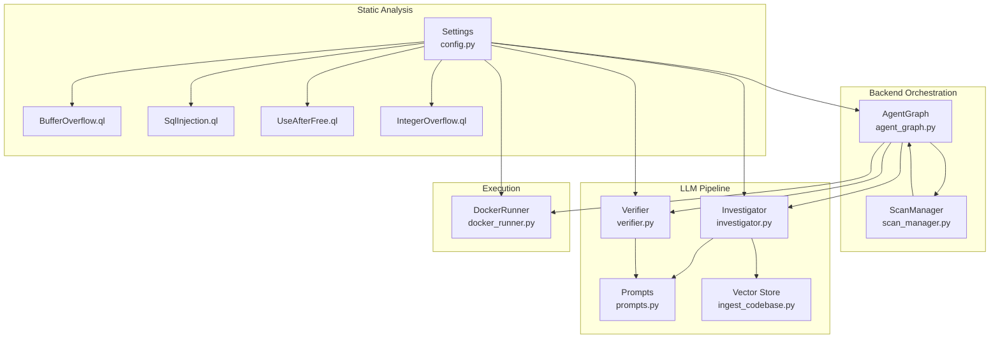
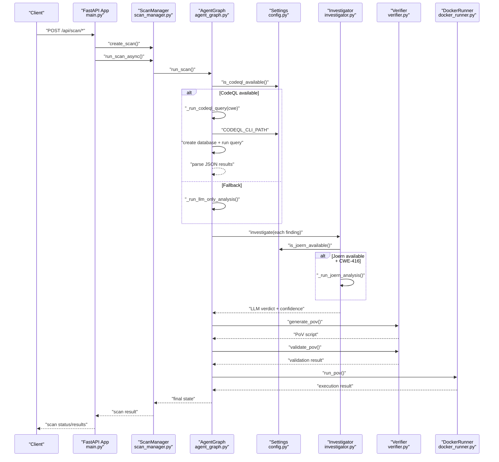
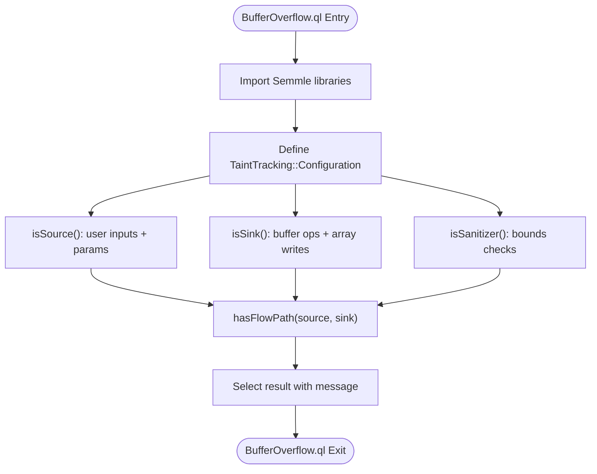
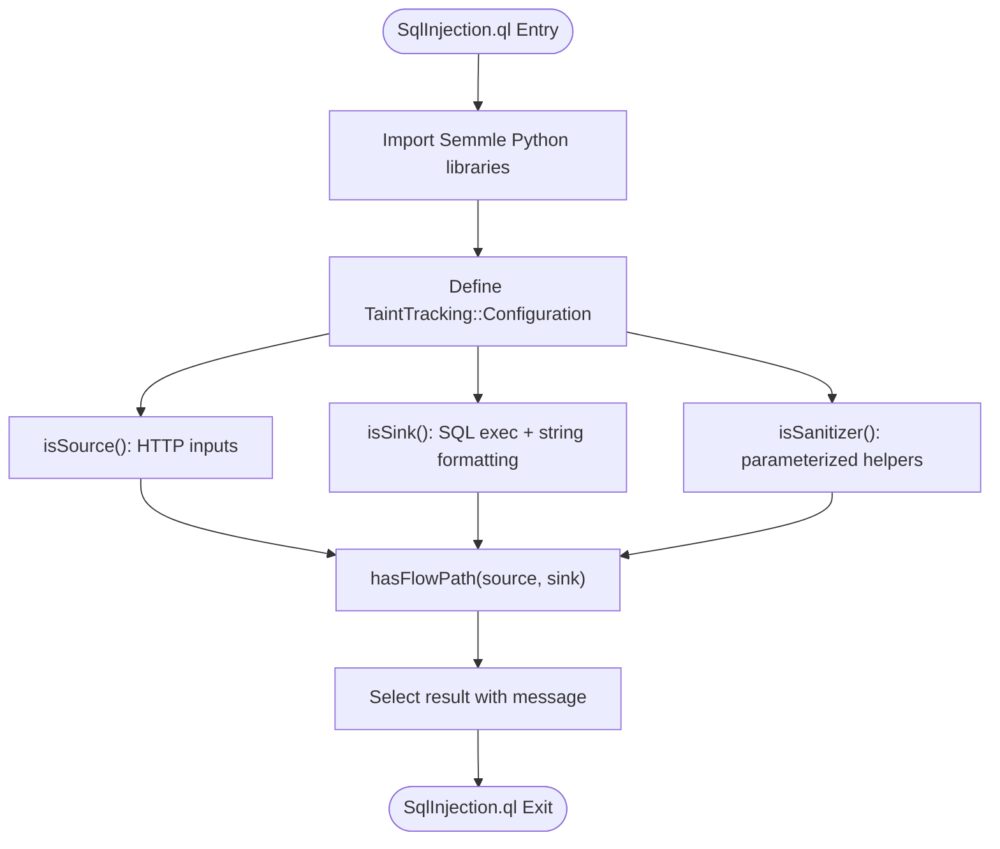
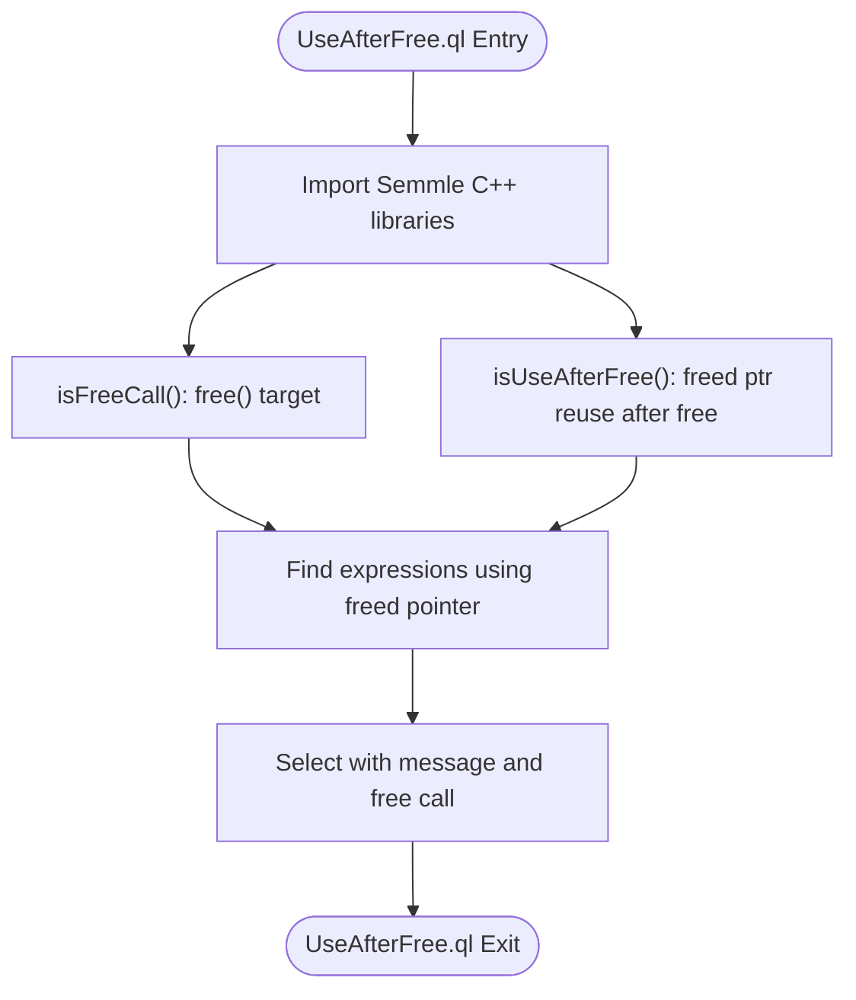
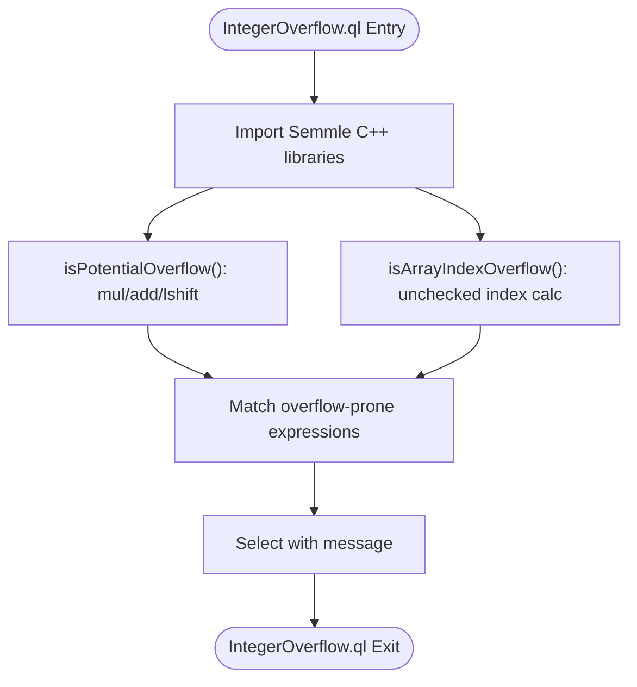
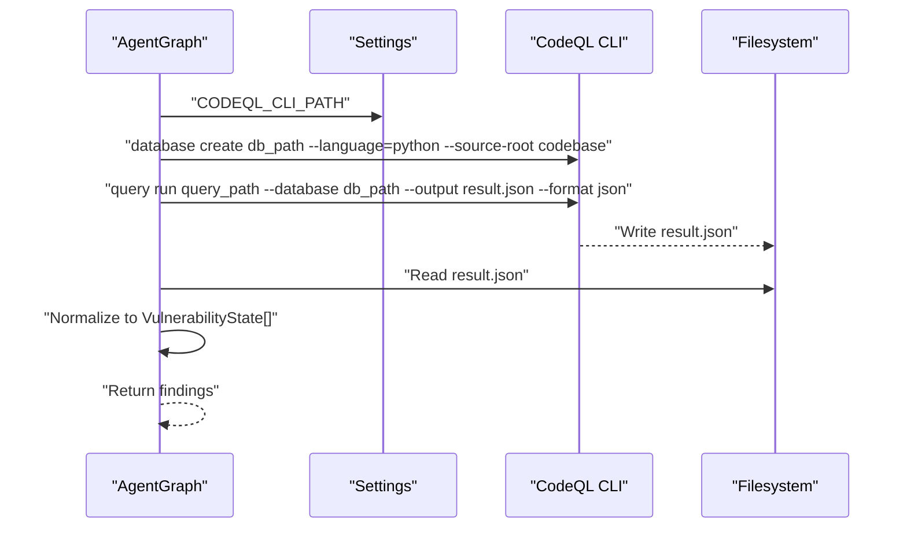
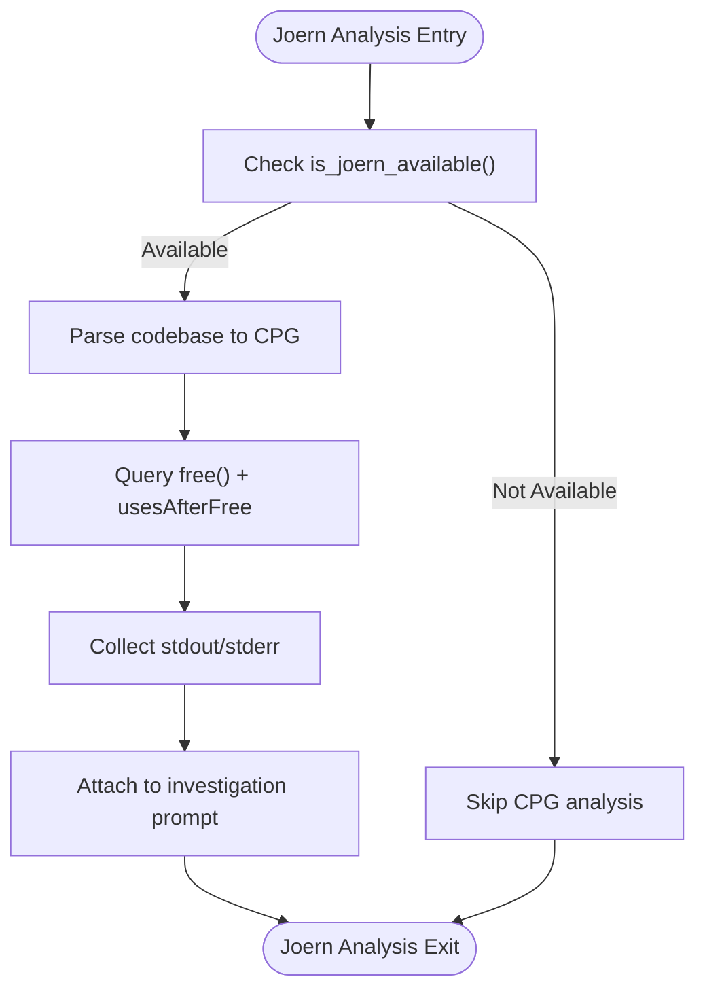
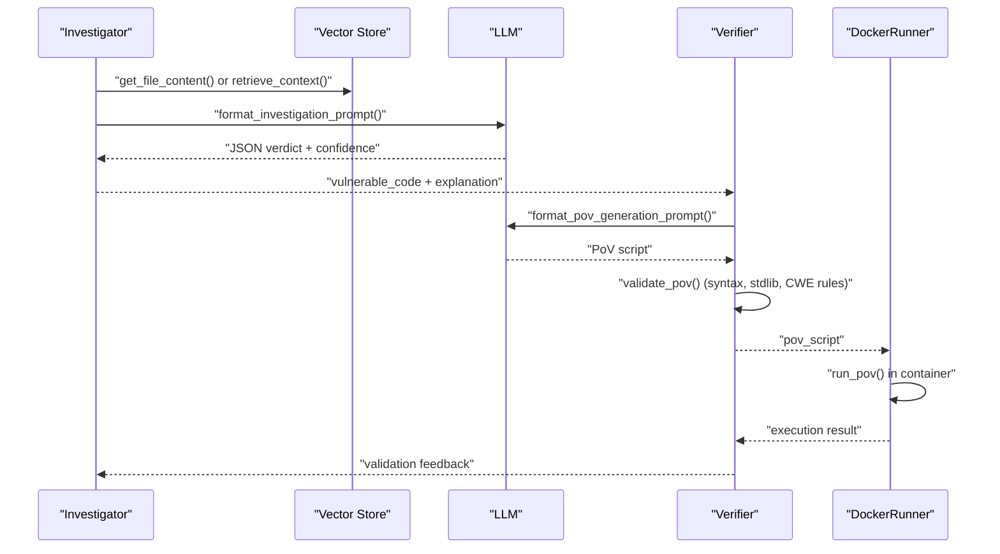
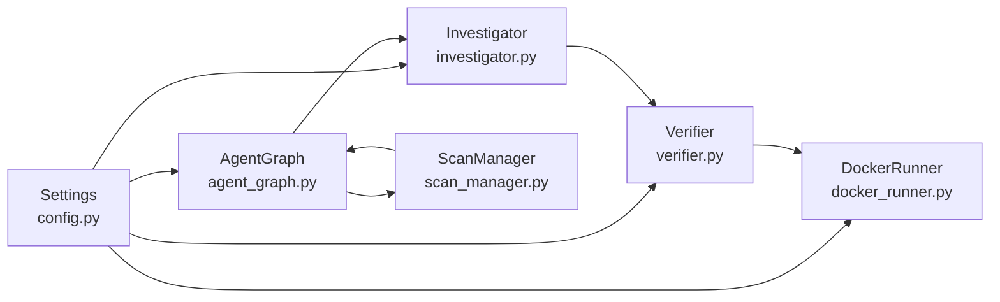

# Static Analysis Integration

<cite>
**Referenced Files in This Document**
- [README.md](file://README.md)
- [agent_graph.py](file://autopov/app/agent_graph.py)
- [scan_manager.py](file://autopov/app/scan_manager.py)
- [config.py](file://autopov/app/config.py)
- [investigator.py](file://autopov/agents/investigator.py)
- [verifier.py](file://autopov/agents/verifier.py)
- [docker_runner.py](file://autopov/agents/docker_runner.py)
- [ingest_codebase.py](file://autopov/agents/ingest_codebase.py)
- [prompts.py](file://autopov/prompts.py)
- [analyse.py](file://autopov/analyse.py)
- [BufferOverflow.ql](file://autopov/codeql_queries/BufferOverflow.ql)
- [SqlInjection.ql](file://autopov/codeql_queries/SqlInjection.ql)
- [UseAfterFree.ql](file://autopov/codeql_queries/UseAfterFree.ql)
- [IntegerOverflow.ql](file://autopov/codeql_queries/IntegerOverflow.ql)
</cite>

## Table of Contents
1. [Introduction](#introduction)
2. [Project Structure](#project-structure)
3. [Core Components](#core-components)
4. [Architecture Overview](#architecture-overview)
5. [Detailed Component Analysis](#detailed-component-analysis)
6. [Dependency Analysis](#dependency-analysis)
7. [Performance Considerations](#performance-considerations)
8. [Troubleshooting Guide](#troubleshooting-guide)
9. [Conclusion](#conclusion)
10. [Appendices](#appendices)

## Introduction
This document explains the static analysis integration component of the AutoPoV framework with a focus on CodeQL query execution and Joern CPG analysis. It details how the system orchestrates CodeQL scanning for four key CWE families—Buffer Overflow, SQL Injection, Use After Free, and Integer Overflow—parses and normalizes results, and feeds them into an LLM-driven reasoning pipeline. It also covers the optional Joern CPG analysis for deeper program semantics, especially for Use After Free, and outlines the end-to-end workflow from scan initiation to PoV execution and validation.

## Project Structure
The static analysis integration spans several modules:
- Backend orchestration and workflow: agent_graph.py, scan_manager.py
- Static analysis tooling: CodeQL queries under codeql_queries/, configuration in config.py
- LLM-driven analysis and PoV: investigator.py, verifier.py, prompts.py
- Vector store and context retrieval: ingest_codebase.py
- Docker execution of PoVs: docker_runner.py
- Benchmarking utilities: analyse.py

**Diagram sources**
- [agent_graph.py](file://autopov/app/agent_graph.py#L84-L134)
- [scan_manager.py](file://autopov/app/scan_manager.py#L40-L200)
- [config.py](file://autopov/app/config.py#L137-L172)
- [investigator.py](file://autopov/agents/investigator.py#L89-L185)
- [verifier.py](file://autopov/agents/verifier.py#L79-L149)
- [docker_runner.py](file://autopov/agents/docker_runner.py#L62-L192)
- [ingest_codebase.py](file://autopov/agents/ingest_codebase.py#L201-L307)
- [BufferOverflow.ql](file://autopov/codeql_queries/BufferOverflow.ql#L1-L59)
- [SqlInjection.ql](file://autopov/codeql_queries/SqlInjection.ql#L1-L67)
- [UseAfterFree.ql](file://autopov/codeql_queries/UseAfterFree.ql#L1-L41)
- [IntegerOverflow.ql](file://autopov/codeql_queries/IntegerOverflow.ql#L1-L62)

**Section sources**
- [README.md](file://README.md#L17-L35)
- [agent_graph.py](file://autopov/app/agent_graph.py#L84-L134)
- [scan_manager.py](file://autopov/app/scan_manager.py#L40-L200)
- [config.py](file://autopov/app/config.py#L137-L172)

## Core Components
- CodeQL query execution: Orchestrated by AgentGraph, which creates a CodeQL database per scan, runs targeted queries, and parses results into a unified finding structure.
- Joern CPG analysis: Optional, invoked for Use After Free (CWE-416) to enrich LLM investigations with call graph and memory safety insights.
- LLM reasoning pipeline: Investigator validates CodeQL findings and synthesizes context; Verifier generates and validates PoV scripts; DockerRunner executes PoVs safely.
- Vector store integration: Code chunks are embedded and stored for retrieval during investigation and context synthesis.

**Section sources**
- [agent_graph.py](file://autopov/app/agent_graph.py#L163-L278)
- [investigator.py](file://autopov/agents/investigator.py#L89-L185)
- [verifier.py](file://autopov/agents/verifier.py#L79-L149)
- [ingest_codebase.py](file://autopov/agents/ingest_codebase.py#L201-L307)

## Architecture Overview
The static analysis integration follows a LangGraph-based workflow:
- Ingest codebase into vector store
- Run CodeQL queries for selected CWEs
- Investigate findings with LLM and optional Joern CPG analysis
- Generate and validate PoV scripts
- Execute PoVs in Docker and record outcomes
- Aggregate metrics and finalize scan

**Diagram sources**
- [agent_graph.py](file://autopov/app/agent_graph.py#L163-L278)
- [investigator.py](file://autopov/agents/investigator.py#L254-L366)
- [verifier.py](file://autopov/agents/verifier.py#L79-L149)
- [docker_runner.py](file://autopov/agents/docker_runner.py#L62-L192)
- [config.py](file://autopov/app/config.py#L137-L172)

## Detailed Component Analysis

### CodeQL Query Architecture and Execution

#### Buffer Overflow (CWE-119)
- Detection strategy: Taint-tracking configuration modeling user inputs and unsafe buffer operations as sources and sinks, with sanitizers for bounds checks.
- Sources: Functions like gets, scanf, read, recv; function parameters (excluding main).
- Sinks: Unsafe copy/move/sprintf operations and direct array writes.
- Sanitizers: strlen, sizeof, strnlen, strlcpy, strlcat.
- Query output: Path-based results indicating user-controlled data reaching buffer operations without bounds checks.

**Diagram sources**
- [BufferOverflow.ql](file://autopov/codeql_queries/BufferOverflow.ql#L12-L59)

**Section sources**
- [BufferOverflow.ql](file://autopov/codeql_queries/BufferOverflow.ql#L16-L59)

#### SQL Injection (CWE-89)
- Detection strategy: Taint-tracking from HTTP input sources to SQL execution sinks, including parameterized query checks.
- Sources: request.args.get, request.form.get, request.json.get, input, sys.argv, os.environ.get.
- Sinks: execute, executemany, raw, RawSQL, cursor.execute; string formatting with SQL keywords.
- Sanitizers: escape, mogrify.
- Query output: Path-based results indicating un-sanitized user input reaching SQL execution.

**Diagram sources**
- [SqlInjection.ql](file://autopov/codeql_queries/SqlInjection.ql#L12-L67)

**Section sources**
- [SqlInjection.ql](file://autopov/codeql_queries/SqlInjection.ql#L17-L67)

#### Use After Free (CWE-416)
- Detection strategy: Identifies calls to free() and subsequent uses of the freed pointer in later basic blocks.
- Predicates: isFreeCall() identifies free() calls; isUseAfterFree() checks pointer reuse after free with dominance analysis.
- Query output: Direct matches for pointer use after free with associated free call location.

**Diagram sources**
- [UseAfterFree.ql](file://autopov/codeql_queries/UseAfterFree.ql#L16-L41)

**Section sources**
- [UseAfterFree.ql](file://autopov/codeql_queries/UseAfterFree.ql#L16-L41)

#### Integer Overflow (CWE-190)
- Detection strategy: Identifies arithmetic operations (mul/add/lshift) that may overflow without guards or bounds checks.
- Predicates: isPotentialOverflow() for multiplication/addition/left-shift; isArrayIndexOverflow() for unchecked index calculations.
- Query output: Expressions flagged for potential wraparound or index calculation issues.

**Diagram sources**
- [IntegerOverflow.ql](file://autopov/codeql_queries/IntegerOverflow.ql#L15-L62)

**Section sources**
- [IntegerOverflow.ql](file://autopov/codeql_queries/IntegerOverflow.ql#L15-L62)

#### Query Compilation, Execution, and Result Parsing
- Database creation: A temporary CodeQL database is created for the scanned codebase.
- Query execution: Each selected CWE query is executed against the database, producing JSON results.
- Result normalization: Results are parsed into a unified finding structure with fields such as filepath, line_number, cwe_type, and placeholder fields for LLM metadata.

**Diagram sources**
- [agent_graph.py](file://autopov/app/agent_graph.py#L193-L278)
- [config.py](file://autopov/app/config.py#L74-L76)

**Section sources**
- [agent_graph.py](file://autopov/app/agent_graph.py#L193-L278)
- [config.py](file://autopov/app/config.py#L74-L76)

### Joern CPG Analysis Integration
- Trigger: Only for CWE-416 (Use After Free).
- Execution: Creates a CPG from the codebase and runs a script to find free() calls and subsequent uses of freed pointers.
- Output enrichment: The resulting analysis is included in the investigation prompt to guide LLM reasoning.

**Diagram sources**
- [investigator.py](file://autopov/agents/investigator.py#L89-L185)
- [config.py](file://autopov/app/config.py#L149-L159)

**Section sources**
- [investigator.py](file://autopov/agents/investigator.py#L89-L185)
- [config.py](file://autopov/app/config.py#L149-L159)

### LLM Reasoning Pipeline and PoV Execution
- Investigation: The Investigator retrieves code context (full file or RAG chunks), optionally augments with Joern CPG output, and asks the LLM to judge if the finding is real or a false positive.
- PoV Generation: The Verifier generates a Python PoV script that prints a specific trigger phrase upon successful exploitation.
- Validation: Scripts are validated for syntax, standard library usage, and CWE-specific criteria; an LLM review further assesses feasibility.
- Execution: DockerRunner executes PoVs in isolated containers with strict resource limits and timeouts.

**Diagram sources**
- [prompts.py](file://autopov/prompts.py#L7-L44)
- [prompts.py](file://autopov/prompts.py#L46-L79)
- [prompts.py](file://autopov/prompts.py#L81-L109)
- [investigator.py](file://autopov/agents/investigator.py#L254-L366)
- [verifier.py](file://autopov/agents/verifier.py#L79-L149)
- [docker_runner.py](file://autopov/agents/docker_runner.py#L62-L192)

**Section sources**
- [prompts.py](file://autopov/prompts.py#L7-L109)
- [investigator.py](file://autopov/agents/investigator.py#L254-L366)
- [verifier.py](file://autopov/agents/verifier.py#L79-L149)
- [docker_runner.py](file://autopov/agents/docker_runner.py#L62-L192)

### Practical Examples and Workflow Integration
- Example: Buffer Overflow
  - CodeQL detects a strcpy with a tainted source.
  - Investigator confirms by checking bounds checks and surrounding logic.
  - Verifier generates a PoV that supplies oversized input to overflow a fixed-size buffer.
  - DockerRunner executes the PoV and reports success if the trigger phrase is printed.
- Example: SQL Injection
  - CodeQL flags a string formatting operation receiving user input.
  - Investigator verifies parameterization and sanitization.
  - Verifier crafts a PoV injecting malicious SQL tokens.
  - DockerRunner executes PoV and records outcome.
- Example: Use After Free (CWE-416)
  - CodeQL finds a free() followed by pointer use.
  - Investigator augments with Joern CPG to confirm control-flow dependency.
  - Verifier attempts to construct a minimal PoV; DockerRunner executes it.
- Example: Integer Overflow
  - CodeQL flags addition/multiplication with large operands.
  - Investigator checks for missing guards.
  - Verifier constructs a PoV using large constants to trigger wraparound.

These steps integrate seamlessly into the broader vulnerability detection workflow orchestrated by AgentGraph and ScanManager.

**Section sources**
- [agent_graph.py](file://autopov/app/agent_graph.py#L163-L278)
- [scan_manager.py](file://autopov/app/scan_manager.py#L118-L199)
- [investigator.py](file://autopov/agents/investigator.py#L254-L366)
- [verifier.py](file://autopov/agents/verifier.py#L79-L149)
- [docker_runner.py](file://autopov/agents/docker_runner.py#L62-L192)

## Dependency Analysis
- Tool availability checks: CodeQL, Joern, and Docker availability are centrally managed in settings and used throughout the pipeline to decide fallbacks and feature activation.
- Configuration-driven behavior: The system adapts to environment variables for model mode, tool paths, and resource limits.
- Data flow: CodeQL results feed into the investigation stage; validated PoVs are executed in Docker; results are aggregated and persisted.

**Diagram sources**
- [config.py](file://autopov/app/config.py#L137-L172)
- [agent_graph.py](file://autopov/app/agent_graph.py#L163-L278)
- [investigator.py](file://autopov/agents/investigator.py#L254-L366)
- [verifier.py](file://autopov/agents/verifier.py#L79-L149)
- [docker_runner.py](file://autopov/agents/docker_runner.py#L62-L192)
- [scan_manager.py](file://autopov/app/scan_manager.py#L118-L199)

**Section sources**
- [config.py](file://autopov/app/config.py#L137-L172)
- [agent_graph.py](file://autopov/app/agent_graph.py#L163-L278)
- [investigator.py](file://autopov/agents/investigator.py#L254-L366)
- [verifier.py](file://autopov/agents/verifier.py#L79-L149)
- [docker_runner.py](file://autopov/agents/docker_runner.py#L62-L192)
- [scan_manager.py](file://autopov/app/scan_manager.py#L118-L199)

## Performance Considerations
- CodeQL execution timeouts: Subprocess calls include timeouts to prevent long-running queries from blocking the pipeline.
- Resource limits for PoV execution: DockerRunner enforces memory, CPU quota, and timeout to contain resource usage.
- Batched ingestion: Vector store ingestion writes embeddings in batches to reduce overhead.
- Conditional analysis: Joern is only invoked for CWE-416 to avoid unnecessary overhead.
- Cost estimation: Simple inference-time-based cost tracking helps bound expenses during investigation and PoV generation.

Recommendations:
- Tune CodeQL timeouts per project size.
- Adjust chunk size and overlap for RAG to balance recall and performance.
- Monitor Docker resource limits and adjust as needed.
- Consider caching CodeQL databases for repeated scans of the same codebase.

**Section sources**
- [agent_graph.py](file://autopov/app/agent_graph.py#L214-L241)
- [docker_runner.py](file://autopov/agents/docker_runner.py#L33-L36)
- [docker_runner.py](file://autopov/agents/docker_runner.py#L135-L144)
- [ingest_codebase.py](file://autopov/agents/ingest_codebase.py#L290-L307)
- [investigator.py](file://autopov/agents/investigator.py#L108-L110)

## Troubleshooting Guide
Common issues and resolutions:
- CodeQL not available
  - Symptom: Fallback to LLM-only analysis.
  - Action: Verify CODEQL_CLI_PATH and installation; ensure is_codeql_available() returns true.
- Joern not available
  - Symptom: Skips CPG analysis for CWE-416.
  - Action: Install Joern and ensure is_joern_available() returns true.
- Docker not available
  - Symptom: PoV generation succeeds but execution returns failure with Docker not available.
  - Action: Install Docker, enable service, and ensure is_docker_available() returns true.
- Query execution failures
  - Symptom: Empty findings or errors when parsing results.
  - Action: Confirm query file exists, database creation succeeded, and JSON output is valid.
- PoV validation failures
  - Symptom: Missing trigger phrase, non-stdlib imports, or syntax errors.
  - Action: Review validation criteria and regenerate PoV; use LLM validation feedback.

**Section sources**
- [agent_graph.py](file://autopov/app/agent_graph.py#L168-L173)
- [agent_graph.py](file://autopov/app/agent_graph.py#L270-L272)
- [config.py](file://autopov/app/config.py#L137-L172)
- [investigator.py](file://autopov/agents/investigator.py#L108-L110)
- [verifier.py](file://autopov/agents/verifier.py#L177-L227)
- [docker_runner.py](file://autopov/agents/docker_runner.py#L81-L90)

## Conclusion
The static analysis integration in AutoPoV combines CodeQL’s precise taint/path analysis with Joern’s CPG semantics for deep memory safety insights. The unified findings are normalized and reasoned by LLMs, leading to automated PoV generation and safe execution in Docker. The system’s configuration-driven design enables robust fallbacks and performance tuning, while the LangGraph workflow ensures a coherent, traceable pipeline from static detection to actionable results.

## Appendices

### Benchmarking Static Analysis Results
- Load scan history and compute metrics such as detection rate, false positive rate, and cost per confirmed vulnerability.
- Generate CSV summaries and detailed JSON reports for model comparisons.

**Section sources**
- [analyse.py](file://autopov/analyse.py#L46-L98)
- [analyse.py](file://autopov/analyse.py#L216-L247)
- [analyse.py](file://autopov/analyse.py#L249-L267)