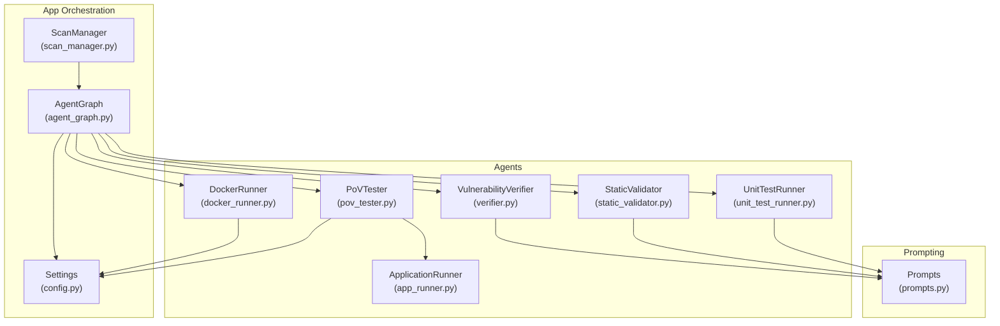
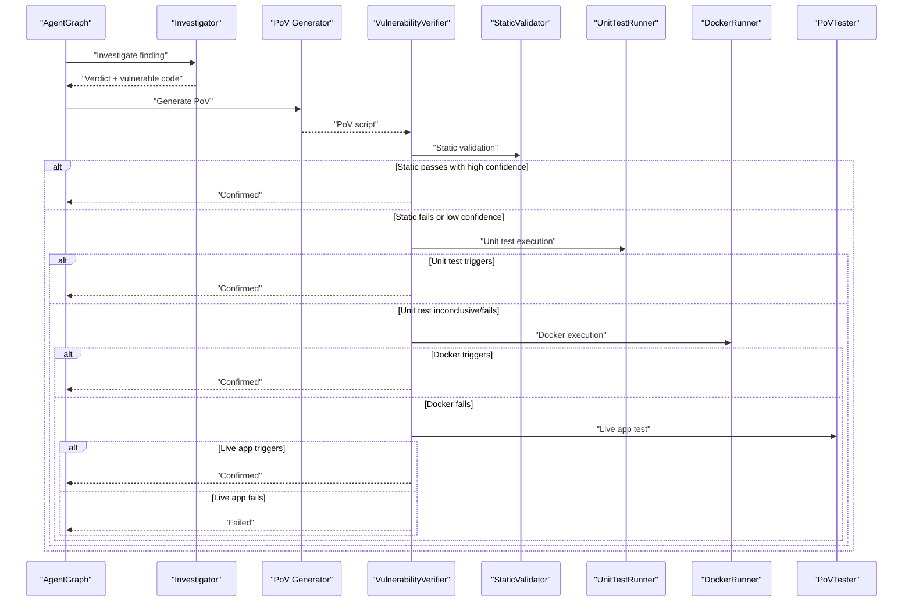
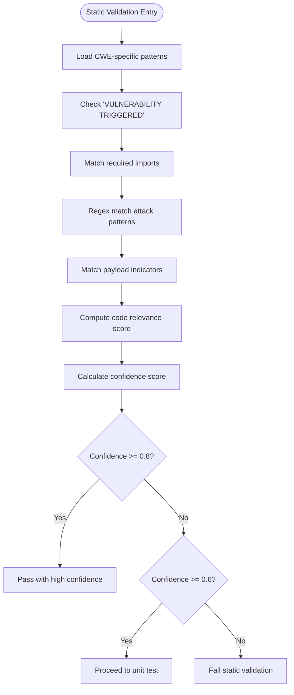
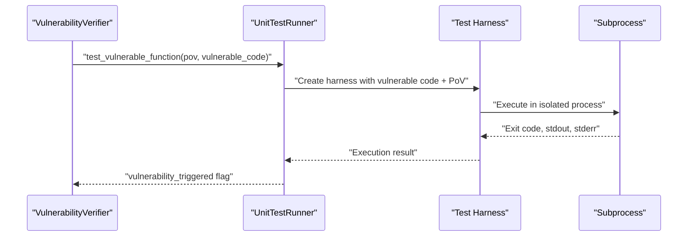
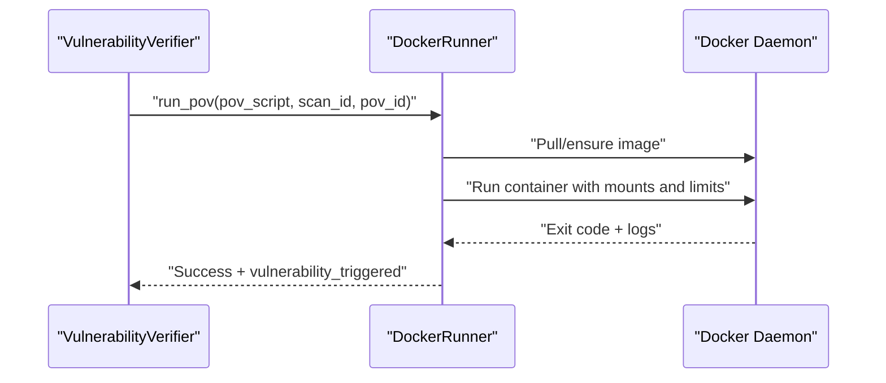
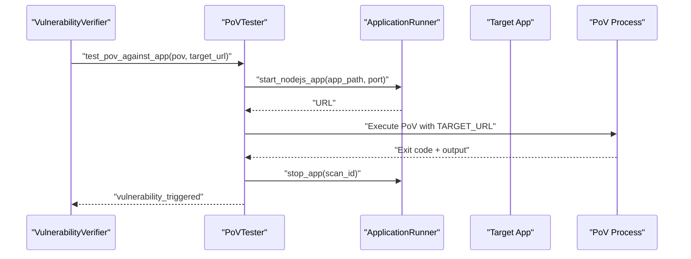
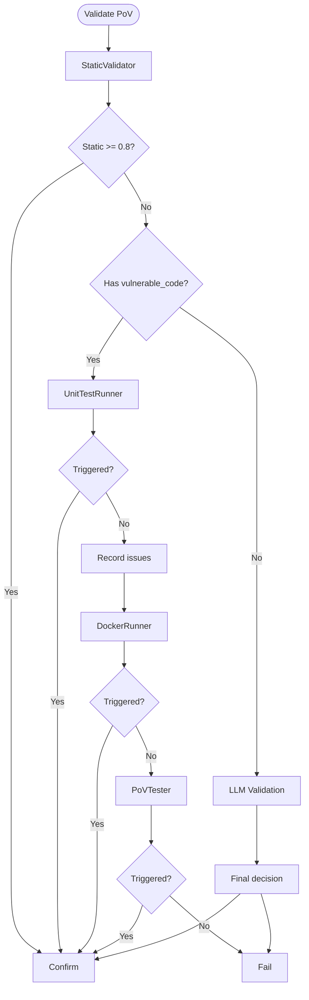
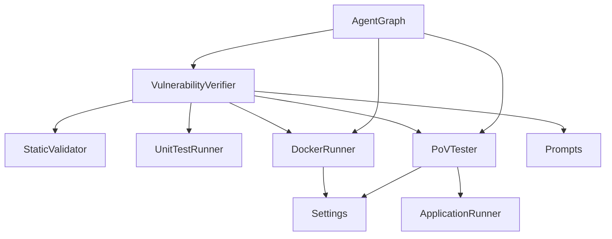

# Validation Pipeline

<cite>
**Referenced Files in This Document**
- [static_validator.py](file://agents/static_validator.py)
- [unit_test_runner.py](file://agents/unit_test_runner.py)
- [docker_runner.py](file://agents/docker_runner.py)
- [pov_tester.py](file://agents/pov_tester.py)
- [verifier.py](file://agents/verifier.py)
- [app_runner.py](file://agents/app_runner.py)
- [agent_graph.py](file://app/agent_graph.py)
- [config.py](file://app/config.py)
- [prompts.py](file://prompts.py)
- [scan_manager.py](file://app/scan_manager.py)
</cite>

## Table of Contents
1. [Introduction](#introduction)
2. [Project Structure](#project-structure)
3. [Core Components](#core-components)
4. [Architecture Overview](#architecture-overview)
5. [Detailed Component Analysis](#detailed-component-analysis)
6. [Dependency Analysis](#dependency-analysis)
7. [Performance Considerations](#performance-considerations)
8. [Troubleshooting Guide](#troubleshooting-guide)
9. [Conclusion](#conclusion)

## Introduction
This document describes AutoPoV’s multi-stage validation pipeline that escalates from static analysis to dynamic testing. The pipeline reduces false positives while maintaining detection accuracy by progressively strengthening validation criteria at each stage. It consists of four tiers:
- Static validation: Pattern-based filtering using CodeQL and Semgrep-like signatures
- Unit test validation: Deterministic execution against isolated vulnerable code
- Docker sandbox execution: Containerized runtime testing without network access
- PoV tester: Real-world application testing with URL patching and lifecycle management

Each stage defines explicit pass/fail criteria, confidence scoring, and failure-handling mechanisms. The pipeline integrates with a broader agent graph that orchestrates scanning, investigation, PoV generation, and execution.

## Project Structure
The validation pipeline spans several modules:
- Agents handle the four validation stages and supporting utilities
- App modules coordinate orchestration, configuration, and persistence
- Prompts define standardized LLM instructions for PoV generation and validation

**Diagram sources**
- [agent_graph.py:88-168](file://app/agent_graph.py#L88-L168)
- [static_validator.py:22-305](file://agents/static_validator.py#L22-L305)
- [unit_test_runner.py:28-344](file://agents/unit_test_runner.py#L28-L344)
- [docker_runner.py:27-377](file://agents/docker_runner.py#L27-L377)
- [pov_tester.py:21-296](file://agents/pov_tester.py#L21-L296)
- [app_runner.py:19-200](file://agents/app_runner.py#L19-L200)
- [verifier.py:42-562](file://agents/verifier.py#L42-L562)
- [config.py:13-255](file://app/config.py#L13-L255)
- [prompts.py:46-424](file://prompts.py#L46-L424)
- [scan_manager.py:47-663](file://app/scan_manager.py#L47-L663)

**Section sources**
- [agent_graph.py:88-168](file://app/agent_graph.py#L88-L168)
- [config.py:13-255](file://app/config.py#L13-L255)

## Core Components
- StaticValidator: Validates PoV scripts using signature matching, required imports, attack patterns, and code relevance scoring. Produces a confidence score and pass/fail decision.
- UnitTestRunner: Executes PoVs in isolated harnesses against vulnerable code snippets with strict timeouts and resource constraints.
- DockerRunner: Runs PoVs inside containers with restricted CPU/memory and no network access, capturing stdout/stderr and exit codes.
- PoVTester: Tests PoVs against live applications, patches target URLs, and manages app lifecycle via ApplicationRunner.
- VulnerabilityVerifier: Orchestrates hybrid validation combining static checks, unit test execution, and LLM-based analysis; computes confidence and suggests improvements.
- AgentGraph: Coordinates the end-to-end scan workflow, routing findings through investigation, PoV generation, and validation.
- Config: Centralizes environment-driven settings for LLMs, Docker, and supported CWEs.

**Section sources**
- [static_validator.py:22-305](file://agents/static_validator.py#L22-L305)
- [unit_test_runner.py:28-344](file://agents/unit_test_runner.py#L28-L344)
- [docker_runner.py:27-377](file://agents/docker_runner.py#L27-L377)
- [pov_tester.py:21-296](file://agents/pov_tester.py#L21-L296)
- [verifier.py:225-387](file://agents/verifier.py#L225-L387)
- [agent_graph.py:88-168](file://app/agent_graph.py#L88-L168)
- [config.py:13-255](file://app/config.py#L13-L255)

## Architecture Overview
The pipeline is orchestrated by AgentGraph, which:
- Ingests codebases and runs CodeQL/Semgrep-style queries
- Investigates findings with LLM and RAG
- Generates PoVs with standardized prompts
- Validates PoVs using StaticValidator and UnitTestRunner
- Executes PoVs in DockerRunner or PoVTester depending on availability and confidence thresholds

**Diagram sources**
- [agent_graph.py:691-777](file://app/agent_graph.py#L691-L777)
- [verifier.py:225-387](file://agents/verifier.py#L225-L387)
- [static_validator.py:123-233](file://agents/static_validator.py#L123-L233)
- [unit_test_runner.py:34-116](file://agents/unit_test_runner.py#L34-L116)
- [docker_runner.py:62-191](file://agents/docker_runner.py#L62-L191)
- [pov_tester.py:24-105](file://agents/pov_tester.py#L24-L105)

## Detailed Component Analysis

### Static Validation
StaticValidator performs pattern-based checks to quickly filter PoVs:
- Required imports for the CWE type
- Attack pattern regex matches
- Payload indicators
- Presence of “VULNERABILITY TRIGGERED”
- Code relevance score against the vulnerable code
- Confidence calculation balances matched patterns, presence of vulnerability trigger, code relevance, and issues

Pass/fail criteria:
- High-confidence pass: static_result.is_valid AND static_result.confidence >= 0.8
- Low-confidence pass: static_result.is_valid AND static_result.confidence >= 0.6 (requires further testing)

Confidence adjustment:
- Base score increases with matched patterns and code relevance
- Decreases with issues
- Enforces minimum threshold for acceptance

**Diagram sources**
- [static_validator.py:123-284](file://agents/static_validator.py#L123-L284)

**Section sources**
- [static_validator.py:22-305](file://agents/static_validator.py#L22-L305)

### Unit Test Validation
UnitTestRunner executes PoVs against isolated vulnerable code:
- Extracts the vulnerable function/snippet
- Builds a test harness that loads the vulnerable code into a namespace and executes the PoV
- Runs in a subprocess with strict timeouts and minimal environment
- Captures stdout/stderr and exit codes; determines if “VULNERABILITY TRIGGERED” was printed

Decision criteria:
- If unit test succeeds and prints the trigger, mark as confirmed
- If unit test runs but no trigger, mark as maybe-trigger
- If unit test fails, record issues and continue to Docker/Live testing

**Diagram sources**
- [unit_test_runner.py:34-116](file://agents/unit_test_runner.py#L34-L116)
- [unit_test_runner.py:145-286](file://agents/unit_test_runner.py#L145-L286)

**Section sources**
- [unit_test_runner.py:28-344](file://agents/unit_test_runner.py#L28-L344)

### Docker Sandbox Execution
DockerRunner executes PoVs in a secure, isolated container:
- Ensures the configured Docker image exists or pulls it
- Mounts a temporary directory with the PoV script
- Runs with CPU/memory limits and no network access
- Waits with timeout and captures logs
- Determines success if exit code indicates success OR “VULNERABILITY TRIGGERED” is found

**Diagram sources**
- [docker_runner.py:62-191](file://agents/docker_runner.py#L62-L191)
- [config.py:92-98](file://app/config.py#L92-L98)

**Section sources**
- [docker_runner.py:27-377](file://agents/docker_runner.py#L27-L377)
- [config.py:92-98](file://app/config.py#L92-L98)

### PoV Tester Against Live Applications
PoVTester validates PoVs against running applications:
- Patches the PoV to use the target URL (supports placeholders and localhost patterns)
- Executes PoV locally or via node for JavaScript
- Manages application lifecycle via ApplicationRunner (start/stop)
- Records success if “VULNERABILITY TRIGGERED” is detected

**Diagram sources**
- [pov_tester.py:24-105](file://agents/pov_tester.py#L24-L105)
- [app_runner.py:25-148](file://agents/app_runner.py#L25-L148)

**Section sources**
- [pov_tester.py:21-296](file://agents/pov_tester.py#L21-L296)
- [app_runner.py:19-200](file://agents/app_runner.py#L19-L200)

### Hybrid Validation Orchestration
VulnerabilityVerifier coordinates the four-tier validation:
- Static validation (always)
- Unit test validation (if vulnerable code available)
- LLM-based validation (fallback)
- Final determination with suggestions and issues

Decision logic:
- If static validation passes with high confidence → confirm
- Else if unit test triggers → confirm
- Else if unit test fails → mark issues and escalate
- Else if Docker/Live app triggers → confirm
- Else → mark failure

**Diagram sources**
- [verifier.py:225-387](file://agents/verifier.py#L225-L387)

**Section sources**
- [verifier.py:225-387](file://agents/verifier.py#L225-L387)

## Dependency Analysis
Key dependencies and coupling:
- StaticValidator depends on CWE-specific patterns and regex matching
- UnitTestRunner depends on AST parsing and subprocess isolation
- DockerRunner depends on Docker SDK and configuration settings
- PoVTester depends on ApplicationRunner and environment variables
- VulnerabilityVerifier orchestrates all agents and uses prompts for PoV generation/validation
- AgentGraph coordinates the end-to-end workflow and transitions between nodes

**Diagram sources**
- [verifier.py:225-387](file://agents/verifier.py#L225-L387)
- [static_validator.py:22-305](file://agents/static_validator.py#L22-L305)
- [unit_test_runner.py:28-344](file://agents/unit_test_runner.py#L28-L344)
- [docker_runner.py:27-377](file://agents/docker_runner.py#L27-L377)
- [pov_tester.py:21-296](file://agents/pov_tester.py#L21-L296)
- [app_runner.py:19-200](file://agents/app_runner.py#L19-L200)
- [agent_graph.py:88-168](file://app/agent_graph.py#L88-L168)
- [config.py:13-255](file://app/config.py#L13-L255)
- [prompts.py:46-424](file://prompts.py#L46-L424)

**Section sources**
- [verifier.py:225-387](file://agents/verifier.py#L225-L387)
- [agent_graph.py:88-168](file://app/agent_graph.py#L88-L168)
- [config.py:13-255](file://app/config.py#L13-L255)

## Performance Considerations
- Static validation is extremely fast and acts as a prefilter to reduce downstream costs
- Unit tests run with strict timeouts to bound execution time
- DockerRunner enforces CPU/memory limits to prevent resource exhaustion
- LLM-based steps are reserved for ambiguous cases to minimize cost
- AgentGraph batches and streams progress to keep scans responsive

[No sources needed since this section provides general guidance]

## Troubleshooting Guide
Common failure scenarios and remedies:
- Static validation fails due to missing “VULNERABILITY TRIGGERED” or disallowed imports
  - Ensure PoV prints the required trigger and uses only standard library
- Unit test failures due to extraction errors or missing vulnerable code context
  - Verify the vulnerable code snippet is provided and extractable
- DockerRunner reports “Docker not available” or timeouts
  - Confirm Docker daemon is running and image is accessible; adjust timeout/memory settings
- PoVTester fails to connect to target URL
  - Patch placeholders and ensure target URL is reachable; verify ApplicationRunner started successfully
- LLM validation inconclusive
  - Review suggestions returned by the verifier and refine the PoV accordingly

**Section sources**
- [verifier.py:327-387](file://agents/verifier.py#L327-L387)
- [docker_runner.py:50-61](file://agents/docker_runner.py#L50-L61)
- [pov_tester.py:107-138](file://agents/pov_tester.py#L107-L138)
- [app_runner.py:150-169](file://agents/app_runner.py#L150-L169)

## Conclusion
AutoPoV’s four-tier validation pipeline balances speed, safety, and accuracy. By escalating from static signature checks to unit tests, sandboxed execution, and live application testing, it minimizes false positives while ensuring robust verification. The orchestrator coordinates these stages efficiently, leveraging configuration-driven settings and standardized prompts to maintain consistency across diverse codebases and vulnerability types.

[No sources needed since this section summarizes without analyzing specific files]