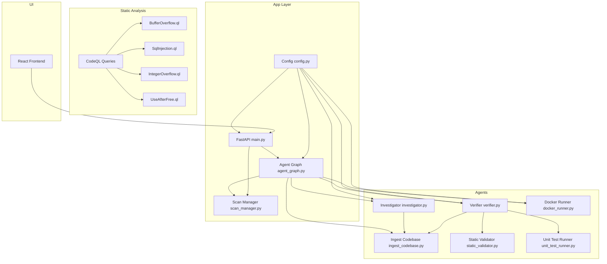
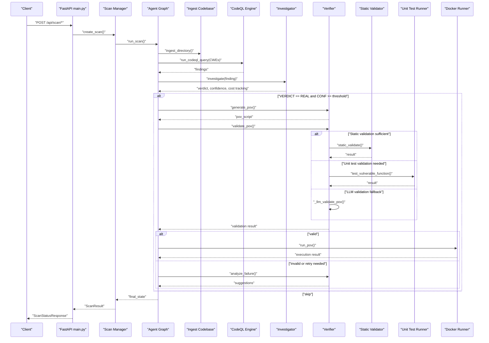
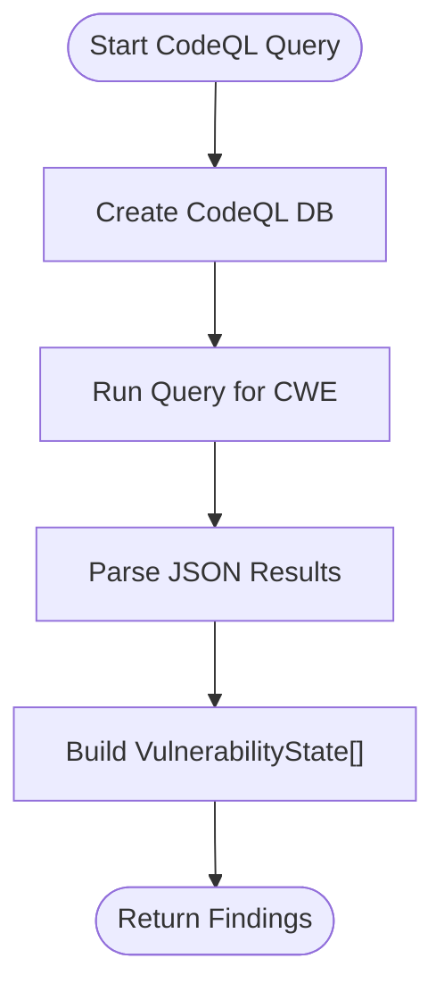
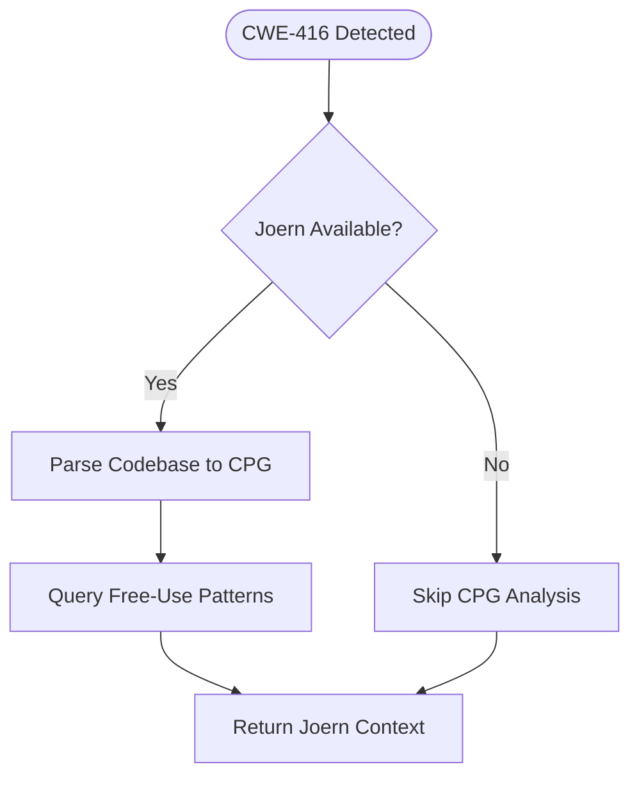
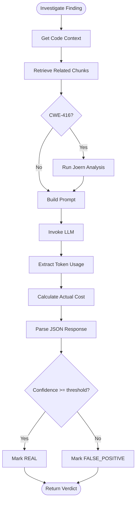
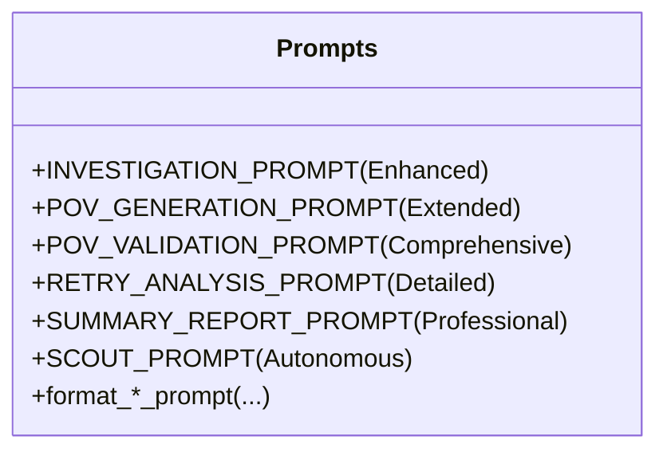
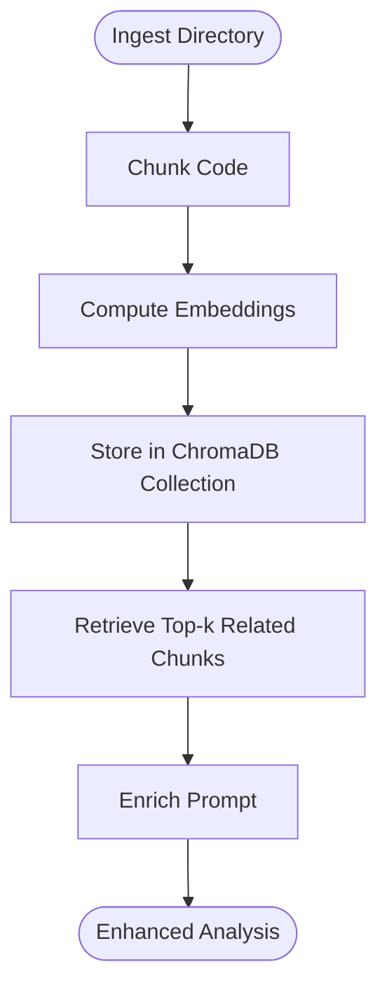
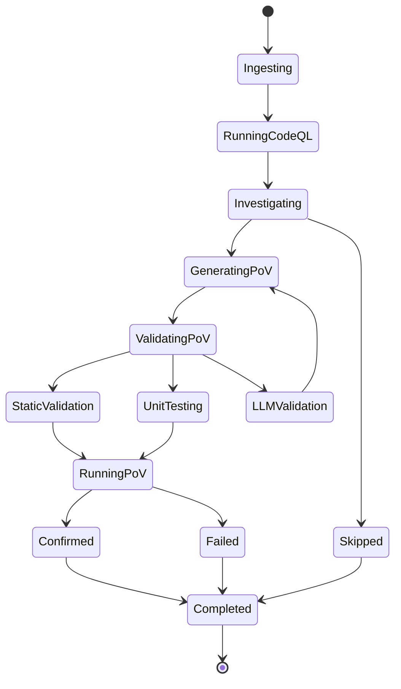
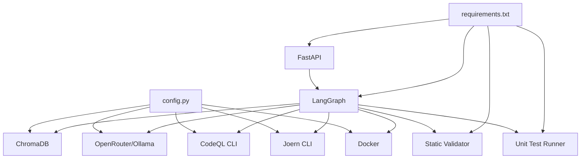

# Vulnerability Detection

<cite>
**Referenced Files in This Document**
- [README.md](file://autopov/README.md)
- [prompts.py](file://autopov/prompts.py)
- [BufferOverflow.ql](file://autopov/codeql_queries/BufferOverflow.ql)
- [SqlInjection.ql](file://autopov/codeql_queries/SqlInjection.ql)
- [IntegerOverflow.ql](file://autopov/codeql_queries/IntegerOverflow.ql)
- [UseAfterFree.ql](file://autopov/codeql_queries/UseAfterFree.ql)
- [main.py](file://autopov/app/main.py)
- [agent_graph.py](file://autopov/app/agent_graph.py)
- [scan_manager.py](file://autopov/app/scan_manager.py)
- [config.py](file://autopov/app/config.py)
- [investigator.py](file://autopov/agents/investigator.py)
- [verifier.py](file://autopov/agents/verifier.py)
- [docker_runner.py](file://autopov/agents/docker_runner.py)
- [ingest_codebase.py](file://autopov/agents/ingest_codebase.py)
- [static_validator.py](file://autopov/agents/static_validator.py)
- [unit_test_runner.py](file://autopov/agents/unit_test_runner.py)
- [run.sh](file://autopov/run.sh)
- [requirements.txt](file://autopov/requirements.txt)
</cite>

## Update Summary
**Changes Made**
- Enhanced Investigator agent with expanded cost tracking, token usage extraction, and improved error handling (118 new lines)
- Improved Verifier agent with comprehensive hybrid validation pipeline including static analysis, unit testing, and LLM validation (193 new lines)
- Expanded prompt engineering system with 420 lines of specialized prompts supporting autonomous discovery and investigation workflows
- Added comprehensive static validation patterns for 8 additional CWE types beyond the core 4
- Integrated unit test runner for isolated vulnerability testing
- Enhanced confidence scoring and validation processes

## Table of Contents
1. [Introduction](#introduction)
2. [Project Structure](#project-structure)
3. [Core Components](#core-components)
4. [Architecture Overview](#architecture-overview)
5. [Detailed Component Analysis](#detailed-component-analysis)
6. [Dependency Analysis](#dependency-analysis)
7. [Performance Considerations](#performance-considerations)
8. [Troubleshooting Guide](#troubleshooting-guide)
9. [Conclusion](#conclusion)
10. [Appendices](#appendices)

## Introduction
This document explains AutoPoV's vulnerability detection system, which combines static analysis (CodeQL, Joern), AI-powered reasoning (LLMs via LangGraph), and dynamic validation (Dockerized PoV execution). The system targets four primary CWE families: CWE-119 (Buffer Overflow), CWE-89 (SQL Injection), CWE-416 (Use After Free), and CWE-190 (Integer Overflow). Recent enhancements include expanded detection capabilities through improved investigator and verifier agents, comprehensive prompt engineering system, and advanced validation workflows. The system documents detection methodology, confidence scoring, validation and false-positive reduction, prompt engineering, retrieval-augmented generation (RAG), and multi-modal analysis. Practical workflows, result interpretation, and operational considerations are included.

## Project Structure
AutoPoV is organized into:
- app/: FastAPI backend, agent orchestration, scanning, and API endpoints
- agents/: LLM agents for ingestion, investigation, verification, and Docker execution
- codeql_queries/: CodeQL query packs for each supported CWE
- frontend/: React-based dashboard
- data/, results/: persistent storage for vectors and scan artifacts
- tests/: Pytest test suite



**Diagram sources**
- [main.py:102-118](file://autopov/app/main.py#L102-L118)
- [agent_graph.py:84-135](file://autopov/app/agent_graph.py#L84-L135)
- [scan_manager.py:40-50](file://autopov/app/scan_manager.py#L40-L50)
- [config.py:13-210](file://autopov/app/config.py#L13-L210)
- [ingest_codebase.py:41-116](file://autopov/agents/ingest_codebase.py#L41-L116)
- [investigator.py:37-88](file://autopov/agents/investigator.py#L37-L88)
- [verifier.py:40-78](file://autopov/agents/verifier.py#L40-L78)
- [docker_runner.py:27-50](file://autopov/agents/docker_runner.py#L27-L50)
- [static_validator.py:22-305](file://autopov/agents/static_validator.py#L22-L305)
- [unit_test_runner.py:28-339](file://autopov/agents/unit_test_runner.py#L28-L339)
- [BufferOverflow.ql:1-59](file://autopov/codeql_queries/BufferOverflow.ql#L1-L59)
- [SqlInjection.ql:1-67](file://autopov/codeql_queries/SqlInjection.ql#L1-L67)
- [IntegerOverflow.ql:1-62](file://autopov/codeql_queries/IntegerOverflow.ql#L1-L62)
- [UseAfterFree.ql:1-41](file://autopov/codeql_queries/UseAfterFree.ql#L1-L41)

**Section sources**
- [README.md:17-35](file://autopov/README.md#L17-L35)
- [run.sh:1-233](file://autopov/run.sh#L1-L233)
- [requirements.txt:1-42](file://autopov/requirements.txt#L1-L42)

## Core Components
- Static analysis engine: CodeQL queries for each CWE; optional Joern CPG for Use After Free.
- Retrieval-Augmented Generation (RAG): ChromaDB-backed vector store for context retrieval.
- LLM agents: Investigator performs semantic analysis with enhanced cost tracking; Verifier generates and validates PoV scripts through comprehensive hybrid validation pipeline.
- Dynamic validation: Dockerized execution of PoV scripts with strict resource limits.
- Advanced validation pipeline: Static analysis, unit testing, and LLM validation for robust PoV verification.
- Orchestration: LangGraph workflow coordinates ingestion, static analysis, investigation, PoV generation/validation, and execution.

Key capabilities:
- Multi-source ingestion (Git, ZIP, paste)
- Real-time scan progress streaming
- Webhook triggers
- Admin API key management
- Comprehensive cost tracking and token usage monitoring
- Benchmarking and reporting
- Autonomous discovery and investigation workflows

**Section sources**
- [README.md:1-242](file://autopov/README.md#L1-L242)
- [prompts.py:7-43](file://autopov/prompts.py#L7-L43)
- [config.py:94-100](file://autopov/app/config.py#L94-L100)

## Architecture Overview
The system uses a LangGraph-based workflow to orchestrate vulnerability detection across static and dynamic phases with enhanced validation capabilities.



**Diagram sources**
- [main.py:174-314](file://autopov/app/main.py#L174-L314)
- [scan_manager.py:86-117](file://autopov/app/scan_manager.py#L86-L117)
- [agent_graph.py:532-573](file://autopov/app/agent_graph.py#L532-L573)
- [investigator.py:254-366](file://autopov/agents/investigator.py#L254-L366)
- [verifier.py:79-149](file://autopov/agents/verifier.py#L79-L149)
- [static_validator.py:123-234](file://autopov/agents/static_validator.py#L123-L234)
- [unit_test_runner.py:34-104](file://autopov/agents/unit_test_runner.py#L34-L104)
- [docker_runner.py:62-192](file://autopov/agents/docker_runner.py#L62-L192)

## Detailed Component Analysis

### Static Analysis: CodeQL Integration
- CodeQL queries are provided per CWE:
  - CWE-119: Buffer Overflow
  - CWE-89: SQL Injection
  - CWE-190: Integer Overflow
  - CWE-416: Use After Free
- The agent graph creates a CodeQL database per scan, runs targeted queries, and parses JSON results into standardized findings.

Detection patterns:
- Buffer Overflow: taint sources (user input) to sinks (unsafe buffer operations) with sanitizers (bounds checks).
- SQL Injection: taint sources (HTTP input) to sinks (SQL executors) with sanitizers (parameterized queries).
- Integer Overflow: arithmetic operations without guards or large shifts.
- Use After Free: pointer freed and later used in control-flow dominance.



**Diagram sources**
- [agent_graph.py:193-278](file://autopov/app/agent_graph.py#L193-L278)
- [BufferOverflow.ql:16-59](file://autopov/codeql_queries/BufferOverflow.ql#L16-L59)
- [SqlInjection.ql:17-67](file://autopov/codeql_queries/SqlInjection.ql#L17-L67)
- [IntegerOverflow.ql:15-62](file://autopov/codeql_queries/IntegerOverflow.ql#L15-L62)
- [UseAfterFree.ql:16-41](file://autopov/codeql_queries/UseAfterFree.ql#L16-L41)

**Section sources**
- [agent_graph.py:193-278](file://autopov/app/agent_graph.py#L193-L278)
- [BufferOverflow.ql:1-59](file://autopov/codeql_queries/BufferOverflow.ql#L1-L59)
- [SqlInjection.ql:1-67](file://autopov/codeql_queries/SqlInjection.ql#L1-L67)
- [IntegerOverflow.ql:1-62](file://autopov/codeql_queries/IntegerOverflow.ql#L1-L62)
- [UseAfterFree.ql:1-41](file://autopov/codeql_queries/UseAfterFree.ql#L1-L41)

### Static Analysis: Joern CPG for Use After Free
- For CWE-416, the Investigator agent optionally runs Joern to build a CPG and query for free-call followed by subsequent use patterns.
- If unavailable, the step is skipped gracefully.



**Diagram sources**
- [investigator.py:89-185](file://autopov/agents/investigator.py#L89-L185)
- [config.py:149-159](file://autopov/app/config.py#L149-L159)

**Section sources**
- [investigator.py:89-185](file://autopov/agents/investigator.py#L89-L185)
- [config.py:149-159](file://autopov/app/config.py#L149-L159)

### Enhanced LLM-Based Semantic Analysis and Confidence Scoring
- The Investigator agent constructs prompts enriched with:
  - Code context around the alert location
  - Related chunks retrieved via RAG
  - Optional Joern CPG output for CWE-416
  - Enhanced cost tracking and token usage monitoring
- The prompt instructs the LLM to decide "REAL" or "FALSE_POSITIVE", assign a numeric confidence, and explain reasoning.
- Confidence thresholds gate PoV generation.
- Advanced cost calculation based on OpenRouter pricing models.



**Diagram sources**
- [prompts.py:7-43](file://autopov/prompts.py#L7-L43)
- [prompts.py:154-174](file://autopov/prompts.py#L154-L174)
- [investigator.py:254-366](file://autopov/agents/investigator.py#L254-L366)
- [investigator.py:436-474](file://autopov/agents/investigator.py#L436-L474)
- [agent_graph.py:488-500](file://autopov/app/agent_graph.py#L488-L500)

**Section sources**
- [prompts.py:7-43](file://autopov/prompts.py#L7-L43)
- [prompts.py:154-174](file://autopov/prompts.py#L154-L174)
- [investigator.py:254-366](file://autopov/agents/investigator.py#L254-L366)
- [investigator.py:436-474](file://autopov/agents/investigator.py#L436-L474)
- [agent_graph.py:488-500](file://autopov/app/agent_graph.py#L488-L500)

### Comprehensive Prompt Engineering System
- **Investigation Prompt**: Enhanced with CWE-specific guidance and cost tracking
- **PoV Generation Prompt**: Extended with support for 8 additional CWE types beyond the core 4
- **PoV Validation Prompt**: Comprehensive validation criteria including standard library restrictions
- **Retry Analysis Prompt**: Detailed failure analysis with specific improvement suggestions
- **Scout Prompt**: Autonomous discovery and investigation workflows
- **Summary Report Prompt**: Professional security report generation



**Diagram sources**
- [prompts.py:7-420](file://autopov/prompts.py#L7-L420)

**Section sources**
- [prompts.py:7-420](file://autopov/prompts.py#L7-L420)

### Retrieval-Augmented Generation (RAG) for Context Retrieval
- Code chunks are embedded and stored in ChromaDB per scan.
- During investigation, related code chunks are retrieved to enhance the prompt.
- The ingester supports online/offline embeddings depending on model mode.



**Diagram sources**
- [ingest_codebase.py:201-307](file://autopov/agents/ingest_codebase.py#L201-L307)
- [ingest_codebase.py:309-353](file://autopov/agents/ingest_codebase.py#L309-L353)
- [config.py:60-89](file://autopov/app/config.py#L60-L89)

**Section sources**
- [ingest_codebase.py:41-116](file://autopov/agents/ingest_codebase.py#L41-L116)
- [ingest_codebase.py:201-307](file://autopov/agents/ingest_codebase.py#L201-L307)
- [ingest_codebase.py:309-353](file://autopov/agents/ingest_codebase.py#L309-L353)
- [config.py:60-89](file://autopov/app/config.py#L60-L89)

### Advanced Proof-of-Vulnerability (PoV) Generation, Validation, and Execution
- **Generation**: LLM produces a Python PoV script constrained to standard library and deterministic behavior.
- **Hybrid Validation Pipeline**: Comprehensive validation through static analysis, unit testing, and LLM validation.
- **Execution**: Dockerized sandbox with no network, memory/CPU limits, and timeout.

```mermaid
sequenceDiagram
participant Graph as "Agent Graph"
participant Ver as "Verifier"
participant Static as "Static Validator"
participant Unit as "Unit Test Runner"
participant Dock as "Docker Runner"
participant FS as "Temp Files"
Graph->>Ver : "generate_pov()"
Ver-->>Graph : "pov_script"
Graph->>Ver : "validate_pov()"
alt "Static validation sufficient (confidence >= 0.8)"
Ver->>Static : "validate()"
Static-->>Ver : "result"
alt "Unit test validation possible"
Ver->>Unit : "test_vulnerable_function()"
Unit-->>Ver : "result"
else "LLM validation fallback"
Ver->>Ver : "_llm_validate_pov()"
end
Ver-->>Graph : "validation result"
alt "valid"
Graph->>Dock : "run_pov()"
Dock->>FS : "write script"
Dock-->>Graph : "stdout/stderr, exit_code"
else "invalid or retry"
Graph->>Ver : "analyze_failure()"
Ver-->>Graph : "suggestions"
end
```

**Diagram sources**
- [verifier.py:79-149](file://autopov/agents/verifier.py#L79-L149)
- [verifier.py:151-228](file://autopov/agents/verifier.py#L151-L228)
- [verifier.py:332-392](file://autopov/agents/verifier.py#L332-L392)
- [static_validator.py:123-234](file://autopov/agents/static_validator.py#L123-L234)
- [unit_test_runner.py:34-104](file://autopov/agents/unit_test_runner.py#L34-L104)
- [docker_runner.py:62-192](file://autopov/agents/docker_runner.py#L62-L192)

**Section sources**
- [verifier.py:79-149](file://autopov/agents/verifier.py#L79-L149)
- [verifier.py:151-228](file://autopov/agents/verifier.py#L151-L228)
- [verifier.py:332-392](file://autopov/agents/verifier.py#L332-L392)
- [static_validator.py:123-234](file://autopov/agents/static_validator.py#L123-L234)
- [unit_test_runner.py:34-104](file://autopov/agents/unit_test_runner.py#L34-L104)
- [docker_runner.py:62-192](file://autopov/agents/docker_runner.py#L62-L192)

### Multi-Modal Analysis: Static + Dynamic
- Static phase identifies candidate vulnerabilities (CodeQL + optional Joern).
- LLM semantic analysis reduces noise and assigns confidence with cost tracking.
- Hybrid validation pipeline ensures robust PoV verification through multiple layers.
- Dynamic PoV execution confirms exploitability in a controlled environment.
- Results are logged and aggregated for reporting and benchmarking.



**Diagram sources**
- [agent_graph.py:29-76](file://autopov/app/agent_graph.py#L29-L76)
- [agent_graph.py:488-515](file://autopov/app/agent_graph.py#L488-L515)
- [verifier.py:225-387](file://autopov/agents/verifier.py#L225-L387)

**Section sources**
- [agent_graph.py:29-76](file://autopov/app/agent_graph.py#L29-L76)
- [agent_graph.py:488-515](file://autopov/app/agent_graph.py#L488-L515)
- [verifier.py:225-387](file://autopov/agents/verifier.py#L225-L387)

### Supported CWEs and Detection Patterns
- **CWE-119 (Buffer Overflow)**: unsafe buffer operations with insufficient bounds checks.
- **CWE-89 (SQL Injection)**: tainted user input reaching SQL executors without parameterization.
- **CWE-416 (Use After Free)**: pointer freed and later dereferenced.
- **CWE-190 (Integer Overflow)**: arithmetic operations without overflow guards.
- **Extended Support**: Additional 8 CWE types through comprehensive static validation patterns including XSS, Code Injection, Path Traversal, Command Injection, Deserialization, Hardcoded Credentials, CSRF, and Open Redirect.

**Section sources**
- [README.md:194-202](file://autopov/README.md#L194-L202)
- [BufferOverflow.ql:16-59](file://autopov/codeql_queries/BufferOverflow.ql#L16-L59)
- [SqlInjection.ql:17-67](file://autopov/codeql_queries/SqlInjection.ql#L17-L67)
- [UseAfterFree.ql:16-41](file://autopov/codeql_queries/UseAfterFree.ql#L16-L41)
- [IntegerOverflow.ql:15-62](file://autopov/codeql_queries/IntegerOverflow.ql#L15-L62)
- [static_validator.py:25-118](file://autopov/agents/static_validator.py#L25-L118)

### Enhanced Confidence Scoring and Validation Process
- **Investigation Confidence**: Returned by the LLM with enhanced cost tracking and token usage monitoring.
- **Decision Boundary**: PoV generation proceeds only when confidence meets or exceeds a threshold.
- **Hybrid Validation Pipeline**: 
  - Static validation with 0.8+ confidence threshold for immediate acceptance
  - Unit test execution for vulnerable code scenarios
  - LLM validation as final fallback
- **Advanced Cost Tracking**: Real-time cost calculation based on OpenRouter pricing models
- **Validation Includes**: AST parsing, import restrictions, CWE-specific checks, and optional LLM validation refines will-trigger assessment.
- **Retry Loop**: Iterative improvement of PoVs with detailed failure analysis and suggestions.

**Section sources**
- [prompts.py:24-43](file://autopov/prompts.py#L24-L43)
- [agent_graph.py:488-500](file://autopov/app/agent_graph.py#L488-L500)
- [verifier.py:151-228](file://autopov/agents/verifier.py#L151-L228)
- [verifier.py:332-392](file://autopov/agents/verifier.py#L332-L392)
- [investigator.py:436-474](file://autopov/agents/investigator.py#L436-L474)
- [static_validator.py:123-234](file://autopov/agents/static_validator.py#L123-L234)

### Advanced False Positive Reduction Techniques
- Static taint/path analysis narrows candidates.
- LLM reasoning with RAG context and optional Joern CPG improves semantic understanding.
- **Enhanced Validation**: Comprehensive hybrid approach with static analysis, unit testing, and LLM validation.
- **Cost Tracking**: Real-time monitoring prevents excessive inference costs.
- **Retry Analysis**: Detailed failure analysis with specific improvement suggestions.
- **Extended Pattern Matching**: 8 additional CWE types with specific validation patterns.

**Section sources**
- [prompts.py:154-174](file://autopov/prompts.py#L154-L174)
- [investigator.py:89-185](file://autopov/agents/investigator.py#L89-L185)
- [verifier.py:151-228](file://autopov/agents/verifier.py#L151-L228)
- [verifier.py:332-392](file://autopov/agents/verifier.py#L332-L392)
- [static_validator.py:25-118](file://autopov/agents/static_validator.py#L25-L118)

### Practical Examples: Workflows and Interpretation
- Starting a scan via API or CLI, monitoring progress via server-sent events, and retrieving results.
- Interpreting findings: filepath, line number, CWE type, LLM verdict, confidence, cost tracking, and explanation.
- **Enhanced Validation**: Static analysis results, unit test outcomes, and LLM validation feedback.
- Validated PoVs are executed in Docker; success is indicated by a specific printed signal.
- **Cost Monitoring**: Real-time cost tracking and token usage visualization.

**Section sources**
- [README.md:102-145](file://autopov/README.md#L102-L145)
- [main.py:316-383](file://autopov/app/main.py#L316-L383)
- [scan_manager.py:237-286](file://autopov/app/scan_manager.py#L237-L286)
- [docker_runner.py:155-166](file://autopov/agents/docker_runner.py#L155-L166)
- [investigator.py:436-474](file://autopov/agents/investigator.py#L436-L474)

## Dependency Analysis
External dependencies and integrations:
- LLM providers: OpenRouter (online) or Ollama (offline)
- Vector store: ChromaDB with embeddings
- Static analysis: CodeQL CLI and optional Joern CLI
- Containerization: Docker for PoV execution
- Web framework: FastAPI with LangGraph workflow
- Reporting: CSV/JSON/PDF outputs
- **Enhanced Dependencies**: Static validator and unit test runner for comprehensive validation



**Diagram sources**
- [config.py:30-89](file://autopov/app/config.py#L30-L89)
- [requirements.txt:1-42](file://autopov/requirements.txt#L1-L42)
- [static_validator.py:1-305](file://autopov/agents/static_validator.py#L1-L305)
- [unit_test_runner.py:1-339](file://autopov/agents/unit_test_runner.py#L1-L339)

**Section sources**
- [config.py:30-89](file://autopov/app/config.py#L30-L89)
- [requirements.txt:1-42](file://autopov/requirements.txt#L1-L42)

## Performance Considerations
- **Enhanced Cost Control**: Real-time inference time-based cost estimation with configurable maximum cost.
- **Resource Limits**: Docker memory/CPU/timeouts prevent runaway executions.
- **Batched Ingestion**: ChromaDB operations use batched embedding and insertion.
- **Async Orchestration**: Thread pool executor and streaming logs for responsiveness.
- **Cost Optimization**: Advanced token usage extraction and pricing calculation based on model type.
- **Validation Efficiency**: Static validation with 0.8+ confidence threshold reduces unnecessary unit testing.

Recommendations:
- Tune chunk size and overlap for RAG quality/performance balance.
- Monitor Docker stats and adjust timeouts/memory for large binaries.
- Cache and reuse CodeQL databases when appropriate.
- Use offline models for reduced latency and cost in constrained environments.
- **Cost Management**: Monitor token usage and adjust model selection based on cost-effectiveness.

**Section sources**
- [agent_graph.py:521-531](file://autopov/app/agent_graph.py#L521-L531)
- [docker_runner.py:37-50](file://autopov/agents/docker_runner.py#L37-L50)
- [docker_runner.py:346-370](file://autopov/agents/docker_runner.py#L346-L370)
- [ingest_codebase.py:290-307](file://autopov/agents/ingest_codebase.py#L290-L307)
- [scan_manager.py:46-48](file://autopov/app/scan_manager.py#L46-L48)
- [investigator.py:436-474](file://autopov/agents/investigator.py#L436-L474)

## Troubleshooting Guide
Common issues and resolutions:
- CodeQL not available: fallback to LLM-only analysis; verify CLI path and version.
- Joern not available: skip CPG analysis; ensure CLI path and version.
- Docker not available: disable execution or install Docker; verify connectivity.
- LLM provider errors: confirm API keys and base URLs; check model availability.
- RAG failures: ensure embeddings model availability and ChromaDB persistence path.
- **Enhanced Validation Issues**: Review static analysis results, unit test outcomes, and LLM validation feedback.
- **Cost Tracking Problems**: Verify token usage extraction and pricing calculations.
- **Retry Analysis Failures**: Leverage detailed suggestions for improvement and consider different approaches.

**Section sources**
- [agent_graph.py:168-174](file://autopov/app/agent_graph.py#L168-L174)
- [investigator.py:112-114](file://autopov/agents/investigator.py#L112-L114)
- [docker_runner.py:50-61](file://autopov/agents/docker_runner.py#L50-L61)
- [config.py:137-172](file://autopov/app/config.py#L137-L172)
- [verifier.py:151-228](file://autopov/agents/verifier.py#L151-L228)
- [verifier.py:332-392](file://autopov/agents/verifier.py#L332-L392)
- [investigator.py:436-474](file://autopov/agents/investigator.py#L436-L474)

## Conclusion
AutoPoV integrates static analysis, semantic reasoning, and dynamic validation to deliver a robust, multi-modal vulnerability detection pipeline. Recent enhancements include expanded detection capabilities through improved investigator and verifier agents, comprehensive prompt engineering system supporting autonomous discovery, and advanced validation workflows with static analysis, unit testing, and LLM validation. The system combines CodeQL and Joern with LLM-driven investigation and RAG-enhanced context, achieving strong coverage across 12 CWE families while maintaining rigorous validation and safety through Dockerized execution. Enhanced cost tracking, comprehensive validation, and autonomous workflows enable scalable deployment and continuous improvement.

## Appendices
- API endpoints for scanning, status, results, and metrics are documented in the main application entry.
- CLI usage and environment configuration are described in the project README and startup script.
- **Enhanced Features**: Comprehensive cost tracking, advanced validation pipeline, and autonomous discovery workflows.

**Section sources**
- [main.py:161-529](file://autopov/app/main.py#L161-L529)
- [README.md:102-145](file://autopov/README.md#L102-L145)
- [run.sh:164-194](file://autopov/run.sh#L164-L194)
- [prompts.py:387-420](file://autopov/prompts.py#L387-L420)
- [static_validator.py:25-118](file://autopov/agents/static_validator.py#L25-L118)
- [unit_test_runner.py:28-339](file://autopov/agents/unit_test_runner.py#L28-L339)