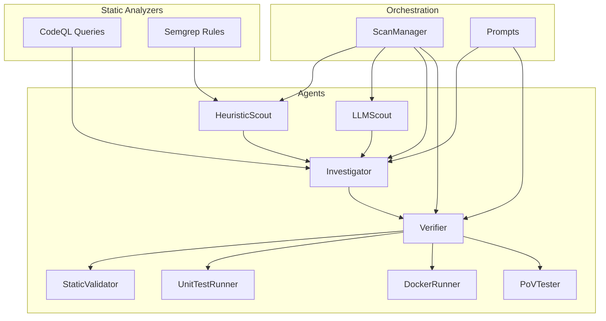
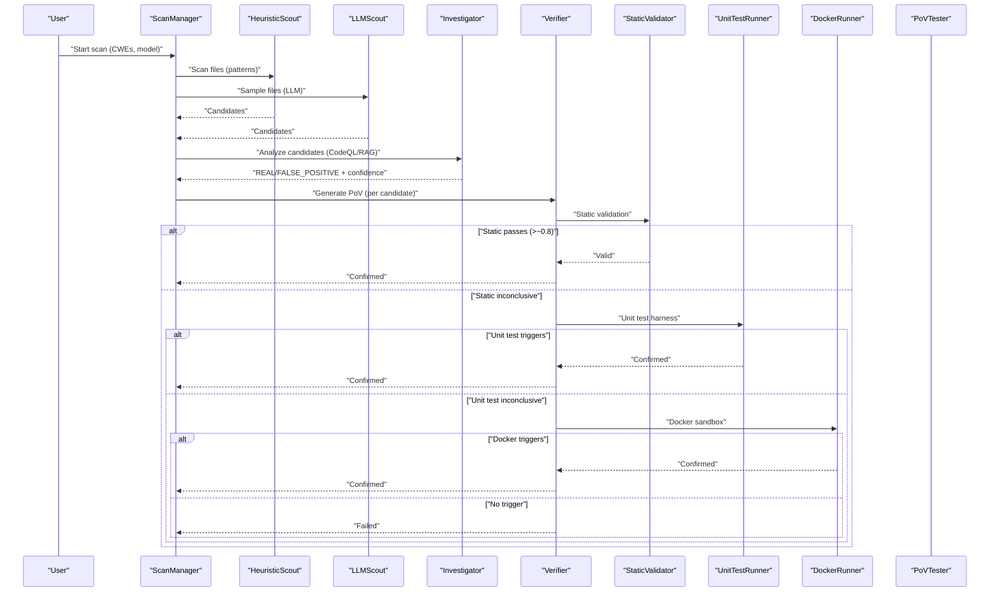
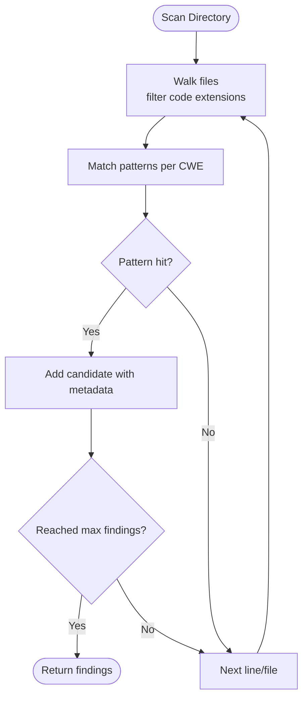
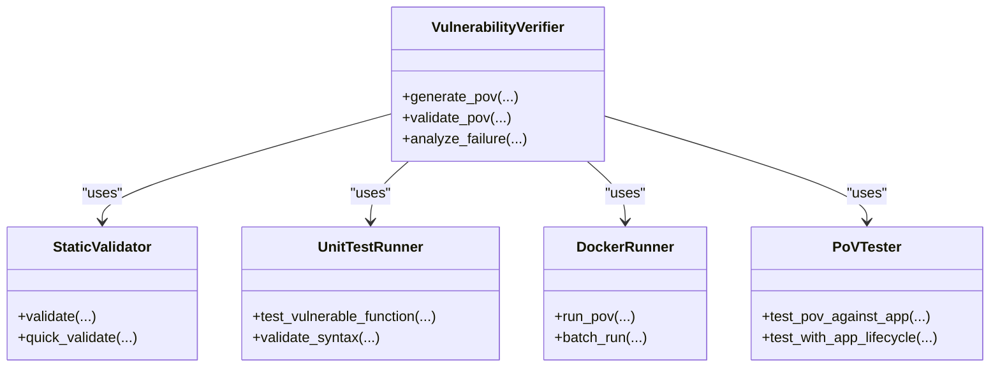
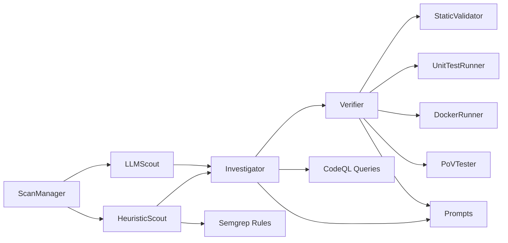

# Vulnerability Detection

<cite>
**Referenced Files in This Document**
- [README.md](file://README.md)
- [prompts.py](file://prompts.py)
- [agents/heuristic_scout.py](file://agents/heuristic_scout.py)
- [agents/llm_scout.py](file://agents/llm_scout.py)
- [agents/static_validator.py](file://agents/static_validator.py)
- [agents/unit_test_runner.py](file://agents/unit_test_runner.py)
- [agents/docker_runner.py](file://agents/docker_runner.py)
- [agents/pov_tester.py](file://agents/pov_tester.py)
- [agents/verifier.py](file://agents/verifier.py)
- [app/scan_manager.py](file://app/scan_manager.py)
- [codeql_queries/SqlInjection.ql](file://codeql_queries/SqlInjection.ql)
- [codeql_queries/BufferOverflow.ql](file://codeql_queries/BufferOverflow.ql)
- [codeql_queries/IntegerOverflow.ql](file://codeql_queries/IntegerOverflow.ql)
- [codeql_queries/UseAfterFree.ql](file://codeql_queries/UseAfterFree.ql)
- [semgrep-rules/owasp-min.yml](file://semgrep-rules/owasp-min.yml)
</cite>

## Table of Contents
1. [Introduction](#introduction)
2. [Project Structure](#project-structure)
3. [Core Components](#core-components)
4. [Architecture Overview](#architecture-overview)
5. [Detailed Component Analysis](#detailed-component-analysis)
6. [Dependency Analysis](#dependency-analysis)
7. [Performance Considerations](#performance-considerations)
8. [Troubleshooting Guide](#troubleshooting-guide)
9. [Conclusion](#conclusion)

## Introduction
AutoPoV is an autonomous, agentic vulnerability research platform that performs end-to-end security analysis: code ingestion, static analysis, LLM-powered investigation, exploit generation, and execution validation. It supports detection across 20+ CWE categories by combining:
- Static analysis (CodeQL queries)
- Lightweight pattern matching (Semgrep rules)
- LLM-powered reasoning (heuristic and LLM scouts, investigator agent)
- Hybrid validation pipeline (static → unit test → Docker sandbox)
- Confidence scoring and adaptive routing

Supported categories include injection vulnerabilities (SQLi, XSS, Code Injection, Command Injection), access control issues (Path Traversal, CSRF, Broken Authentication), memory safety problems (Buffer Overflow, Use After Free, Integer Overflow), sensitive data exposure, cryptography weaknesses, and more design-related flaws.

## Project Structure
The repository organizes detection capabilities across agents, static analyzers, and orchestration layers:
- agents/: autonomous agents implementing each stage of the workflow
- codeql_queries/: CodeQL query packs for core memory and injection issues
- semgrep-rules/: OWASP-focused Semgrep rulesets
- app/: orchestration, scanning lifecycle, and configuration
- prompts.py: centralized LLM prompts for investigation, PoV generation, validation, and retry analysis

**Diagram sources**
- [agents/heuristic_scout.py:13-242](file://agents/heuristic_scout.py#L13-L242)
- [agents/llm_scout.py:32-208](file://agents/llm_scout.py#L32-L208)
- [agents/verifier.py:42-562](file://agents/verifier.py#L42-L562)
- [agents/static_validator.py:22-305](file://agents/static_validator.py#L22-L305)
- [agents/unit_test_runner.py:28-344](file://agents/unit_test_runner.py#L28-L344)
- [agents/docker_runner.py:27-377](file://agents/docker_runner.py#L27-L377)
- [agents/pov_tester.py:21-296](file://agents/pov_tester.py#L21-L296)
- [app/scan_manager.py:47-663](file://app/scan_manager.py#L47-L663)
- [prompts.py:7-424](file://prompts.py#L7-L424)
- [codeql_queries/SqlInjection.ql:1-67](file://codeql_queries/SqlInjection.ql#L1-L67)
- [codeql_queries/BufferOverflow.ql:1-59](file://codeql_queries/BufferOverflow.ql#L1-L59)
- [codeql_queries/IntegerOverflow.ql:1-62](file://codeql_queries/IntegerOverflow.ql#L1-L62)
- [codeql_queries/UseAfterFree.ql:1-41](file://codeql_queries/UseAfterFree.ql#L1-L41)
- [semgrep-rules/owasp-min.yml:1-53](file://semgrep-rules/owasp-min.yml#L1-L53)

**Section sources**
- [README.md:89-124](file://README.md#L89-L124)
- [app/scan_manager.py:47-663](file://app/scan_manager.py#L47-L663)

## Core Components
- Heuristic Scout: Lightweight pattern matching across files to surface candidate vulnerabilities per CWE.
- LLM Scout: LLM-driven candidate discovery across sampled files with confidence and reasoning.
- Investigator Agent: Deep analysis using prompts, optionally enhanced with CodeQL alerts and RAG context.
- Verifier Agent: Generates PoV scripts and validates them via static analysis, unit tests, and fallback LLM analysis.
- Static Validator: Pattern-based validation of PoV scripts with confidence calculation.
- Unit Test Runner: Executes PoVs against isolated vulnerable code snippets in a controlled environment.
- Docker Runner: Executes PoVs in sandboxed containers with strict resource limits and no network.
- PoV Tester: Tests PoVs against running applications and supports lifecycle management.
- CodeQL Queries: Custom .ql packs for SQL Injection, Buffer Overflow, Integer Overflow, and Use After Free.
- Semgrep Rules: OWASP-focused rulesets for PHP and other languages.
- Prompts: Centralized templates for investigation, PoV generation, validation, and retry analysis.

**Section sources**
- [agents/heuristic_scout.py:13-242](file://agents/heuristic_scout.py#L13-L242)
- [agents/llm_scout.py:32-208](file://agents/llm_scout.py#L32-L208)
- [agents/verifier.py:42-562](file://agents/verifier.py#L42-L562)
- [agents/static_validator.py:22-305](file://agents/static_validator.py#L22-L305)
- [agents/unit_test_runner.py:28-344](file://agents/unit_test_runner.py#L28-L344)
- [agents/docker_runner.py:27-377](file://agents/docker_runner.py#L27-L377)
- [agents/pov_tester.py:21-296](file://agents/pov_tester.py#L21-L296)
- [codeql_queries/SqlInjection.ql:1-67](file://codeql_queries/SqlInjection.ql#L1-L67)
- [codeql_queries/BufferOverflow.ql:1-59](file://codeql_queries/BufferOverflow.ql#L1-L59)
- [codeql_queries/IntegerOverflow.ql:1-62](file://codeql_queries/IntegerOverflow.ql#L1-L62)
- [codeql_queries/UseAfterFree.ql:1-41](file://codeql_queries/UseAfterFree.ql#L1-L41)
- [semgrep-rules/owasp-min.yml:1-53](file://semgrep-rules/owasp-min.yml#L1-L53)
- [prompts.py:7-424](file://prompts.py#L7-L424)

## Architecture Overview
AutoPoV’s agent graph orchestrates a hybrid detection pipeline:
- Ingestion → Heuristic/LLM Scout → CodeQL/Semgrep → Merge/Deduplicate → Investigator → PoV Generator → Validation (static → unit test → Docker) → Policy/Learning Store

**Diagram sources**
- [app/scan_manager.py:117-366](file://app/scan_manager.py#L117-L366)
- [agents/heuristic_scout.py:188-234](file://agents/heuristic_scout.py#L188-L234)
- [agents/llm_scout.py:88-200](file://agents/llm_scout.py#L88-L200)
- [agents/verifier.py:225-387](file://agents/verifier.py#L225-L387)
- [agents/static_validator.py:123-233](file://agents/static_validator.py#L123-L233)
- [agents/unit_test_runner.py:34-116](file://agents/unit_test_runner.py#L34-L116)
- [agents/docker_runner.py:62-191](file://agents/docker_runner.py#L62-L191)
- [agents/pov_tester.py:24-106](file://agents/pov_tester.py#L24-L106)

**Section sources**
- [README.md:34-69](file://README.md#L34-L69)
- [app/scan_manager.py:117-366](file://app/scan_manager.py#L117-L366)

## Detailed Component Analysis

### Static Analysis: CodeQL and Semgrep
- CodeQL:
  - SQL Injection: taint-tracking configuration identifying user input sources and SQL execution sinks.
  - Buffer Overflow: taint-tracking configuration for unsafe C/C++ operations and missing bounds checks.
  - Integer Overflow: arithmetic range analysis for unsafe operations and index calculations.
  - Use After Free: control-flow analysis for freed-pointer usage.
- Semgrep:
  - OWASP-min rules for PHP: SQLi, XSS, command injection, and path traversal patterns.

These analyzers feed structured alerts into the Investigator Agent and Heuristic Scout to guide candidate prioritization.

**Section sources**
- [codeql_queries/SqlInjection.ql:17-66](file://codeql_queries/SqlInjection.ql#L17-L66)
- [codeql_queries/BufferOverflow.ql:16-58](file://codeql_queries/BufferOverflow.ql#L16-L58)
- [codeql_queries/IntegerOverflow.ql:18-61](file://codeql_queries/IntegerOverflow.ql#L18-L61)
- [codeql_queries/UseAfterFree.ql:19-40](file://codeql_queries/UseAfterFree.ql#L19-L40)
- [semgrep-rules/owasp-min.yml:1-53](file://semgrep-rules/owasp-min.yml#L1-L53)

### Heuristic Scout
- Scans codebase using language-aware regex patterns mapped to CWE categories.
- Produces candidate findings with filepath, line number, code snippet, and confidence.
- Integrates with ScanManager to merge with LLM Scout results.

**Diagram sources**
- [agents/heuristic_scout.py:188-234](file://agents/heuristic_scout.py#L188-L234)

**Section sources**
- [agents/heuristic_scout.py:13-242](file://agents/heuristic_scout.py#L13-L242)

### LLM Scout
- Samples files and asks an LLM to propose candidates with CWE, location, snippet, reasoning, and confidence.
- Enforces cost caps and limits to control inference spend.
- Outputs findings compatible with the agent graph.

**Section sources**
- [agents/llm_scout.py:32-208](file://agents/llm_scout.py#L32-L208)

### Investigator Agent and Prompts
- Uses centralized prompts to analyze code context, CodeQL alerts, and optional Joern context.
- Responds with verdict (REAL/FALSE_POSITIVE), confidence, explanation, vulnerable code, root cause, and impact.
- Provides structured JSON for downstream automation.

**Section sources**
- [prompts.py:7-43](file://prompts.py#L7-L43)
- [prompts.py:257-273](file://prompts.py#L257-L273)

### PoV Generation and Validation
- Verifier generates PoV scripts using a dedicated prompt template, constrained to standard libraries and deterministic behavior.
- Validation pipeline:
  1) StaticValidator: pattern-based checks, required imports, attack indicators, relevance to vulnerable code, and confidence calculation.
  2) UnitTestRunner: executes PoVs against isolated vulnerable code in a restricted subprocess.
  3) Fallback LLM validation: parses structured JSON to assess validity and likelihood of triggering.
- PoVTester can run PoVs against running applications and supports lifecycle management.
- DockerRunner executes PoVs in sandboxed containers with strict resource limits and no network.

**Diagram sources**
- [agents/verifier.py:42-562](file://agents/verifier.py#L42-L562)
- [agents/static_validator.py:22-305](file://agents/static_validator.py#L22-L305)
- [agents/unit_test_runner.py:28-344](file://agents/unit_test_runner.py#L28-L344)
- [agents/docker_runner.py:27-377](file://agents/docker_runner.py#L27-L377)
- [agents/pov_tester.py:21-296](file://agents/pov_tester.py#L21-L296)

**Section sources**
- [agents/verifier.py:90-387](file://agents/verifier.py#L90-L387)
- [agents/static_validator.py:123-284](file://agents/static_validator.py#L123-L284)
- [agents/unit_test_runner.py:34-116](file://agents/unit_test_runner.py#L34-L116)
- [agents/docker_runner.py:62-191](file://agents/docker_runner.py#L62-L191)
- [agents/pov_tester.py:24-106](file://agents/pov_tester.py#L24-L106)

### Confidence Scoring and Validation Thresholds
- StaticValidator computes a confidence score based on matched patterns, presence of “VULNERABILITY TRIGGERED” indicator, code relevance, and issue count.
- Verifier enforces thresholds: static pass with confidence ≥ 0.8 leads to immediate confirmation; otherwise, unit test and/or Docker execution are attempted.
- CWE-specific checks further refine validation (e.g., SQL keywords for CWE-89, large values for CWE-190).

**Section sources**
- [agents/static_validator.py:261-284](file://agents/static_validator.py#L261-L284)
- [agents/verifier.py:279-387](file://agents/verifier.py#L279-L387)

### Custom CWE Query Development and Rule Customization
- CodeQL:
  - Extend existing configurations by adding new sources/sinks or sanitizers in the .ql files.
  - Example: add new sinks for a specific ORM or framework.
- Semgrep:
  - Add new rules under rules: with language, pattern-either, and metadata.cwe entries.
  - Example: detect new injection vectors or hardcoded secrets in additional languages.
- Heuristic Scout:
  - Add new regex patterns per CWE in the patterns dictionary.
  - Example: expand Path Traversal patterns to include new include functions.

Integration points:
- CodeQL queries are consumed by the Investigator Agent and integrated into the agent graph.
- Semgrep rules are applied by the Heuristic Scout to produce candidates.
- CWE-specific patterns in StaticValidator can be extended to improve PoV validation.

**Section sources**
- [codeql_queries/SqlInjection.ql:17-66](file://codeql_queries/SqlInjection.ql#L17-L66)
- [codeql_queries/BufferOverflow.ql:16-58](file://codeql_queries/BufferOverflow.ql#L16-L58)
- [codeql_queries/IntegerOverflow.ql:18-61](file://codeql_queries/IntegerOverflow.ql#L18-L61)
- [codeql_queries/UseAfterFree.ql:19-40](file://codeql_queries/UseAfterFree.ql#L19-L40)
- [semgrep-rules/owasp-min.yml:1-53](file://semgrep-rules/owasp-min.yml#L1-L53)
- [agents/heuristic_scout.py:18-157](file://agents/heuristic_scout.py#L18-L157)
- [agents/static_validator.py:26-118](file://agents/static_validator.py#L26-L118)

### Supported CWE Categories
AutoPoV covers 20+ CWE categories by default, including:
- Injection: CWE-89 (SQL), CWE-79 (XSS), CWE-94 (Code), CWE-78 (Command)
- Access Control: CWE-22 (Path Traversal), CWE-352 (CSRF), CWE-306 (Missing Auth), CWE-287 (Broken Auth)
- Memory Safety: CWE-119 (Buffer Overflow), CWE-416 (Use After Free), CWE-190 (Integer Overflow)
- Sensitive Data: CWE-312 (Cleartext Storage), CWE-798 (Hardcoded Credentials), CWE-200 (Info Disclosure)
- Cryptography: CWE-327 (Broken Crypto)
- Design: CWE-502 (Deserialization), CWE-918 (SSRF), CWE-434 (Unrestricted Upload), CWE-611 (XXE), CWE-400 (DoS), CWE-384 (Session Fixation), CWE-601 (Open Redirect)

Detection methodology:
- Static analysis (CodeQL) for memory and injection issues
- Lightweight pattern matching (Semgrep) for broader categories
- LLM scouts for contextual discovery
- Hybrid validation pipeline for confirmation

**Section sources**
- [README.md:330-342](file://README.md#L330-L342)

## Dependency Analysis
Key dependencies and coupling:
- ScanManager orchestrates agents and persists results.
- HeuristicScout and LLMScout feed candidates into the Investigator Agent.
- Investigator integrates CodeQL/Semgrep alerts and RAG context.
- Verifier depends on StaticValidator, UnitTestRunner, DockerRunner, and PoVTester.
- Prompts module centralizes templates used across agents.

**Diagram sources**
- [app/scan_manager.py:117-366](file://app/scan_manager.py#L117-L366)
- [agents/heuristic_scout.py:188-234](file://agents/heuristic_scout.py#L188-L234)
- [agents/llm_scout.py:88-200](file://agents/llm_scout.py#L88-L200)
- [agents/verifier.py:225-387](file://agents/verifier.py#L225-L387)
- [agents/static_validator.py:123-233](file://agents/static_validator.py#L123-L233)
- [agents/unit_test_runner.py:34-116](file://agents/unit_test_runner.py#L34-L116)
- [agents/docker_runner.py:62-191](file://agents/docker_runner.py#L62-L191)
- [agents/pov_tester.py:24-106](file://agents/pov_tester.py#L24-L106)
- [codeql_queries/SqlInjection.ql:17-66](file://codeql_queries/SqlInjection.ql#L17-L66)
- [semgrep-rules/owasp-min.yml:1-53](file://semgrep-rules/owasp-min.yml#L1-L53)
- [prompts.py:257-358](file://prompts.py#L257-L358)

**Section sources**
- [app/scan_manager.py:47-663](file://app/scan_manager.py#L47-L663)

## Performance Considerations
- Cost control:
  - LLM Scout has configurable caps for max files, chars, and cost to limit inference spend.
  - Static validation is fast and scales well; unit test and Docker execution are reserved for inconclusive cases.
- Resource isolation:
  - Unit tests run in restricted subprocesses with timeouts.
  - DockerRunner enforces memory, CPU, and network limitations.
- Scalability:
  - ThreadPoolExecutor in ScanManager handles background scan execution.
  - Pattern matching is linear in file size and number of patterns.

[No sources needed since this section provides general guidance]

## Troubleshooting Guide
Common issues and resolutions:
- Missing Docker:
  - DockerRunner returns failure with “Docker not available.” Ensure Docker is installed and accessible.
- Timeout during unit test or Docker execution:
  - Increase timeouts or simplify PoV logic; verify deterministic behavior.
- Static validation failures:
  - Ensure PoV prints “VULNERABILITY TRIGGERED,” uses only standard library, and addresses the vulnerable code.
- LLM cost exceeded:
  - Reduce SCOUT_MAX_FILES or SCOUT_MAX_COST_USD to constrain inference budget.
- Pattern mismatch:
  - Extend HeuristicScout patterns or add Semgrep rules for new attack vectors.

**Section sources**
- [agents/docker_runner.py:81-90](file://agents/docker_runner.py#L81-L90)
- [agents/static_validator.py:157-164](file://agents/static_validator.py#L157-L164)
- [agents/llm_scout.py:165-166](file://agents/llm_scout.py#L165-L166)

## Conclusion
AutoPoV delivers a robust, hybrid vulnerability detection system that combines static analysis, pattern matching, and LLM reasoning with a rigorous validation pipeline. Its modular agent architecture enables scalable, autonomous security analysis across 20+ CWE categories, while adaptive routing and learning store support continuous improvement. The documented extension points for CodeQL, Semgrep, and heuristic patterns allow teams to tailor detection to their codebases and threat models.