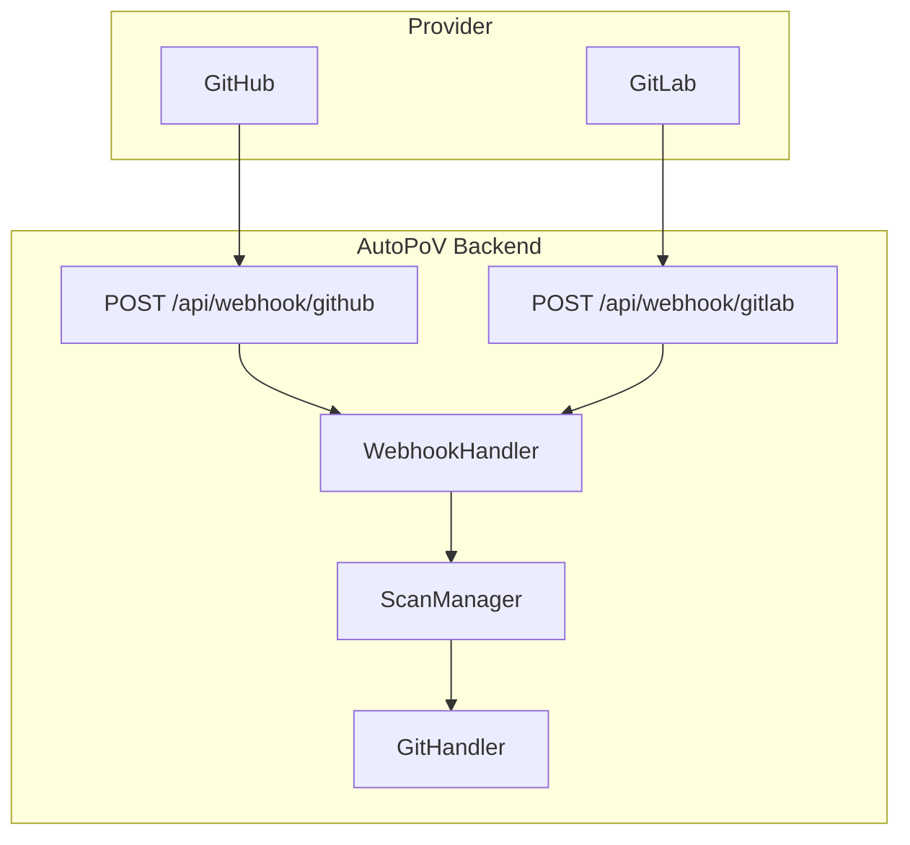
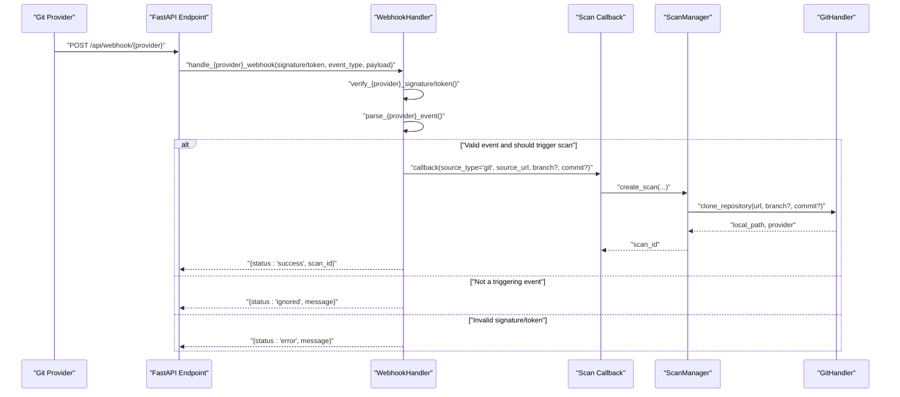
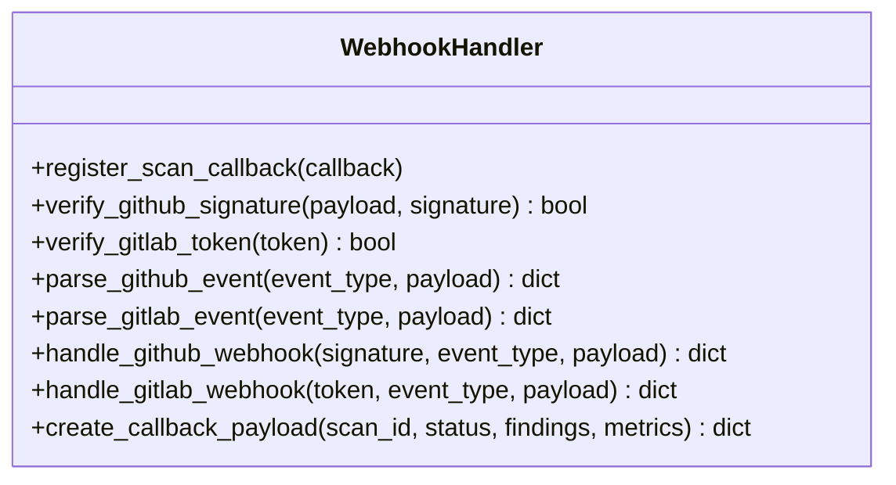
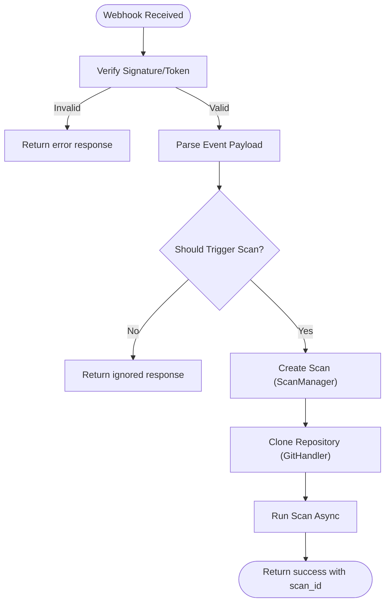
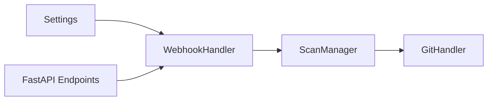

# Webhook Integration

<cite>
**Referenced Files in This Document**
- [webhook_handler.py](file://autopov/app/webhook_handler.py)
- [main.py](file://autopov/app/main.py)
- [config.py](file://autopov/app/config.py)
- [scan_manager.py](file://autopov/app/scan_manager.py)
- [git_handler.py](file://autopov/app/git_handler.py)
- [WebhookSetup.jsx](file://autopov/frontend/src/components/WebhookSetup.jsx)
- [test_webhook_handler.py](file://autopov/tests/test_webhook_handler.py)
- [README.md](file://autopov/README.md)
</cite>

## Table of Contents
1. [Introduction](#introduction)
2. [Project Structure](#project-structure)
3. [Core Components](#core-components)
4. [Architecture Overview](#architecture-overview)
5. [Detailed Component Analysis](#detailed-component-analysis)
6. [Dependency Analysis](#dependency-analysis)
7. [Performance Considerations](#performance-considerations)
8. [Troubleshooting Guide](#troubleshooting-guide)
9. [Conclusion](#conclusion)
10. [Appendices](#appendices)

## Introduction
This document explains AutoPoV’s webhook integration system for CI/CD pipeline automation and automatic scanning triggers. It covers GitHub and GitLab webhook setup, endpoint configuration, secret management, payload validation, event filtering, and scan initiation workflows. It also documents security measures such as signature verification and token validation, along with practical configuration examples and troubleshooting guidance.

## Project Structure
AutoPoV exposes two webhook endpoints:
- GitHub: POST /api/webhook/github
- GitLab: POST /api/webhook/gitlab

These endpoints accept provider-specific headers and raw JSON payloads, validate signatures/tokens, parse events, and conditionally trigger scans via a registered callback.

**Diagram sources**
- [main.py](file://autopov/app/main.py#L430-L472)
- [webhook_handler.py](file://autopov/app/webhook_handler.py#L15-L363)
- [scan_manager.py](file://autopov/app/scan_manager.py#L40-L344)
- [git_handler.py](file://autopov/app/git_handler.py#L18-L222)

**Section sources**
- [main.py](file://autopov/app/main.py#L430-L472)
- [README.md](file://autopov/README.md#L211-L219)

## Core Components
- WebhookHandler: Validates provider signatures/tokens, parses events, and triggers scans via a callback.
- FastAPI endpoints: Expose /api/webhook/github and /api/webhook/gitlab with appropriate headers.
- ScanManager: Orchestrates scan creation and execution.
- GitHandler: Clones repositories for webhook-triggered scans.
- Frontend component: Provides pre-filled webhook URLs and headers for quick setup.

**Section sources**
- [webhook_handler.py](file://autopov/app/webhook_handler.py#L15-L363)
- [main.py](file://autopov/app/main.py#L430-L472)
- [scan_manager.py](file://autopov/app/scan_manager.py#L40-L344)
- [git_handler.py](file://autopov/app/git_handler.py#L18-L222)
- [WebhookSetup.jsx](file://autopov/frontend/src/components/WebhookSetup.jsx#L1-L89)

## Architecture Overview
The webhook flow validates authenticity, extracts repository and branch/commit info, decides whether to trigger a scan, and invokes the scan callback in the background.

**Diagram sources**
- [main.py](file://autopov/app/main.py#L430-L472)
- [webhook_handler.py](file://autopov/app/webhook_handler.py#L196-L336)
- [scan_manager.py](file://autopov/app/scan_manager.py#L50-L84)
- [git_handler.py](file://autopov/app/git_handler.py#L60-L124)

## Detailed Component Analysis

### WebhookHandler
Responsibilities:
- Signature/token verification
- Event parsing for push and pull/merge request events
- Conditional scan triggering
- Callback payload construction

Security validations:
- GitHub: HMAC SHA-256 signature verification against configured secret.
- GitLab: HMAC token comparison against configured secret.

Event filtering:
- GitHub: push and pull_request events; PR actions limited to opened/synchronize/reopened.
- GitLab: push and merge_request events; MR actions limited to open/update/reopen.

Scan initiation:
- If a scan callback is registered and repository URL is present, a background scan is started.

**Diagram sources**
- [webhook_handler.py](file://autopov/app/webhook_handler.py#L15-L363)

**Section sources**
- [webhook_handler.py](file://autopov/app/webhook_handler.py#L15-L363)

### FastAPI Webhook Endpoints
- /api/webhook/github
  - Headers: X-Hub-Signature-256, X-GitHub-Event
  - Body: Raw JSON payload
- /api/webhook/gitlab
  - Headers: X-Gitlab-Token, X-Gitlab-Event
  - Body: Raw JSON payload

Both endpoints forward to WebhookHandler and return a standardized response.

**Section sources**
- [main.py](file://autopov/app/main.py#L430-L472)

### Configuration and Secret Management
Environment variables:
- GITHUB_WEBHOOK_SECRET: Secret for GitHub signature verification.
- GITLAB_WEBHOOK_SECRET: Secret for GitLab token verification.

These are loaded via the Settings class and used by WebhookHandler.

**Section sources**
- [config.py](file://autopov/app/config.py#L56-L58)
- [webhook_handler.py](file://autopov/app/webhook_handler.py#L40-L73)

### Scan Initiation Workflow
When a webhook triggers a scan:
- A scan is created with a unique ID.
- The repository is cloned to a temporary path using GitHandler.
- The scan is executed asynchronously.
- Results are persisted and can be queried via status endpoints.

**Diagram sources**
- [webhook_handler.py](file://autopov/app/webhook_handler.py#L196-L336)
- [main.py](file://autopov/app/main.py#L120-L158)
- [scan_manager.py](file://autopov/app/scan_manager.py#L50-L84)
- [git_handler.py](file://autopov/app/git_handler.py#L60-L124)

**Section sources**
- [main.py](file://autopov/app/main.py#L120-L158)
- [scan_manager.py](file://autopov/app/scan_manager.py#L86-L116)
- [git_handler.py](file://autopov/app/git_handler.py#L60-L124)

### Frontend Webhook Setup
The frontend component provides:
- Pre-filled webhook URLs for GitHub and GitLab.
- Secret header names for each provider.
- Setup location hints.
- Copy-to-clipboard functionality.

**Section sources**
- [WebhookSetup.jsx](file://autopov/frontend/src/components/WebhookSetup.jsx#L1-L89)

## Dependency Analysis
- WebhookHandler depends on Settings for secrets and on a registered callback for scan initiation.
- FastAPI endpoints depend on WebhookHandler.
- ScanManager depends on agent graph and code ingestion for scan execution.
- GitHandler depends on Settings for tokens and environment.

**Diagram sources**
- [config.py](file://autopov/app/config.py#L13-L210)
- [webhook_handler.py](file://autopov/app/webhook_handler.py#L12-L23)
- [main.py](file://autopov/app/main.py#L23-L24)
- [scan_manager.py](file://autopov/app/scan_manager.py#L16-L18)
- [git_handler.py](file://autopov/app/git_handler.py#L15-L16)

**Section sources**
- [config.py](file://autopov/app/config.py#L13-L210)
- [webhook_handler.py](file://autopov/app/webhook_handler.py#L12-L23)
- [main.py](file://autopov/app/main.py#L23-L24)
- [scan_manager.py](file://autopov/app/scan_manager.py#L16-L18)
- [git_handler.py](file://autopov/app/git_handler.py#L15-L16)

## Performance Considerations
- Asynchronous background execution: Scans are started in the background to avoid blocking webhook responses.
- Thread pool execution: Scan execution uses a thread pool to keep the event loop responsive.
- Shallow clones and cleanup: GitHandler removes .git directories and cleans up on failure to reduce resource usage.
- Minimal payload parsing: Only required fields are extracted for event filtering.

[No sources needed since this section provides general guidance]

## Troubleshooting Guide

Common configuration errors:
- Missing webhook secret in environment variables:
  - Symptom: Signature/token validation fails.
  - Fix: Set GITHUB_WEBHOOK_SECRET or GITLAB_WEBHOOK_SECRET and restart the service.

- Incorrect provider headers:
  - Symptom: Validation fails due to missing or wrong header names.
  - Fix: Use X-Hub-Signature-256 for GitHub and X-Gitlab-Token for GitLab.

- Unsupported event types:
  - Symptom: Event ignored with “does not trigger scans”.
  - Fix: Configure provider to send push and pull_request (GitHub) or push and merge_request (GitLab) events.

- Empty or zero commit hash:
  - Symptom: Event ignored because commit is empty.
  - Fix: Ensure push or MR contains a valid commit SHA.

Security validation failures:
- Invalid signature or token:
  - Symptom: “Invalid signature” or “Invalid token” response.
  - Fix: Verify secret matches provider configuration and is not exposed in logs.

Integration testing:
- Use curl to simulate provider requests:
  - GitHub: Send POST with X-Hub-Signature-256 and X-GitHub-Event headers.
  - GitLab: Send POST with X-Gitlab-Token and X-Gitlab-Event headers.
- Observe response status and message; confirm scan appears in history.

Monitoring and subscriptions:
- Use the history endpoint to review recent scans.
- Use the status endpoint to track scan progress and results.
- Ensure provider webhooks are configured to send only necessary events to reduce noise.

**Section sources**
- [webhook_handler.py](file://autopov/app/webhook_handler.py#L213-L265)
- [webhook_handler.py](file://autopov/app/webhook_handler.py#L284-L336)
- [test_webhook_handler.py](file://autopov/tests/test_webhook_handler.py#L21-L50)
- [test_webhook_handler.py](file://autopov/tests/test_webhook_handler.py#L52-L62)
- [README.md](file://autopov/README.md#L211-L219)

## Conclusion
AutoPoV’s webhook integration provides secure, configurable automation for CI/CD pipelines. By validating provider signatures/tokens, filtering relevant events, and triggering asynchronous scans, it enables reliable, scalable vulnerability detection on code changes. Proper secret management, event selection, and monitoring ensure smooth operation.

[No sources needed since this section summarizes without analyzing specific files]

## Appendices

### Practical Configuration Examples

- GitHub
  - Endpoint: POST /api/webhook/github
  - Required headers: X-Hub-Signature-256, X-GitHub-Event
  - Events: Push, Pull Request (opened/synchronize/reopened)
  - Secret: Set GITHUB_WEBHOOK_SECRET

- GitLab
  - Endpoint: POST /api/webhook/gitlab
  - Required headers: X-Gitlab-Token, X-Gitlab-Event
  - Events: Push, Merge Request (open/update/reopen)
  - Secret: Set GITLAB_WEBHOOK_SECRET

- Frontend quick setup
  - Use the WebhookSetup component to copy provider URLs and headers.

**Section sources**
- [main.py](file://autopov/app/main.py#L430-L472)
- [WebhookSetup.jsx](file://autopov/frontend/src/components/WebhookSetup.jsx#L8-L21)
- [config.py](file://autopov/app/config.py#L56-L58)
- [README.md](file://autopov/README.md#L211-L219)

### Security Best Practices
- Use strong, random secrets for both providers.
- Restrict webhook events to only those that trigger scans.
- Monitor webhook responses and scan history for anomalies.
- Rotate secrets periodically and update provider configurations accordingly.

**Section sources**
- [webhook_handler.py](file://autopov/app/webhook_handler.py#L25-L73)
- [scan_manager.py](file://autopov/app/scan_manager.py#L304-L334)